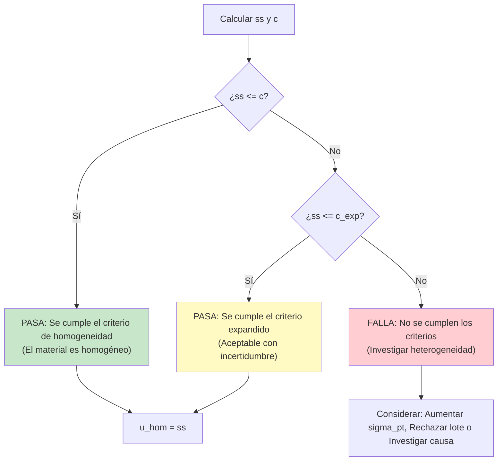
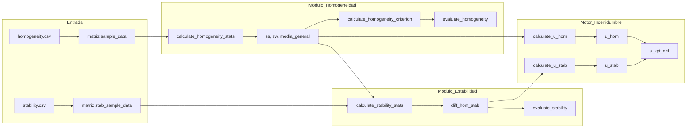

# Evaluación de Homogeneidad y Estabilidad (ISO 13528:2022)

## 1. Descripción General
Este módulo implementa los métodos estadísticos descritos en las **Secciones 7.4 y 7.5 de la norma ISO 13528:2022** para evaluar si los ítems de los ensayos de aptitud (PT) son suficientemente homogéneos y estables.

*   **Homogeneidad**: Asegura que cada participante reciba un ítem de ensayo equivalente. La falta de homogeneidad hace que la evaluación del desempeño sea injusta.
*   **Estabilidad**: Verifica que las propiedades del material no cambien significativamente durante el periodo del PT, asegurando la consistencia independientemente de cuándo el participante realice el ensayo.

---

## 2. Especificaciones Técnicas

| Elemento | Valor |
|:---|:---|
 | **Archivo** | `ptcalc/R/pt_homogeneity.R` |
 | **Líneas** | 1 - 410 |
 | **Norma** | ISO 13528:2022, Guía ISO 35:2017 |

---

## 3. Modelo Estadístico: ANOVA de un Factor
La evaluación se basa en un modelo de Análisis de Varianza (ANOVA) de un factor:

$$x_{ij} = \mu + \alpha_i + \epsilon_{ij}$$

Donde:
- $x_{ij}$ = $j$-ésima medición de la $i$-ésima muestra.
- $\mu$ = Media general.
- $\alpha_i$ = Efecto de la muestra $i$ (variación entre muestras).
- $\epsilon_{ij}$ = Error de medición (variación dentro de la muestra).

---

## 4. Evaluación de Homogeneidad

### 4.1 Funciones
La función principal para el cálculo de la homogeneidad es:
`calculate_homogeneity_stats(sample_data)`

**Entrada:**
- `sample_data`: Una matriz o data frame donde las filas representan ítems (muestras) y las columnas representan réplicas.

**Retorna:**
 - `g`: Número de muestras.
 - `m`: Número de réplicas por muestra.
 - `general_mean_homog`: Media general de TODOS los valores ($\bar{\bar{x}}$).
 - `sample_means`: Vector de medias para cada muestra.
 - `x_pt`: Mediana de la primera réplica (valor asignado estimado).
 - `s_x_bar_sq`: Varianza de las medias de las muestras.
 - `s_xt`: Desviación estándar de las medias de las muestras.
 - `sw`: Desviación estándar dentro de las muestras (within-sample).
 - `ss`: Desviación estándar entre muestras (between-sample).
 - `sw_sq`, `ss_sq`: Varianzas respectivas.
 - `median_of_diffs`: Mediana de las diferencias absolutas entre medias de muestra.
 - `MADe`: Estimación robusta de sigma ($1.483 \times median\_of\_diffs$).
 - `sigma_pt`: Desviación estándar para evaluación de aptitud (igual a MADe).
  - `u_sigma_pt`: Incertidumbre de sigma_pt ($MADe / \sqrt{2 \times (g-1)}$).

### 4.2 Cálculos Estadísticos

#### Desviación Estándar Dentro de las Muestras ($s_w$)
Para el caso típico de **$m = 2$ réplicas**:
$$s_w = \sqrt{\frac{\sum_{i=1}^{g} (x_{i1} - x_{i2})^2}{2g}}$$
*Nota: Esto también puede expresarse utilizando el rango $w_i = |x_{i1} - x_{i2}|$ como $s_w = \sqrt{\sum w_i^2 / 2g}$.*

Para **$m > 2$ réplicas**:
$$s_w^2 = \frac{1}{g} \sum_{i=1}^{g} s_i^2$$
Donde $s_i^2$ es la varianza de las réplicas para la muestra $i$.

#### Desviación Estándar Entre Muestras ($s_s$)
$$s_s^2 = \max\left(0, s_{\bar{x}}^2 - \frac{s_w^2}{m}\right)$$
Donde $s_{\bar{x}}^2$ es la varianza de las medias de las muestras. La resta de $s_w^2/m$ elimina la contribución del ruido de medición de la variación observada entre muestras.

### 4.3 Construcción de la Tabla ANOVA

| Fuente | Grados de Libertad | Suma de Cuadrados (SS) | Media de Cuadrados (MS) |
|:---|:---|:---|:---|
| **Entre Muestras** | $g - 1$ | $SS_B = m \sum_{i=1}^{g}(\bar{x}_i - \bar{\bar{x}})^2$ | $MS_B = SS_B / (g-1)$ |
| **Dentro de Muestras** | $g(m - 1)$ | $SS_W = \sum_{i=1}^{g}\sum_{j=1}^{m}(x_{ij} - \bar{x}_i)^2$ | $MS_W = SS_W / (g(m-1))$ |
| **Total** | $gm - 1$ | $SS_T = SS_B + SS_W$ | |

**Relación con las estadísticas ISO:**
- $s_w^2 = MS_W$
- $s_s^2 = \max(0, \frac{MS_B - MS_W}{m})$

---

## 5. Criterios de Aceptación

### 5.1 Estimación de $\sigma_{pt}$ (MADe)
La desviación estándar para evaluación de aptitud se calcula mediante una estimación robusta:

$$\sigma_{pt} = \text{MADe} = 1.483 \times \text{mediana}(|x_i - \text{mediana}(x)|)$$

Donde $x_i$ son las medias de las muestras. Esta estimación es robusta a valores atípicos.

**Incertidumbre de $\sigma_{pt}$:**
$$u_{\sigma_{pt}} = 1.25 \times \frac{\sigma_{pt}}{\sqrt{g}}$$

### 5.2 Criterio Básico ($c$)
El material se considera suficientemente homogéneo si:
$$s_s \leq c = 0.3 \times \sigma_{pt}$$

 ### 5.3 Criterio Expandido ($c_{exp}$)
 Si no se cumple el criterio básico, se utiliza un criterio expandido según ISO 13528:2022, Sección 9.2.4:
 $$c_{exp} = F_1 \times (0.3 \times \sigma_{pt})^2 + F_2 \times s_w^2$$

 Donde $F_1$ y $F_2$ son coeficientes que dependen del número de muestras $g$:

 | g (muestras) | F₁ | F₂ |
 |--------------|-----|-----|
 | 7 | 2.10 | 1.43 |
 | 8 | 2.01 | 1.25 |
 | 9 | 1.94 | 1.11 |
 | 10 | 1.88 | 1.01 |
 | 11 | 1.83 | 0.93 |
 | 12 | 1.79 | 0.86 |
 | 13 | 1.75 | 0.80 |
 | 14 | 1.72 | 0.75 |
 | 15 | 1.69 | 0.71 |
 | 16 | 1.67 | 0.68 |
 | 17 | 1.64 | 0.64 |
 | 18 | 1.62 | 0.62 |
 | 19 | 1.60 | 0.59 |
 | 20 | 1.59 | 0.57 |

 **Nota:** Para valores de $g$ fuera del rango [7, 20], se usa clamping a los extremos del rango.

### 5.4 Método Alternativo: nIQR

Como alternativa a MADe, se puede utilizar el método nIQR (Normalized Interquartile Range):

$$\sigma_{pt} = \text{nIQR} = 0.7413 \times (Q_3 - Q_1)$$

Donde $Q_1$ y $Q_3$ son los cuartiles 25% y 75% de los valores de la primera réplica.

Este método proporciona una estimación robusta alternativa de $\sigma_{pt}$ y se implementa junto con MADe para comparar ambos enfoques. El aplicativo calcula dos conjuntos de criterios (básico y expandido) usando tanto MADe como nIQR.

### 5.5 Árbol de Decisión



---

## 6. Evaluación de Estabilidad

### 6.1 Funciones
`calculate_stability_stats(stab_sample_data, hom_general_mean_homog, hom_stab_x_pt, hom_stab_sigma_pt)`

Esta función compara los resultados del estudio de estabilidad con la línea base del estudio de homogeneidad.

**Parámetros:**
- `stab_sample_data`: Matriz de datos de estabilidad (muestras como filas, réplicas como columnas)
- `hom_general_mean_homog`: Media general del estudio de homogeneidad
- `hom_stab_x_pt`: Valor asignado $x_{pt}$ del estudio de homogeneidad (mediana de primera réplica)
- `hom_stab_sigma_pt`: Desviación estándar del estudio de homogeneidad (MADe o nIQR)

**Nota:** La función de estabilidad NO calcula su propio `x_pt`. Utiliza el valor `hom_stab_x_pt` recibido del estudio de homogeneidad como el valor asignado ($x_{pt}$) para todos los cálculos que lo requieran.

La función de estabilidad calcula únicamente:
- `general_mean`: Media general de TODOS los valores de estabilidad
- `diff_hom_stab`: Diferencia absoluta entre medias de estabilidad y homogeneidad

Todos los demás componentes (`sw`, `ss`, `x_pt`, `sigma_pt`) se obtienen del estudio de homogeneidad.

### 6.2 Diferencia de Estabilidad ($D$)
La métrica principal es la diferencia absoluta entre la media general de homogeneidad ($\bar{\bar{x}}_{hom}$) y la media general de estabilidad ($\bar{\bar{x}}_{stab}$):
$$D = |\bar{\bar{x}}_{hom} - \bar{\bar{x}}_{stab}|$$

### 6.3 Criterios de Estabilidad
- **Básico**: $D \leq 0.3 \times \sigma_{pt}$
- **Expandido**: $D \leq (0.3 \times \sigma_{pt}) + 2 \times \sqrt{u_{\bar{x}_{hom}}^2 + u_{\bar{x}_{stab}}^2}$
  Donde $u_{\bar{x}} = s_w / \sqrt{g \cdot m}$ es la incertidumbre estándar de la media.

### 6.4 Prueba t para Estabilidad
Para determinar si la diferencia es estadísticamente significativa (incluso si pasa el criterio de 0.3):
$$t = \frac{|\bar{\bar{x}}_{hom} - \bar{\bar{x}}_{stab}|}{\sqrt{u_{\bar{x}_{hom}}^2 + u_{\bar{x}_{stab}}^2}}$$

| Resultado | Interpretación |
|:---|:---|
| $|t| < 2$ | Diferencia no significativa (estable) |
| $2 \leq |t| < 3$ | Posible deriva, se recomienda investigación |
| $|t| \geq 3$ | Deriva significativa |

---

## 7. Contribuciones a la Incertidumbre

Los componentes de incertidumbre de homogeneidad y estabilidad se combinan en la incertidumbre definitiva del valor asignado ($u_{xpt,def}$).

### 7.1 Incertidumbre de Homogeneidad ($u_{hom}$)
$$u_{hom} = s_s$$
*Nota: Si $s_s^2 < 0$ y se estableció en 0, $u_{hom} = 0$.*

### 7.2 Incertidumbre de Estabilidad ($u_{stab}$)
Asume una distribución rectangular si la diferencia es mayor que el criterio:
$$u_{stab} = \begin{cases} 
0 & \text{si } D \leq 0.3 \times \sigma_{pt} \\ 
\frac{D}{\sqrt{3}} & \text{si } D > 0.3 \times \sigma_{pt} 
\end{cases}$$

### 7.3 Incertidumbre Combinada
$$u_{xpt,def} = \sqrt{u_{xpt}^2 + u_{hom}^2 + u_{stab}^2}$$
Donde $u_{xpt}$ es la incertidumbre del método de caracterización (ej., Algoritmo A).

---

## 8. Flujo de Datos en el Aplicativo



---

## 9. Ejemplo Numérico: SO2 en ppm

### 9.1 Datos de Homogeneidad (10 muestras, 2 réplicas)
| Muestra | Répl 1 | Répl 2 | Media | Rango ($w_i$) |
|:---|:---|:---|:---|:---|
| 1 | 0.0521 | 0.0525 | 0.0523 | 0.0004 |
| ... | ... | ... | ... | ... |
| 10 | 0.0526 | 0.0523 | 0.0525 | 0.0003 |

**Cálculos:**
1.  **Media General**: $\bar{\bar{x}} = 0.0526$
2.  **DE dentro de muestras**: $s_w = \sqrt{\frac{\sum w_i^2}{20}} = 0.000245$
3.  **Varianza de Medias**: $s_{\bar{x}}^2 = 0.0000000278$
4.  **DE entre muestras**: $s_s^2 = 0.0000000278 - \frac{0.000245^2}{2} = -0.0000000022$
    Como es negativo, **$s_s = 0$**.

**Evaluación ($\sigma_{pt} = 0.005$):**
- $c = 0.3 \times 0.005 = 0.0015$
- $0 \leq 0.0015 \implies$ **PASA** (Homogéneo).

### 9.2 Datos de Estabilidad (3 muestras después de 30 días)
- $\bar{\bar{x}}_{hom} = 0.0526$
- $\bar{\bar{x}}_{stab} = 0.0527$
- $D = |0.0526 - 0.0527| = 0.0001$

**Evaluación:**
- $0.0001 \leq 0.0015 \implies$ **PASA** (Estable).
- $u_{stab} = 0$.

---

## 10. Implementación en Código (R)

```r
library(ptcalc)

# Cargar datos
hom_data <- matrix(c(19.70, 19.72, 19.68, 19.69, ...), ncol=2, byrow=TRUE)

 # 1. Homogeneidad (sigma_pt se calcula internamente desde MADe)
 stats <- calculate_homogeneity_stats(hom_data)
 c_crit <- calculate_homogeneity_criterion(stats$sigma_pt)
 c_exp <- calculate_homogeneity_criterion_expanded(stats$sigma_pt, stats$sw, stats$g)
 eval <- evaluate_homogeneity(stats$ss, c_crit, c_exp)

# 2. Estabilidad
stab_stats <- calculate_stability_stats(
  stab_data,
  stats$general_mean_homog,
  stats$x_pt,
  stats$sigma_pt
)
stab_eval <- evaluate_stability(stab_stats$diff_hom_stab, c_crit)

# 3. Incertidumbre
u_hom <- calculate_u_hom(stats$ss)
u_stab <- calculate_u_stab(stab_stats$diff_hom_stab, c_crit)
```

**Nuevos valores disponibles:**
- `stats$x_pt`: Mediana de la primera réplica (valor asignado estimado)
- `stats$MADe`: Estimación robusta de sigma
- `stats$nIQR`: Estimación robusta alternativa de sigma
- `stats$sigma_pt`: Desviación estándar para PT (igual a MADe o nIQR)
- `stats$u_sigma_pt`: Incertidumbre de sigma_pt

---

## 11. Casos Límite y Errores

| Caso | Manejo |
|:---|:---|
| **< 2 Muestras** | `calculate_homogeneity_stats` arroja error: "At least 2 samples required". |
| **< 2 Réplicas** | `calculate_homogeneity_stats` arroja error: "At least 2 replicates required". |
| **$s_s^2$ es negativo** | Esto ocurre cuando la variación observada entre medias es menor de lo esperado por el ruido de medición. El aplicativo establece $s_s = 0$ según las directrices de ISO 13528. |

---

## 12. Referencias
- **ISO 13528:2022**: Métodos estadísticos para uso en ensayos de aptitud por comparación interlaboratorio.
- **Guía ISO 35:2017**: Materiales de referencia — Guía para la caracterización y evaluación de la homogeneidad y estabilidad.
- **ISO/IEC 17043:2023**: Evaluación de la conformidad — Requisitos generales para los ensayos de aptitud.
