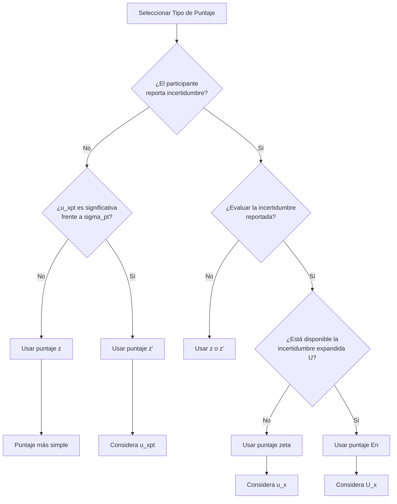
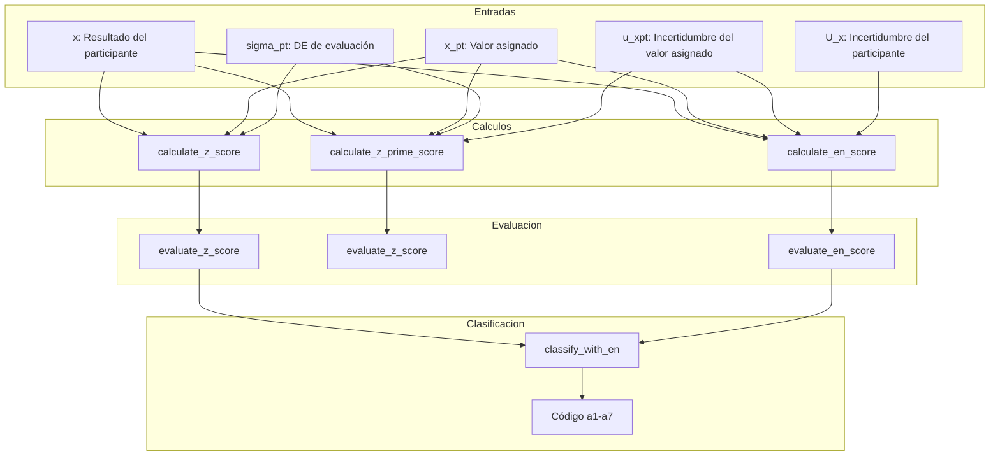

# Puntuación y Evaluación del Desempeño (pt_scores.R)

## 1. Descripción General
Funciones para calcular y evaluar los puntajes de desempeño de los participantes ($z$, $z'$, $\zeta$, $E_n$) según la norma ISO 13528:2022 Sección 10. Estos puntajes cuantifican qué tan bien se alinea el resultado de un participante con el valor asignado y permiten evaluar la competencia del laboratorio en los esquemas de ensayos de aptitud (PT).

La selección del puntaje depende de:
1.  La información disponible (valor asignado, $\sigma_{pt}$, incertidumbres).
2.  El propósito (cribado vs. evaluación detallada).
3.  Las características de la medición.

## 2. Ubicación en el Código
| Elemento | Valor |
| :--- | :--- |
| **Archivo** | `ptcalc/R/pt_scores.R` |
| **Líneas** | 1 - 275 |

---

## 3. Guía de Selección de Puntajes

### 3.1 Diagrama de Flujo de Selección


### 3.2 Árbol de Decisión Alternativo
```mermaid
flowchart TD
    START[Calcular puntaje PT] --> UNC_X{¿Incertidumbre del<br/>participante conocida?}
    
    UNC_X -- Sí --> UNC_XPT{¿Incertidumbre del valor<br/>asignado conocida?}
    UNC_XPT -- Sí --> ZETA[Usar puntaje zeta<br/>ζ = (x - x_pt) / sqrt(u_x² + u_xpt²)]
    UNC_XPT -- No --> ZPRIME[Usar puntaje z'<br/>z' = (x - x_pt) / sqrt(σ_pt² + u_xpt²)]
    
    UNC_X -- No --> SIGMA_PT{¿σ_pt especificada?}
    SIGMA_PT -- Sí --> Z[Usar puntaje z<br/>z = (x - x_pt) / σ_pt]
    SIGMA_PT -- No --> CALIBRATION{¿Comparación de<br/>calibración?}
    
    CALIBRATION -- Sí --> EN[Usar puntaje En<br/>En = (x - x_pt) / sqrt(U_x² + U_xpt²)]
    CALIBRATION -- No --> CONSENSUS{¿Usar consenso<br/>para x_pt?}
    
    CONSENSUS -- Sí --> ZPRIME
    CONSENSUS -- No --> NO_INFO[Información insuficiente]
    
    style Z fill:#c8e6c9
    style ZPRIME fill:#fff9c4
    style ZETA fill:#c5e1a5
    style EN fill:#b39ddb
```

### 3.3 Tabla de Resumen de Puntajes
| Puntaje | Fórmula | Usa $u_{xpt}$ | Usa $u_x/U_x$ | Caso de Uso |
| :--- | :--- | :---: | :---: | :--- |
| **z** | $(x - x_{pt}) / \sigma_{pt}$ | No | No | Evaluación básica, $\sigma_{pt}$ especificada. |
| **z'** | $(x - x_{pt}) / \sqrt{\sigma_{pt}^2 + u_{xpt}^2}$ | Sí | No | $u_{xpt}$ es significativa ($> 0.3 \sigma_{pt}$). |
| **ζ (zeta)** | $(x - x_{pt}) / \sqrt{u_x^2 + u_{xpt}^2}$ | Sí | $u_x$ (est) | Evaluar la incertidumbre estándar reportada. |
| **En** | $(x - x_{pt}) / \sqrt{U_x^2 + U_{xpt}^2}$ | Sí | $U_x$ (exp) | Compatibilidad metrológica (k=2). |

---

## 4. Funciones de Cálculo de Puntajes

### 4.1 `calculate_z_score(x, x_pt, sigma_pt)`
Métrica de desempeño estándar. Se utiliza cuando la incertidumbre del valor asignado es despreciable ($u(x_{pt}) \le 0.3 \sigma_{pt}$).
**Referencia:** ISO 13528:2022 Sección 10.2

| Parámetro | Tipo | Descripción |
| :--- | :--- | :--- |
| `x` | numérico | Resultado del participante |
| `x_pt` | numérico | Valor asignado |
| `sigma_pt` | numérico | Desviación estándar objetivo para la evaluación |

**Retorna:** El valor del puntaje z (o `NA_real_` si `sigma_pt` ≤ 0).

**Ejemplo:**
```r
z <- calculate_z_score(x = 10.5, x_pt = 10.0, sigma_pt = 0.5)
# z = (10.5 - 10.0) / 0.5 = 1.0
```

### 4.2 `calculate_z_prime_score(x, x_pt, sigma_pt, u_xpt)`
Se utiliza cuando la incertidumbre del valor asignado es significativa ($u(x_{pt}) > 0.3 \sigma_{pt}$). Amplía los límites de aceptación para tener en cuenta esta incertidumbre.
**Referencia:** ISO 13528:2022 Sección 10.3

| Parámetro | Tipo | Descripción |
| :--- | :--- | :--- |
| `x` | numérico | Resultado del participante |
| `x_pt` | numérico | Valor asignado |
| `sigma_pt` | numérico | Desviación estándar objetivo |
| `u_xpt` | numérico | Incertidumbre estándar del valor asignado |

**Ejemplo:**
```r
zprime <- calculate_z_prime_score(x = 10.5, x_pt = 10.0, sigma_pt = 0.5, u_xpt = 0.1)
# denominador = sqrt(0.5^2 + 0.1^2) = 0.51
# z' = 0.5 / 0.51 = 0.98
```

### 4.3 `calculate_zeta_score(x, x_pt, u_x, u_xpt)`
Evalúa la concordancia entre el resultado del participante y el valor asignado, considerando **ambas** incertidumbres ($u_x$ y $u_{xpt}$).
**Referencia:** ISO 13528:2022 Sección 10.4

| Parámetro | Tipo | Descripción |
| :--- | :--- | :--- |
| `x` | numérico | Resultado del participante |
| `x_pt` | numérico | Valor asignado |
| `u_x` | numérico | Incertidumbre estándar del resultado del participante |
| `u_xpt` | numérico | Incertidumbre estándar del valor asignado |

**Ejemplo:**
```r
zeta <- calculate_zeta_score(x = 10.5, x_pt = 10.0, u_x = 0.2, u_xpt = 0.1)
# zeta = 0.5 / sqrt(0.2^2 + 0.1^2) = 2.24
```

### 4.4 `calculate_en_score(x, x_pt, U_x, U_xpt)`
Error Normalizado. Similar al puntaje zeta pero utiliza incertidumbres expandidas (usualmente $k=2$).
**Referencia:** ISO 13528:2022 Sección 10.5

| Parámetro | Tipo | Descripción |
| :--- | :--- | :--- |
| `x` | numérico | Resultado del participante |
| `x_pt` | numérico | Valor asignado |
| `U_x` | numérico | Incertidumbre expandida del resultado del participante |
| `U_xpt` | numérico | Incertidumbre expandida del valor asignado |

**Ejemplo:**
```r
en <- calculate_en_score(x = 10.5, x_pt = 10.0, U_x = 0.4, U_xpt = 0.2)
# En = 0.5 / sqrt(0.4^2 + 0.2^2) = 1.12
```

---

## 5. Evaluación del Desempeño

### 5.1 Clasificación de los puntajes z, z' y ζ
Criterios para los puntajes de desempeño estándar:

| Resultado | Criterio | Color |
| :--- | :--- | :--- |
| **Satisfactorio** | $|z| \leq 2$ | Verde (`#4CAF50`) |
| **Cuestionable** | $2 < |z| < 3$ | Amarillo (`#FFC107`) |
| **No satisfactorio** | $|z| \geq 3$ | Rojo (`#F44336`) |

### 5.2 Clasificación del puntaje En
Criterios para el puntaje $E_n$:

| Resultado | Criterio | Color |
| :--- | :--- | :--- |
| **Satisfactorio** | $|E_n| \leq 1$ | Verde (`#4CAF50`) |
| **No satisfactorio** | $|E_n| > 1$ | Rojo (`#F44336`) |

**Nota:** El puntaje $E_n$ no tiene una categoría "Cuestionable" porque utiliza incertidumbres expandidas ($k=2$) que ya incorporan un intervalo de confianza de aproximadamente el 95%.

---

## 6. Propagación de la Incertidumbre ($u_{xpt,def}$)

La incertidumbre estándar definitiva del valor asignado ($u_{xpt,def}$) combina múltiples fuentes, incluyendo la caracterización, la homogeneidad y la estabilidad.

$$u_{xpt,def} = \sqrt{u_{xpt}^2 + u_{hom}^2 + u_{stab}^2}$$

| Componente | Origen | Cálculo Típico |
| :--- | :--- | :--- |
| $u_{xpt}$ | Método de asignación | Alg. A: $1.25 \cdot s^* / \sqrt{n}$ |
| $u_{hom}$ | Estudio de homogeneidad | $s_s$ (DE entre muestras) |
| $u_{stab}$ | Estudio de estabilidad | $0$ si es estable, $D/\sqrt{3}$ si no |

### Impacto en los Puntajes
Una $u_{xpt}$ más alta conduce a valores absolutos de puntaje más bajos (evaluación más indulgente), ya que aumenta el denominador.

**Ejemplo:**
```r
u_hom <- 0.016
u_stab <- 0.000  # Estable
u_xpt_def <- sqrt(0.016^2 + 0.000^2)  # 0.016

# Problema de u_stab
u_stab_bad <- 0.115
u_xpt_def_bad <- sqrt(0.016^2 + 0.115^2)  # 0.116
```

---

## 7. Clasificación Combinada (a1-a7)

La función `classify_with_en()` combina los puntajes de desempeño (z/z') con $E_n$ para una evaluación más exhaustiva del desempeño del laboratorio.

### 7.1 Tabla de Clasificación
| Código | Etiqueta | Puntaje z | Puntaje En | $U_x$ vs $\sigma_{pt}$ | Significado |
| :--- | :--- | :---: | :---: | :---: | :--- |
| **a1** | Totalmente satisfactorio | $\le 2$ | $\le 1$ | $U_x < 2\sigma_{pt}$ | Tanto el resultado como la incertidumbre son correctos. |
| **a2** | Satisfactorio pero conservador | $\le 2$ | $\le 1$ | $U_x \ge 2\sigma_{pt}$ | Resultado correcto, pero la incertidumbre está sobreestimada. |
| **a3** | Satisfactorio con MU subestimada | $\le 2$ | $> 1$ | - | Resultado correcto, pero la incertidumbre está subestimada. |
| **a4** | Cuestionable pero aceptable | 2 - 3 | $\le 1$ | - | Resultado cuestionable, pero cubierto por la MU reportada. |
| **a5** | Cuestionable e inconsistente | 2 - 3 | $> 1$ | - | Tanto el resultado como la incertidumbre son problemáticos. |
| **a6** | No satisfactorio pero MU cubre | $\ge 3$ | $\le 1$ | - | Resultado pobre, pero cubierto por una MU muy grande. |
| **a7** | No satisfactorio (crítico) | $\ge 3$ | $> 1$ | - | Falla crítica tanto en el resultado como en la incertidumbre. |

### 7.2 Códigos Especiales
| Código | Etiqueta | Condición |
| :--- | :---: | :--- |
| `mu_missing_z` | MU ausente - solo z: [desempeño] | No se proporcionó incertidumbre, se usó puntaje z. |
| `mu_missing_zprime` | MU ausente - solo z': [desempeño] | No se proporcionó incertidumbre, se usó puntaje z'. |

### 7.3 Matriz de Interpretación Visual
```
                    |En| <= 1             |En| > 1
            ┌─────────────────────┬─────────────────────┐
            │                     │                     │
   |z| <= 2 │   a1 (o a2 si U     │        a3           │
            │   conservadora)     │   MU subestimada    │
            │     [VERDE OSCURO]  │   [VERDE CLARO]     │
            ├─────────────────────┼─────────────────────┤
            │                     │                     │
   2<|z|<3  │        a4           │        a5           │
            │   Cuestionable OK   │   Cuestionable mal  │
            │    [AMARILLO]       │   [NARANJA]         │
            ├─────────────────────┼─────────────────────┤
            │                     │                     │
   |z| >= 3 │        a6           │        a7           │
            │   MU cubre el error │     CRÍTICO         │
            │   [ROSADO]          │     [ROJO]          │
            └─────────────────────┴─────────────────────┘
```

### 7.4 Paleta de Colores (PT_EN_CLASS_COLORS)
| Código | Color Hex | Descripción |
| :--- | :--- | :--- |
| **a1** | `#2E7D32` | Verde Oscuro (Excelente) |
| **a2** | `#66BB6A` | Verde Medio (Conservador) |
| **a3** | `#9CCC65` | Verde Claro (MU Subestimada) |
| **a4** | `#FFF59D` | Amarillo Claro (Cuestionable OK) |
| **a5** | `#FBC02D` | Naranja (Cuestionable Mal) |
| **a6** | `#EF9A9A` | Rosado (No satisfactorio Cubierto) |
| **a7** | `#C62828` | Rojo Oscuro (Crítico) |
| `mu_missing_z` | `#90A4AE` | Gris-Azulado (MU Faltante - z) |
| `mu_missing_zprime` | `#78909C` | Gris Oscuro (MU Faltante - z') |

---

## 8. Escenarios Prácticos

### Escenario 1: Buen Resultado e Incertidumbre Confiable
- $x = 10.05, x_{pt} = 10.00, \sigma_{pt} = 0.5, U_x = 0.20$
- $z = 0.10$ (Satisfactorio)
- $E_n = 0.25$ (Satisfactorio)
- **Clasificación:** **a1** (Totalmente satisfactorio)

### Escenario 2: Incertidumbre Subestimada
- $x = 10.80, x_{pt} = 10.00, \sigma_{pt} = 0.5, U_x = 0.10$
- $z = 1.60$ (Satisfactorio)
- $E_n = 7.69$ (No satisfactorio)
- **Clasificación:** **a3** (Resultado satisfactorio, pero MU demasiado pequeña)

### Escenario 3: Resultado Pobre cubierto por Gran Incertidumbre
- $x = 12.00, x_{pt} = 10.00, \sigma_{pt} = 0.5, U_x = 2.50$
- $z = 4.00$ (No satisfactorio)
- $E_n = 0.80$ (Satisfactorio)
- **Clasificación:** **a6** (No satisfactorio, pero la MU cubre el error)

---

## 9. Flujo de Trabajo en el Aplicativo



---

## 10. Consideraciones Estadísticas

### 10.1 Distribución de los puntajes z
En una población de laboratorios competentes, los puntajes z deberían:
- Seguir aproximadamente una distribución normal estándar $N(0,1)$.
- ~95% de los resultados deberían caer dentro de $\pm 2$.
- ~99.7% de los resultados deberían caer dentro de $\pm 3$.

### 10.2 Análisis de Patrones
| Patrón Observado | Causa Posible |
| :--- | :--- |
| Media $z \neq 0$ | Sesgo sistemático en $x_{pt}$ o en el grupo de participantes. |
| $SD(z) >> 1$ | $\sigma_{pt}$ está subestimada (los límites son demasiado estrictos). |
| $SD(z) << 1$ | $\sigma_{pt}$ está sobreestimada (los límites son demasiado holgados). |
| Asimetría | Sesgo presente en un subconjunto de laboratorios. |

---

## 11. Referencias
- **ISO 13528:2022** Métodos estadísticos para uso en ensayos de aptitud por comparación interlaboratorio.
- **ILAC-G13:08/2007** Directrices para los requisitos de competencia de los proveedores de esquemas de ensayos de aptitud.
- **Guía EURACHEM (2000)** Cuantificación de la incertidumbre en las mediciones analíticas.

---

## 12. Documentos Relacionados
- [03_estadisticas_robustas_pt.md](03_estadisticas_robustas_pt.md) - Media y DE robustas para valores asignados.
- [04_homogeneidad_pt.md](04_homogeneidad_pt.md) - Contribuciones de homogeneidad y estabilidad a $u_{xpt}$.
- [09_puntajes_pt.md](09_puntajes_pt.md) - Interfaz de usuario para los puntajes de desempeño.
- [10_informe_global.md](10_informe_global.md) - Visualizaciones en mapas de calor de los resultados.
