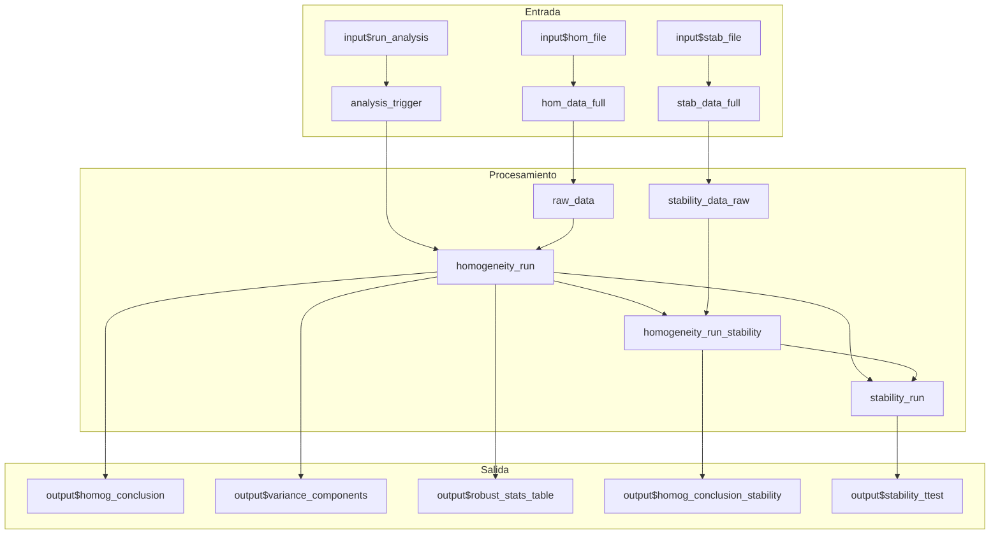
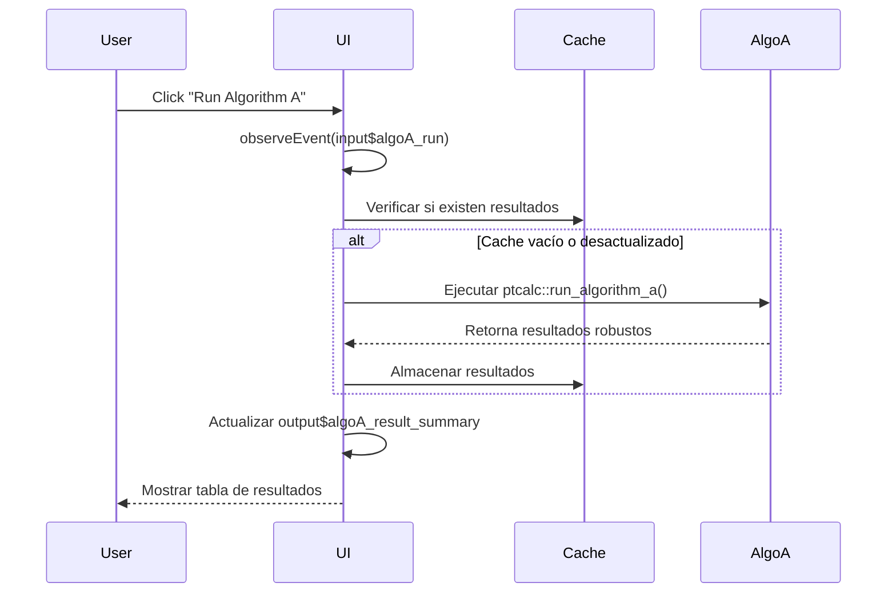
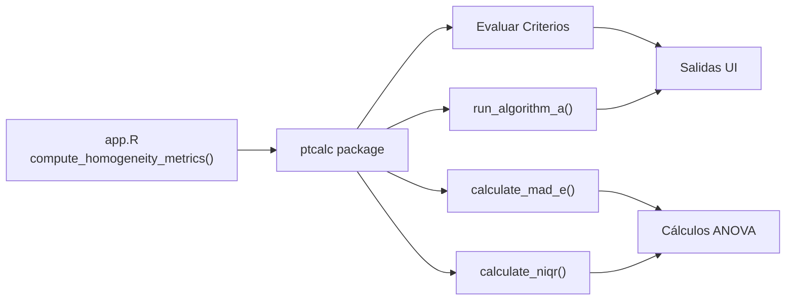

# Módulo Shiny: Homogeneidad y Estabilidad

## Descripción General

Este módulo implementa la interfaz de usuario y la lógica reactiva para la evaluación de la homogeneidad y estabilidad del ítem de ensayo, siguiendo los lineamientos de la norma **ISO 13528:2022**. Permite verificar que los materiales distribuidos a los participantes sean suficientemente homogéneos y estables para garantizar la validez del ensayo de aptitud (PT).

| Propiedad | Valor |
|-----------|-------|
| Archivo | `app.R` |
| Líneas (Lógica) | 239 - 558 |
| Líneas (UI) | 762 - 857 |
| Líneas (Algoritmo A) | 642 - 690 |
| Dependencias | `ptcalc`, `hom_data_full()`, `stab_data_full()`, `analysis_trigger()` |
| Norma de Referencia | ISO 13528:2022 Sección 7 |

---

## Mapa de Componentes UI

| Elemento UI | Input ID | Output ID | Tipo | Descripción |
|-------------|----------|-----------|------|-------------|
| **Botón Ejecutar** | `run_analysis` | - | `actionButton` | Dispara el cálculo de homogeneidad. |
| **Selector Analito** | `pollutant_analysis` | `pollutant_selector_analysis` | `selectInput` | Filtra por contaminante (SO2, CO, O3, etc.). |
| **Selector Nivel** | `target_level` | `level_selector` | `selectInput` | Filtra por nivel de concentración. |
| **Conclusión Homog.** | - | `homog_conclusion` | `uiOutput` | Alerta colorizada con el resultado del criterio. |
| **Boton Estabilidad** | `run_stability` | - | `actionButton` | Dispara el análisis de estabilidad. |
| **Conclusión Stab.** | - | `homog_conclusion_stability` | `uiOutput` | Alerta con el resultado de estabilidad. |
| **Tabla ANOVA** | - | `variance_components` | `tableOutput` | Componentes de varianza (ss, sw) y criterios. |
| **Estadísticos Robustos**| - | `robust_stats_table` | `tableOutput` | Mediana, MADe, nIQR. |
| **Detalles por ítem** | - | `details_per_item_table` | `tableOutput` | Promedio y rango por cada ítem evaluado. |
| **Tabla u_hom** | - | `u_hom_table` | `dataTableOutput` | Incertidumbre por homogeneidad. |
| **Tabla u_stab** | - | `u_stab_table` | `dataTableOutput` | Incertidumbre por estabilidad. |
| **Algoritmo A (Iter)** | `algoA_max_iter` | - | `numericInput` | Máximo de iteraciones para Algoritmo A. |
| **Botón Algoritmo A** | `algoA_run` | - | `actionButton` | Ejecuta el Algoritmo A sobre los datos. |
| **Resultados Algo A** | - | `algoA_result_summary` | `tableOutput` | Resumen de resultados del Algoritmo A. |
| **Histograma** | - | `results_histogram` | `plotlyOutput` | Distribución de los resultados. |
| **Diagrama de Caja** | - | `results_boxplot` | `plotlyOutput` | Variabilidad por nivel. |

---

## Flujo de Datos y Lógica Reactiva

### Diagrama de Flujo



### Reactivos Principales

1.  **`analysis_trigger()`**: Se activa cuando el usuario hace clic en el botón de ejecución. Invalida los resultados previos para forzar un nuevo cálculo.
2.  **`homogeneity_run()`**: Depende de los selectores de analito/nivel y del trigger. Llama a `compute_homogeneity_metrics()`.
3.  **`stability_run()`**: Depende de que `homogeneity_run()` se haya completado exitosamente. Evalúa la estabilidad comparando medias.
4.  **`algoA_results_cache()`**: Almacena los resultados del Algoritmo A para evitar re-cálculos innecesarios. Se limpia si los datos de entrada cambian.

---

## Funciones Wrapper

### `compute_homogeneity_metrics(target_pollutant, target_level)`

**Propósito**: Realiza el análisis completo de homogeneidad para un analito y nivel.

**Pasos**:
1.  Obtiene datos en formato ancho mediante `get_wide_data()`.
    *   **Nota**: La función maneja automáticamente la columna `run` si está presente en los datos, agrupando las mediciones por contaminante, nivel y corrida.
2.  Calcula estadísticas descriptivas (mediana, MADe, nIQR).
3.  Calcula componentes de varianza (ss, sw) mediante ANOVA.
4.  Calcula estimación robusta de sigma_pt desde MADe y su incertidumbre.
5.  Evalúa criterios:
    *   Criterio Crítico: $s_s \leq 0.3 \times \sigma_{pt}$
    *   Criterio Expandido: $s_s \leq c + u_{\sigma_{pt}}$
6.  Retorna una lista con resultados, conclusiones y clases CSS para la UI.

**Retorno**:
```r
list(
  summary = hom_anova_summary,      # Tabla ANOVA
  ss = hom_ss,                      # DE entre muestras
  sw = hom_sw,                      # DE dentro de la muestra
  conclusion = hom_conclusion,      # Texto HTML con resultado
  conclusion_class = "alert-success|alert-warning",
  g = g,                            # Número de ítems
  m = m,                            # Número de réplicas
  x_pt = x_pt,                      # Mediana de primera réplica
  sigma_pt = hom_sigma_pt,          # MADe como sigma_pt
  u_sigma_pt = u_sigma_pt,          # Incertidumbre de sigma_pt
  u_xpt = u_xpt,                    # Incertidumbre del valor asignado
  c_criterion = hom_c_criterion,    # Criterio c = 0.3 * sigma_pt
  c_criterion_expanded = hom_c_criterion_expanded
)
```

### `compute_stability_metrics(target_pollutant, target_level, hom_results)`

**Propósito**: Evalúa la estabilidad comparando los resultados de homogeneidad con los de estabilidad.

**Cálculo Clave**:
*   Diferencia de medias: $|media_{hom} - media_{stab}|$
*   Incertidumbre por estabilidad: $u_{stab} = \frac{|media_{hom} - media_{stab}|}{\sqrt{3}}$

---

## Fórmulas Matemáticas (ISO 13528)

### Estimación de $\sigma_{pt}$ (MADe)
$$\sigma_{pt} = \text{MADe} = 1.483 \times \text{mediana}(|x_i - \text{mediana}(x)|)$$
Donde $x_i$ son las medias de las muestras.

### Incertidumbre de $\sigma_{pt}$
$$u_{\sigma_{pt}} = 1.25 \times \frac{\sigma_{pt}}{\sqrt{g}}$$

### Normal Interquartile Range (nIQR)
$$nIQR = 0.7413 \times (Q_3 - Q_1)$$

Nota: El aplicativo implementa ambos métodos (MADe y nIQR) para el cálculo de $\sigma_{pt}$, mostrando resultados lado a lado para comparación.

### Incertidumbre del Valor Asignado ($u_{xpt}$)
$$u_{xpt} = 1.25 \times \frac{\sigma_{pt}}{\sqrt{n}}$$

### Criterio de Homogeneidad
$$s_s \leq c = 0.3 \times \sigma_{pt}$$

### Criterio de Homogeneidad Expandido
$$c_{exp} = c + u_{\sigma_{pt}} = 0.3 \times \sigma_{pt} + 1.25 \times \frac{\sigma_{pt}}{\sqrt{g}}$$

### Varianza Entre-muestras ($s_s$)
$$s_s = \sqrt{s_{\bar{x}}^2 - \frac{s_w^2}{m}}$$

### Varianza Dentro-muestras ($s_w$)
$$s_w = \sqrt{\frac{\sum w_t^2}{2g}}$$
Donde $w_t$ es el rango de las réplicas para el ítem $t$.

---

## Gestión de Errores

| Estado | Mensaje | Causa | Solución |
|--------|---------|-------|----------|
| Datos faltantes | "No se encontraron datos de homogeneidad para el analito 'X'" | Archivo no cargado o analito no existe en CSV. | Verificar carga en pestaña "Carga de datos". |
| Nivel inexistente | "El nivel 'X' no existe para el analito 'Y'" | Selección de nivel no presente en los datos. | Revisar consistencia de los archivos CSV. |
| Réplicas insuficientes | "No hay suficientes réplicas (se requieren al menos 2)" | Menos de 2 columnas de mediciones (sample_*). | Asegurar formato de datos con al menos 2 réplicas. |
| Ítems insuficientes | "No hay suficientes ítems (se requieren al menos 2)" | Menos de 2 filas de datos para el nivel/analito. | Incrementar el número de muestras analizadas. |

---

## Detalle de Salidas (Outputs)

### Conclusión de Homogeneidad (`output$homog_conclusion`)
Muestra un cuadro de alerta dinámico:
*   **Verde (`alert-success`)**: Cumple el criterio crítico ($s_s \le c$).
*   **Amarillo (`alert-warning`)**: No cumple el criterio crítico pero cumple el expandido.
*   **Rojo (`alert-danger`)**: Falla ambos criterios.

### Componentes de Varianza (`output$variance_components`)
Muestra la descomposición de la variabilidad:
- **Media General ($\bar{x}_{pt}$)**
- **Desviación Estándar Permitida ($\sigma_{pt}$)**
- **$s_s$ y $s_w$** calculados mediante ANOVA.

---

## Algoritmo A

El módulo incluye un observador específico para ejecutar el Algoritmo A (ISO 13528 Anexo C) de forma interactiva.

**Diagrama de Secuencia**:


**Lógica de Caché**:
Se utiliza `reactiveVal(NULL)` para almacenar los resultados. Si el usuario cambia el archivo de entrada, el caché se limpia automáticamente para garantizar la integridad de los datos.

---

## Pestañas de Análisis

1.  **Vista Previa de Datos**: Muestra las primeras filas y gráficos de distribución (Histogramas/Boxplots).
2.  **Evaluación de Homogeneidad**: Resultados estadísticos y evaluación de criterios ISO.
3.  **Evaluación de Estabilidad**: Comparativa de estabilidad y cálculo de $u_{stab}$.
4.  **Contribuciones a la Incertidumbre**: Tablas resumen de $u_{hom}$ y $u_{stab}$ para todos los niveles analizados.

---

## Integración con ptcalc



---

## Referencias
*   **ISO 13528:2022**: Statistical methods for use in proficiency testing by interlaboratory comparison.
*   **ISO/IEC 17043:2023**: Conformity assessment — General requirements for the competence of proficiency testing providers.
