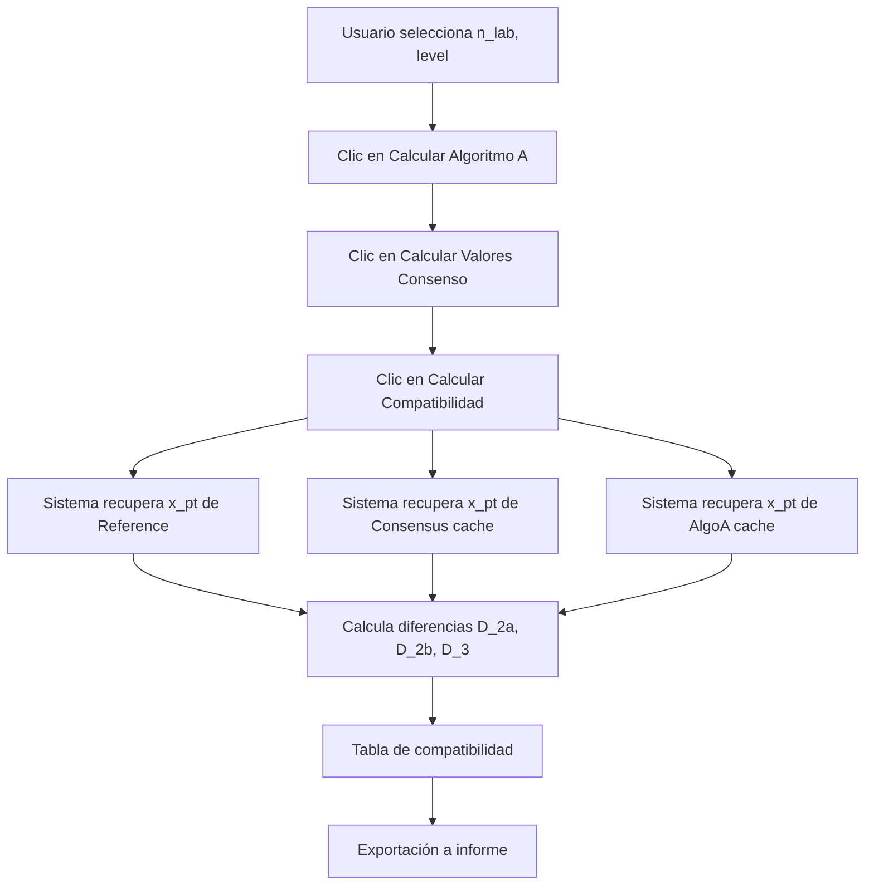

# Módulo: Compatibilidad Metrológica

## 1. Descripción General

Evalúa la coherencia entre el valor de referencia y los valores de consenso calculados por diferentes métodos (MADe, nIQR, Algoritmo A). Esta comparación permite validar la consistencia metodológica entre el valor asignado de referencia y los métodos de consenso, asegurando que las diferencias entre métodos sean estadísticamente aceptables.

| Elemento | Valor |
|----------|-------|
| Archivo | `app.R` |
| Pestaña UI | "Compatibilidad Metrológica" (dentro de Valor Asignado) |
| Líneas UI | ~990-993 |
| Líneas Lógica | Cálculo en generación de informes |
| Normas ISO | ISO 13528:2022 Sección 9 |

## 2. Ubicación en la Interfaz

El módulo se encuentra en la pestaña **"Valor asignado"** → sub-pestaña **"Compatibilidad Metrológica"**.

### 2.1 Botón de Acción
- **ID**: `run_metrological_compatibility`
- **Función**: Activa el cálculo de diferencias entre métodos

### 2.2 Tabla de Resultados
- **Output ID**: `metrological_compatibility_table`
- **Tipo**: DataTable interactiva

## 3. Métodos de Consenso Comparados

| Método | Código | x_pt Calculation | σ_pt Calculation |
|--------|--------|------------------|------------------|
| Consenso MADe | 2a | median(valores) | 1.483 × MAD |
| Consenso nIQR | 2b | median(valores) | 0.7413 × IQR |
| Algoritmo A | 3 | x* (robust mean) | s* (robust sd) |

## 4. Cálculo de Diferencias

### 4.1 Diferencias Absolutas

Para cada combinación (pollutant, n_lab, level):

$$D_{2a} = |x_{pt,ref} - x_{pt,2a}|$$
$$D_{2b} = |x_{pt,ref} - x_{pt,2b}|$$
$$D_{3} = |x_{pt,ref} - x_{pt,3}|$$

### 4.2 Criterio de Evaluación (Opcional - Implementación Futura)

La evaluación de compatibilidad puede usar:

$$Criterio = \sqrt{u_{xpt,ref}^2 + u_{xpt,consenso}^2}$$

**Compatible si**: $D \leq Criterio$

## 5. Estructura de Datos de Salida

### 5.1 Tabla de Compatibilidad

Columnas generadas:
- `pollutant`: Contaminante
- `n_lab`: Esquema de ensayo
- `level`: Nivel de concentración
- `x_pt_ref`: Valor de referencia
- `x_pt_2a`: Valor consenso MADe
- `x_pt_2b`: Valor consenso nIQR
- `x_pt_3`: Valor consenso Algoritmo A
- `Diff_Ref_2a`: |x_pt_ref - x_pt_2a|
- `Diff_Ref_2b`: |x_pt_ref - x_pt_2b|
- `Diff_Ref_3`: |x_pt_ref - x_pt_3|

## 6. Integración con Generación de Informes

### 6.1 Parámetro del Reporte

```yaml
params:
  metrological_compatibility: NA  # Data frame con diferencias
  metrological_compatibility_method: "2a"  # Método seleccionado
```

### 6.2 Sección en el Informe

Ubicación: report_template.Rmd, líneas 312-361

Título: "2.4. Compatibilidad Metrológica"

La tabla mostrada se filtra según `metrological_compatibility_method`.

## 7. Flujo de Trabajo



## 8. Casos de Uso

### 8.1 Validación de Método de Consenso

Objetivo: Determinar si consenso y referencia están alineados

Acción: Revisar si D_2a, D_2b, D_3 < umbral aceptable

### 8.2 Selección de Método para Reporte

Objetivo: Elegir método de consenso más compatible con referencia

Acción: Comparar D_2a vs D_2b vs D_3, seleccionar el menor

## 9. Referencias Cruzadas

- Valor Asignado: [07_valor_asignado.md](07_valor_asignado.md)
- Generación de Informes: [12_generacion_informes.md](12_generacion_informes.md)
- Report Template: [14_plantilla_informe.md](14_plantilla_informe.md)
