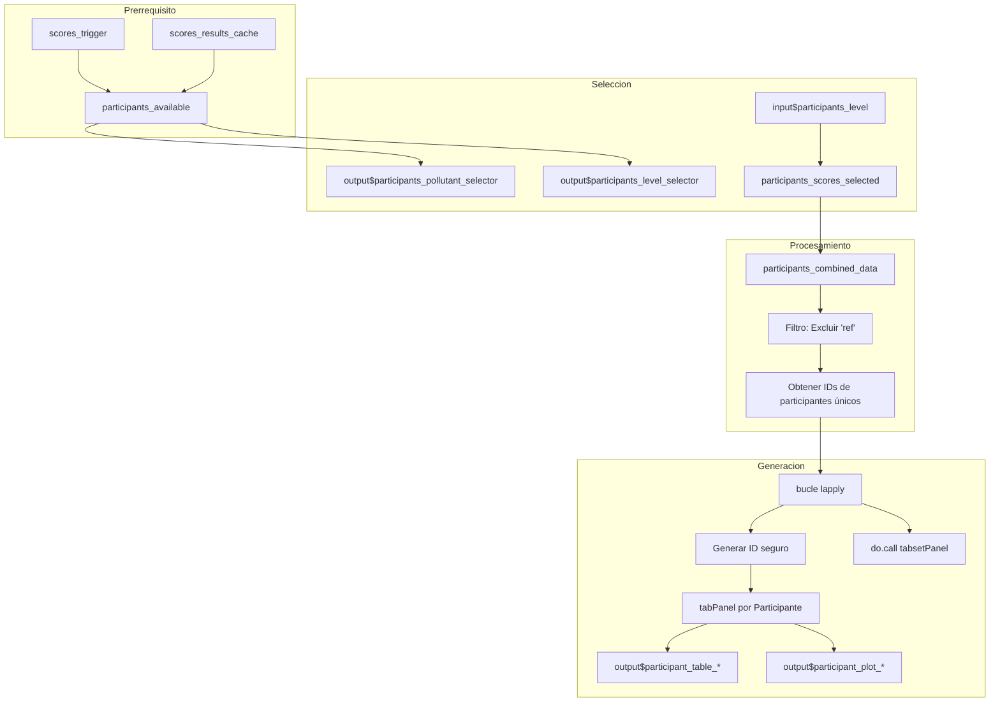

# Módulo: Detalle por Participante (Participantes)

## 1. Descripción General
El módulo de "Participantes" genera un tablero dinámico y dedicado para cada laboratorio que participa en el esquema de Ensayos de Aptitud (PT). Permite un análisis individualizado del desempeño a través de diferentes contaminantes y niveles, proporcionando tanto resúmenes tabulares como análisis de tendencias visuales.

**Ubicación del archivo:** `app.R`
**Pestaña de la UI:** `tabPanel("Participantes")`
**Rango de implementación:** Líneas 3615-3746 (aprox.)

---

## 2. Contexto Técnico y Mapa de la UI

### 2.1 Mapeo de Componentes
| Elemento UI | ID de Entrada | ID de Salida | Tipo | Descripción |
|------------|----------|-----------|------|-------------|
| Selector de Contaminante | `participants_pollutant` | `participants_pollutant_selector` | `selectInput` | Filtra por contaminante |
| Selector de Nivel/Esquema | `participants_level` | `participants_level_selector` | `selectInput` | Selecciona el nivel y el esquema PT (n_lab) |
| Selector de Método | `participants_method` | - | `selectInput` | Filtra por método de cálculo |
| Contenedor Principal | - | `scores_participant_tabs` | `uiOutput` | Contenedor dinámico de pestañas |
| Tabla del Participante | - | `participant_table_[ID]` | `dataTableOutput` | Tabla de resultados individuales |
| Gráficos del Participante | - | `participant_plot_[ID]` | `plotlyOutput` | Gráficos de desempeño combinados |

### 2.2 Reactivos Principales
- **`participants_available()`**: Identifica las combinaciones válidas de contaminante, esquema (n_lab) y nivel que tienen datos.
- **`participants_scores_selected()`**: Recupera del caché los puntajes para el nivel/contaminante actualmente seleccionado.
- **`participants_combined_data()`**: Agrega y filtra los puntajes basados en la selección del usuario, excluyendo al laboratorio de referencia ("ref").

---

## 3. Patrón de Generación Dinámica de Pestañas

### 3.1 Flujo de Implementación
El módulo utiliza un patrón de `renderUI` -> `lapply` -> `do.call(tabsetPanel)` para generar una pestaña por cada ID de participante único encontrado en el conjunto de datos.



### 3.2 Generación de ID Seguro
Para asegurar la compatibilidad con el sistema de IDs de Shiny, los IDs de los participantes se limpian reemplazando los caracteres especiales por guiones bajos:
```r
# Ejemplo: "LAB-01" se convierte en "LAB_01"
safe_id <- gsub("[^A-Za-z0-9]", "_", pid)
table_id <- paste0("participant_table_", safe_id)
plot_id <- paste0("participant_plot_", safe_id)
```

---

## 4. Contenido del Tablero del Participante

### 4.1 Tabla de Resultados
Una tabla interactiva que muestra todos los resultados para el laboratorio específico en todos los contaminantes y niveles seleccionados.

| Columna | Descripción |
|--------|-------------|
| Combinación | Método utilizado (Algoritmo A, Consenso, etc.) |
| Analito | Nombre del contaminante |
| Esquema PT (n) | ID del esquema PT / número de participantes |
| Nivel | Nivel de concentración |
| Resultado | Valor medio reportado por el laboratorio |
| x_pt | Valor asignado (Referencia) |
| sigma_pt | Desviación estándar para la evaluación de la aptitud |
| u(x_pt) | Incertidumbre estándar del valor asignado |
| u(x_pt)_def | Incertidumbre combinada (incluyendo homogeneidad/estabilidad) |
| Puntaje z | z-score |
| Evaluación z | Satisfactorio / Cuestionable / No satisfactorio |
| Puntaje z' | z'-score (ajustado por incertidumbre) |
| Puntaje zeta | zeta-score |
| Puntaje En | En-score |

### 4.2 Gráficos de Desempeño (Panel 2x2)
Un tablero combinado de Plotly que muestra cuatro vistas distintas:

| Vista | Descripción | Límites / Lógica |
|------|-------------|--------------------|
| **Valores (Ref vs Lab)** | Comparación del resultado del Lab vs. el valor de Referencia a través de los niveles. | Lab: Línea azul sólida; Ref: Línea roja discontinua. |
| **Tendencia Puntaje Z** | Evolución de los puntajes z con límites de control. | ±2 (Naranja/Advertencia), ±3 (Rojo/Acción). |
| **Tendencia Puntaje Zeta** | Evolución de los puntajes zeta (basados en incertidumbre). | ±2 (Advertencia), ±3 (Acción). |
| **Tendencia Puntaje En** | Evolución de los puntajes En. | ±1 (Rojo/Acción). |

---

## 5. Desempeño y Escalamiento

### 5.1 Estrategias de Optimización
- **Renderizado Perezoso (Lazy Rendering)**: El contenido dentro de las pestañas (gráficos/tablas) solo se renderiza cuando se selecciona la pestaña del participante específico.
- **Caché de Datos**: Utiliza `participants_combined_data()` para evitar operaciones de filtrado redundantes dentro del bucle `lapply`.
- **Paginación**: Las tablas de datos están limitadas a 10 filas por página para mantener la capacidad de respuesta del DOM.

### 5.2 Expectativas de Escalamiento
| Participantes | Tiempo de Carga Estimado | Experiencia de Respuesta |
|--------------|---------------------|-----------------------|
| 1 - 10 | < 1 segundo | Excelente |
| 11 - 30 | 1 - 3 segundos | Buena |
| 50+ | 5+ segundos | Moderada (Las pestañas pueden amontonarse) |

---

## 6. Estados de Error y Solución de Problemas

| Mensaje | Causa | Solución |
|---------|-------|----------|
| "Calcule los puntajes para habilitar esta seccion" | `scores_trigger()` es NULL. | Ejecute primero "Calcular puntajes" en el módulo de Puntajes PT. |
| "No hay participantes disponibles para esta selección" | Los datos filtrados están vacíos o solo contienen "ref". | Verifique la carga de datos; compruebe si los IDs de los participantes están presentes en el CSV. |
| "No hay resultados disponibles" | `scores_results_cache()` está vacío. | Asegúrese de que los cálculos de los puntajes se completaron sin errores. |

---

## 7. Referencias y Cumplimiento
- **ISO 13528:2022**: Sección 10.2 (Informes individuales).
- **ISO/IEC 17043:2023**: Anexo A (Contenido de los informes de los participantes).
- **Documentos Relacionados**: `09_puntajes_pt.md`, `10_informe_global.md`.
