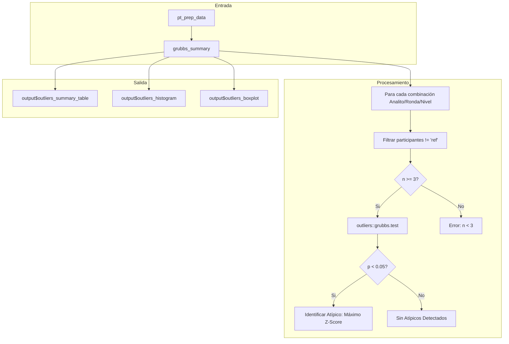

# Módulo: Valores Atípicos (Outliers)

Este módulo implementa la detección de valores anómalos mediante la **Prueba de Grubbs**, permitiendo identificar estadísticamente a los participantes con resultados extremos antes o durante la fase de evaluación de desempeño.

## 1. Descripción General

| Propiedad | Valor |
|-----------|-------|
| **Archivo** | `cloned_app.R` |
| **Ubicación UI** | `tabPanel("Valores Atípicos")` (Líneas 858-876) |
| **Lógica Server** | Reactive `grubbs_summary()` (Líneas 3801-3938) |
| **Librería R** | `outliers` |
| **Norma de Referencia** | ISO 13528:2022 Sección 7.3 |
| **Dependencias** | `pt_prep_data()` |

---

## 2. Mapa de Componentes UI

| Elemento UI | Input ID | Output ID | Tipo | Descripción |
|-------------|----------|-----------|------|-------------|
| **Selector Contaminante** | `outliers_pollutant` | - | `selectInput` | Filtra los resultados por analito. |
| **Selector Ronda (n_lab)** | `outliers_n_lab` | - | `selectInput` | Filtra por esquema/ronda específica. |
| **Selector Nivel** | `outliers_level` | - | `selectInput` | Filtra por nivel de concentración. |
| **Tabla de Resumen** | - | `outliers_summary_table` | `dataTableOutput` | Resumen maestro de la prueba de Grubbs. |
| **Histograma** | - | `outliers_histogram` | `plotlyOutput` | Distribución con curva de densidad. |
| **Diagrama de Caja** | - | `outliers_boxplot` | `plotlyOutput` | Boxplot con atípicos resaltados. |

---

## 3. Flujo de Datos y Lógica Reactiva

El siguiente diagrama describe cómo se procesan los datos desde la carga inicial hasta la visualización de atípicos:



---

## 4. Metodología Estadística: Prueba de Grubbs

La prueba de Grubbs identifica un único valor atípico en un conjunto de datos univariado que sigue una distribución aproximadamente normal.

### Estadístico de Prueba
El estadístico $G$ se define como la desviación absoluta máxima de la media en unidades de desviación estándar:

$$G = \frac{\max|x_i - \bar{x}|}{s}$$

Donde:
- $\bar{x}$: Media muestral.
- $s$: Desviación estándar muestral.

### Hipótesis
- **H0 (Nula)**: No hay valores atípicos en el conjunto de datos.
- **H1 (Alternativa)**: Existe al menos un valor atípico.

### Criterios de Decisión
- **Si $p < 0.05$**: Se rechaza H0. El valor más extremo se considera un **atípico estadístico**.
- **Si $p \geq 0.05$**: No hay evidencia suficiente para declarar un valor como atípico.

### Requisitos y Limitaciones
1. **Tamaño de muestra**: Se requiere un mínimo de $n \geq 3$ participantes (recomendado $n \geq 7$ para mayor potencia).
2. **Normalidad**: La prueba asume que los datos (sin el atípico) provienen de una distribución normal.
3. **Un solo valor**: En cada iteración, la prueba de Grubbs detecta solo el valor más extremo.

---

## 5. Implementación: `grubbs_summary()`

Este reactive construye una tabla maestra evaluando todas las combinaciones de datos disponibles.

### Lógica de Identificación del Atípico
Cuando la prueba resulta significativa ($p < 0.05$), el sistema identifica al participante responsable mediante el cálculo de desviaciones:

```r
# Cálculo interno simplificado
vals <- subset_data$mean_value
mean_val <- mean(vals)
sd_val <- sd(vals)
# Identificar el índice del valor con mayor desviación absoluta
idx_max <- which.max(abs(vals - mean_val))
outlier_id <- subset_data$participant_id[idx_max]
outlier_value <- vals[idx_max]
```

### Estructura de Retorno (Tibble)
La tabla resultante contiene:
- `pollutant`: Nombre del contaminante.
- `n_lab`: Identificador de la ronda/esquema.
- `level`: Nivel de concentración.
- `n_participants`: Número de laboratorios evaluados (excluyendo la referencia).
- `p_value`: Valor p de la prueba de Grubbs.
- `is_outlier`: Binario (1 = Detectado, 0 = No detectado).
- `outlier_id`: ID del participante sospechoso.
- `outlier_value`: Valor reportado por el participante.
- `error`: Mensaje descriptivo en caso de n insuficiente o falla técnica.

---

## 6. Visualizaciones

### Histograma con Densidad
- **Propósito**: Mostrar la distribución de los resultados y la posición del atípico respecto a la curva normal teórica.
- **Detalle**: Los valores normales se muestran en gris y el atípico detectado resalta en **rojo**. Se superpone una curva de densidad azul.

### Diagrama de Caja (Boxplot)
- **Propósito**: Visualizar cuartiles (Q1, Mediana, Q3) y dispersión.
- **Detalle**: Utiliza `geom_jitter` para mostrar todos los puntos. El atípico de Grubbs se colorea en **rojo**. Note que los "outliers" visuales de un boxplot estándar (1.5 * IQR) pueden diferir de los atípicos estadísticos de Grubbs.

---

## 7. Integración con el Cálculo de Puntajes

### ¿Se excluyen automáticamente los atípicos?
**NO.** Los valores detectados por la prueba de Grubbs **no se eliminan automáticamente** de los cálculos de desempeño (Z-scores).

### Justificación y Flujo de Trabajo
1. **Algoritmo A**: El método estándar de la ISO 13528 (Algoritmo A) ya es robusto y maneja los atípicos internamente mediante un proceso iterativo de "winsorización".
2. **Propósito Informativo**: La prueba de Grubbs sirve para que el coordinador del ensayo identifique laboratorios sospechosos para investigación técnica (errores de transcripción, problemas de equipo, etc.).
3. **Intervención Manual**: Si un coordinador decide que un valor es un error grosero, debe editar el archivo de entrada o filtrar al participante antes de generar el informe final.

| Método de Cálculo | Manejo de Atípicos |
|-------------------|-------------------|
| **Referencia (Método 1)** | No aplica (usa valor de lab de referencia). |
| **Consenso (MADe / nIQR)** | Inherente robusto, ignora extremos. |
| **Algoritmo A** | Los trata internamente (Iteración hasta convergencia). |
| **Prueba de Grubbs** | **Solo identificación**, sin impacto automático en cálculos. |

---

## 8. Interpretación y Casos de Uso

### Ejemplo de Resultados
- **Caso A (p = 0.4501)**: `is_outlier = 0`. Los datos son consistentes entre sí.
- **Caso B (p = 0.0012)**: `is_outlier = 1`. El `Participante: LAB_15` tiene un `Valor: 150.2` que es estadísticamente inconsistente con el grupo. **Acción**: Revisar registros de calibración de LAB_15.

---

## 9. Estados de Error y Resolución

| Mensaje de Error | Causa Probable | Solución |
|------------------|----------------|----------|
| `"Se requieren al menos 3 participantes"` | El filtro actual contiene solo 1 o 2 laboratorios (excluyendo 'ref'). | Verificar la carga de datos o agrupar más laboratorios si es posible. |
| `p_value = NA` | Datos con varianza cero (todos los valores iguales) o datos inválidos. | Revisar que los valores de entrada no sean idénticos o contengan caracteres no numéricos. |
| Tabla vacía | `pt_prep_data()` no ha cargado archivos válidos. | Asegurarse de cargar archivos `summary_n*.csv` en el módulo de Carga de Datos. |

---

## 10. Referencias

- **ISO 13528:2022**: Statistical methods for use in proficiency testing by interlaboratory comparison.
- **Grubbs, F. E. (1969)**: "Procedures for Detecting Outlying Observations in Samples", Technometrics.
- **Paquete R `outliers`**: Lukasz Komsta (CRAN).
