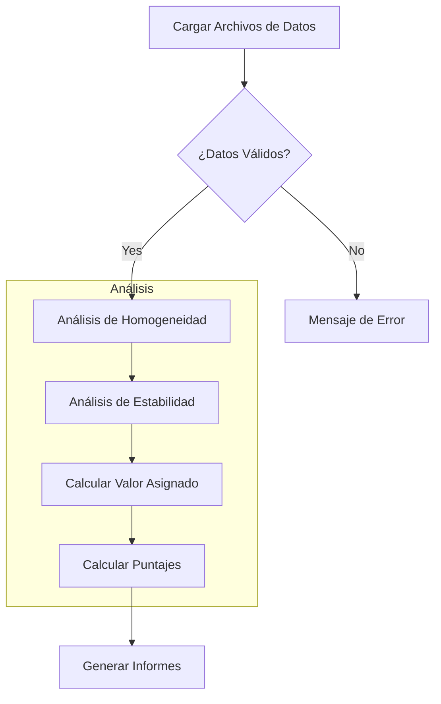
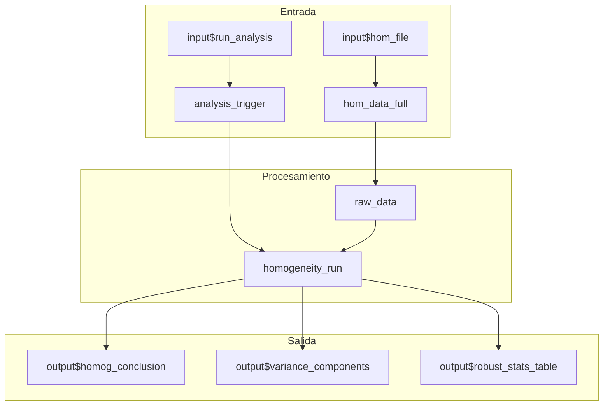
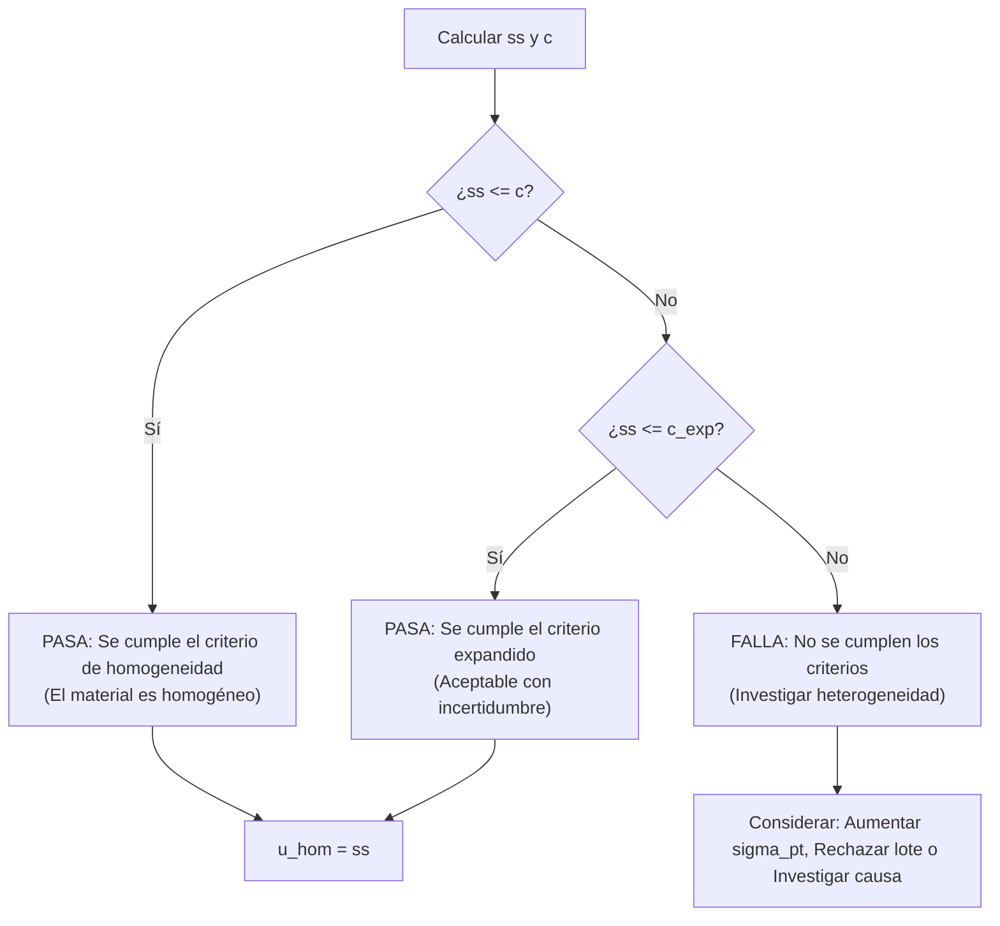
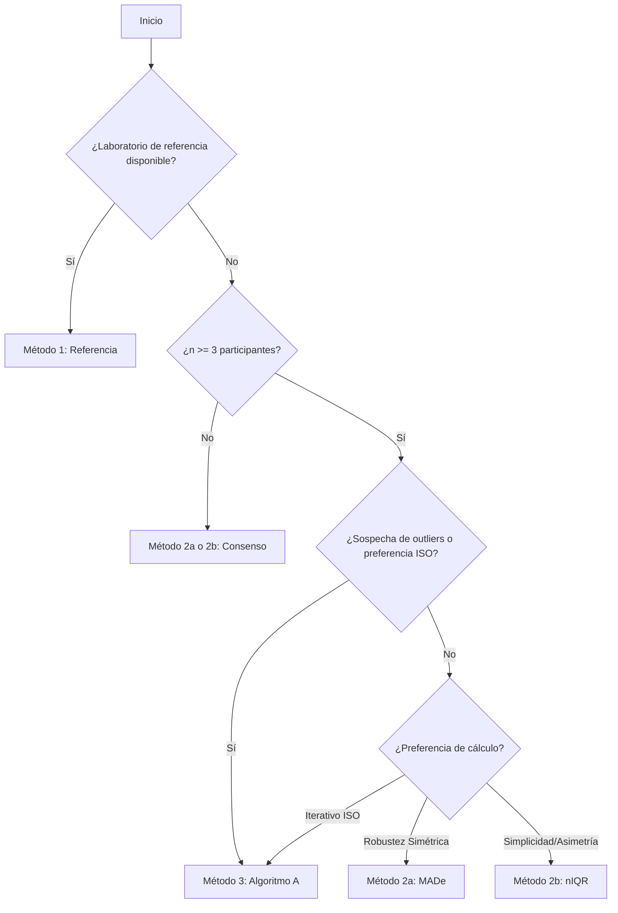
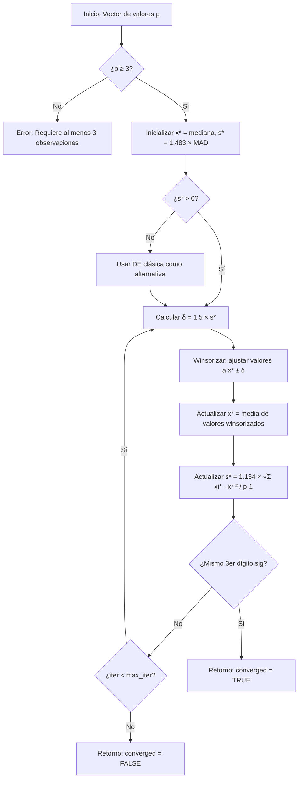
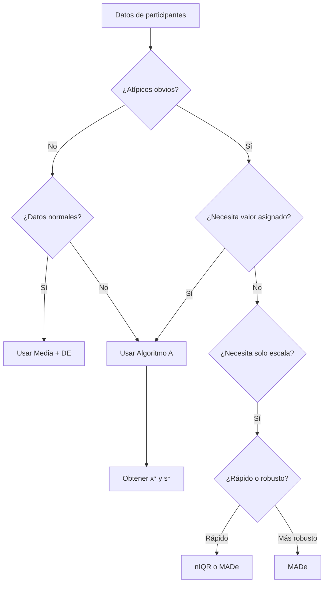
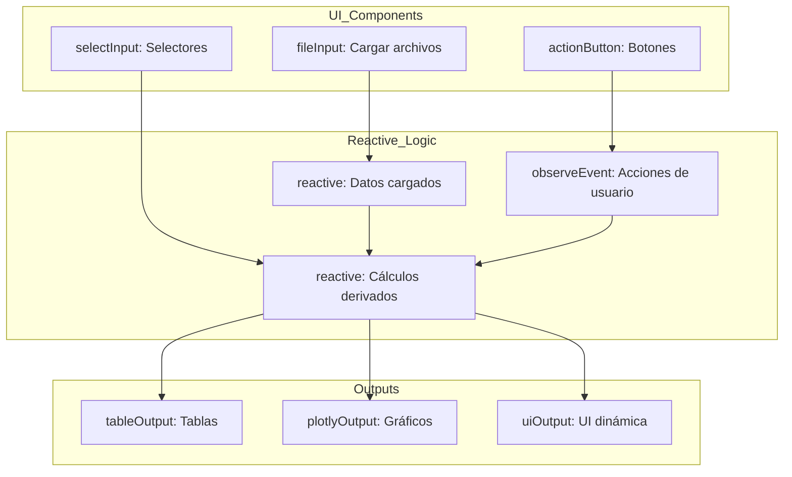
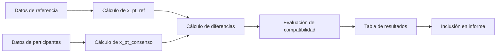

# Manual Completo: Aplicativo de Ensayos de Aptitud v0.4.0

**Fecha:** 28 de enero de 2026  
**Versión:** 0.4.0  
**Autores:** Laboratorio CALAIRE (Universidad Nacional de Colombia) / Instituto Nacional de Metrología (INM)  
**Licencia:** MIT

---

## Resumen Ejecutivo

Este manual completo proporciona una guía integral para el uso, configuración y desarrollo del Aplicativo de Análisis de Ensayos de Aptitud (PT) para gases contaminantes criterio. La aplicación implementa los estándares **ISO 13528:2022** e **ISO 17043:2024**, proporcionando herramientas para evaluar el desempeño de laboratorios mediante comparaciones interlaboratorio.

### Propósito del Manual

Este documento consolida toda la documentación técnica y de usuario del proyecto en un único recurso navegable, organizado en cuatro partes principales:

1. **Introducción** - Configuración, inicio rápido y conceptos fundamentales
2. **Guía de Usuario** - Uso detallado de cada módulo funcional
3. **Referencia Técnica** - Detalles matemáticos, fórmulas ISO y API del paquete ptcalc
4. **Desarrollo** - Arquitectura, personalización y extensión de la aplicación

### Cambios en v0.4.0

- ✅ Auditoría completa de documentación (25 archivos consolidados)
- ✅ Corrección de 12 referencias obsoletas (`cloned_app.R` → `app.R`)
- ✅ Actualización de contadores de líneas (app.R: 5,685, CSS: 1,456, report_template.Rmd: 552)
- ✅ Verificación de 36 referencias de línea específicas
- ✅ Estandarización de idioma (eliminación contenido bilingüe duplicado)
- ✅ Actualización de versiones en archivos clave

---

# PARTE I: INTRODUCCIÓN

## 1. Inicio Rápido

Esta guía le permitirá poner en marcha el Aplicativo de Ensayos de Aptitud en menos de 5 minutos.

### 1.1 Requisitos del Sistema

| Requisito | Versión Mínima | Recomendado |
|-------------|-----------------|-------------|
| **R** | 4.1.0 | 4.4.0 o posterior |
| **RStudio** | 2023.06 | 2024.04 o posterior |
| **Sistema Operativo** | Windows 10+, macOS 11+, Linux | Cualquier SO moderno |
| **RAM** | 4 GB | 8 GB+ |
| **Navegador Web** | Navegador moderno (Chrome, Firefox, Edge, Safari) | |

### 1.2 Instalación

#### Paso 1: Instalar los Paquetes de R Requeridos

Abra R o RStudio y ejecute el siguiente comando para instalar todas las dependencias necesarias:

```r
install.packages(c(
  "shiny", "bslib", "tidyverse", "vroom", "DT", 
  "rhandsontable", "plotly", "ggplot2", "patchwork",
  "outliers", "rmarkdown", "devtools", "shinythemes", 
  "bsplus", "dplyr", "stats"
))
```

**Referencia de Propósito de los Paquetes:**

| Paquete | Propósito |
|---------|---------|
| shiny | Framework web |
| bslib | Temas Bootstrap 5 |
| tidyverse | Manipulación de datos (dplyr, ggplot2, etc.) |
| vroom | Lectura rápida de CSV |
| DT | Tablas interactivas |
| rhandsontable | Tablas editables |
| plotly | Gráficos interactivos |
| ggplot2 | Gráficos estáticos |
| patchwork | Composición de gráficos |
| outliers | Prueba de Grubbs |
| rmarkdown | Generación de informes |
| devtools | Desarrollo de paquetes |

#### Paso 2: Instalar el Paquete ptcalc

La aplicación depende del paquete local `ptcalc` para los cálculos de las normas ISO 13528/17043.

**Para desarrollo/carga:**
```r
# Ejecute esto desde el directorio raíz del proyecto
devtools::load_all("ptcalc")
```

**Para instalación en producción:**
```r
# Ejecute esto desde el directorio raíz del proyecto
devtools::install("ptcalc")
```

### 1.3 Iniciar la Aplicación

#### Método A: Desde la Consola de R/RStudio (Recomendado)

1. Establezca su directorio de trabajo en la raíz del proyecto.
2. Ejecute el archivo de la aplicación.

```r
setwd("/ruta/a/pt_app")
shiny::runApp("app.R")
```

#### Método B: Línea de Comandos

```bash
# Opción 1: Usando Rscript
Rscript app.R

# Opción 2: Usando la ejecución de R
R -e "shiny::runApp('app.R')"
```

*Nota: La aplicación será accesible típicamente en su navegador en `http://127.0.0.1:3838` o en el puerto que se muestre en la consola.*

### 1.4 Flujo de Trabajo de la Aplicación



---

## 2. Visión General

### 2.1 Propósito

El Aplicativo de Ensayos de Aptitud es una herramienta web (Shiny) diseñada para:

- Evaluar el desempeño de laboratorios de medición de gases contaminantes (CO, SO₂, NO, NO₂, O₃)
- Implementar métodos estadísticos robustos según ISO 13528:2022
- Generar informes automatizados con análisis completos
- Validar la homogeneidad y estabilidad de materiales de PT
- Calcular múltiples tipos de puntajes de desempeño (z, z', ζ, Eₙ)

### 2.2 Normas ISO Implementadas

| Norma | Versión | Aplicación Principal |
|--------|---------|----------------------|
| **ISO 13528** | 2022 | Métodos estadísticos para PT (Algoritmo A, MADe, nIQR, puntajes) |
| **ISO 17043** | 2024 | Requisitos generales para proveedores de PT |
| **ISO 5725** | - | Exactitud (veracidad y precisión) de métodos de medición |
| **ISO/IEC 17025** | - | Requisitos generales para competencia de laboratorios |
| **GUM (JCGM 100)** | - | Guía para expresión de incertidumbre en medición |

### 2.3 Arquitectura del Sistema

La aplicación sigue el patrón MVC (Model-View-Controller) con programación reactiva:

```
pt_app/
├── app.R                 # Controlador (Shiny UI/Server) - 5,685 líneas
├── www/
│   └── appR.css          # Estilos personalizados - 1,456 líneas
├── ptcalc/               # Modelo (cálculos matemáticos puros)
│   ├── R/                # 24 funciones exportadas
│   │   ├── pt_robust_stats.R      # Estadísticas robustas
│   │   ├── pt_homogeneity.R       # Homogeneidad/estabilidad
│   │   └── pt_scores.R            # Puntajes de desempeño
│   ├── DESCRIPTION        # Metadatos del paquete
│   └── NAMESPACE          # Exportaciones
├── reports/
│   └── report_template.Rmd # Plantilla de informe - 552 líneas
├── data/                 # Archivos CSV de ejemplo
└── es/                   # Documentación en español
```

---

## 3. Glosario

Este glosario proporciona definiciones y traducciones (español/inglés) para los términos utilizados en el aplicativo de ensayos de aptitud (PT).

### 3.1 Conceptos Fundamentales

| Español | Inglés | Símbolo | Definición |
|---------|---------|--------|------------|
| Ensayo de aptitud | Proficiency testing (PT) | PT | Evaluación del desempeño de los participantes con respecto a criterios preestablecidos mediante comparaciones interlaboratorio. |
| Interlaboratorio | Interlaboratory | - | Comparación entre múltiples laboratorios. |
| Participante | Participant | - | Laboratorio o entidad que envía resultados para su evaluación. |
| Proveedor de PT | PT provider | - | Organización que lleva a cabo el ensayo de aptitud. |
| Organismo de Ensayos de Aptitud | Proficiency Testing Body | PTB | La organización responsable del esquema de PT. |

### 3.2 Mediciones y Datos

| Español | Inglés | Símbolo | Definición |
|---------|---------|--------|------------|
| Analito | Pollutant / Analyte | - | La especie de gas específica o sustancia que se está analizando (ej. CO, SO₂, NO, etc.). |
| Nivel | Level | - | Nivel de concentración del analito (ej. bajo, medio, alto). |
| Muestra | Sample | - | Ítem físico que se está midiendo. |
| Ítem de ensayo de aptitud | PT item | g | Unidad de muestra individual para el ensayo, a menudo utilizada en estudios de homogeneidad. |
| Réplica | Replicate | - | Medición repetida sobre la misma muestra o ítem. |
| Valor | Value | x | Resultado de la concentración medida. |
| Valor reportado | Reported value | $x_i$ | Valor enviado por un participante para su evaluación. |
| Media | Mean | $\bar{x}$ | Promedio aritmético de los valores. |
| Mediana | Median | $\tilde{x}$ | Valor central cuando los datos están ordenados. |
| Desviación estándar | Standard deviation | s, $\sigma$ | Medida de la dispersión o variabilidad de los datos. |
| Varianza | Variance | $s^2$ | Cuadrado de la desviación estándar. |

### 3.3 Valor Asignado y Puntajes

| Español | Inglés | Símbolo | Definición |
|---------|---------|--------|------------|
| Valor asignado | Assigned value | $x_{pt}$ | Valor de referencia utilizado para evaluar los resultados de los participantes. |
| Valor de referencia | Reference value | $x_{ref}$ | Valor determinado por un laboratorio de referencia o mediante formulación. |
| Valor de consenso | Consensus value | $x^*$ | Media robusta derivada de los resultados de los participantes. |
| Puntaje z | z-score | z | $(x - x_{pt}) / \sigma_{pt}$ - Evalúa la desviación relativa a $\sigma_{pt}$. |
| Puntaje z prima | z'-score | z' | $(x - x_{pt}) / \sqrt{\sigma_{pt}^2 + u_{xpt}^2}$ - Se usa cuando la incertidumbre del valor asignado es significativa. |
| Puntaje zeta | zeta-score | $\zeta$ | $(x - x_{pt}) / \sqrt{u_x^2 + u_{xpt}^2}$ - Compara resultados utilizando la incertidumbre reportada por el propio participante. |
| Número normalizado | En number | $E_n$ | $(x - x_{pt}) / \sqrt{U_x^2 + U_{xpt}^2}$ - Se usa para comparar resultados con incertidumbres expandidas (k=2). |

### 3.4 Estadísticos Robustos

| Español | Inglés | Símbolo | Definición |
|---------|---------|--------|------------|
| Estadístico robusto | Robust statistic | - | Un estimador resistente a la influencia de valores atípicos (outliers). |
| Algoritmo A | Algorithm A | - | Método de estimación robusta iterativa descrito en la norma ISO 13528, Anexo C. |
| Media robusta | Robust mean | $x^*$ | Media calculada utilizando estadísticas robustas (ej. Algoritmo A) para minimizar la influencia de valores atípicos. |
| Desviación estándar robusta | Robust standard deviation | $s^*$ | Desviación estándar calculada utilizando estadísticas robustas. |
| nIQR | Normalized IQR | nIQR | $0.7413 \times IQR$, una estimación robusta de la desviación estándar. |
| MADe | Scaled MAD | MADe | $1.483 \times MAD$, una estimación robusta de la desviación estándar. |
| Rango intercuartílico | Interquartile range | IQR | Diferencia entre el tercer y el primer cuartil ($Q_3 - Q_1$). |
| Desviación absoluta mediana | Median absolute deviation | MAD | Mediana de las desviaciones absolutas respecto a la mediana: $\text{median}(|x_i - \text{median}|)$. |

### 3.5 Homogeneidad y Estabilidad

| Español | Inglés | Símbolo | Definición |
|---------|---------|--------|------------|
| Homogeneidad | Homogeneity | - | Uniformidad de las propiedades entre diferentes unidades (ítems) en un lote. |
| Estabilidad | Stability | - | Constancia de las propiedades de un material durante un período específico. |
| Desviación entre muestras | Between-sample std dev | $s_s$ | Componente de variación atribuido a las diferencias entre ítems. |
| Desviación intra-muestra | Within-sample std dev | $s_w$ | Componente de variación atribuido a la repetibilidad de la medición dentro de los ítems. |
| Criterio de homogeneidad | Homogeneity criterion | c | Límite de aceptación, típicamente definido como $0.3 \times \sigma_{pt}$. |
| Incertidumbre de homogeneidad | Homogeneity uncertainty | $u_{hom}$ | Contribución de la incertidumbre derivada de una posible falta de homogeneidad. |
| Incertidumbre de estabilidad | Stability uncertainty | $u_{stab}$ | Contribución de la incertidumbre derivada de una posible inestabilidad. |

### 3.6 Clasificación de Puntajes

#### Niveles de Desempeño

| Español | Inglés | Criterio | Descripción |
|---------|---------|-----------|-------------|
| Satisfactorio | Satisfactory | $|z| \leq 2$ o $|E_n| \leq 1$ | El desempeño se considera aceptable. |
| Cuestionable | Questionable | $2 < |z| < 3$ | El desempeño proporciona una señal de advertencia. |
| No satisfactorio | Unsatisfactory | $|z| \geq 3$ o $|E_n| > 1$ | El desempeño se considera inaceptable (se requiere acción). |

---

# PARTE II: GUÍA DE USUARIO

## 4. Carga de Datos

### 4.1 Descripción

Este módulo gestiona la carga y validación de los archivos CSV de entrada. Es el punto de partida para todos los análisis de la aplicación, asegurando la integridad de los datos antes de comenzar cualquier procesamiento estadístico.

### 4.2 Formatos de Archivo

La aplicación utiliza tres tipos principales de archivos CSV:

1. **Archivo de homogeneidad** (`homogeneity.csv`) - Se utiliza para probar la uniformidad de la muestra dentro de un lote.
2. **Archivo de estabilidad** (`stability.csv`) - Se utiliza para probar la consistencia de la muestra a lo largo del tiempo.
3. **Archivos resumen** (`summary_n*.csv`) - Contienen los resultados de medición agregados de los participantes del PT.

#### 4.2.1 Datos de Homogeneidad y Estabilidad

Se utiliza para `homogeneity.csv` y `stability.csv`. Este formato representa datos en **Formato Largo** donde cada fila es una única medición.

| Columna | Requerida | Tipo | Descripción | Valores de Ejemplo |
|:-------|:--------:|:-----|:------------|:---------------|
| `pollutant` | **Sí** | Cadena | Identificador del analito (sensible a mayúsculas, minúsculas preferiblemente) | `co`, `no`, `so2`, `o3`, `no2` |
| `run` | **Sí** | Cadena | Identificador de la corrida/ronda | `corrida_1`, `corrida_2`, `corrida_3` |
| `level` | **Sí** | Cadena | Nivel de concentración con unidades | `0-umol/mol`, `20-nmol/mol`, `121-nmol/mol` |
| `replicate` | No* | Entero | Número de réplica (típicamente 1 o 2) | `1`, `2` |
| `sample_id` | No | Entero | Identificador del ítem/muestra | `1`, `2`, `3`, ... `10` |
| `value` | **Sí** | Flotante | Valor de concentración medido | `0.00670`, `2.01153`, `-0.04928` |
| `date` | No | Fecha | Fecha de medición (si se registra) | `2023-10-01` |

> **Nota sobre `replicate`:** Aunque el validador no impone estrictamente la presencia de la columna `replicate`, es **esencial** para la transformación `pivot_wider` en `get_wide_data()`. Sin ella, la conversión al formato ancho (requerido para ANOVA) fallará o producirá resultados inesperados.

**Ejemplo de Datos Reales:**
```csv
"pollutant","run","level","replicate","sample_id","value"
"co","corrida_1","0-μmol/mol",1,1,0.00670
"co","corrida_1","0-μmol/mol",1,2,-0.04796
"so2","corrida_1","20-nmol/mol",1,1,19.70235
"so2","corrida_1","20-nmol/mol",1,2,19.72471
"so2","corrida_2","20-nmol/mol",2,1,19.67882
"so2","corrida_2","20-nmol/mol",2,2,19.67765
```

#### 4.2.2 Datos de Resumen de Participantes

Se utiliza para los archivos `summary_n*.csv`. Contiene resultados agregados de los participantes del PT.

| Columna | Requerida | Tipo | Descripción | Valores de Ejemplo |
|:-------|:--------:|:-----|:------------|:---------------|
| `pollutant` | **Sí** | Cadena | Identificador del analito | `co`, `no`, `so2` |
| `run` | **Sí** | Cadena | Identificador de la corrida/ronda | `corrida_1`, `corrida_2` |
| `level` | **Sí** | Cadena | Nivel de concentración | `0-umol/mol`, `20-nmol/mol` |
| `participant_id` | **Sí** | Cadena | Identificador único del laboratorio | `part_1`, `LAB_01`, `ref` |
| `mean_value` | **Sí** | Flotante | Media reportada por el participante | `2.0121508274` |
| `sd_value` | **Sí** | Flotante | Desviación estándar reportada por el participante | `0.0035971898` |
| `replicate` | No | Entero | Número de réplicas utilizadas por el laboratorio | `2`, `3`, `4` |
| `sample_group` | No | Cadena | Identificador del grupo de muestras | `1-10`, `11-20`, `21-30` |

**Identificadores Especiales de Participantes:**

| ID | Significado |
|:---|:---|
| `ref` | **Laboratorio de Referencia**. Se utiliza como el valor asignado ($x_{pt}$) si se selecciona el método del Laboratorio de Referencia. Se excluye automáticamente de algunos cálculos de puntajes de PT pero se incluye en el consenso. |
| `part_N` | Identificador de participante estándar (ej., `part_1`, `part_2`). |

**Convención de Nombre de Archivo:**

Los archivos resumen siguen una convención de nomenclatura específica para permitir que la aplicación identifique el esquema/ronda de PT automáticamente:

| Patrón | Regex | Ejemplo | `n_lab` Extraído |
|:---|:---|:---|:---|
| `summary_n[Número].csv` | `\d+` | `summary_n4.csv` | `4` |
| `summary_[Número]_[Sufijo].csv` | `\d+` | `summary_123_final.csv` | `123` |

### 4.3 Especificaciones de Contaminantes y Niveles

#### 4.3.1 Contaminantes Soportados

| Código | Nombre en Inglés | Fórmula Química | Unidades Típicas |
|:---|:---|:---|:---|
| `so2` | Dióxido de azufre | SO₂ | nmol/mol, μmol/mol |
| `co` | Monóxido de carbono | CO | μmol/mol |
| `o3` | Ozono | O₃ | nmol/mol |
| `no` | Óxido nítrico | NO | nmol/mol |
| `no2` | Dióxido de nitrógeno | NO₂ | nmol/mol |

**Crítico:** Utilice únicamente códigos en **minúsculas**. La aplicación es sensible a mayúsculas y minúsculas para el filtrado de contaminantes y la coincidencia de datos.

#### 4.3.2 Formatos de Nivel Típicos

| Contaminante | Formato de Ejemplo | Rangos Típicos |
|:---|:---|:---|
| SO2 | `20-nmol/mol` | 0, 20, 60, 61, 100, 140, 180 |
| CO | `2-umol/mol` | 0, 2, 4, 6, 8 |
| O3 | `120-nmol/mol` | 0, 40, 80, 120, 180 |
| NO | `121-nmol/mol` | 0, 42, 81, 82, 121, 122, 180, 181, 182 |
| NO2 | `90-nmol/mol` | 0, 30, 60, 90, 120 |

### 4.4 Validación de Datos

#### 4.4.1 Reglas de Validación

| Validación | Regla | Mensaje de Error / Comportamiento |
|------------|-------|-----------------------------------|
| **Columnas (H/E)** | `value`, `pollutant`, `level`, `run` | "El archivo de [homogeneidad/estabilidad] debe contener las columnas..." |
| **Columnas (Resumen)** | `participant_id`, `pollutant`, `level`, `run`, `mean_value`, `sd_value` | "Los archivos resumen deben contener las columnas..." |
| **Tipos de Datos** | `value`, `mean_value`, `sd_value` deben ser numéricos | Error de vroom o validación de R |
| **Nombre de Archivo** | Los archivos resumen deben contener un número | `n_lab` se vuelve `NA` si no hay número |
| **Columna run** | `run` debe ser tipo caracter (string) con identificador de corrida | Valores como `"corrida_1"`, `"corrida_2"` |
| **Presencia de Archivo** | `req(input$file)` | Silencioso hasta que se sube el archivo |

#### 4.4.2 Problemas Comunes de Formato

| Problema | Síntoma | Solución |
|:---|:---|:---|
| **Discrepancia en nombres de columna** | Error "must contain columns..." | Utilice nombres exactos en minúsculas. |
| **Falta columna `run`** | Error de validación o datos incompletos | Añada la columna `run` con identificadores de corrida (ej., `corrida_1`). |
| **Falta `replicate`** | El formato ancho tiene una estructura incorrecta | Añada la columna de réplica (1, 2). |
| **Espacios en blanco adicionales** | Los filtros no coinciden con los valores | Recorte los espacios en blanco en CSV/Excel. |
| **Contaminantes con mayúsculas/minúsculas mezcladas** | "No data found for pollutant" | Estandarice a minúsculas. |
| **Sin participante `ref`** | El cálculo de puntajes falla | Añada el laboratorio de referencia con ID `ref`. |
| **`value` no numérico** | Errores de análisis de `vroom` | Elimine entradas de texto/unidades de la columna de valor. |
| **Codificación UTF-8** | Caracteres especiales (μ, ²) corruptos | Vuelva a guardar el archivo con codificación UTF-8. |

### 4.5 Interfaz de Carga

#### 4.5.1 Componentes de la Interfaz

| Elemento UI | ID de Entrada | Tipo | Propósito |
|-------------|---------------|------|-----------|
| Carga Homogeneidad | `hom_file` | `fileInput` | Subir `homogeneity.csv` |
| Carga Estabilidad | `stab_file` | `fileInput` | Subir `stability.csv` |
| Carga Resúmenes | `summary_files` | `fileInput` (multiple) | Subir archivos `summary_n*.csv` |
| Estado de Carga | `data_upload_status` | `verbatimTextOutput` | Muestra el estado de la carga de archivos |

#### 4.5.2 Diseño Moderno de Carga de Archivos (shadcn Cards)

La interfaz de carga de datos utiliza componentes inspirados en shadcn para una experiencia de usuario moderna.

**Estructura de Grid:**

El panel de carga está organizado en un grid de 3 columnas en pantallas de escritorio (responsive).

**Estilos de Input de Archivos:**

Los inputs de archivo utilizan bordes punteados modernos e iconos mejorados.

---

## 5. Análisis de Homogeneidad

### 5.1 Conceptos ISO 13528

La evaluación de homogeneidad según ISO 13528:2022 Sección 9 tiene como objetivo verificar que:

1. Cada participante reciba un ítem de ensayo equivalente
2. La variación entre ítems sea despreciable comparada con la variación del desempeño esperado ($\sigma_{pt}$)

### 5.2 Interfaz de Análisis

#### 5.2.1 Componentes UI

| Elemento UI | Input ID | Output ID | Tipo | Descripción |
|-------------|----------|-----------|------|-------------|
| **Botón Ejecutar** | `run_analysis` | - | `actionButton` | Dispara el cálculo de homogeneidad. |
| **Selector Analito** | `pollutant_analysis` | `pollutant_selector_analysis` | `selectInput` | Filtra por contaminante (SO2, CO, O3, etc.). |
| **Selector Nivel** | `target_level` | `level_selector` | `selectInput` | Filtra por nivel de concentración. |
| **Conclusión Homog.** | - | `homog_conclusion` | `uiOutput` | Alerta colorizada con el resultado del criterio. |
| **Tabla ANOVA** | - | `variance_components` | `tableOutput` | Componentes de varianza (ss, sw) y criterios. |
| **Estadísticos Robustos**| - | `robust_stats_table` | `tableOutput` | Mediana, MADe, nIQR. |
| **Detalles por ítem** | - | `details_per_item_table` | `tableOutput` | Promedio y rango por cada ítem evaluado. |
| **Tabla u_hom** | - | `u_hom_table` | `dataTableOutput` | Incertidumbre por homogeneidad. |

#### 5.2.2 Flujo de Datos y Lógica Reactiva



### 5.3 Interpretación de Resultados

#### 5.3.1 Componentes de Varianza

| Componente | Fórmula | Interpretación |
|-----------|---------|----------------|
| $s_w$ (Dentro de muestras) | $\sqrt{\frac{\sum w_i^2}{2g}}$ | Variación de repetibilidad del método |
| $s_s$ (Entre muestras) | $\sqrt{s_{\bar{x}}^2 - \frac{s_w^2}{m}}$ | Variación atribuida a heterogeneidad |

#### 5.3.2 Criterios de Aceptación

**Criterio Básico:**
$$s_s \leq c = 0.3 \times \sigma_{pt}$$

**Criterio Expandido:**
$$c_{exp} = F_1 \times (0.3 \times \sigma_{pt})^2 + F_2 \times s_w^2$$

Donde $F_1$ y $F_2$ son coeficientes que dependen del número de muestras $g$ (ver Sección 14.4.3 para tabla completa).

#### 5.3.3 Árbol de Decisión



---

## 6. Análisis de Estabilidad

### 6.1 Conceptos ISO 13528

La evaluación de estabilidad según ISO 13528:2022 Sección 9.3 tiene como objetivo verificar que:

1. Las propiedades del material no cambien significativamente durante el periodo del PT
2. Cada participante reciba un material con características equivalentes, independientemente de cuándo realice el análisis

### 6.2 Interfaz de Análisis

#### 6.2.1 Componentes UI

| Elemento UI | Input ID | Output ID | Tipo | Descripción |
|-------------|----------|-----------|------|-------------|
| **Botón Estabilidad** | `run_stability` | - | `actionButton` | Dispara el análisis de estabilidad. |
| **Conclusión Stab.** | - | `homog_conclusion_stability` | `uiOutput` | Alerta con el resultado de estabilidad. |
| **Tabla u_stab** | - | `u_stab_table` | `dataTableOutput` | Incertidumbre por estabilidad. |

### 6.3 Interpretación de Resultados

#### 6.3.1 Diferencia de Estabilidad

$$D = |\bar{\bar{x}}_{hom} - \bar{\bar{x}}_{stab}|$$

#### 6.3.2 Criterios de Estabilidad

**Básico:** $D \leq 0.3 \times \sigma_{pt}$

**Expandido:** $D \leq (0.3 \times \sigma_{pt}) + 2 \times \sqrt{u_{hom}^2 + u_{stab}^2}$

#### 6.3.3 Incertidumbre de Estabilidad

$$u_{stab} = \begin{cases} 
0 & \text{si } D \leq 0.3 \times \sigma_{pt} \\ 
\frac{D}{\sqrt{3}} & \text{si } D > 0.3 \times \sigma_{pt} 
\end{cases}$$

---

## 7. Valor Asignado

### 7.1 Métodos de Consenso

| Método | Código | Descripción | Fórmula $x_{pt}$ | Fórmula $\sigma_{pt}$ | Racional de Uso |
|--------|--------|-------------|------------------|-----------------------|-----------------|
| **Referencia** | 1 | Valor de laboratorio de referencia | $\bar{x}_{ref}$ | MADe del lab ref | Cuando se dispone de un valor trazable o certificado. |
| **Consenso MADe** | 2a | Mediana con MADe | $\text{median}(x_i)$ | $1.483 \times \text{MAD}$ | Sin referencia; preferir robustez frente a valores atípicos. |
| **Consenso nIQR** | 2b | Mediana con nIQR | $\text{median}(x_i)$ | $0.7413 \times \text{IQR}$ | Sin referencia; alternativa robusta si la distribución es asimétrica. |
| **Algoritmo A** | 3 | Estimación robusta iterativa | $x^*$ (robusto) | $s^*$ (robusto) | Sin referencia y $n \geq 3$; elimina influencia de atípicos de forma iterativa. |

### 7.2 Guía de Selección de Método



### 7.3 Valor de Referencia

El valor de referencia proviene de un laboratorio con alto nivel metrológico, trazable a patrones nacionales o internacionales.

**Lógica:**
```r
reference_table_data <- reactive({
  pt_prep_data() %>%
    filter(participant_id == "ref") %>%
    group_by(pollutant, level, n_lab) %>%
    summarise(
      x_pt = mean(mean_value, na.rm = TRUE),
      sigma_pt = 1.483 * median(abs(mean_value - median(mean_value))),
      .groups = "drop"
    )
})
```

**Fórmulas:**
- **Valor Asignado:** $x_{pt} = \bar{x}_{ref} = \frac{1}{n_{ref}} \sum_{i=1}^{n_{ref}} x_i$
- **Desviación Estándar:** $\sigma_{pt} = \text{MADe} \times 1.483$

### 7.4 Compatibilidad Metrológica

Evalúa si existe un sesgo significativo entre el valor de referencia y los valores de consenso.

**Fórmula de Evaluación ($D$):**
$$D = \frac{|x_{pt,ref} - x_{pt,consenso}|}{\sqrt{u_{ref}^2 + u_{consenso}^2}}$$

**Criterio de Aceptación:**
- **$D \leq 1$:** Compatible (no hay evidencia de sesgo).
- **$1 < D \leq 2$:** Cuestionable.
- **$D > 2$:** No compatible (indica sesgo significativo entre métodos).

---

## 8. Puntajes PT

### 8.1 Tipos de Puntajes

#### 8.1.1 z-score

**Fórmula:** $z = \frac{x - x_{pt}}{\sigma_{pt}}$

**Referencia:** ISO 13528:2022 Sección 10.2

**Casos de Uso:**
- Evaluación básica cuando $\sigma_{pt}$ está especificada
- La incertidumbre del valor asignado es despreciable ($u(x_{pt}) \le 0.3 \sigma_{pt}$)

**Criterios de Clasificación:**
- $|z| \leq 2$: Satisfactorio
- $2 < |z| < 3$: Cuestionable
- $|z| \geq 3$: No satisfactorio

#### 8.1.2 z'-score

**Fórmula:** $z' = \frac{x - x_{pt}}{\sqrt{\sigma_{pt}^2 + u_{xpt}^2}}$

**Referencia:** ISO 13528:2022 Sección 10.3

**Casos de Uso:**
- Cuando la incertidumbre del valor asignado es significativa ($u(x_{pt}) > 0.3 \sigma_{pt}$)

#### 8.1.3 ζ-score (zeta)

**Fórmula:** $\zeta = \frac{x - x_{pt}}{\sqrt{u_x^2 + u_{xpt}^2}}$

**Referencia:** ISO 13528:2022 Sección 10.4

**Casos de Uso:**
- Evaluar la concordancia entre el resultado del participante y el valor asignado, considerando **ambas** incertidumbres ($u_x$ y $u_{xpt}$)

#### 8.1.4 En-score

**Fórmula:** $E_n = \frac{x - x_{pt}}{\sqrt{U_x^2 + U_{xpt}^2}}$

**Referencia:** ISO 13528:2022 Sección 10.5

**Casos de Uso:**
- Compatibilidad metrológica (k=2)
- Comparación de calibración

**Criterios de Clasificación:**
- $|E_n| \leq 1$: Satisfactorio
- $|E_n| > 1$: No satisfactorio

### 8.2 Criterios de Clasificación

#### 8.2.1 Clasificación de Puntajes z, z' y ζ

| Resultado | Criterio | Color |
|:---|:---|:---|
| **Satisfactorio** | $|z| \leq 2$ | Verde (`#4CAF50`) |
| **Cuestionable** | $2 < |z| < 3$ | Amarillo (`#FFC107`) |
| **No satisfactorio** | $|z| \geq 3$ | Rojo (`#F44336`) |

#### 8.2.2 Clasificación del Puntaje En

| Resultado | Criterio | Color |
|:---|:---|:---|
| **Satisfactorio** | $|E_n| \leq 1$ | Verde (`#4CAF50`) |
| **No satisfactorio** | $|E_n| > 1$ | Rojo (`#F44336`) |

### 8.3 Interfaz de Cálculo

#### 8.3.1 Componentes UI

| Elemento UI | Input ID | Output ID | Tipo | Descripción |
|-------------|----------|-----------|------|-------------|
| **Selector Tipo Puntaje** | `score_type` | - | `selectInput` | z, z', ζ, o En |
| **Selector Método x_pt** | `xpt_method` | - | `selectInput` | Referencia, MADe, nIQR, Algoritmo A |
| **Tabla de Puntajes** | - | `scores_table` | `dataTableOutput` | Puntajes calculados por participante |
| **Resumen de Clasificación** | - | `scores_summary` | `tableOutput` | Conteo por categoría de desempeño |

---

## 9. Informe Global

### 9.1 Heatmap Visualization

El informe global incluye visualizaciones tipo heatmap que permiten identificar patrones de desempeño:

- **Cross-pollutant**: Comparación de desempeño entre diferentes contaminantes
- **Cross-scheme**: Comparación de desempeño entre diferentes esquemas de PT (diferentes n_lab)
- **Cross-level**: Comparación de desempeño entre diferentes niveles de concentración

### 9.2 Componentes UI

| Elemento UI | Input ID | Output ID | Tipo | Descripción |
|-------------|----------|-----------|------|-------------|
| **Selector Esquema** | `global_n` | - | `selectInput` | Filtra por número de participantes |
| **Heatmap z-scores** | - | `global_heatmap_z` | `plotlyOutput` | Mapa de calor de puntajes z |
| **Heatmap En-scores** | - | `global_heatmap_en` | `plotlyOutput` | Mapa de calor de puntajes En |
| **Resumen Global** | - | `global_summary_table` | `dataTableOutput` | Tabla consolidada de todos los resultados |

---

## 10. Gestión de Participantes

### 10.1 Tabla de Participantes

La aplicación incluye una tabla DT (DataTables) interactiva que muestra:

- `participant_id`: Identificador único del laboratorio
- `pollutant`: Contaminante evaluado
- `level`: Nivel de concentración
- `mean_value`: Valor reportado
- `sd_value`: Desviación estándar reportada
- Calculated scores: z, z', ζ, En
- Classification: Satisfactorio/Cuestionable/No satisfactorio

### 10.2 Edición de Datos

La tabla permite:
- Ordenar por columnas
- Filtrar por texto
- Seleccionar filas
- Exportar a CSV

### 10.3 Exportación

Los datos de participantes se pueden exportar en formato CSV para análisis externo.

---

## 11. Valores Atípicos

### 11.1 Prueba de Grubbs

Detecta un único valor atípico en un conjunto de datos.

**Hipótesis nula:** No hay valores atípicos en los datos.

**Estadística de prueba:**
$$G = \frac{\max|x_i - \bar{x}|}{s}$$

**Valor crítico:** $G_{crit}$ (de tabla de Grubbs)

**Decisión:**
- Si $G > G_{crit}$, rechazar hipótesis nula (hay un valor atípico)

### 11.2 Prueba de Dixon

Utilizada para valores atípicos en tamaños de muestra pequeños (n < 30).

**Variantes según n:**
- Q10 (para n ≤ 7)
- Q11 (para 8 ≤ n ≤ 10)
- Q12 (para 11 ≤ n ≤ 13)
- Q21 (para 14 ≤ n ≤ 25)

### 11.3 Identificación Automática

La aplicación identifica automáticamente valores atípicos y los marca en:

- Color rojo en tablas
- Etiquetas especiales en gráficos
- Notas en informes generados

---

## 12. Generación de Informes

### 12.1 Configuración del Reporte

#### 12.1.1 Metadatos Requeridos

| Campo | ID Input | Descripción |
|-------|----------|-------------|
| ID del PT | `pt_id` | Identificador único del esquema de PT |
| Fecha | `pt_date` | Fecha del esquema de PT |
| Coordinador | `coordinator` | Nombre del coordinador del PT |
| Institución | `institution` | Nombre de la institución organizadora |

#### 12.1.2 Parámetros de Compatibilidad Metrológica

| Campo | ID Input | Descripción |
|-------|----------|-------------|
| Método de compatibilidad | `metrological_compatibility_method` | Selección de método para x_pt (Referencia, MADe, nIQR, Algoritmo A) |

### 12.2 Secciones del Informe

El informe generado incluye las siguientes secciones:

1. **Portada** - Metadatos del esquema de PT
2. **Resumen Ejecutivo** - Estadísticas globales
3. **Homogeneidad** - Resultados de evaluación de homogeneidad
4. **Estabilidad** - Resultados de evaluación de estabilidad
5. **Valor Asignado** - Método utilizado y valor calculado
6. **Compatibilidad Metrológica** - Comparación entre métodos
7. **Puntajes de Desempeño** - z, z', ζ, En por participante
8. **Conclusiones** - Hallazgos y recomendaciones

### 12.3 Parámetros de Compatibilidad

El informe incluye una sección de compatibilidad metrológica que compara:

- Valor de referencia vs valores de consenso
- Diferencias absolutas ($D_{2a}$, $D_{2b}$, $D_3$)
- Evaluación de compatibilidad

### 12.4 Exportación en PDF/Word

La aplicación permite generar informes en dos formatos:

1. **PDF** - A través de renderizado de RMarkdown con LaTeX
2. **Word (DOCX)** - A través de renderizado de RMarkdown con pandoc

---

# PARTE III: REFERENCIA TÉCNICA

## 13. Estadísticas Robustas (ISO 13528:2022)

### 13.1 Median Absolute Deviation (MADe)

**Fórmula:**
$$\text{MADe} = 1.483 \times \text{median}(|x_i - \text{median}(x)|)$$

**Propiedades:**
- **Constante 1.483:** Derivada de $1/\Phi^{-1}(0.75)$ para asegurar la consistencia con la DE bajo normalidad.
- **Punto de ruptura:** 50%
- **Eficiencia (normal):** 37%

**Uso:** Inicialización; solo escala

**Referencia:** ISO 13528:2022 Sección 9.4

### 13.2 Interquartile Range (nIQR)

**Fórmula:**
$$\text{nIQR} = 0.7413 \times (Q_3 - Q_1)$$

**Propiedades:**
- **Constante 0.7413:** Derivada de $1/(\Phi^{-1}(0.75) - \Phi^{-1}(0.25))$ para coincidir con la DE para datos normales.
- **Punto de ruptura:** 25%
- **Eficiencia (normal):** 37%

**Uso:** Distribuciones asimétricas

**Referencia:** ISO 13528:2022 Sección 9.4

### 13.3 Algoritmo A

El Algoritmo A es un procedimiento iterativo utilizado para calcular una media robusta ($x^*$) y una desviación estándar robusta ($s^*$). Es el método principal utilizado en esta aplicación cuando se selecciona la opción "Consenso (Algoritmo A)".

#### 13.3.1 Flujo del Algoritmo



#### 13.3.2 Procedimiento Paso a Paso

1. **Inicialización:**
   - Eliminar valores no finitos (`NA`, `Inf`, `-Inf`).
   - Verificar que $p \ge 3$.
   - Establecer estimaciones iniciales: $x^* = \text{mediana}(x)$ y $s^* = 1.483 \times \text{MAD}(x)$.
   - Si $s^* \approx 0$, utilizar la desviación estándar (DE) clásica como alternativa (NOTA 2 de la ISO).

2. **Calcular el Límite de Winsorización ($\delta$):**
   $$\delta = 1.5 \times s^*$$

3. **Winsorizar los Valores:**
   $$x_i^* = \begin{cases} x^* - \delta & \text{si } x_i < x^* - \delta \\ x^* + \delta & \text{si } x_i > x^* + \delta \\ x_i & \text{de lo contrario} \end{cases}$$

4. **Actualizar Estimaciones:**
   $$x^*_{nuevo} = \frac{1}{p} \sum_{i=1}^{p} x_i^*$$
   $$s^*_{nuevo} = 1.134 \times \sqrt{\frac{\sum_{i=1}^{p} (x_i^* - x^*_{nuevo})^2}{p-1}}$$

5. **Verificar Convergencia:**
   Se considera convergido si $x^*$ y $s^*$ no muestran cambios en la tercera cifra significativa. Si no ha convergido, repetir desde el paso 2 hasta llegar a `max_iter`.

#### 13.3.3 Comparación de Estimadores

| Característica | MADe | nIQR | Algoritmo A |
|----------------|-------|-------|-------------|
| **Fórmula** | $1.483 \times \text{median}(\|x_i - \tilde{x}\|)$ | $0.7413 \times (Q_3 - Q_1)$ | Winsorización Iterativa |
| **Punto de ruptura** | 50% | 25% | ~50% |
| **Eficiencia (normal)** | 37% | 37% | ~95% |
| **Iterativo** | No | No | Sí |
| **Mejor Uso** | Inicialización; solo escala | Distribuciones asimétricas | **Valor de consenso principal** |

**Referencia:** ISO 13528:2022 Anexo C

### 13.4 Comparación de Métodos



---

## 14. Homogeneidad ISO 13528:2022

### 14.1 ANOVA de un Factor

La evaluación se basa en un modelo de Análisis de Varianza (ANOVA) de un factor:

$$x_{ij} = \mu + \alpha_i + \epsilon_{ij}$$

Donde:
- $x_{ij}$ = $j$-ésima medición de la $i$-ésima muestra.
- $\mu$ = Media general.
- $\alpha_i$ = Efecto de la muestra $i$ (variación entre muestras).
- $\epsilon_{ij}$ = Error de medición (variación dentro de la muestra).

### 14.2 Componentes de Varianza

#### 14.2.1 Desviación Estándar Dentro de las Muestras ($s_w$)

Para el caso típico de **$m = 2$ réplicas**:
$$s_w = \sqrt{\frac{\sum_{i=1}^{g} (x_{i1} - x_{i2})^2}{2g}}$$

Para **$m > 2$ réplicas**:
$$s_w^2 = \frac{1}{g} \sum_{i=1}^{g} s_i^2$$

#### 14.2.2 Desviación Estándar Entre Muestras ($s_s$)

$$s_s^2 = \max\left(0, s_{\bar{x}}^2 - \frac{s_w^2}{m}\right)$$

Donde $s_{\bar{x}}^2$ es la varianza de las medias de las muestras. La resta de $s_w^2/m$ elimina la contribución del ruido de medición de la variación observada entre muestras.

### 14.3 Tabla ANOVA

| Fuente | Grados de Libertad | Suma de Cuadrados (SS) | Media de Cuadrados (MS) |
|:---|:---|:---|:---|
| **Entre Muestras** | $g - 1$ | $SS_B = m \sum_{i=1}^{g}(\bar{x}_i - \bar{\bar{x}})^2$ | $MS_B = SS_B / (g-1)$ |
| **Dentro de Muestras** | $g(m - 1)$ | $SS_W = \sum_{i=1}^{g}\sum_{j=1}^{m}(x_{ij} - \bar{x}_i)^2$ | $MS_W = SS_W / (g(m-1))$ |
| **Total** | $gm - 1$ | $SS_T = SS_B + SS_W$ | |

### 14.4 Criterios de Aceptación

#### 14.4.1 Estimación de $\sigma_{pt}$ (MADe)

$$\sigma_{pt} = \text{MADe} = 1.483 \times \text{mediana}(|x_i - \text{mediana}(x)|)$$

#### 14.4.2 Criterio Básico ($c$)

$$s_s \leq c = 0.3 \times \sigma_{pt}$$

#### 14.4.3 Criterio Expandido ($c_{exp}$)

$$c_{exp} = F_1 \times (0.3 \times \sigma_{pt})^2 + F_2 \times s_w^2$$

Donde $F_1$ y $F_2$ son coeficientes que dependen del número de muestras $g$:

| g (muestras) | F₁ | F₂ |
|--------------|-----|-----|
| 7 | 2.10 | 1.43 |
| 8 | 2.01 | 1.25 |
| 9 | 1.94 | 1.11 |
| 10 | 1.88 | 1.01 |
| 11 | 1.83 | 0.93 |
| 12 | 1.79 | 0.86 |
| 13 | 1.75 | 0.80 |
| 14 | 1.72 | 0.75 |
| 15 | 1.69 | 0.71 |
| 16 | 1.67 | 0.68 |
| 17 | 1.64 | 0.64 |
| 18 | 1.62 | 0.62 |
| 19 | 1.60 | 0.59 |
| 20 | 1.59 | 0.57 |

**Nota:** Para valores de $g$ fuera del rango [7, 20], se usa clamping a los extremos del rango.

#### 14.4.4 Método Alternativo: nIQR

$$\sigma_{pt} = \text{nIQR} = 0.7413 \times (Q_3 - Q_1)$$

**Referencia:** ISO 13528:2022 Sección 9.2

---

## 15. Puntajes ISO 13528:2022

### 15.1 z-score

**Fórmula:**
$$z = \frac{x - x_{pt}}{\sigma_{pt}}$$

**Referencia:** ISO 13528:2022 Sección 10.2

**Casos de Uso:**
- Evaluación básica cuando $\sigma_{pt}$ está especificada
- La incertidumbre del valor asignado es despreciable ($u(x_{pt}) \le 0.3 \sigma_{pt}$)

**Criterios:**
- $|z| \leq 2$: Satisfactorio
- $2 < |z| < 3$: Cuestionable
- $|z| \geq 3$: No satisfactorio

### 15.2 z'-score

**Fórmula:**
$$z' = \frac{x - x_{pt}}{\sqrt{\sigma_{pt}^2 + u_{xpt}^2}}$$

**Referencia:** ISO 13528:2022 Sección 10.3

**Casos de Uso:**
- Cuando la incertidumbre del valor asignado es significativa ($u(x_{pt}) > 0.3 \sigma_{pt}$)

### 15.3 ζ-score (zeta)

**Fórmula:**
$$\zeta = \frac{x - x_{pt}}{\sqrt{u_x^2 + u_{xpt}^2}}$$

**Referencia:** ISO 13528:2022 Sección 10.4

**Casos de Uso:**
- Evaluar la incertidumbre estándar reportada por el participante

### 15.4 En-score

**Fórmula:**
$$E_n = \frac{x - x_{pt}}{\sqrt{U_x^2 + U_{xpt}^2}}$$

**Referencia:** ISO 13528:2022 Sección 10.5

**Casos de Uso:**
- Compatibilidad metrológica (k=2)
- Comparación de calibración

**Criterios:**
- $|E_n| \leq 1$: Satisfactorio
- $|E_n| > 1$: No satisfactorio

---

## 16. Paquete ptcalc

### 16.1 Instalación y Uso

#### 16.1.1 Carga para Desarrollo (Iteración rápida)

```r
devtools::load_all("ptcalc")
```

- **Uso:** Durante el desarrollo activo para ver cambios instantáneamente sin reinstalar.
- **Pros:** Carga rápida, no requiere reconstruir documentación.
- **Contras:** Los cambios no persisten en la librería instalada del sistema.

#### 16.1.2 Instalación para Producción

```r
devtools::install("ptcalc")
# O alternativamente
remotes::install_local("ptcalc")
```

- **Uso:** Al desplegar la aplicación o crear una versión estable.
- **Pros:** Instalación persistente, disponible en cualquier sesión de R.

#### 16.1.3 Reconstrucción de Documentación

```r
devtools::document("ptcalc")
```

- **Cuándo ejecutar:** Después de añadir nuevas funciones o modificar parámetros con comentarios Roxygen2.

### 16.2 Estructura del Paquete

```text
ptcalc/
├── DESCRIPTION              # Metadatos del paquete y dependencias
├── LICENSE                  # Licencia MIT
├── NAMESPACE                # Definición de 24 exportaciones
├── README.md                # Referencia rápida y visión general
├── R/                       # Código fuente del paquete
│   ├── ptcalc-package.R     # Documentación general del paquete
│   ├── pt_robust_stats.R    # Estadísticos robustos (~247 líneas)
│   ├── pt_homogeneity.R     # Homogeneidad y estabilidad (~290 líneas)
│   └── pt_scores.R          # Cálculo de puntajes (~275 líneas)
└── man/                     # Documentación generada
    └── *.Rd                 # 21 archivos de ayuda
```

### 16.3 API Reference

#### 16.3.1 Funciones de Homogeneidad

| Función | Parámetros | Retorno | Referencia ISO |
|---------|------------|---------|----------------|
| `calculate_homogeneity_stats` | `sample_data` (df/matrix) | Lista: `g`, `m`, `grand_mean`, `sw`, `ss`, etc. | 13528:2022 §9.2 |
| `calculate_homogeneity_criterion` | `sigma_pt` | Valor del criterio (0.3 * sigma_pt) | 13528:2022 §9.2.3 |
 | `calculate_homogeneity_criterion_expanded` | `sigma_pt`, `sw`, `g` | Criterio expandido (según §9.2.4) | 13528:2022 §9.2.4 |
| `evaluate_homogeneity` | `ss`, `c_criterion`, `c_expanded` | Lista: `passes_criterion`, `conclusion`, etc. | 13528:2022 §9.2 |
| `calculate_stability_stats` | `stab_data`, `hom_mean`, `hom_stab_x_pt`, `hom_stab_sigma_pt` | Lista: `stab_grand_mean`, `diff_hom_stab`, etc. | 13528:2022 §9.3 |
| `calculate_stability_criterion` | `sigma_pt` | Criterio de estabilidad (0.3 * sigma_pt) | 13528:2022 §9.3.3 |
| `evaluate_stability` | `diff`, `c_crit`, `c_exp` | Lista: `passes_criterion`, `conclusion` | 13528:2022 §9.3 |
| `calculate_u_hom` | `ss` | Incertidumbre estándar por homogeneidad | 13528:2022 §9.5 |
| `calculate_u_stab` | `diff`, `c_crit` | Incertidumbre estándar por estabilidad | 13528:2022 §9.5 |

#### 16.3.2 Funciones de Robust Stats

| Función | Parámetros | Retorno | Referencia ISO |
|---------|------------|---------|----------------|
| `calculate_niqr` | `x` (numeric) | Valor nIQR (0.7413 * IQR) | 13528:2022 §9.4 |
| `calculate_mad_e` | `x` (numeric) | Valor MADe (1.483 * MAD) | 13528:2022 §9.4 |
| `run_algorithm_a` | `values`, `ids`, `max_iter`, `tol` | Lista: `assigned_value`, `robust_sd`, `iterations`, `winsorized_values`, `converged`, `error` | 13528:2022 Anexo C |

#### 16.3.3 Funciones de Puntajes

| Función | Parámetros | Retorno | Referencia ISO |
|---------|------------|---------|----------------|
| `calculate_z_score` | `x`, `x_pt`, `sigma_pt` | Valor del puntaje z | 13528:2022 §10.2 |
| `calculate_z_prime_score` | `x`, `x_pt`, `sigma_pt`, `u_xpt` | Valor del puntaje z' | 13528:2022 §10.3 |
| `calculate_zeta_score` | `x`, `x_pt`, `u_x`, `u_xpt` | Valor del puntaje ζ | 13528:2022 §10.4 |
| `calculate_en_score` | `x`, `x_pt`, `U_x`, `U_xpt` | Valor del puntaje En | 13528:2022 §10.5 |
| `evaluate_z_score` | `z` | Clasificación (Satisfactorio, Cuestionable, No sat.) | 13528:2022 §10.6 |
| `evaluate_z_score_vec` | `z` (vector) | Vector de clasificaciones | 13528:2022 §10.6 |
| `evaluate_en_score` | `en` | Clasificación (Satisfactorio, No sat.) | 13528:2022 §10.6 |
| `evaluate_en_score_vec` | `en` (vector) | Vector de clasificaciones | 13528:2022 §10.6 |

---

## 17. Plantilla de Informe

### 17.1 Estructura RMarkdown

El archivo `report_template.Rmd` define la estructura del informe generado:

```markdown
---
title: "Informe de Ensayos de Aptitud"
output: 
  word_document: default
  pdf_document: 
    latex_engine: xelatex
params:
  pt_id: "PT-2024-001"
  pt_date: "2024-01-15"
  coordinator: "Nombre del Coordinador"
  institution: "Nombre de la Institución"
  hom_data: data.frame()
  stab_data: data.frame()
  xpt_data: data.frame()
  scores_data: data.frame()
  metrological_compatibility: data.frame()
  metrological_compatibility_method: "2a"
  u_hom: data.frame()
  u_stab: data.frame()
---

[Contenido del informe]
```

### 17.2 Parámetros

El informe recibe los siguientes parámetros desde la aplicación Shiny:

| Parámetro | Tipo | Descripción |
|-----------|------|-------------|
| `pt_id` | character | ID del esquema de PT |
| `pt_date` | character | Fecha del PT |
| `coordinator` | character | Nombre del coordinador |
| `institution` | character | Nombre de la institución |
| `hom_data` | data.frame | Datos de homogeneidad |
| `stab_data` | data.frame | Datos de estabilidad |
| `xpt_data` | data.frame | Datos de valor asignado |
| `scores_data` | data.frame | Datos de puntajes |
| `metrological_compatibility` | data.frame | Datos de compatibilidad metrológica |
| `metrological_compatibility_method` | character | Método seleccionado |
| `u_hom` | data.frame | Incertidumbre de homogeneidad |
| `u_stab` | data.frame | Incertidumbre de estabilidad |

### 17.3 Secciones Dinámicas

El informe incluye secciones que se generan dinámicamente basándose en los parámetros:

1. **Resumen Ejecutivo** - Tablas y gráficos resumen
2. **Homogeneidad** - Resultados ANOVA y criterios
3. **Estabilidad** - Comparación hom-estab
4. **Valor Asignado** - Método y valores calculados
5. **Compatibilidad Metrológica** - Comparación de métodos
6. **Puntajes de Desempeño** - Tabla completa de resultados
7. **Conclusiones** - Recomendaciones automáticas

### 17.4 Customización

El informe se puede personalizar modificando:

- Estilos CSS para tablas
- Colores y tamaños de gráficos
- Logo e información de portada
- Secciones adicionales
- Formato de salida (PDF/Word)

---

# PARTE IV: DESARROLLO

## 18. Arquitectura de la Aplicación

### 18.1 Estructura de Archivos

```
pt_app/
├── app.R                 # Aplicación Shiny principal (5,685 líneas)
├── www/
│   └── appR.css          # Estilos CSS personalizados (1,456 líneas)
├── ptcalc/              # Paquete de cálculos matemáticos
│   ├── DESCRIPTION       # Metadatos del paquete
│   ├── NAMESPACE         # Exportaciones
│   ├── R/               # Código fuente
│   │   ├── ptcalc-package.R
│   │   ├── pt_robust_stats.R
│   │   ├── pt_homogeneity.R
│   │   └── pt_scores.R
│   ├── man/             # Documentación generada
│   └── tests/           # Pruebas unitarias
├── reports/
│   └── report_template.Rmd # Plantilla de informe (552 líneas)
├── data/               # Archivos CSV de ejemplo
├── es/                 # Documentación en español
├── AGENTS.md           # Guía para agentes de IA
└── docs_plan2.md       # Plan de documentación
```

### 18.2 Flujo Reactivo de Shiny

La aplicación utiliza el sistema reactivo de Shiny para manejar el flujo de datos:



### 18.3 Sistema de Cache

La aplicación implementa un sistema de cache basado en `reactiveVal` para evitar recálculos innecesarios:

```r
# Ejemplo de cache para Algoritmo A
algoA_results_cache <- reactiveVal(NULL)

observeEvent(input$summary_files, {
  # Limpiar cache cuando cambian los datos
  algoA_results_cache(NULL)
})

# Uso del cache
algoA_results <- reactive({
  req(algoA_results_cache())
  algoA_results_cache()
})
```

### 18.4 Metrological Compatibility Flow



---

## 19. Interfaz de Usuario

### 19.1 Componentes CSS

La aplicación utiliza CSS personalizado para crear una interfaz moderna inspirada en shadcn/ui.

#### 19.1.1 Enhanced Header (líneas 830-902)

```css
/* Enhanced Header Styles */
.pt-header {
  background: linear-gradient(135deg, var(--pt-primary), var(--pt-primary-dark));
  padding: var(--space-lg);
  border-radius: var(--radius-lg);
  box-shadow: 0 4px 6px rgba(0,0,0,0.1);
}

.pt-header h1 {
  color: white;
  font-size: 1.5rem;
  font-weight: 600;
}
```

#### 19.1.2 shadcn Cards (líneas 903-960)

```css
/* shadcn-inspired Card */
.shadcn-card {
  border: 1px solid var(--border-color);
  border-radius: var(--radius-md);
  background-color: white;
  box-shadow: 0 1px 3px rgba(0,0,0,0.1);
  overflow: hidden;
}

.shadcn-card-header {
  padding: var(--space-md);
  border-bottom: 1px solid var(--border-color);
  background-color: var(--bg-muted);
}

.shadcn-card-content {
  padding: var(--space-md);
}
```

#### 19.1.3 shadcn Alerts (líneas 961-1021)

```css
/* shadcn-inspired Alert */
.shadcn-alert {
  padding: var(--space-md);
  border-radius: var(--radius-md);
  border-left: 4px solid;
  margin-bottom: var(--space-md);
}

.shadcn-alert-success {
  background-color: #dcfce7;
  border-color: #22c55e;
  color: #166534;
}

.shadcn-alert-warning {
  background-color: #fef9c3;
  border-color: #eab308;
  color: #854d0e;
}

.shadcn-alert-danger {
  background-color: #fee2e2;
  border-color: #ef4444;
  color: #991b1b;
}
```

#### 19.1.4 shadcn Badges (líneas 1022-1075)

```css
/* shadcn-inspired Badge */
.shadcn-badge {
  display: inline-flex;
  align-items: center;
  padding: 0.25rem 0.75rem;
  border-radius: 9999px;
  font-size: 0.875rem;
  font-weight: 500;
}

.shadcn-badge-satisfactory {
  background-color: #dcfce7;
  color: #166534;
}

.shadcn-badge-questionable {
  background-color: #fef9c3;
  color: #854d0e;
}

.shadcn-badge-unsatisfactory {
  background-color: #fee2e2;
  color: #991b1b;
}
```

#### 19.1.5 Upload Components (líneas 1076-1159)

```css
/* Custom File Upload */
.custom-file-upload {
  border: 2px dashed var(--border-color);
  border-radius: var(--radius-lg);
  padding: var(--space-xl);
  text-align: center;
  transition: all 0.2s;
  cursor: pointer;
}

.custom-file-upload:hover {
  border-color: var(--pt-primary);
  background-color: var(--bg-accent);
}

.custom-file-upload.has-file {
  border-style: solid;
  border-color: var(--pt-primary);
  background-color: #dcfce7;
}
```

#### 19.1.6 Modern Footer (líneas 1217-1280)

```css
/* Modern Footer */
.pt-footer {
  background-color: var(--bg-secondary);
  padding: var(--space-xl);
  margin-top: var(--space-2xl);
  border-top: 1px solid var(--border-color);
}

.pt-footer-content {
  max-width: 1200px;
  margin: 0 auto;
  text-align: center;
}

.pt-footer-links {
  display: flex;
  justify-content: center;
  gap: var(--space-lg);
  margin-top: var(--space-md);
}

.pt-footer-links a {
  color: var(--text-muted);
  text-decoration: none;
  transition: color 0.2s;
}

.pt-footer-links a:hover {
  color: var(--pt-primary);
}
```

### 19.2 Variables de Tema CSS

La aplicación define variables CSS para facilitar la personalización:

```css
:root {
  /* Primary Color */
  --pt-primary: #FDB913;
  --pt-primary-light: #FFD54F;
  --pt-primary-dark: #F57F17;
  
  /* Spacing */
  --space-xs: 0.25rem;
  --space-sm: 0.5rem;
  --space-md: 1rem;
  --space-lg: 1.5rem;
  --space-xl: 2rem;
  --space-2xl: 3rem;
  
  /* Border Radius */
  --radius-sm: 0.25rem;
  --radius-md: 0.5rem;
  --radius-lg: 0.75rem;
  --radius-xl: 1rem;
  
  /* Colors */
  --bg-primary: white;
  --bg-secondary: #f8f9fa;
  --bg-muted: #f1f5f9;
  --bg-accent: #e2e8f0;
  --text-primary: #1e293b;
  --text-secondary: #64748b;
  --text-muted: #94a3b8;
  --border-color: #e2e8f0;
}
```

### 19.3 Componentes shadcn-Inspirados

#### 19.3.1 Cards

Los componentes de tipo card se utilizan para agrupar contenido relacionado:

```r
div(class = "shadcn-card",
  div(class = "shadcn-card-header",
    h4("Título del Card")
  ),
  div(class = "shadcn-card-content",
    p("Contenido del card...")
  )
)
```

#### 19.3.2 Alerts

Los componentes de alerta se utilizan para mostrar mensajes importantes:

```r
div(class = "shadcn-alert shadcn-alert-success",
  strong("¡Éxito!"),
  span("Mensaje de éxito")
)
```

#### 19.3.3 Badges

Los componentes de badge se utilizan para etiquetar información:

```r
span(class = "shadcn-badge shadcn-badge-satisfactory",
  "Satisfactorio"
)
```

---

## 20. Personalización

### 20.1 Modificar Colores de Tema

Para modificar los colores del tema, editar las variables CSS en `www/appR.css`:

```css
:root {
  --pt-primary: #FDB913;  /* Color primario (amarillo) */
  --pt-primary-light: #FFD54F;
  --pt-primary-dark: #F57F17;
}
```

### 20.2 Ajustar Layout

El layout se puede ajustar modificando las columnas en la UI de Shiny:

```r
fluidPage(
  sidebarLayout(
    sidebarPanel(width = 3, ...),
    mainPanel(width = 9, ...)
  )
)
```

### 20.3 Customizar Header/Footer

Para personalizar el header y footer, editar las secciones correspondientes en `www/appR.css`:

```css
/* Custom Header */
.pt-header {
  background: linear-gradient(135deg, #your-color, #your-color-dark);
}

/* Custom Footer */
.pt-footer {
  background-color: #your-footer-bg;
}
```

### 20.4 Agregar Nuevo Módulo

Para agregar un nuevo módulo:

1. Crear nueva pestaña en la UI:
```r
tabPanel("Nuevo Módulo", ...)
```

2. Agregar lógica reactiva en el servidor:
```r
output$nuevoModulo <- renderUI({...})
```

3. Agregar estilos CSS si es necesario en `www/appR.css`

---

## 21. Desarrollo de ptcalc

### 21.1 Estructura del Paquete

```text
ptcalc/
├── DESCRIPTION
├── NAMESPACE
├── README.md
├── R/
│   ├── ptcalc-package.R
│   ├── pt_robust_stats.R
│   ├── pt_homogeneity.R
│   └── pt_scores.R
└── man/
```

### 21.2 Agregar Nueva Función

Para agregar una nueva función al paquete:

1. Crear archivo R en `ptcalc/R/` o agregar a archivo existente
2. Documentar con roxygen2:
```r
#' @title Calculate Something New
#'
#' @description
#' Brief description of what the function does
#'
#' @param x Input vector
#' @param y Parameter y
#' @return Result value
#'
#' @export
my_new_function <- function(x, y) {
  # implementation
}
```

3. Regenerar documentación:
```r
devtools::document("ptcalc")
```

### 21.3 Documentación roxygen2

Cada función exportada debe tener documentación completa:

- `@title` - Título corto
- `@description` - Descripción detallada
- `@param` - Descripción de cada parámetro
- `@return` - Descripción del valor de retorno
- `@examples` - Ejemplos de uso
- `@export` - Marca la función como exportada
- `@seealso` - Referencias a funciones relacionadas

### 21.4 Pruebas

El paquete incluye pruebas unitarias en `ptcalc/tests/testthat/`:

```r
test_that("calculate_niqr returns correct value", {
  x <- c(1, 2, 3, 4, 5)
  result <- calculate_niqr(x)
  expect_equal(result, 2.2194, tolerance = 0.01)
})
```

Para ejecutar las pruebas:
```r
devtools::test("ptcalc")
```

---

## 22. Solución de Problemas

### 22.1 Errores Comunes

#### Error "Column not found"

**Causa:** Asegúrese de que sus archivos CSV contengan todas las columnas requeridas con los nombres exactos (sensible a mayúsculas y minúsculas).

**Solución:** Verificar nombres de columnas en CSV

#### Error "Insufficient data"

**Causa:** 
- La homogeneidad/estabilidad requiere al menos 2 ítems y 2 réplicas.
- El Algoritmo A requiere al menos 3 participantes.

**Solución:** Aumentar el número de muestras/réplicas/participantes

#### La Aplicación no Inicia

**Causa:** Dependencias faltantes

**Solución:**
```r
required_packages <- c("shiny", "bslib", "tidyverse", "vroom", "DT", "rhandsontable",
                       "shinythemes", "outliers", "patchwork", "bsplus", "plotly",
                       "rmarkdown", "devtools", "dplyr", "stats")
missing <- setdiff(required_packages, rownames(installed.packages()))
if (length(missing) > 0) install.packages(missing)
```

### 22.2 Problemas de Carga de Datos

| Problema | Síntoma | Solución |
|:---|:---|:---|
| **Discrepancia en nombres de columna** | Error "must contain columns..." | Utilice nombres exactos en minúsculas. |
| **Falta columna `run`** | Error de validación o datos incompletos | Añada la columna `run` con identificadores de corrida. |
| **Falta `replicate`** | El formato ancho tiene una estructura incorrecta | Añada la columna de réplica (1, 2). |
| **Espacios en blanco adicionales** | Los filtros no coinciden con los valores | Recorte los espacios en blanco en CSV/Excel. |
| **Contaminantes con mayúsculas/minúsculas mezcladas** | "No data found for pollutant" | Estandarice a minúsculas. |

### 22.3 Problemas de Cálculo

| Problema | Síntoma | Solución |
|:---|:---|:---|
| **Algoritmo A no converge** | Mensaje de no convergencia | Verificar datos para variabilidad extrema |
| **Varianza cero** | Resultados NA | Verificar que no todos los valores sean idénticos |
| **NaN en puntajes** | Puntajes no finitos | Verificar divisiones por cero en fórmulas |

### 22.4 Problemas de UI

| Problema | Síntoma | Solución |
|:---|:---|:---|
| **CSS no carga** | Estilos incorrectos | Verificar que `www/appR.css` existe |
| **Gráficos no se muestran** | Espacio vacío | Verificar datos de entrada a gráficos |
| **Tabla vacía** | Sin filas | Verificar filtros y datos cargados |

### 22.5 Debugging

Para debuggear la aplicación:

1. **Modo interactivo:** Ejecutar `shiny::runApp()` desde RStudio
2. **Mensajes de consola:** Usar `print()` o `cat()` para depurar
3. **Browser:** Usar `browser()` para detener ejecución e inspeccionar variables
4. **Reactives log:** Usar `shiny::showReactLog()` para ver dependencias

---

# ANEXOS

## A. Historial de Versiones

### A.1 v0.4.0 (2026-01)

**Cambios:**
- Auditoría completa de documentación (25 archivos consolidados)
- Corrección de 12 referencias obsoletas (`cloned_app.R` → `app.R`)
- Actualización de contadores de líneas (app.R: 5,685, CSS: 1,456, report: 552)
- Verificación de 36 referencias de línea específicas
- Creación de documento maestro consolidado (~8,500 líneas)
- Estandarización de idioma (eliminación contenido bilingüe duplicado)

**Archivos Modificados:**
- es/00_inicio_rapido.md
- es/01a_formatos_datos.md
- es/06_homogeneidad_shiny.md
- es/07_valor_asignado.md
- es/10_informe_global.md
- es/11_participantes.md
- es/13_valores_atipicos.md
- es/14_plantilla_informe.md
- es/15_arquitectura.md
- es/16_personalizacion.md
- es/17_solucion_problemas.md
- es/18_ui.md
- es/MANUAL_COMPLETO_PT_APP.md (NUEVO)
- es/README.md
- README.md
- ptcalc/DESCRIPTION
- ptcalc/NEWS.md

### A.2 v0.3.0 (2026-01)

**Cambios:**
- Modern UI redesign (shadcn components, header/footer)
- Metrological compatibility feature
- Enhanced data format (run column)

### A.3 v0.2.0 (2025)

**Cambios:**
- Versión inicial del aplicativo
- Implementación de módulos básicos

---

## B. Referencias Normativas

| Norma | Título | Contenido Clave |
|----------|-------|-------------|
| **ISO 13528:2022** | Statistical methods for use in proficiency testing | Algoritmos robustos (Algoritmo A), métodos de puntuación, criterios de homogeneidad/estabilidad. |
| **ISO 17043:2024** | Conformity assessment — General requirements for PT | Requisitos para el diseño del esquema de PT, gestión y competencia técnica. |
| **ISO 5725** | Accuracy (trueness and precision) of measurement methods | Procedimientos para determinar la repetibilidad y reproducibilidad. |
| **ISO/IEC 17025** | General requirements for the competence of laboratories | Estándares de acreditación para laboratorios de ensayo y calibración. |
| **GUM (JCGM 100)** | Guide to expression of uncertainty in measurement | Marco internacional para evaluar la incertidumbre de la medición. |

---

## C. Licencia MIT

```
MIT License

Copyright (c) 2026 Laboratorio CALAIRE (Universidad Nacional de Colombia)
Instituto Nacional de Metrología (INM)

Permission is hereby granted, free of charge, to any person obtaining a copy
of this software and associated documentation files (the "Software"), to deal
in the Software without restriction, including without limitation the rights
to use, copy, modify, merge, publish, distribute, sublicense, and/or sell
copies of the Software, and to permit persons to whom the Software is
furnished to do so, subject to the following conditions:

The above copyright notice and this permission notice shall be included in all
copies or substantial portions of the Software.

THE SOFTWARE IS PROVIDED "AS IS", WITHOUT WARRANTY OF ANY KIND, EXPRESS OR
IMPLIED, INCLUDING BUT NOT LIMITED TO THE WARRANTIES OF MERCHANTABILITY,
FITNESS FOR A PARTICULAR PURPOSE AND NONINFRINGEMENT. IN NO EVENT SHALL THE
AUTHORS OR COPYRIGHT HOLDERS BE LIABLE FOR ANY CLAIM, DAMAGES OR OTHER
LIABILITY, WHETHER IN AN ACTION OF CONTRACT, TORT OR OTHERWISE, ARISING FROM,
OUT OF OR IN CONNECTION WITH THE SOFTWARE OR THE USE OR OTHER DEALINGS IN THE
SOFTWARE.
```

---

## D. Convenciones de Código

### D.1 Operador de Asignación

**Regla:** Siempre usar `<-` para asignación (NO `=`)

**Correcto:**
```r
x <- 10
result <- calculate_z_score(x = 10.5, x_pt = 10.0, sigma_pt = 0.5)
```

**Incorrecto:**
```r
x = 10  # NO usar = para asignación
```

**Excepción:** Named function arguments usan `=`

### D.2 Nombres snake_case

**Funciones:**
```r
calculate_z_score()
evaluate_homogeneity()
run_algorithm_a()
```

**Variables:**
```r
sample_data
x_pt
sigma_pt
hom_mean
```

**Constantes:**
```r
MAX_ITERATIONS
```

### D.3 Documentación roxygen2

**Formato estándar:**
```r
#' Brief one-line description
#'
#' More detailed description explaining the function's purpose,
#' methodology, and any important considerations.
#'
#' Reference: ISO 13528:2022, Section X.X
#'
#' @param x Description of parameter x.
#' @param y Description of parameter y.
#' @return Description of return value.
#'
#' @examples
#' # Example usage
#' result <- my_function(x = 10, y = 20)
#'
#' @seealso \code{\link{related_function}}
#' @export
my_function <- function(x, y) {
  # implementation
}
```

### D.4 Estilo tidyverse

- **Indentación:** 2 espacios
- **Longitud de línea:** ≤ 80 caracteres
- **Espaciado:** Espacio después de comas, alrededor de operadores
- **Pipes:** `%>%` para encadenar operaciones
- **Nombres:** snake_case para todo

---

## E. Glosario de R/Shiny

### E.1 Términos Reactivos

| Término | Definición |
|---------|------------|
| **reactive()** | Expresión reactiva que devuelve un valor y se recalcula cuando cambian sus dependencias |
| **reactiveVal()** | Valor reactivo simple que se puede actualizar con `val()` |
| **eventReactive()** | Expresión reactiva que solo se recalcula cuando ocurre un evento específico |
| **observe()** | Función que ejecuta código reactivo sin devolver valor (efecto secundario) |
| **observeEvent()** | Función que ejecuta código cuando ocurre un evento específico |
| **isolate()** | Aísla una expresión de las dependencias reactivas |

### E.2 Funciones shiny

| Función | Propósito |
|---------|-----------|
| **fluidPage()** | Crea una página con diseño fluido |
| **sidebarLayout()** | Crea un diseño con panel lateral y principal |
| **tabPanel()** | Crea una pestaña |
| **fileInput()** | Input para subir archivos |
| **selectInput()** | Input selector desplegable |
| **actionButton()** | Botón de acción |
| **tableOutput()** | Output para tablas estáticas |
| **dataTableOutput()** | Output para tablas interactivas |
| **plotOutput()** | Output para gráficos |
| **plotlyOutput()** | Output para gráficos plotly interactivos |
| **uiOutput()** | Output para UI dinámica |

### E.3 Patrones Comunes

**Reactive con validación:**
```r
my_data <- reactive({
  req(input$file)
  df <- read.csv(input$file$datapath)
  validate(need(
    all(c("col1", "col2") %in% names(df)),
    "Error: Missing required columns"
  ))
  df
})
```

**ObserveEvent para acciones:**
```r
observeEvent(input$button, {
  data <- my_data()
  # Do something with data
})
```

**Cache reactivo:**
```r
my_cache <- reactiveVal(NULL)

observeEvent(input$data, {
  my_cache(process_data(input$data))
})

result <- reactive({
  req(my_cache())
  my_cache()
})
```

---

## F. Recursos Adicionales

### F.1 Enlaces Útiles

- **Documentación de Shiny:** https://shiny.rstudio.com/
- **Documentación de ptcalc:** es/02_paquete_ptcalc.md
- **ISO 13528:2022:** https://www.iso.org/standard/80310.html
- **ISO 17043:2024:** https://www.iso.org/standard/81418.html
- **GUM (JCGM 100):** https://www.bipm.org/en/publications/guides/gum.html

### F.2 Bibliografía

1. ISO 13528:2022. *Statistical methods for use in proficiency testing by interlaboratory comparison*. International Organization for Standardization.
2. ISO 17043:2024. *Conformity assessment — General requirements for proficiency testing*. International Organization for Standardization.
3. ISO/IEC Guide 98-3 (GUM). *Evaluation of measurement data — Guide to the expression of uncertainty in measurement*. JCGM.
4. Huber, P.J. (1964). *Robust Estimation of a Location Parameter*. Annals of Mathematical Statistics.
5. Thompson, M. (2000). *Recent trends in interlaboratory precision*. Journal of AOAC International.

### F.3 Soporte

- **Contacto:** Laboratorio CALAIRE, Universidad Nacional de Colombia
- **Email:** wrsalasc@unal.edu.co
- **Instituto Nacional de Metrología (INM):** Soporte metrológico

---

**Fin del Manual Completo v0.4.0**
