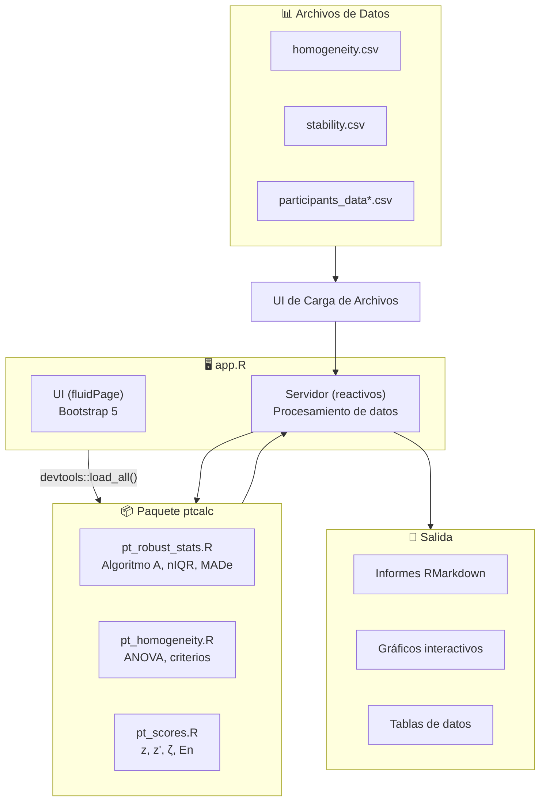
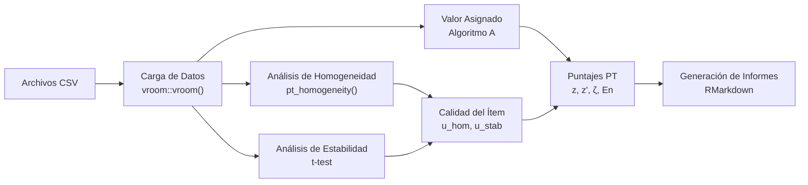

# Aplicativo de Ensayos de Aptitud para Gases Contaminantes Criterio

Esta aplicación Shiny proporciona un conjunto completo de herramientas para analizar datos de esquemas de ensayos de aptitud (PT). Implementa los métodos estadísticos descritos en las normas ISO 13528:2022 e ISO 17043:2024 para evaluar la homogeneidad y estabilidad de los ítems de PT y para calcular los puntajes de desempeño de los participantes.

La aplicación está refactorizada para implementar una **separación de responsabilidades**:
- **`ptcalc/`**: Paquete de R con funciones matemáticas puras (ISO 13528).
- **`app.R`**: Lógica reactiva de Shiny para la interfaz de usuario.


*Figura 1: Vista general del tablero del Aplicativo de Análisis de Datos de PT*

> **Actualización de Captura de Pantalla Requerida**: Los siguientes elementos de la interfaz de usuario han sido rediseñados y
> las capturas de pantalla deben mostrar:
> - Encabezado mejorado con el logo de la UNAL (alineado a la izquierda) e imagen institucional
> - Tarjetas de carga inspiradas en shadcn con estilo moderno de entrada de archivos
> - Pie de página de tres columnas con información del proyecto, instituciones y secciones de contacto
> - Esquema de colores moderno (Primario: #FDB913 amarillo/oro con fondos grises)

```
┌─────────────────────────────────────────────────────────────────┐
│  [Logo] Aplicativo para Evaluación de Ensayos de Aptitud       │
│         Gases Contaminantes Criterio                           │
│         Laboratorio Calaire                                     │
├─────────────────────────────────────────────────────────────────┤
│  [☰ Carga de Datos] [Homogeneidad] [Estabilidad] [Valor Asig.] │
│  [Puntajes PT] [Informe Global] [Participantes] [Informes]    │
├─────────────────────────────────────────────────────────────────┤
│  Sidebar                      │  Main Content Area              │
│  ├── tarjetas estilo shadcn    │  ├── DataTables mejoradas       │
│  ├── Zonas de carga de arch.   │  ├── Gráficos interactivos      │
│  └── Controles de form. mod.   │  └── alertas/badges shadcn      │
├─────────────────────────────────────────────────────────────────┤
│  Pie: © 2026 INM / Laboratorio CALAIRE - Licencia MIT           │
└─────────────────────────────────────────────────────────────────┘
```

## Inicio Rápido

```r
# 1. Establecer el directorio de trabajo
setwd("/ruta/a/pt_app")

# 2. Iniciar la aplicación
shiny::runApp("app.R")
```

La aplicación se abrirá en `http://127.0.0.1:3838` en su navegador predeterminado. Para un recorrido completo de 5 minutos, consulte [00_inicio_rapido.md](00_inicio_rapido.md).

---

## Instalación y Prerrequisitos

### Entorno de R

| Requisito | Versión | Notas |
|-------------|---------|-------|
| R | ≥ 4.3.0 | [Descargar de CRAN](https://cran.r-project.org/) |
| RStudio | ≥ 2023.06 | Opcional pero recomendado |
| Sistema Operativo | Windows 10+, macOS 11+, o Linux | Cualquier SO moderno |

### Paquetes de R Requeridos

```r
# Instalar todas las dependencias
install.packages(c(
  "shiny", "bslib", "tidyverse", "vroom", "DT",
  "rhandsontable", "plotly", "patchwork", "outliers",
  "rmarkdown", "devtools", "shinythemes", "bsplus"
))
```

### Instalación del Paquete ptcalc

El paquete `ptcalc` contiene todas las funciones de cálculo de las normas ISO 13528/17043.

**Para desarrollo:**

```r
devtools::load_all("ptcalc")
```

**Para despliegue en producción:**

```r
devtools::install("ptcalc")
library(ptcalc)
```

---

## Arquitectura del Sistema



---

## Flujo de Datos



---

## Módulos de la Aplicación

### 1. Carga de datos
Este módulo gestiona la carga inicial de archivos CSV para el análisis.
*   **Entradas:** Archivos `homogeneity.csv`, `stability.csv` y `summary_n*.csv`.
*   **Validación:** Verifica las columnas requeridas (`value`, `pollutant`, `level`).

### 2. Análisis de Homogeneidad y Estabilidad
Evalúa si los ítems del ensayo de aptitud son suficientemente homogéneos y estables.
*   **Entradas:** Elección del contaminante, nivel de concentración.
*   **Salidas:** Previsualización de datos, resumen de ANOVA, evaluaciones de homogeneidad y estabilidad ($s_s$, $s_w$, verificación de criterios ISO).

### 3. Preparación del PT
Analiza los resultados de los participantes de diferentes rondas.
*   **Funcionalidad:** Crea dinámicamente pestañas para cada contaminante.
*   **Salidas:** Gráficos de barras, distribuciones y prueba de Grubbs para valores atípicos.

### 4. Valor Asignado / Puntajes PT
Calcula los valores de referencia y los puntajes de desempeño de los participantes.
*   **Funcionalidad:** Soporta Algoritmo A, Consenso (MADe/nIQR) o Laboratorio de referencia.
*   **Puntuación:** Calcula puntajes z, z', zeta y En utilizando estadísticas robustas.
*   **Incertidumbre:** Incorpora la incertidumbre estándar del valor asignado ($u(x_{pt})$).

### 5. Informe Global y Generación de Informes
*   **Informe Global:** Visualización en mapa de calor de los resultados en todos los niveles y contaminantes.
*   **Generación de informes:** Interfaz para configurar y descargar el informe final en RMarkdown.

### Componentes de la Interfaz de Usuario

La aplicación utiliza un sistema de diseño moderno con componentes inspirados en shadcn:

| Componente | Descripción | Referencia CSS |
|-----------|-------------|---------------|
| Encabezado mejorado | Logo UNAL + imagen institucional | Líneas 828-902 |
| Tarjetas shadcn | Sistema moderno de componentes de tarjetas | Líneas 903-960 |
| Alertas shadcn | Variantes de alerta (info, éxito, advertencia, error) | Líneas 961-1021 |
| Badges shadcn | Badges de estado con variantes de puntuación | Líneas 1022-1075 |
| Componentes de carga | Cuadrícula de carga de archivos y entradas con estilo | Líneas 1076-1159 |
| Pie de página moderno | Diseño de pie de página de tres columnas | Líneas 1217-1280 |
| Referencia de UI y CSS | Componentes shadcn, arquitectura CSS (1,456 líneas) | |

Para la documentación completa de CSS, consulte [18_ui.md](18_ui.md).

---

## Datos de Ejemplo

Se proporcionan archivos de datos de ejemplo en el directorio `data/`:

| Archivo | Descripción |
|------|-------------|
| `homogeneity.csv` | Mediciones de la prueba de homogeneidad |
| `stability.csv` | Mediciones de la prueba de estabilidad |
| `summary_n4.csv` | Resultados de los participantes (escenario n=4) |
| `summary_n7.csv` | Resultados de los participantes (escenario n=7) |
| `summary_n10.csv` | Resultados de los participantes (escenario n=10) |
| `summary_n13.csv` | Resultados de los participantes (escenario n=13) |

---

## Índice de Módulos

### Introducción
- [Guía de Inicio Rápido](00_inicio_rapido.md) - Tutorial de 5 minutos
- [Glosario](00_glosario.md) - Referencia de terminología español/inglés

### Documentación del Paquete ptcalc
1. [Descripción General del Paquete](02_paquete_ptcalc.md) - Arquitectura y exportaciones
2. [Referencia de la API](02a_api_ptcalc.md) - Referencia completa de funciones
3. [Estadísticas Robustas](03_estadisticas_robustas_pt.md) - nIQR, MADe, Algoritmo A
4. [Homogeneidad y Estabilidad](04_homogeneidad_pt.md) - Criterios ISO 13528
5. [Cálculos de Puntajes](05_puntajes_pt.md) - Fórmulas de z, z', zeta, En

### Documentación de la Aplicación Shiny
6. [Carga de Datos](01_carga_datos.md) - Carga de archivos y validación
7. [Formatos de Datos](01a_formatos_datos.md) - Referencia completa del esquema CSV
8. [Módulo de Homogeneidad](06_homogeneidad_shiny.md) - Componentes de la interfaz
9. [Valor Asignado](07_valor_asignado.md) - Métodos de consenso y referencia
10. [Módulo de Puntajes PT](09_puntajes_pt.md) - Cálculo y visualización de puntajes
11. [Informe Global](10_informe_global.md) - Mapas de calor de resumen
12. [Detalle por Participante](11_participantes.md) - Resultados individuales
13. [Generación de Informes](12_generacion_informes.md) - Exportación a RMarkdown
14. [Detección de Valores Atípicos](13_valores_atipicos.md) - Prueba de Grubbs
15. [Plantilla de Informe](14_plantilla_informe.md) - Estructura RMarkdown (compatibilidad metrológica)

### Temas Avanzados
16. [Arquitectura del Sistema](15_arquitectura.md) - Gráfico de dependencias reactivas, optimización del desempeño
17. [Guía de Personalización](16_personalizacion.md) - Tema, diseño, extensión de ptcalc
18. [Referencia de UI y CSS](18_ui.md) - Componentes shadcn, arquitectura CSS (1458 líneas)
19. [Solución de Problemas y FAQ](17_solucion_problemas.md) - Errores comunes, problemas de formato de datos

---

## Solución de Problemas

### Errores Comunes

| Error | Causa | Solución |
|-------|-------|----------|
| `Error: could not find function "xxx"` | `ptcalc` no cargado | Ejecute `devtools::load_all("ptcalc")` |
| `Error: El archivo debe contener las columnas...` | Encabezados CSV incorrectos | Asegure los encabezados: `pollutant`, `level`, `value` |
| `disconnected from the server` | Caída de la sesión de R | Revise la consola para logs de error. Reinicie la aplicación. |
| `package 'outliers' not found` | Falta dependencia | Ejecute `install.packages("outliers")` |
| `Insufficient data for Algorithm A` | < 3 participantes | Verifique que los datos tengan suficientes valores numéricos válidos. |

### Problemas de Formato de Datos
Los archivos resumen deben seguir el patrón `summary_n{N}.csv` donde `{N}` es un número entero.

### Problemas de Desempeño
Para conjuntos de datos grandes (>100 participantes), considere usar `data.table` o reducir el análisis simultáneo de contaminantes.

---

## Documentación para Desarrolladores

### Inmersión en `app.R`
La función del servidor contiene la lógica para el procesamiento de datos:
1. **Carga de Datos**: Lee `homogeneity.csv`, `stability.csv` y `summary_n*.csv`.
2. **Expresiones Reactivas**:
    - `homogeneity_run`: Cálculos ANOVA e ISO.
    - `scores_run`: Puntajes z y otras métricas.
3. **UI Dinámica**: Utiliza `renderUI` y `navlistPanel` para un diseño flexible.

### Ejecución de Verificaciones de Sintaxis
```bash
./Rscript -e "source('app.R')"
```
*Nota: El stub `Rscript` en la raíz del proyecto realiza solo validación estructural.*

---

## Guías de Contribución
- Siga la [guía de estilo de tidyverse](https://style.tidyverse.org/).
- Documente las funciones con comentarios roxygen2.
- Escriba pruebas unitarias para nuevos cálculos (`devtools::test()`).
- Utilice diagramas mermaid para el flujo de datos en las actualizaciones de la documentación.

---

## Estándares y Referencias

| Estándar | Título | Estado |
|----------|-------|--------|
| ISO 13528:2022 | Statistical methods for use in proficiency testing | Implementado |
| ISO 17043:2024 | Conformity assessment — General requirements for proficiency testing | Implementado |

---

## Historial de Versiones

| Versión | Fecha | Cambios |
|---------|------|---------|\
| 0.1.0 | 2024 | Versión inicial refactorizada con separación del paquete ptcalc |
| 0.2.0 | 2025 | Actualización de documentación (Fase 1) |
| 0.3.0 | 2026-01 | Rediseño moderno de la UI (componentes shadcn, encabezado/pie de página), función de compatibilidad metrológica, formato de datos mejorado (columna run) |

---

## Licencia y Contacto
Desarrollado bajo contrato OSE-282-3065-2025 por:
- **Laboratorio CALAIRE** - Universidad Nacional de Colombia
- **Instituto Nacional de Metrología (INM)**

Autor: Wilson Rafael Salas Chavez (wrsalasc@unal.edu.co)
Licencia: MIT
