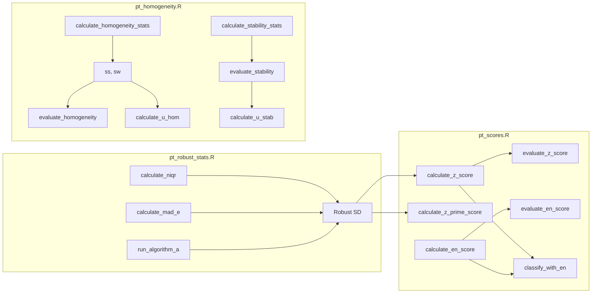

# Paquete ptcalc: Documentación Completa

## Información del Paquete

| Atributo | Detalles |
|----------|----------|
| **Ubicación** | `pt_app/ptcalc/` |
| **Versión** | 0.1.0 |
| **Licencia** | MIT |
| **Estándares** | ISO 13528:2022, ISO 17043:2024 |
| **Autor** | Wilson Rafael Salas Chavez (wrsalasc@unal.edu.co) |
| **Dependencias** | stats, dplyr (>= 1.0.0) |

---

## Descripción General

`ptcalc` es un paquete de R que encapsula todas las **funciones matemáticas puras** para el cálculo de ensayos de aptitud según las normas **ISO 13528:2022** e **ISO 17043:2024**. Está diseñado con **cero dependencias de Shiny**, lo que lo hace ideal para:

- Uso independiente en scripts de R y procesamiento por lotes.
- Pruebas unitarias exhaustivas sin la sobrecarga de la interfaz de usuario.
- Integración vía API con sistemas externos.
- Flujos de trabajo automatizados de validación de datos.

### Características Clave
- **Funciones puras**: Sin efectos secundarios, solo transformaciones deterministas de datos.
- **Documentación Roxygen2**: Cada función cuenta con ejemplos ejecutables y referencias a estándares.
- **Trazabilidad**: Referencias explícitas a secciones específicas de la norma ISO 13528.
- **Robustez**: Manejo consistente de valores atípicos, datos faltantes y varianza cero.

---

## Filosofía de Diseño

| Principio | Implementación | Beneficio |
|-----------|----------------|-----------|
| **Separación de responsabilidades** | Lógica matemática completamente desacoplada de la UI (Shiny). | Alta mantenibilidad y modularidad. |
| **Funciones puras** | Salidas determinadas únicamente por los parámetros de entrada. | Predecibilidad y facilidad de depuración. |
| **Testabilidad** | Funciones independientes que facilitan las pruebas unitarias. | Confiabilidad en los resultados matemáticos. |
| **Documentación técnica** | Uso de Roxygen2 con ejemplos y referencias ISO. | Facilidad de uso para desarrolladores. |
| **Cumplimiento de estándares** | Implementación estricta de fórmulas de ISO 13528. | Validez técnica y legal de los cálculos. |

---

## Estructura del Paquete

```text
ptcalc/
├── DESCRIPTION              # Metadatos del paquete y dependencias
├── LICENSE                  # Licencia MIT
├── NAMESPACE                # Definición de 24 exportaciones (funciones y constantes)
├── README.md                # Referencia rápida y visión general
├── R/                       # Código fuente del paquete
│   ├── ptcalc-package.R     # Documentación general del paquete
│   ├── pt_robust_stats.R    # Estadísticos robustos: nIQR, MADe, Algoritmo A (~247 líneas)
│   ├── pt_homogeneity.R     # Homogeneidad y estabilidad (~290 líneas)
│   └── pt_scores.R          # Cálculo de puntajes: z, z', ζ, En (~275 líneas)
└── man/                     # Documentación generada automáticamente (.Rd)
    └── *.Rd                 # 21 archivos de ayuda de funciones
```

---

## Flujo de Datos en el Paquete



---

## Resumen de Funciones Exportadas

### 1. Estadísticos Robustos (`pt_robust_stats.R`)

| Función | Parámetros | Retorno | Referencia ISO |
|---------|------------|---------|----------------|
| `calculate_niqr` | `x` (numeric) | Valor nIQR (0.7413 * IQR) | 13528:2022 §9.4 |
| `calculate_mad_e` | `x` (numeric) | Valor MADe (1.483 * MAD) | 13528:2022 §9.4 |
| `run_algorithm_a` | `values`, `ids`, `max_iter`, `tol` | Lista: `assigned_value`, `robust_sd`, `iterations`, `weights`, `converged`, `error` | 13528:2022 Anexo C |

### 2. Homogeneidad y Estabilidad (`pt_homogeneity.R`)

| Función | Parámetros | Retorno | Referencia ISO |
|---------|------------|---------|----------------|
| `calculate_homogeneity_stats` | `sample_data` (df/matrix) | Lista: `g`, `m`, `grand_mean`, `sw`, `ss`, etc. | 13528:2022 §9.2 |
| `calculate_homogeneity_criterion` | `sigma_pt` | Valor del criterio (0.3 * sigma_pt) | 13528:2022 §9.2.3 |
| `calculate_homogeneity_criterion_expanded` | `sigma_pt`, `sw_sq` | Criterio expandido (según §9.2.4) | 13528:2022 §9.2.4 |
| `evaluate_homogeneity` | `ss`, `c_criterion`, `c_expanded` | Lista: `passes_criterion`, `conclusion`, etc. | 13528:2022 §9.2 |
| `calculate_stability_stats` | `stab_data`, `hom_mean` | Lista: `stab_grand_mean`, `diff_hom_stab`, etc. | 13528:2022 §9.3 |
| `calculate_stability_criterion` | `sigma_pt` | Criterio de estabilidad (0.3 * sigma_pt) | 13528:2022 §9.3.3 |
| `calculate_stability_criterion_expanded` | `c_crit`, `u_hom`, `u_stab` | Criterio de estabilidad expandido | 13528:2022 §9.3.4 |
| `evaluate_stability` | `diff`, `c_crit`, `c_exp` | Lista: `passes_criterion`, `conclusion` | 13528:2022 §9.3 |
| `calculate_u_hom` | `ss` | Incertidumbre estándar por homogeneidad | 13528:2022 §9.5 |
| `calculate_u_stab` | `diff`, `c_crit` | Incertidumbre estándar por estabilidad | 13528:2022 §9.5 |

### 3. Cálculo de Puntajes (`pt_scores.R`)

| Función | Parámetros | Retorno | Referencia ISO |
|---------|------------|---------|----------------|
| `calculate_z_score` | `x`, `x_pt`, `sigma_pt` | Valor del puntaje z | 13528:2022 §10.2 |
| `calculate_z_prime_score` | `x`, `x_pt`, `sigma_pt`, `u_xpt` | Valor del puntaje z' | 13528:2022 §10.3 |
| `calculate_zeta_score` | `x`, `x_pt`, `u_x`, `u_xpt` | Valor del puntaje ζ | 13528:2022 §10.4 |
| `calculate_en_score` | `x`, `x_pt`, `U_x`, `U_xpt` | Valor del puntaje En | 13528:2022 §10.5 |
| `evaluate_z_score` | `z` | Clasificación (Satisfactorio, Cuestionable, No sat.) | 13528:2022 §10.6 |
| `evaluate_z_score_vec` | `z` (vector) | Vector de clasificaciones | 13528:2022 §10.6 |
| `evaluate_en_score` | `en` | Clasificación (Satisfactorio, No sat.) | 13528:2022 §10.6 |
| `evaluate_en_score_vec` | `en` (vector) | Vector de clasificaciones | 13528:2022 §10.6 |
| `classify_with_en` | `score`, `en`, `U_xi`, `sigma_pt`, ... | Lista: `code` (a1-a7), `label` | 13528:2022 §10.7 |

---

## Constantes Exportadas

| Constante | Tipo | Descripción |
|-----------|------|-------------|
| `PT_EN_CLASS_LABELS` | Named Vector | Etiquetas para la clasificación combinada z/En (a1 a a7). |
| `PT_EN_CLASS_COLORS` | Named Vector | Códigos de colores hexadecimales para visualizaciones de clasificación. |

---

## Fórmulas Matemáticas Implementadas

### Estadísticos Robustos
- **nIQR:** `nIQR = 0.7413 × (Q3 - Q1)`
- **MADe:** `MADe = 1.483 × median(|xi - median(x)|)`
- **Algoritmo A (Iterativo):**
  - `u = (xi - x*) / (1.5 × s*)`
  - `w = 1 si |u| <= 1, de lo contrario 1/u²`
  - `x*nuevo = Σ(wi × xi) / Σwi`
  - `s*nuevo = √[Σwi × (xi - x*nuevo)² / Σwi]`

### Homogeneidad
- **Desviación típica intra-muestra (m=2):** `s_w = √[Σ(rango_i²) / (2g)]`
- **Varianza entre-muestras:** `s_s² = |s_x̄² - s_w²/m|`
- **Criterio estándar:** `c = 0.3 × σ_pt`

### Puntajes (Scores)
- **z:** `z = (x - x_pt) / σ_pt`
- **z':** `z' = (x - x_pt) / √(σ_pt² + u_xpt²)`
- **ζ:** `ζ = (x - x_pt) / √(u_x² + u_xpt²)`
- **En:** `En = (x - x_pt) / √(U_x² + U_xpt²)`

---

## Flujo de Desarrollo

### 1. Carga para Desarrollo (Iteración rápida)
```r
devtools::load_all("ptcalc")
```
- **Uso:** Durante el desarrollo activo para ver cambios instantáneamente sin reinstalar.
- **Pros:** Carga rápida, no requiere reconstruir documentación.
- **Contras:** Los cambios no persisten en la librería instalada del sistema.

### 2. Instalación para Producción
```r
devtools::install("ptcalc")
# O alternativamente
remotes::install_local("ptcalc")
```
- **Uso:** Al desplegar la aplicación o crear una versión estable.
- **Pros:** Instalación persistente, disponible en cualquier sesión de R.

### 3. Reconstrucción de Documentación
```r
devtools::document("ptcalc")
```
- **Cuándo ejecutar:** Después de añadir nuevas funciones o modificar parámetros con comentarios Roxygen2.

---

## Manejo de Errores

| Condición | Comportamiento |
|-----------|----------------|
| Datos insuficientes (n < 2) | Retorna `NA_real_` o lista con atributo `$error`. |
| División por cero | Retorna `NA_real_`. |
| Valores no finitos (Inf, NaN) | Filtrados automáticamente o resultan en error controlado. |
| Varianza cero | Manejada con fallback a desviación estándar clásica si aplica. |

---

## Uso en la Aplicación

### Ejemplo: Uso en un Reactive de Shiny
```r
scores_data <- reactive({
  # Obtener valor asignado (Algoritmo A)
  res_a <- run_algorithm_a(df$valor, df$id)
  x_pt <- res_a$assigned_value
  sigma_pt <- input$sigma_pt
  
  df %>%
    mutate(
      z = calculate_z_score(valor, x_pt, sigma_pt),
      eval = evaluate_z_score_vec(z)
    )
})
```

### Ejemplo: Evaluación de Homogeneidad
```r
hom_stats <- calculate_homogeneity_stats(datos_csv)
criterion <- calculate_homogeneity_criterion(sigma_pt = 0.5)
evaluacion <- evaluate_homogeneity(hom_stats$ss, criterion)

if (evaluacion$passes_criterion) {
  print("La muestra es homogénea.")
} else {
  print(evaluacion$conclusion)
}
```

---

## Estado de la Documentación y Pruebas

### Cobertura de Documentación Roxygen2
- **Funciones exportadas:** 21 (100% documentadas).
- **Ejemplos incluidos:** 15 (71% de las funciones).
- **Formatos:** Archivos `.Rd` generados en `man/`.

### Estado de Pruebas Unitarias
- **Framework:** `testthat` (configurado pero con cobertura inicial).
- **Ubicación:** `ptcalc/tests/testthat/`.
- **Áreas críticas cubiertas:** Estadísticos robustos y fórmulas de puntajes.
- **Próximos pasos:** Implementar pruebas de casos de borde para homogeneidad y estabilidad.

---

## Referencias
1. **ISO 13528:2022** - Statistical methods for use in proficiency testing by interlaboratory comparison.
2. **ISO 17043:2024** - Conformity assessment — General requirements for proficiency testing.
3. **Huber, P.J. (1964)** - Robust estimation of a location parameter.
4. **Thompson, M. (2000)** - Recent trends in internal quality control.

---

## Documentos Relacionados
- [02a_ptcalc_api.md](02a_ptcalc_api.md) - Referencia API completa con ejemplos detallados.
- [03_pt_robust_stats.md](../cloned_docs/03_pt_robust_stats.md) - Documentación profunda de estadísticos robustos.
- [04_pt_homogeneity.md](../cloned_docs/04_pt_homogeneity.md) - Manual de homogeneidad.
- [05_pt_scores.md](../cloned_docs/05_pt_scores.md) - Guía detallada de puntajes.
