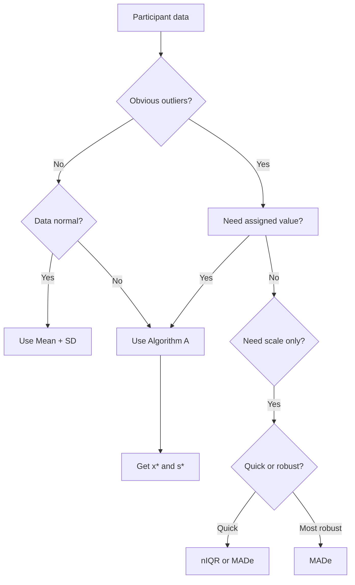

# pt_robust_stats.R: Robust Statistical Methods (ISO 13528)

## 1. Overview / Descripción General

Este módulo (`pt_robust_stats.R`) implementa estimadores estadísticos robustos utilizados para calcular valores asignados ($x_{pt}$) y desviaciones estándar ($\sigma_{pt}$) resistentes a valores atípicos, siguiendo los métodos descritos en **ISO 13528:2022**.

Robust statistics provide estimates of location (mean) and scale (standard deviation) that are resistant to outliers and non-normal distributions. These methods are fundamental to the proficiency testing analysis, ensuring that extreme values do not distort the evaluation of the group's performance.

### Location in Code / Ubicación
| Elemento | Valor |
|----------|-------|
| Archivo | `ptcalc/R/pt_robust_stats.R` |
| Líneas | 1 - 247 |

---

## 2. Key Robust Estimators

This module implements three key robust estimators used in different stages of the PT analysis:

1.  **MADe** (Scaled Median Absolute Deviation): The most robust simple scale estimator.
2.  **nIQR** (Normalized Interquartile Range): An alternative robust scale based on quartiles.
3.  **Algorithm A** (ISO 13528 robust mean/sd): The primary iterative method for calculating consensus values.

---

## 3. Algorithm A (ISO 13528 Annex C)

Algorithm A is an iterative procedure used to calculate a robust mean ($x^*$) and a robust standard deviation ($s^*$). It is the primary method used in this application when the "Consensus (Algorithm A)" option is selected.

### 3.1 Visual Algorithm Flow / Flujo Visual

```mermaid
flowchart TD
    START[Start: Vector of values] --> CHECK{n ≥ 3?}
    CHECK -- No --> ERR[Error: Requires at least 3 observations]
    CHECK -- Yes --> INIT[Initialize x* = median, s* = 1.483 × MAD]
    
    INIT --> ZCHECK{s* > 0?}
    ZCHECK -- No --> FALLBACK[Use classical SD as fallback]
    ZCHECK -- Yes --> RESIDUALS[Calculate residuals: u = x - x* / 1.5 × s*]
    FALLBACK --> RESIDUALS
    
    RESIDUALS --> WEIGHTS[Calculate Huber weights]
    WEIGHTS --> WEIGHT_DECISION{|u| ≤ 1?}
    WEIGHT_DECISION -- Yes --> WEIGHT1[w = 1]
    WEIGHT_DECISION -- No --> WEIGHT2[w = 1 / u²]
    
    WEIGHT1 --> UPDATE[Update x* = Σw×x / Σw]
    WEIGHT2 --> UPDATE
    
    UPDATE --> UPDATE_S[Update s* = √Σw×x-x*² / Σw]
    UPDATE_S --> CONVERGENCE{Δx < tol and Δs < tol?}
    
    CONVERGENCE -- No --> ITER_CHECK{iter < max_iter?}
    ITER_CHECK -- Yes --> RESIDUALS
    ITER_CHECK -- No --> NO_CONV[Return: converged = FALSE]
    
    CONVERGENCE -- Yes --> YES_CONV[Return: converged = TRUE]
    
    style INIT fill:#e3f2fd
    style RESIDUALS fill:#bbdefb
    style WEIGHTS fill:#c8e6c9
    style UPDATE fill:#ffe0b2
    style YES_CONV fill:#c8e6c9
    style NO_CONV fill:#ffcdd2
    style ERR fill:#ffcdd2
```

### 3.2 Step-by-Step Procedure

1.  **Initialization**:
    - Remove non-finite values (`NA`, `Inf`, `-Inf`).
    - Verify $n \ge 3$.
    - Set initial estimates: $x^* = \text{median}(x)$ and $s^* = 1.483 \times \text{MAD}(x)$.
    - If $s^* \approx 0$, use classical SD as a fallback.
2.  **Calculate Standardized Residuals ($u_i$)**:
    $$u_i = \frac{x_i - x^*}{1.5 \times s^*}$$
    The factor 1.5 is the "tuning constant" for Huber's weights.
3.  **Calculate Huber Weights ($w_i$)**:
    $$w_i = \begin{cases} 1 & \text{if } |u_i| \leq 1 \\ 1/u_i^2 & \text{if } |u_i| > 1 \end{cases}$$
4.  **Update Estimates**:
    $$x^*_{new} = \frac{\sum w_i x_i}{\sum w_i}$$
    $$s^*_{new} = \sqrt{\frac{\sum w_i (x_i - x^*_{new})^2}{\sum w_i}}$$
5.  **Check Convergence**:
    Converged if $\Delta x < tol$ AND $\Delta s < tol$. If not converged, repeat from step 2 up to `max_iter`.

---

## 4. Numerical Examples

### 4.1 Example 1: Standard PT Dataset with Outlier
**Data:** `[10.1, 10.2, 9.9, 10.0, 10.3, 50.0]`

#### Iteration 0: Initialization
- Median: 10.05
- MAD: 0.15
- $s^*$ initial: $1.483 \times 0.15 = 0.222$

#### Iteration 1
| Participant | Value | $x_i - 10.05$ | $u = diff / 0.333$ | $|u|$ | Weight $w$ |
|-------------|--------|-----------------|-------------------------|-------|-----------|
| 1 | 10.1 | 0.05 | 0.150 | 0.150 | 1.000 |
| 2 | 10.2 | 0.15 | 0.451 | 0.451 | 1.000 |
| 3 | 9.9 | -0.15 | -0.451 | 0.451 | 1.000 |
| 4 | 10.0 | -0.05 | -0.150 | 0.150 | 1.000 |
| 5 | 10.3 | 0.25 | 0.751 | 0.751 | 1.000 |
| 6 | 50.0 | 39.95 | **119.97** | 119.97 | **0.00007** |

- **Update**: $x^*_{new} = 10.10$, $s^*_{new} = 0.141$.
- **Convergencia**: $\Delta x = 0.05$, $\Delta s = 0.081$. Continúa.

#### Iteration 2
- Atípico (50.0) recibe peso $w \approx 0.000028$.
- **Update**: $x^*_{new} = 10.10$ (estacionario), $s^*_{new} = 0.140$.
- **Convergencia**: Alcanzada.

### 4.2 Example 2: Small Dataset with Large Outlier
**Data:** `[10.1, 10.2, 10.3, 10.2, 25.0]`
- Initial Median: 10.2
- Initial $s^*$: 0.1483
- Outlier weight in Iteration 1: $\approx 0.0005$
- Result: Converges rapidly to ~10.2, effectively ignoring the 25.0.

### 4.3 Comparison with Classical Statistics
| Estimator | Example 1 Value | Interpretation |
|-----------|--------|----------------|
| **Arithmetic mean** | 16.75 | **Biased high** due to outlier |
| **Median** | 10.05 | Good location estimate |
| **Robust mean (x*)** | 10.10 | Best location estimate (ISO 13528) |
| **Classical SD** | 16.23 | **Inflated** due to outlier |
| **MADe** | 0.222 | Good scale estimate |
| **nIQR** | 0.185 | Alternative scale estimate |
| **Robust SD (s*)** | 0.140 | Best scale estimate (ISO 13528) |

---

## 5. Convergence Behavior

### 5.1 Typical Patterns
Algorithm A typically converges in 3-8 iterations depending on:
1. **Proportion of outliers**: More outliers = more iterations.
2. **Magnitude of outliers**: Extreme outliers converge faster as their weights go to zero quickly.
3. **Initial dispersion**: More spread data = more iterations.

#### Convergence Plot Example
```mermaid
xychart-beta
    title "Algorithm A Convergence Example"
    x-axis "Iteration" [1, 2, 3, 4, 5]
    y-axis "Estimate" [9.5, 10.5]
    line [10.05, 10.10, 10.10, 10.10, 10.10]
```

| % Outliers | Average Iterations |
|-------------|-------------------|
| 0% | 2-3 |
| 10% | 4-5 |
| 20% | 5-7 |
| 40% | 8-12 |

### 5.2 Tuning Constant Effect
The factor 1.5 in $u = \frac{x - x^*}{1.5 \times s^*}$ controls sensitivity:
- **1.0**: More aggressive down-weighting, lower efficiency with normal data.
- **1.5**: Standard ISO 13528 value; balanced robustness and efficiency.
- **2.0**: More tolerant of moderate outliers.

---

## 6. Edge Cases / Casos Límite

| Scenario | Behavior |
|:---|:---|
| **< 3 Participants** | Returns `NA`. Algorithm A requires at least 3 valid observations to be statistically meaningful. |
| **Zero Dispersion** | If all values are identical, $s^* = 0$. Algorithm uses classical SD as fallback. If that is also 0, it returns 0. |
| **Non-Finite Values** | `NA`, `Inf`, `-Inf` are automatically filtered before calculation. |
| **High Outlier Ratio** | The breakdown point is ~50%. If >50% of data are outliers, the "outliers" become the consensus. |

---

## 7. Comparison of Scale Estimators

| Characteristic | MADe | nIQR | Algorithm A |
|----------------|-------|-------|-------------|
| **Formula** | $1.483 \times \text{median}(\|x_i - \tilde{x}\|)$ | $0.7413 \times (Q_3 - Q_1)$ | Iterative weighted |
| **Breakdown Point** | 50% | 25% | ~50% |
| **Efficiency (normal)** | 37% | 37% | ~95% |
| **Iterative** | No | No | Yes |
| **Best Use** | Initialization; Scale only | Asymmetric distributions | **Primary consensus value** |

---

## 8. When to Use Each Estimator



---

## 9. Implementation Examples (R)

### Basic Usage
```r
values <- c(10.1, 10.2, 9.9, 10.0, 10.3, 50.0)

# Robust scale estimators
made <- calculate_mad_e(values)  # 0.222
niqr <- calculate_niqr(values)   # 0.185

# Algorithm A
result <- run_algorithm_a(values)
result$assigned_value  # 10.10
result$robust_sd       # 0.14
```

### Inspecting Weights and History
```r
# Participant weights
result$weights
#   id value    weight standardized_residual
# 6  6  50.0    0.000028               282.84

# Convergence history
result$iterations
#   iteration  x_star   s_star   delta
# 1          1   10.10     0.141  0.0810
```

---

## 10. Mathematical Derivations

- **MADe Constant (1.483)**: Derived from $1/\Phi^{-1}(0.75)$ to ensure consistency with SD under normality.
- **nIQR Constant (0.7413)**: Derived from $1/(\Phi^{-1}(0.75) - \Phi^{-1}(0.25))$ to match SD for normal data.

---

## References
- **ISO 13528:2022** Section 9.4 and Annex C.
- Huber, P.J. (1981). *Robust Statistics*. Wiley.

## Cross-References
- [04_pt_homogeneity.md](04_pt_homogeneity.md) - Uses robust statistics for quality metrics.
- [07_valor_asignado.md](07_valor_asignado.md) - Details on consensus value assignment.
