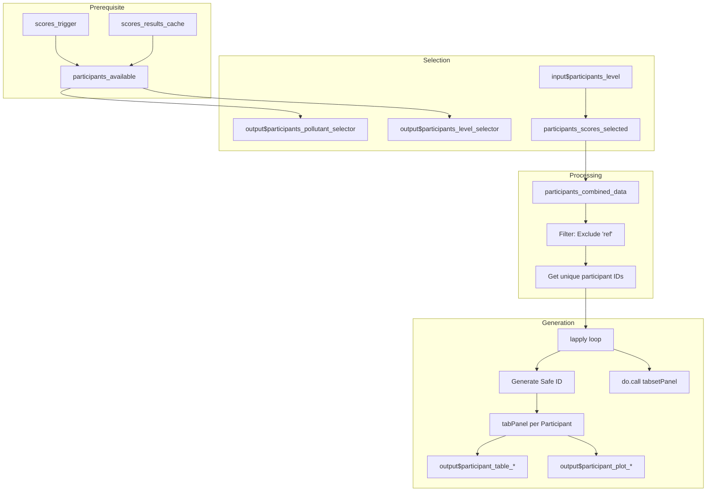

# Module: Participant Detail (Participantes)

## 1. Overview
The "Participantes" module generates a dedicated, dynamic dashboard for each laboratory participating in the Proficiency Testing (PT) scheme. It allows for individualized analysis of performance across different pollutants and levels, providing both tabular summaries and visual trend analysis.

**File Location:** `cloned_app.R`  
**UI Tab:** `tabPanel("Participantes")`  
**Implementation Range:** Lines 3615-3746 (approx.)

---

## 2. Technical Context & UI Map

### 2.1 Component Mapping
| UI Element | Input ID | Output ID | Type | Description |
|------------|----------|-----------|------|-------------|
| Pollutant Selector | `participants_pollutant` | `participants_pollutant_selector` | `selectInput` | Filter by contaminant |
| Level/Scheme Selector | `participants_level` | `participants_level_selector` | `selectInput` | Select level and PT scheme (n_lab) |
| Method Selector | `participants_method` | - | `selectInput` | Filter by calculation method |
| Main Container | - | `scores_participant_tabs` | `uiOutput` | Dynamic tabset container |
| Participant Table | - | `participant_table_[ID]` | `dataTableOutput` | Individual result table |
| Participant Plots | - | `participant_plot_[ID]` | `plotlyOutput` | Combined performance charts |

### 2.2 Core Reactives
- **`participants_available()`**: Identifies valid combinations of pollutant, scheme (n_lab), and level that have data.
- **`participants_scores_selected()`**: Retrieves the scores for the currently selected level/pollutant from the cache.
- **`participants_combined_data()`**: Aggregates and filters the scores based on user selection, excluding the reference laboratory ("ref").

---

## 3. Dynamic Tab Generation Pattern

### 3.1 Implementation Flow
The module utilizes a `renderUI` -> `lapply` -> `do.call(tabsetPanel)` pattern to generate a tab for every unique participant ID found in the dataset.



### 3.2 Safe ID Generation
To ensure compatibility with Shiny's ID system, participant IDs are sanitized by replacing special characters with underscores:
```r
# Example: "LAB-01" becomes "LAB_01"
safe_id <- gsub("[^A-Za-z0-9]", "_", pid)
table_id <- paste0("participant_table_", safe_id)
plot_id <- paste0("participant_plot_", safe_id)
```

---

## 4. Participant Dashboard Content

### 4.1 Results Table
An interactive table showing all results for the specific laboratory across all selected pollutants and levels.

| Column | Description |
|--------|-------------|
| Combinación | Method used (Algorithm A, Consensus, etc.) |
| Analito | Pollutant name |
| Esquema PT (n) | PT scheme ID / number of participants |
| Nivel | Concentration level |
| Resultado | Laboratory's reported mean value |
| x_pt | Assigned value (Reference) |
| sigma_pt | Standard deviation for proficiency assessment |
| u(x_pt) | Standard uncertainty of the assigned value |
| u(x_pt)_def | Combined uncertainty (including homogeneity/stability) |
| Puntaje z | z-score |
| Evaluación z | Satisfactory / Questionable / Unsatisfactory |
| Puntaje z' | z'-score (adjusted for uncertainty) |
| Puntaje zeta | zeta-score |
| Puntaje En | En-score |

### 4.2 Performance Charts (2x2 Panel)
A combined Plotly dashboard showing four distinct views:

| View | Description | Thresholds / Logic |
|------|-------------|--------------------|
| **Values (Ref vs Lab)** | Comparison of Lab result vs. Reference value across levels. | Lab: Blue solid line; Ref: Red dashed line. |
| **Z-Score Trend** | Evolution of z-scores with control limits. | ±2 (Orange/Warning), ±3 (Red/Action). |
| **Zeta-Score Trend** | Evolution of zeta-scores (uncertainty-based). | ±2 (Warning), ±3 (Action). |
| **En-Score Trend** | Evolution of En-scores. | ±1 (Red/Action). |

---

## 5. Performance & Scaling

### 5.1 Optimization Strategies
- **Lazy Rendering**: Content inside tabs (plots/tables) is only rendered when the specific participant's tab is selected.
- **Data Caching**: Uses `participants_combined_data()` to avoid redundant filtering operations inside the `lapply` loop.
- **Pagination**: Data tables are limited to 10 rows per page to maintain DOM responsiveness.

### 5.2 Scaling Expectations
| Participants | Estimated Load Time | Responsive Experience |
|--------------|---------------------|-----------------------|
| 1 - 10 | < 1 second | Excellent |
| 11 - 30 | 1 - 3 seconds | Good |
| 50+ | 5+ seconds | Moderate (Tabs may become cluttered) |

---

## 6. Error States & Troubleshooting

| Message | Cause | Solution |
|---------|-------|----------|
| "Calcule los puntajes para habilitar esta seccion" | `scores_trigger()` is NULL. | Run "Calcular puntajes" in the PT Scores module first. |
| "No hay participantes disponibles para esta selección" | Filtered data is empty or only contains "ref". | Verify data upload; check if participant IDs are present in the CSV. |
| "No hay resultados disponibles" | `scores_results_cache()` is empty. | Ensure score calculations completed without errors. |

---

## 7. References & Compliance
- **ISO 13528:2022**: Section 10.2 (Individual Reports).
- **ISO/IEC 17043:2023**: Annex A (Content of participant reports).
- **Related Docs**: `09_puntajes_pt.md`, `10_informe_global.md`.
