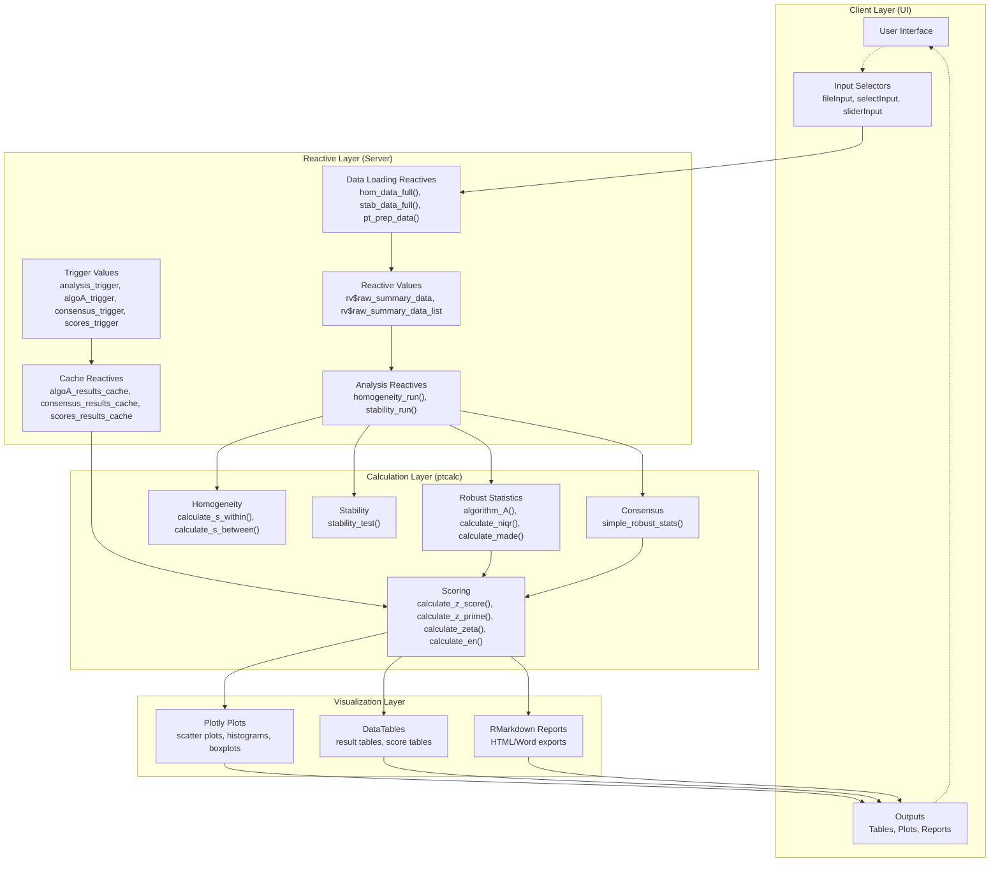
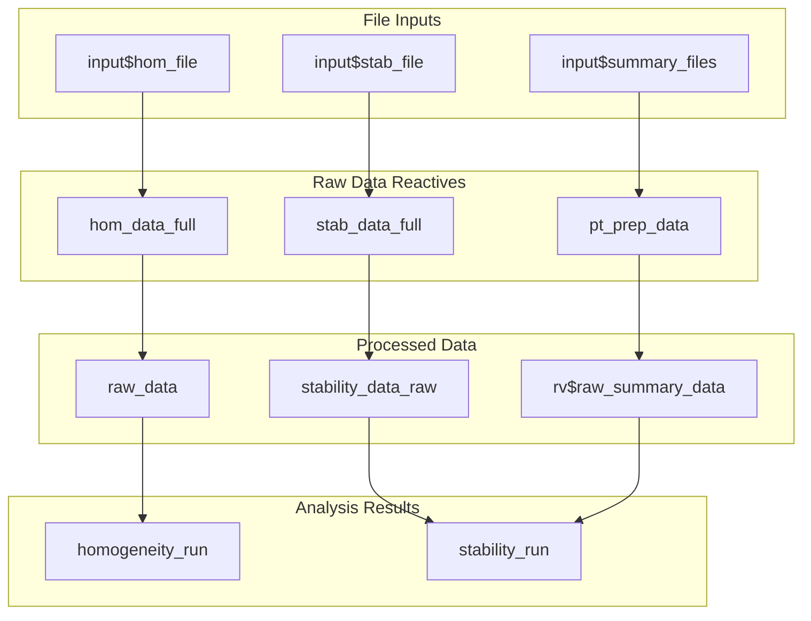
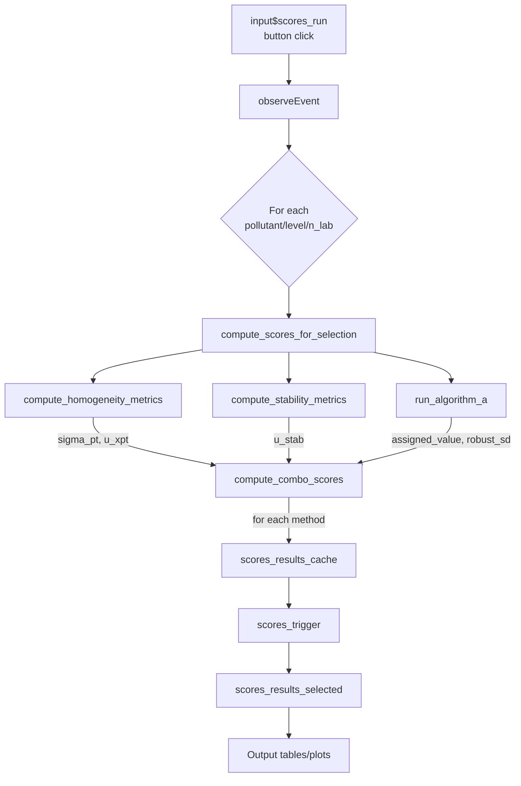
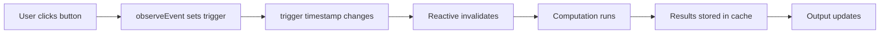
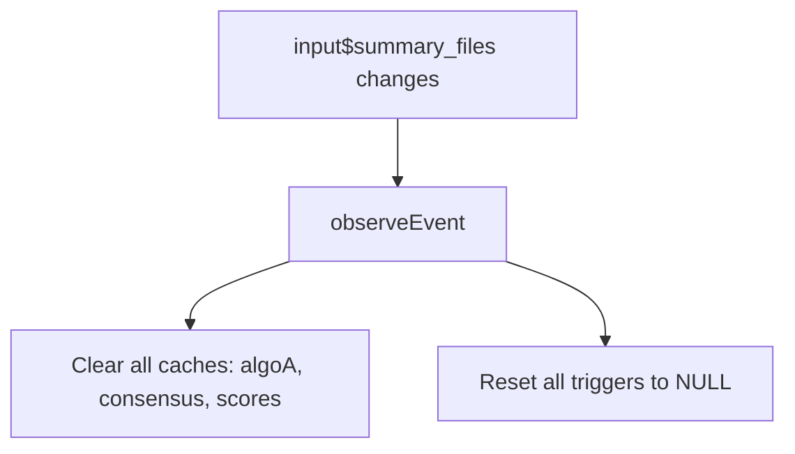
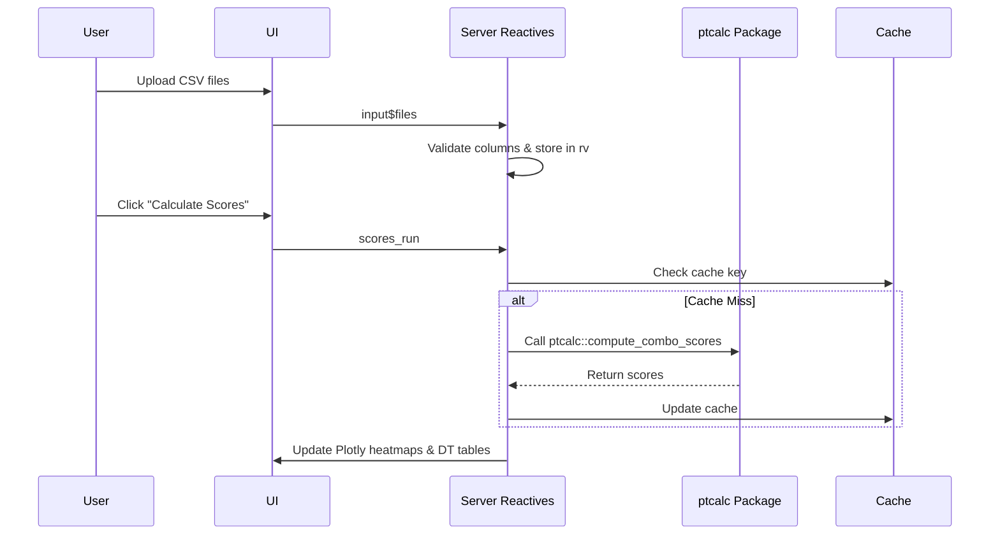

# 15. System Architecture Deep Dive

| Property | Value |
|----------|-------|
| **Document Type** | Architecture Reference |
| **Primary File** | `app.R` (formerly `cloned_app.R`) (approx. 5,184 lines) |
| **Package** | `ptcalc/` |
| **Architecture** | MVC (Model-View-Controller) with Reactive Programming |
| **Related Docs** | `02_ptcalc_package.md`, `README.md`, `01_carga_datos.md`, `03_pt_robust_stats.md`, `05_pt_scores.md` |

---

## 1. Overview

The PT application follows a **clean separation of concerns** and a simplified **Model-View-Controller (MVC)** architecture:

*   **View (UI):** Defined using `fluidPage` with `bslib` styling. It manages the user interface and input/output components.
*   **Controller (Server):** Reactive event handlers in `app.R` that orchestrate package functions, manage state, and handle user events.
*   **Model (Logic/Data):** 
    *   **`ptcalc/`**: A pure R package containing mathematical functions and business logic (no Shiny dependencies).
    *   **Reactive Data Processors**: Internal reactives in the server logic that handle data transformation and aggregation.

### Key Benefits
- **Unit Testing**: Calculations can be tested independently of the UI via the `ptcalc` package.
- **Reusability**: `ptcalc` functions can be used in other contexts like scripts or automated reports.
- **Performance**: Clear boundaries allow for targeted optimization and caching strategies.

---

## 2. Dependency Graphs

### 2.1 Complete Reactive Dependency Graph
This graph illustrates the flow from client-side inputs through the reactive layer to the core calculation package and finally to the visualization layer.



### 2.2 Primary Data Flow


### 2.3 Score Calculation Chain


---

## 3. Server Function Structure

The server function is organized into logical sections covering data loading, processing, and module-specific logic.

| Section | Lines (approx.) | Purpose |
|---------|-----------------|---------|
| **Data Loading** | 80-160 | File upload reactives and validation (`hom_data_full`, `stab_data_full`, `pt_prep_data`) |
| **Trigger/Cache Setup** | 161-224 | Trigger definitions, cache initialization, and reset handlers |
| **Helper Functions** | 226-638 | Internal logic for wide data conversion and metric computation |
| **Algorithm A Handler** | 642-715 | `observeEvent(input$algoA_run)` - iterative robust estimation |
| **Dynamic UI Layout** | 717-1165 | `output$main_layout` rendering adaptive navlistPanel |
| **Homogeneity/Stability** | 1168-1390 | Core analysis reactives and uncertainty outputs |
| **Uncertainty Tables** | 1291-1389 | Generation of `u_hom_data` and `u_stab_data` |
| **Data Preview Outputs** | 1391-1718 | Tables, histograms, and validation displays |
| **PT Scores Module** | 1720-2255 | Score selectors and multi-method computation logic |
| **Global Report Module** | 2256-3237 | Aggregate heatmaps, summary tables, and classification |
| **Participants Module** | 3238-3746 | Individual laboratory views and performance plots |
| **Report Generation** | 3748-4690 | RMarkdown rendering and `downloadHandler` |
| **Assigned Value Module** | 4715-5042 | Manual controls for consensus and reference values |
| **Outliers Module** | 5114-5176 | Grubbs test visualization and analysis |

---

## 4. State Management

The application uses specific mechanisms to manage state and ensure performance.

### 4.1 Reactive Values (`rv`)
Used for storing mutable state that needs to persist across reactive evaluations or be mutated within observers.

| Variable | Type | Purpose | Updated By |
|----------|------|---------|------------|
| `rv$raw_summary_data` | `data.frame` | Combined summary data from all uploaded files | `pt_prep_data()` |
| `rv$raw_summary_data_list` | `list` | Individual dataframes (one per uploaded file) | `pt_prep_data()` |

### 4.2 Trigger-Cache Pattern
For expensive computations (like Algorithm A or multi-scheme scoring), the app uses a **trigger-cache pattern**. This prevents unnecessary re-computation and gives users explicit control.



#### Trigger-Cache Implementation
1. **Initialize**: `scores_results_cache <- reactiveVal(NULL)` and `scores_trigger <- reactiveVal(NULL)`.
2. **Trigger**: User clicks run -> compute all -> `scores_results_cache(results)` -> `scores_trigger(Sys.time())`.
3. **Gate**: Result reactives use `req(scores_trigger())` to wait for explicit user action.

#### Primary Trigger-Cache Pairs
| Trigger | Cache | Purpose |
|---------|-------|---------|
| `analysis_trigger()` | - | Homogeneity/stability execution |
| `algoA_trigger()` | `algoA_results_cache()` | Algorithm A iterative results |
| `consensus_trigger()` | `consensus_results_cache()` | Robust stats (MADe/nIQR) |
| `scores_trigger()` | `scores_results_cache()` | Final PT scores (z, z', zeta, En) |

### 4.3 Cache Invalidation
When summary files change, all downstream caches are automatically cleared to prevent stale data:


---

## 5. Performance Optimization

### 1. Batch Processing
Instead of individual reactive updates, all combinations are processed in a single loop during a button click:
```r
observeEvent(input$algoA_run, {
  combos <- unique(data[, c("pollutant", "n_lab", "level")])
  results <- list()
  for (i in seq_len(nrow(combos))) {
    key <- paste(combos$pollutant[i], combos$n_lab[i], combos$level[i], sep = "||")
    results[[key]] <- run_algorithm_a(...)
  }
  algoA_results_cache(results) # Single update
})
```

### 2. Composite Key Lookups
Uses `pollutant||n_lab||level` format for O(1) cache access instead of expensive dataframe filtering.

### 3. Reactive Isolation
Uses `isolate()` to prevent re-execution when reading values that shouldn't trigger updates.

### 4. Rendering & Loading
- **vroom**: Uses `vroom::vroom` for fast, lazy CSV reading.
- **DataTables**: Implements server-side processing (`server = TRUE`) for responsive tables with large datasets.
- **Vectorization**: Core functions in `ptcalc` are vectorized to minimize R-level loops.

---

## 6. Error Handling Architecture

### 1. Validation Layers
- **Input Validation**: UI constraints and `validate(need())` for user-facing errors.
- **Reactive Validation**: Checks data availability before processing (`req()`).
- **Mathematical Validation**: Internal checks in `ptcalc` for sufficient data (e.g., $n \ge 3$ for Algorithm A).

### 2. Error List Pattern
Functions return a structured list containing both the result and an optional error message:
```r
# Pattern
list(result = calculation, error = NULL)
# On failure
list(result = NULL, error = "Insufficient replicas...")
```

### 3. Error Propagation Flow
```
User Error -> UI Validation -> Reactive Gate -> Package Check -> Structured Error Display
```

---

## 7. ptcalc Package Integration

The `ptcalc` package serves as the mathematical core.

### 7.1 Key Exported Functions
| Category | Functions |
|----------|-----------|
| **Robust Statistics** | `calculate_niqr()`, `calculate_mad_e()`, `run_algorithm_a()` |
| **Homogeneity** | `calculate_homogeneity_stats()`, `evaluate_homogeneity()`, `calculate_u_hom()` |
| **Stability** | `calculate_stability_stats()`, `evaluate_stability()`, `calculate_u_stab()` |
| **Scores** | `calculate_z_score()`, `calculate_z_prime_score()`, `calculate_zeta_score()`, `calculate_en_score()` |
| **Evaluation** | `evaluate_z_score_vec()`, `evaluate_en_score_vec()`, `classify_with_en()` |

### 7.2 Integration Method
The app loads the package at startup via `library(ptcalc)`. During development, `devtools::load_all("ptcalc")` is used to sync changes.

---

## 8. Data Flow Sequence


---

## 9. Concurrency and Threading
- **Current State**: The application is single-threaded. Shiny manages the reactive queue.
- **Performance Management**: Heavy lifting is mitigated by the Trigger-Cache pattern and batch processing rather than parallelization.
- **Future Opportunity**: Implementation of `future` and `promises` for independent pollutant analysis.

---

## 10. See Also
- [01_carga_datos.md](01_carga_datos.md) - Detailed data loading chains.
- [03_pt_robust_stats.md](03_pt_robust_stats.md) - Algorithm A implementation details.
- [02a_ptcalc_api.md](02a_ptcalc_api.md) - Full package API reference.
- [09_puntajes_pt.md](09_puntajes_pt.md) - Scoring module implementation.
