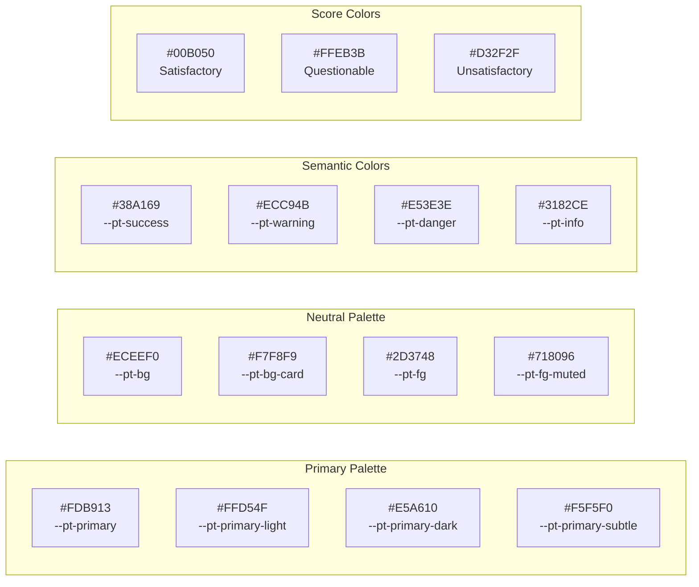
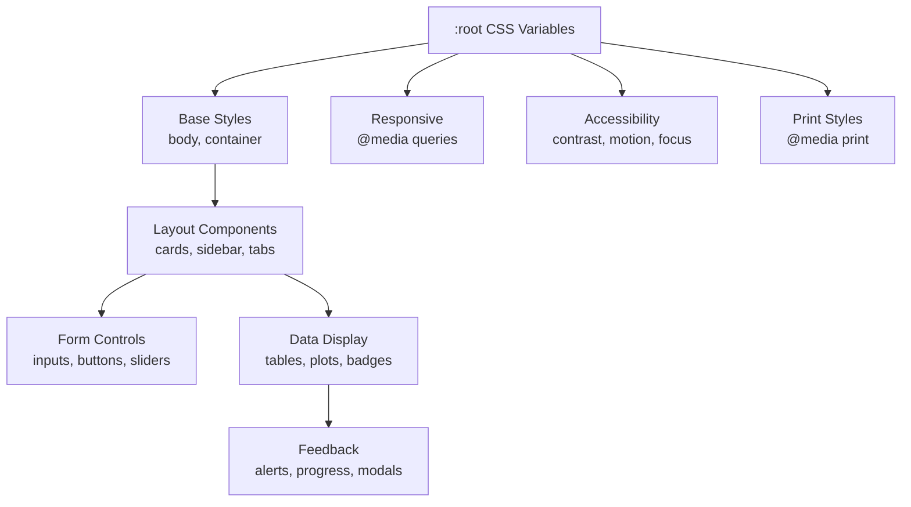

# 18. UI Styling & CSS Architecture

| Property | Value |
|----------|-------|
| **Document Type** | UI/CSS Reference |
| **Primary File** | `www/appR.css` (913 lines) |
| **Framework** | CSS3 with Custom Properties |
| **Design System** | Custom PT Theme (Primary: #FDB913) |
| **Related Docs** | `15_architecture.md`, `16_customization.md`, `README.md` |

---

## 1. Overview

The PT application uses a custom CSS theme (`www/appR.css`) that provides a modern, accessible, and professional appearance. The stylesheet is organized into logical sections and uses CSS Custom Properties (variables) for consistent theming and easy customization.

### Key Features
- **Modern Design**: Clean aesthetics with subtle shadows and gradients
- **Consistent Theming**: CSS variables for colors, spacing, and typography
- **Responsive Layout**: Mobile-friendly breakpoints
- **Accessibility**: High contrast mode, reduced motion, and keyboard focus support
- **Performance**: Optimized transitions and minimal repaints

### File Location
```
pt_app/
└── www/
    └── appR.css    # Main stylesheet (913 lines)
```

### Loading in Shiny
The CSS is loaded automatically when placed in `www/`. It's included in the app via:
```r
# In app.R UI definition
fluidPage(
  theme = bs_theme(...),  # bslib base theme
  includeCSS("www/appR.css"),  # Custom overrides
  ...
)
```

---

## 2. CSS Architecture

### 2.1 Section Structure

| Section | Lines | Purpose |
|---------|-------|---------|
| **CSS Variables** | 1-61 | Custom properties for theming |
| **Base Styles** | 63-83 | Body, container defaults |
| **Typography** | 84-130 | Headings, paragraphs, links |
| **Horizontal Rules** | 132-140 | Decorative separators |
| **Cards & Panels** | 142-175 | Well, card, panel styling |
| **Sidebar** | 177-191 | Navigation sidebar |
| **Navigation Tabs** | 193-269 | Tabs, pills, navlist panels |
| **Form Controls** | 271-399 | Inputs, selects, sliders, file upload |
| **Buttons** | 401-472 | Action buttons, button variants |
| **Tables** | 474-563 | DataTables, table styling |
| **Alerts & Notifications** | 565-602 | Shiny notifications, alerts |
| **Progress Bars** | 604-618 | Progress indicators |
| **Score Badges** | 620-651 | PT score status indicators |
| **Plots** | 653-663 | Shiny plots, Plotly containers |
| **Modals** | 667-699 | Modal dialogs |
| **Tooltips** | 701-709 | Tooltip styling |
| **Responsive Design** | 711-735 | Mobile breakpoints |
| **Print Styles** | 737-759 | Print-friendly overrides |
| **Accessibility** | 761-807 | Focus, screen readers, contrast |
| **Value Boxes/KPI** | 809-844 | KPI card components |
| **Footer** | 846-857 | Application footer |
| **Scrollbars** | 859-886 | Custom scrollbar styling |
| **RHandsontable** | 888-913 | Spreadsheet component styling |

---

## 3. CSS Variables (Custom Properties)

The theme uses CSS Custom Properties defined in `:root` for consistent styling across all components.

### 3.1 Color Palette

```css
:root {
  /* Primary Colors - Yellow Brand */
  --pt-primary: #FDB913;        /* Main brand color */
  --pt-primary-light: #FFD54F;  /* Hover states */
  --pt-primary-dark: #E5A610;   /* Active states */
  --pt-primary-subtle: #F5F5F0; /* Backgrounds */
  
  /* Neutral Colors - Gray Palette */
  --pt-bg: #ECEEF0;             /* Page background */
  --pt-bg-card: #F7F8F9;        /* Card backgrounds */
  --pt-fg: #2D3748;             /* Primary text */
  --pt-fg-muted: #718096;       /* Secondary text */
  --pt-border: #CBD5E0;         /* Border color */
  --pt-border-focus: #FDB913;   /* Focus border */
  
  /* Secondary & Accent */
  --pt-secondary: #1A202C;      /* Dark text/headings */
  --pt-success: #38A169;        /* Success states */
  --pt-warning: #ECC94B;        /* Warning states */
  --pt-danger: #E53E3E;         /* Error states */
  --pt-info: #3182CE;           /* Info states */
  
  /* Score Status Colors (ISO 13528) */
  --pt-satisfactory: #00B050;   /* |z| ≤ 2.0 */
  --pt-questionable: #FFEB3B;   /* 2.0 < |z| < 3.0 */
  --pt-unsatisfactory: #D32F2F; /* |z| ≥ 3.0 */
}
```

### 3.2 Visual Effects

```css
:root {
  /* Shadows - Depth levels */
  --shadow-xs: 0 1px 2px rgba(0, 0, 0, 0.06);
  --shadow-sm: 0 2px 4px rgba(0, 0, 0, 0.08);
  --shadow-md: 0 4px 12px rgba(0, 0, 0, 0.10);
  --shadow-lg: 0 8px 24px rgba(0, 0, 0, 0.14);
  --shadow-focus: 0 0 0 3px rgba(253, 185, 19, 0.3);
  
  /* Border Radius */
  --radius-sm: 6px;   /* Small elements */
  --radius-md: 8px;   /* Buttons, inputs */
  --radius-lg: 12px;  /* Cards, panels */
  --radius-xl: 16px;  /* Large containers */
  
  /* Transitions */
  --transition-fast: 150ms ease;
  --transition-normal: 250ms ease;
  --transition-slow: 350ms cubic-bezier(0.4, 0, 0.2, 1);
}
```

### 3.3 Spacing Scale

```css
:root {
  --space-xs: 0.25rem;   /* 4px */
  --space-sm: 0.5rem;    /* 8px */
  --space-md: 1rem;      /* 16px */
  --space-lg: 1.5rem;    /* 24px */
  --space-xl: 2rem;      /* 32px */
  --space-xxl: 3rem;     /* 48px */
}
```

---

## 4. Component Styling

### 4.1 Base Styles

```css
body {
  background-color: var(--pt-bg);
  color: var(--pt-fg);
  font-family: 'Droid Sans', -apple-system, BlinkMacSystemFont, 
               'Segoe UI', Roboto, 'Helvetica Neue', Arial, sans-serif;
  font-size: 0.9375rem;  /* 15px */
  line-height: 1.6;
  -webkit-font-smoothing: antialiased;
}

.container-fluid {
  max-width: 1600px;
  margin: 0 auto;
  padding: var(--space-lg) var(--space-xl);
}
```

### 4.2 Cards & Panels

Cards use a clean design with subtle shadows and hover effects:

```css
.well, .card, .panel {
  background-color: var(--pt-bg-card);
  border: 1px solid var(--pt-border);
  border-radius: var(--radius-lg);
  box-shadow: var(--shadow-sm);
  padding: var(--space-lg);
  transition: box-shadow var(--transition-normal);
}

.well:hover, .card:hover {
  box-shadow: var(--shadow-md);
}

.card-header {
  background: linear-gradient(135deg, 
    var(--pt-primary-subtle) 0%, 
    var(--pt-bg-card) 100%);
  border-bottom: 1px solid var(--pt-border);
}
```

### 4.3 Sidebar Navigation

The sidebar has a distinctive yellow accent border:

```css
.sidebar .well {
  background: linear-gradient(180deg, 
    var(--pt-bg-card) 0%, 
    var(--pt-primary-subtle) 100%);
  border-left: 4px solid var(--pt-primary);
  border-radius: 0 var(--radius-lg) var(--radius-lg) 0;
}
```

### 4.4 Navigation Tabs

Tabs feature an animated yellow underline for the active state:

```css
.nav-tabs .nav-link.active::after {
  content: '';
  position: absolute;
  bottom: -2px;
  left: 0;
  right: 0;
  height: 3px;
  background: var(--pt-primary);
  border-radius: 3px 3px 0 0;
}

.navlist-panel .nav-link.active {
  background: linear-gradient(90deg, 
    var(--pt-primary) 0%, 
    var(--pt-primary-light) 100%);
  color: var(--pt-secondary);
}
```

### 4.5 Form Controls

All form inputs have consistent styling with focus states:

```css
.form-control, input, select, textarea {
  background-color: var(--pt-bg-card);
  border: 1.5px solid var(--pt-border);
  border-radius: var(--radius-md);
  padding: var(--space-sm) var(--space-md);
  transition: border-color var(--transition-fast), 
              box-shadow var(--transition-fast);
}

.form-control:focus {
  border-color: var(--pt-primary);
  box-shadow: var(--shadow-focus);
  outline: none;
}
```

#### File Input (Drag & Drop Style)

```css
input[type="file"] {
  padding: var(--space-md);
  background-color: var(--pt-primary-subtle);
  border: 2px dashed var(--pt-primary);
  border-radius: var(--radius-md);
  cursor: pointer;
}

input[type="file"]:hover {
  background-color: var(--pt-primary-light);
  border-color: var(--pt-primary-dark);
}
```

#### Slider Input (IRS Plugin)

```css
.irs--shiny .irs-bar {
  background: var(--pt-primary);
  border-color: var(--pt-primary);
}

.irs--shiny .irs-handle {
  background: var(--pt-primary);
  border-color: var(--pt-primary-dark);
}
```

### 4.6 Buttons

Buttons use gradients for depth with hover lift effects:

```css
.btn, button, .action-button {
  font-weight: 500;
  padding: var(--space-sm) var(--space-lg);
  border-radius: var(--radius-md);
  transition: all var(--transition-fast);
}

.btn-primary, .btn-default {
  background: linear-gradient(135deg, 
    var(--pt-primary) 0%, 
    var(--pt-primary-dark) 100%);
  color: var(--pt-secondary);
  box-shadow: var(--shadow-sm);
}

.btn-primary:hover {
  background: linear-gradient(135deg, 
    var(--pt-primary-light) 0%, 
    var(--pt-primary) 100%);
  transform: translateY(-1px);
  box-shadow: var(--shadow-md);
}

.btn-primary:active {
  transform: translateY(0);
  box-shadow: var(--shadow-xs);
}
```

#### Button Variants

| Class | Color | Use Case |
|-------|-------|----------|
| `.btn-primary` | Yellow gradient | Primary actions |
| `.btn-success` | Green gradient | Confirmations |
| `.btn-danger` | Red gradient | Destructive actions |
| `.btn-info` | Blue gradient | Informational |
| `.btn-secondary` | Gray outline | Secondary actions |

### 4.7 Tables & DataTables

Tables have styled headers with yellow accent:

```css
.table thead th {
  background: linear-gradient(180deg, 
    var(--pt-primary-subtle) 0%, 
    var(--pt-bg-card) 100%);
  color: var(--pt-secondary);
  font-weight: 600;
  border-bottom: 2px solid var(--pt-primary);
  text-transform: uppercase;
  letter-spacing: 0.03em;
}

.table tbody tr:hover {
  background-color: var(--pt-primary-subtle);
}

/* Alternating rows */
.table tbody tr:nth-child(even) {
  background-color: rgba(253, 185, 19, 0.03);
}
```

#### DataTables Pagination

```css
.dataTables_paginate .paginate_button.current,
.dataTables_paginate .paginate_button:hover {
  background: var(--pt-primary) !important;
  color: var(--pt-secondary) !important;
}
```

### 4.8 Score Status Badges

These badges display PT score classifications per ISO 13528:

```css
/* Satisfactory: |z| ≤ 2.0 */
.badge-satisfactory, .status-satisfactory {
  background-color: var(--pt-satisfactory);  /* #00B050 */
  color: white;
  padding: var(--space-xs) var(--space-sm);
  border-radius: var(--radius-sm);
  font-weight: 500;
}

/* Questionable: 2.0 < |z| < 3.0 */
.badge-questionable, .status-questionable {
  background-color: var(--pt-questionable);  /* #FFEB3B */
  color: var(--pt-secondary);
}

/* Unsatisfactory: |z| ≥ 3.0 */
.badge-unsatisfactory, .status-unsatisfactory {
  background-color: var(--pt-unsatisfactory);  /* #D32F2F */
  color: white;
}
```

### 4.9 Alerts & Notifications

Shiny notifications use colored left borders:

```css
.alert-success, .shiny-notification-message {
  background-color: #D4EDDA;
  color: #155724;
  border-left: 4px solid var(--pt-success);
}

.alert-warning, .shiny-notification-warning {
  background-color: #FFF3CD;
  color: #856404;
  border-left: 4px solid var(--pt-warning);
}

.alert-danger, .shiny-notification-error {
  background-color: #F8D7DA;
  color: #721C24;
  border-left: 4px solid var(--pt-danger);
}
```

### 4.10 KPI/Value Box Cards

Special styling for metrics display:

```css
.value-box, .kpi-card {
  background: linear-gradient(135deg, 
    var(--pt-bg-card) 0%, 
    var(--pt-primary-subtle) 100%);
  border-radius: var(--radius-lg);
  padding: var(--space-lg);
  text-align: center;
  box-shadow: var(--shadow-md);
  border-left: 4px solid var(--pt-primary);
  transition: transform var(--transition-normal);
}

.value-box:hover {
  transform: translateY(-4px);
  box-shadow: var(--shadow-lg);
}

.value-box .value {
  font-size: 2.5rem;
  font-weight: 700;
  color: var(--pt-primary-dark);
}

.value-box .label {
  font-size: 0.875rem;
  color: var(--pt-fg-muted);
  text-transform: uppercase;
  letter-spacing: 0.05em;
}
```

---

## 5. Responsive Design

### 5.1 Mobile Breakpoint (≤768px)

```css
@media (max-width: 768px) {
  .container-fluid {
    padding: var(--space-md);
  }
  
  .well, .card {
    padding: var(--space-md);
  }
  
  .nav-tabs .nav-link {
    padding: var(--space-xs) var(--space-md);
    font-size: 0.875rem;
  }
  
  .table thead th,
  .table tbody td {
    padding: var(--space-sm);
    font-size: 0.875rem;
  }
}
```

---

## 6. Print Styles

For generating printable reports:

```css
@media print {
  body {
    background: white;
  }
  
  /* Hide interactive elements */
  .btn, .nav-tabs, .dataTables_filter,
  .dataTables_length, .dataTables_paginate {
    display: none !important;
  }
  
  /* Remove shadows for cleaner printing */
  .well, .card, .table {
    box-shadow: none;
    border: 1px solid #ddd;
  }
}
```

---

## 7. Accessibility Features

### 7.1 Focus Indicators

```css
:focus-visible {
  outline: 2px solid var(--pt-primary);
  outline-offset: 2px;
}
```

### 7.2 Screen Reader Support

```css
.sr-only {
  position: absolute;
  width: 1px;
  height: 1px;
  padding: 0;
  margin: -1px;
  overflow: hidden;
  clip: rect(0, 0, 0, 0);
  white-space: nowrap;
  border: 0;
}
```

### 7.3 High Contrast Mode

```css
@media (prefers-contrast: high) {
  :root {
    --pt-border: #333;
    --shadow-sm: none;
    --shadow-md: none;
    --shadow-lg: none;
  }
  
  .btn, .form-control, .well, .card {
    border: 2px solid currentColor;
  }
}
```

### 7.4 Reduced Motion

```css
@media (prefers-reduced-motion: reduce) {
  *, *::before, *::after {
    animation-duration: 0.01ms !important;
    animation-iteration-count: 1 !important;
    transition-duration: 0.01ms !important;
  }
}
```

---

## 8. Custom Scrollbars

### 8.1 WebKit Browsers (Chrome, Safari, Edge)

```css
::-webkit-scrollbar {
  width: 10px;
  height: 10px;
}

::-webkit-scrollbar-track {
  background: var(--pt-bg);
  border-radius: var(--radius-sm);
}

::-webkit-scrollbar-thumb {
  background: linear-gradient(180deg, 
    var(--pt-primary-light) 0%, 
    var(--pt-primary) 100%);
  border-radius: var(--radius-sm);
  border: 2px solid var(--pt-bg);
}

::-webkit-scrollbar-thumb:hover {
  background: var(--pt-primary-dark);
}
```

### 8.2 Firefox

```css
* {
  scrollbar-width: thin;
  scrollbar-color: var(--pt-primary) var(--pt-bg);
}
```

---

## 9. Third-Party Component Styling

### 9.1 RHandsontable (Spreadsheet)

```css
.handsontable {
  font-family: inherit;
}

.handsontable th {
  background: var(--pt-primary-subtle) !important;
  color: var(--pt-secondary) !important;
  font-weight: 600;
}

.handsontable th, .handsontable td {
  border-color: var(--pt-border) !important;
}

/* Selected cell highlight */
.handsontable td.current {
  background-color: rgba(253, 185, 19, 0.15) !important;
}

.handsontable td.area {
  background-color: rgba(253, 185, 19, 0.1) !important;
}
```

### 9.2 Selectize Dropdowns

```css
.selectize-dropdown {
  border: 1px solid var(--pt-border);
  border-radius: var(--radius-md);
  box-shadow: var(--shadow-md);
}

.selectize-dropdown .option:hover,
.selectize-dropdown .option.active {
  background-color: var(--pt-primary-subtle);
}

.selectize-dropdown .option.selected {
  background-color: var(--pt-primary);
  color: var(--pt-secondary);
}
```

### 9.3 Plotly Containers

```css
.shiny-plot-output, .plotly {
  background-color: var(--pt-bg-card);
  border-radius: var(--radius-lg);
  padding: var(--space-md);
  box-shadow: var(--shadow-sm);
  margin-bottom: var(--space-lg);
}
```

---

## 10. Component Visual Reference

### Color Palette Diagram



### Component Hierarchy



---

## 11. Customization Guide

### 11.1 Changing the Primary Color

To change the brand color from yellow to another color:

```css
:root {
  /* Example: Blue theme */
  --pt-primary: #3182CE;
  --pt-primary-light: #63B3ED;
  --pt-primary-dark: #2B6CB0;
  --pt-primary-subtle: #EBF8FF;
  --pt-border-focus: #3182CE;
}
```

### 11.2 Adding New Score Categories

```css
/* Example: Adding a "Warning" level */
.badge-warning-level, .status-warning-level {
  background-color: #FF9800;
  color: white;
  padding: var(--space-xs) var(--space-sm);
  border-radius: var(--radius-sm);
  font-weight: 500;
}
```

### 11.3 Creating Custom Value Boxes

```css
/* Success value box variant */
.value-box.success {
  border-left-color: var(--pt-success);
}

.value-box.success .value {
  color: var(--pt-success);
}
```

---

## 12. Troubleshooting

| Issue | Cause | Solution |
|-------|-------|----------|
| Styles not applying | CSS not loaded | Verify `www/appR.css` exists and path is correct |
| Variables undefined | Old browser | Use fallback values: `color: #FDB913; color: var(--pt-primary);` |
| Conflicts with bslib | Specificity issues | Add `!important` or increase selector specificity |
| Print layout broken | Interactive elements | Check `@media print` rules hide buttons/filters |
| Scrollbar not styled | Firefox | Firefox uses `scrollbar-color` property |

---

## 13. Performance Considerations

1. **Transitions**: Limited to fast properties (`transform`, `opacity`, `box-shadow`)
2. **Shadows**: Use CSS variables for consistent shadow levels
3. **Gradients**: Applied to static elements, not animated
4. **Hover Effects**: Subtle transforms (`translateY(-1px)`) instead of expensive reflows

---

## 14. See Also

- [15_architecture.md](15_architecture.md) - System architecture overview
- [16_customization.md](16_customization.md) - Theme and layout customization
- [bslib Documentation](https://rstudio.github.io/bslib/) - Bootstrap integration for Shiny
