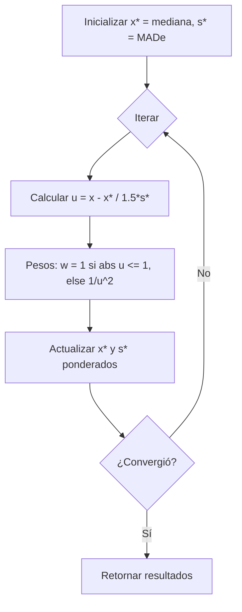
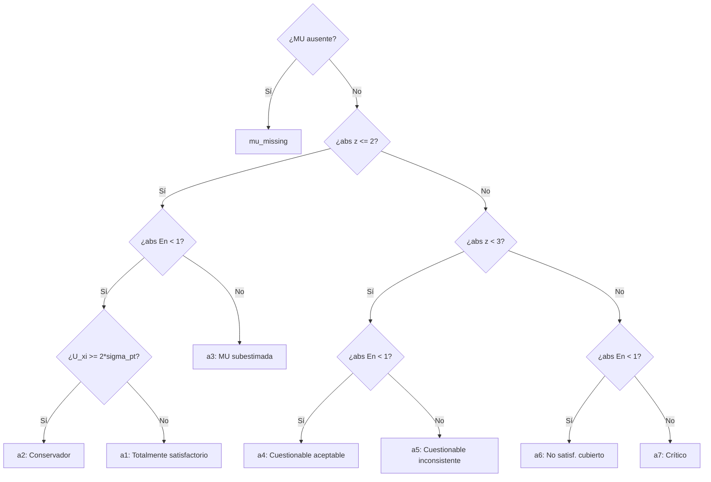

# Referencia del API de ptcalc

## Información del Documento

| Atributo | Valor |
|----------|-------|
| Paquete | `ptcalc` v0.1.0 |
| Funciones Exportadas | 24 |
| Constantes Exportadas | 2 |
| Propósito | Referencia completa de todas las funciones exportadas del paquete para estudios de aptitud |
| Archivos Relacionados | [02_ptcalc_package.md](02_ptcalc_package.md) |

---

## Índice de Contenidos

- [1. Estadísticos Robustos](#1-estadisticos-robustos)
- [2. Homogeneidad](#2-homogeneidad)
- [3. Estabilidad](#3-estabilidad)
- [4. Incertidumbres](#4-incertidumbres)
- [5. Puntajes](#5-puntajes)
- [6. Evaluación de Puntajes](#6-evaluacion-de-puntajes)
- [7. Clasificación Combinada](#7-clasificacion-combinada)
- [8. Constantes](#8-constantes)
- [9. Ejemplo de Flujo Completo](#9-ejemplo-de-flujo-completo)
- [Apéndice: Resumen de Tipos](#apendice-resumen-de-tipos)

---

## 1. Estadísticos Robustos

### calculate_niqr

Calcula el Rango Intercuartil Normalizado (nIQR), un estimador robusto de la desviación estándar.

**Archivo:** `R/pt_robust_stats.R` (líneas 33-40)  
**Referencia:** ISO 13528:2022, Sección 9.4

#### Firma
```r
calculate_niqr(x)
```

#### Parámetros
| Parámetro | Tipo | Requerido | Descripción |
|-----------|------|-----------|-------------|
| `x` | vector numérico | Sí | Vector de valores numéricos |

#### Retorno
- `numeric`: nIQR = 0.7413 * (Q3 - Q1), o `NA_real_` si los datos son insuficientes (menos de 2 valores finitos).

#### Fórmula
$$\text{nIQR} = 0.7413 \times (Q_3 - Q_1)$$

#### Ejemplo
```r
# Calcular nIQR para datos de ensayo de aptitud
values <- c(10.1, 10.2, 9.9, 10.0, 10.3, 9.8, 10.1)
niqr <- calculate_niqr(values)
# Resultado: ~0.222
```

#### Casos de Error / Extremos
| Condición | Resultado |
|-----------|-----------|
| `length(x_clean) < 2` | `NA_real_` |
| Valores no finitos | Filtrados automáticamente antes del cálculo |

---

### calculate_mad_e

Calcula la Desviación Absoluta Mediana escalada (MADe), un estimador robusto de la dispersión muy resistente a valores atípicos.

**Archivo:** `R/pt_robust_stats.R` (líneas 63-72)  
**Referencia:** ISO 13528:2022, Sección 9.4

#### Firma
```r
calculate_mad_e(x)
```

#### Parámetros
| Parámetro | Tipo | Requerido | Descripción |
|-----------|------|-----------|-------------|
| `x` | vector numérico | Sí | Vector de valores numéricos |

#### Retorno
- `numeric`: MADe = 1.483 * MAD, o `NA_real_` si no hay datos finitos.

#### Fórmula
$$\text{MADe} = 1.483 \times \text{median}(|x_i - \text{median}(x)|)$$

#### Ejemplo
```r
# MADe es robusto ante outliers
values <- c(10.1, 10.2, 9.9, 10.0, 50.0)  # 50 es un valor atípico
mad_e <- calculate_mad_e(values)
# Resultado: ~0.222 (ignora el impacto del outlier)
```

---

### run_algorithm_a

Implementa el Algoritmo A de ISO 13528 para calcular la media y desviación estándar robustas mediante un proceso iterativo con ponderación de Huber.

**Archivo:** `R/pt_robust_stats.R` (líneas 112-246)  
**Referencia:** ISO 13528:2022, Anexo C

#### Firma
```r
run_algorithm_a(values, ids = NULL, max_iter = 50, tol = 1e-03)
```

#### Parámetros
| Parámetro | Tipo | Requerido | Default | Descripción |
|-----------|------|-----------|---------|-------------|
| `values` | vector numérico | Sí | - | Resultados de los participantes |
| `ids` | vector | No | `NULL` | Identificadores opcionales de participantes |
| `max_iter` | entero | No | 50 | Máximo número de iteraciones permitidas |
| `tol` | numérico | No | 1e-03 | Tolerancia de convergencia |

#### Retorno
Una lista que contiene:
| Campo | Tipo | Descripción |
|-------|------|-------------|
| `assigned_value` | numérico | Media robusta final (x*) |
| `robust_sd` | numérico | Desviación estándar robusta final (s*) |
| `iterations` | data.frame | Historial paso a paso de la convergencia |
| `weights` | data.frame | Pesos y residuos finales por participante |
| `converged` | lógico | TRUE si se alcanzó la convergencia dentro de `max_iter` |
| `effective_weight` | numérico | Suma de los pesos finales asignados |
| `error` | carácter | Mensaje de error si el proceso falló, de lo contrario `NULL` |

#### Algoritmo (Flujo)


#### Ejemplo
```r
values <- c(10.1, 10.2, 9.9, 10.0, 10.3, 50.0)
ids <- c("Lab1", "Lab2", "Lab3", "Lab4", "Lab5", "Lab6")
result <- run_algorithm_a(values, ids)

if (is.null(result$error)) {
  cat("Valor Asignado:", result$assigned_value, "\n") # ~10.1
  cat("SD Robusta:", result$robust_sd, "\n")          # ~0.14
}
```

#### Casos de Error
| Condición | Comportamiento |
|-----------|----------------|
| `n < 3` | Error: "Algorithm A requires at least 3 valid observations." |
| Dispersión cero | Error: "Data dispersion is insufficient for Algorithm A." |
| SD colapsa a cero | Error: "Algorithm A collapsed due to zero standard deviation." |
| No convergencia | Retorna los últimos valores calculados con `converged = FALSE` |

---

## 2. Homogeneidad

### calculate_homogeneity_stats

Calcula los componentes de varianza mediante ANOVA para evaluar la homogeneidad de los ítems del ensayo de aptitud.

**Archivo:** `R/pt_homogeneity.R` (líneas 38-91)  
**Referencia:** ISO 13528:2022, Sección 9.2

#### Firma
```r
calculate_homogeneity_stats(sample_data)
```

#### Parámetros
| Parámetro | Tipo | Requerido | Descripción |
|-----------|------|-----------|-------------|
| `sample_data` | data.frame/matrix | Sí | Datos con muestras en filas y réplicas en columnas |

#### Retorno
Lista con estadísticos clave:
| Campo | Tipo | Descripción |
|-------|------|-------------|
| `g` | entero | Número de muestras analizadas |
| `m` | entero | Número de réplicas por muestra |
| `grand_mean` | numérico | Media global del estudio (x̄̄) |
| `sample_means` | vector numérico | Media de cada muestra individual |
| `s_x_bar_sq` | numérico | Varianza de las medias de las muestras |
| `sw` | numérico | Desviación estándar intra-muestra |
| `ss` | numérico | Desviación estándar entre-muestras |
| `error` | carácter | Mensaje de error si las dimensiones son insuficientes |

#### Fórmulas (para m = 2)
$$s_w = \sqrt{\frac{\sum w_i^2}{2g}}$$ donde $w_i$ es el rango de la muestra $i$.
$$s_s^2 = \max(0, s_{\bar{x}}^2 - \frac{s_w^2}{m})$$

#### Ejemplo
```r
# Matriz de 10 muestras con 2 réplicas cada una
sample_data <- matrix(rnorm(20, 10, 0.1), nrow=10, ncol=2)
stats <- calculate_homogeneity_stats(sample_data)
cat("ss:", stats$ss, "sw:", stats$sw)
```

---

### calculate_homogeneity_criterion

Calcula el límite crítico estándar para la homogeneidad ($0.3 \times \sigma_{pt}$).

**Archivo:** `R/pt_homogeneity.R` (líneas 109-111)  
**Referencia:** ISO 13528:2022, Sección 9.2.3

#### Firma
```r
calculate_homogeneity_criterion(sigma_pt)
```

#### Retorno
- `numeric`: $c = 0.3 \times \sigma_{pt}$.

---

### calculate_homogeneity_criterion_expanded

Calcula el criterio de homogeneidad expandido según ISO 13528 §9.2.4, que considera la incertidumbre debida a la precisión del método (varianza intra-muestra).

**Archivo:** `R/pt_homogeneity.R` (líneas 123-127)

#### Firma
```r
calculate_homogeneity_criterion_expanded(sigma_pt, sw_sq)
```

#### Fórmula
$$c_{expandido} = \sqrt{(0.3 \times \sigma_{pt})^2 \times 1.88 + s_w^2 \times 1.01}$$

---

### evaluate_homogeneity

Determina si los resultados del estudio de homogeneidad cumplen con los criterios establecidos.

**Archivo:** `R/pt_homogeneity.R` (líneas 139-165)

#### Firma
```r
evaluate_homogeneity(ss, c_criterion, c_expanded = NULL)
```

#### Retorno
| Campo | Tipo | Descripción |
|-------|------|-------------|
| `passes_criterion` | lógico | TRUE si $s_s \leq c$ |
| `passes_expanded` | lógico | TRUE si $s_s \leq c_{expandido}$ (o NA si no se provee) |
| `conclusion` | carácter | Resumen textual del resultado de la evaluación |

---

## 3. Estabilidad

### calculate_stability_stats

Evalúa la estabilidad comparando la media de muestras sometidas a condiciones de estabilidad contra la media del estudio de homogeneidad.

**Archivo:** `R/pt_homogeneity.R` (líneas 181-194)  
**Referencia:** ISO 13528:2022, Sección 9.3

#### Firma
```r
calculate_stability_stats(stab_sample_data, hom_grand_mean)
```

#### Retorno
Extiende los campos de `calculate_homogeneity_stats` incluyendo:
- `stab_grand_mean`: Media de las muestras de estabilidad.
- `diff_hom_stab`: Valor absoluto de la diferencia entre la media de estabilidad y la de homogeneidad.

---

### calculate_stability_criterion

Calcula el criterio base de estabilidad ($0.3 \times \sigma_{pt}$).

**Archivo:** `R/pt_homogeneity.R` (líneas 205-207)

---

### calculate_stability_criterion_expanded

Calcula el criterio de estabilidad expandido considerando las incertidumbres de las medias.

**Archivo:** `R/pt_homogeneity.R` (líneas 218-220)  
**Referencia:** ISO 13528:2022, Sección 9.3.4

#### Firma
```r
calculate_stability_criterion_expanded(c_criterion, u_hom_mean, u_stab_mean)
```

#### Fórmula
$$c_{stab\_exp} = c + 2 \times \sqrt{u_{hom}^2 + u_{stab}^2}$$

---

### evaluate_stability

Determina si el cambio en la media durante el estudio de estabilidad es aceptable.

**Archivo:** `R/pt_homogeneity.R` (líneas 232-258)

#### Firma
```r
evaluate_stability(diff_hom_stab, c_criterion, c_expanded = NULL)
```

---

## 4. Incertidumbres

### calculate_u_hom

Calcula la incertidumbre estándar debida a la falta de homogeneidad.

**Archivo:** `R/pt_homogeneity.R` (líneas 269-271)

#### Fórmula
$$u_{hom} = s_s$$

---

### calculate_u_stab

Calcula la incertidumbre estándar debida a la inestabilidad.

**Archivo:** `R/pt_homogeneity.R` (líneas 284-289)

#### Fórmula
$$u_{stab} = \begin{cases} 0 & \text{si } |diff| \leq c \\ \frac{|diff|}{\sqrt{3}} & \text{si } |diff| > c \end{cases}$$

---

## 5. Puntajes

### calculate_z_score

Calcula el puntaje z convencional para evaluar el desempeño.

**Archivo:** `R/pt_scores.R` (líneas 28-33)  
**Referencia:** ISO 13528:2022, Sección 10.2

#### Fórmula
$$z = \frac{x - x_{pt}}{\sigma_{pt}}$$

#### Casos Extremos
- Retorna `NA_real_` si $\sigma_{pt}$ no es finito o es $\leq 0$.

---

### calculate_z_prime_score

Calcula el puntaje z' que incorpora la incertidumbre del valor asignado.

**Archivo:** `R/pt_scores.R` (líneas 53-59)  
**Referencia:** ISO 13528:2022, Sección 10.3

#### Fórmula
$$z' = \frac{x - x_{pt}}{\sqrt{\sigma_{pt}^2 + u_{xpt}^2}}$$

---

### calculate_zeta_score

Calcula el puntaje zeta utilizando la incertidumbre informada por el participante.

**Archivo:** `R/pt_scores.R` (líneas 79-85)  
**Referencia:** ISO 13528:2022, Sección 10.4

#### Fórmula
$$\zeta = \frac{x - x_{pt}}{\sqrt{u_x^2 + u_{xpt}^2}}$$

---

### calculate_en_score

Calcula el puntaje En (Error Normalizado) usando incertidumbres expandidas ($k=2$).

**Archivo:** `R/pt_scores.R` (líneas 106-112)  
**Referencia:** ISO 13528:2022, Sección 10.5

#### Fórmula
$$E_n = \frac{x - x_{pt}}{\sqrt{U_x^2 + U_{xpt}^2}}$$

---

## 6. Evaluación de Puntajes

### evaluate_z_score / evaluate_z_score_vec

Clasifica los puntajes z, z' o zeta según los umbrales de ISO 13528.

| Condición | Categoría |
|-----------|-----------|
| $|score| \leq 2$ | "Satisfactorio" |
| $2 < |score| < 3$ | "Cuestionable" |
| $|score| \geq 3$ | "No satisfactorio" |
| No finito | "N/A" |

---

### evaluate_en_score / evaluate_en_score_vec

Clasifica el puntaje En según el criterio unitario.

| Condición | Categoría |
|-----------|-----------|
| $|E_n| \leq 1$ | "Satisfactorio" |
| $|E_n| > 1$ | "No satisfactorio" |
| No finito | "N/A" |

---

## 7. Clasificación Combinada

### classify_with_en

Realiza una clasificación profunda (categorías a1 a a7) integrando el desempeño (z/z') y la consistencia de la incertidumbre informada (En).

**Archivo:** `R/pt_scores.R` (líneas 229-274)  
**Referencia:** ISO 13528:2022, Sección 10.7

#### Diagrama de Lógica


#### Tabla de Categorías
| Código | Descripción Completa |
|--------|----------------------|
| **a1** | Totalmente satisfactorio |
| **a2** | Satisfactorio pero conservador (U informada muy grande) |
| **a3** | Satisfactorio con MU subestimada (En > 1 pero z bueno) |
| **a4** | Cuestionable pero aceptable (la MU cubre el error) |
| **a5** | Cuestionable e inconsistente |
| **a6** | No satisfactorio pero la MU cubre la desviación |
| **a7** | No satisfactorio (crítico - fuera de z y fuera de En) |

---

## 8. Constantes

### PT_EN_CLASS_LABELS
Vector nombrado con las descripciones textuales para las categorías a1-a7.

### PT_EN_CLASS_COLORS
Paleta de colores oficial para la representación visual de las categorías en gráficos y heatmaps.
- **a1**: `#2E7D32` (Verde)
- **a4**: `#FFF59D` (Amarillo)
- **a7**: `#C62828` (Rojo)

---

## 9. Ejemplo de Flujo Completo

A continuación se muestra cómo integrar las funciones del API en un flujo de trabajo real:

```r
library(ptcalc)

# 1. Calcular estadísticos robustos de los resultados
participantes <- c(10.2, 10.1, 9.8, 10.0, 10.3, 15.0) # 15.0 es outlier
res_robust <- run_algorithm_a(participantes)
x_pt <- res_robust$assigned_value
s_pt <- res_robust$robust_sd

# 2. Verificar homogeneidad
datos_hom <- matrix(c(10.1, 10.2, 9.9, 10.0), nrow=2, ncol=2)
hom_stats <- calculate_homogeneity_stats(datos_hom)
c_hom <- calculate_homogeneity_criterion(s_pt)
eval_hom <- evaluate_homogeneity(hom_stats$ss, c_hom)
print(eval_hom$conclusion)

# 3. Evaluar un participante con incertidumbre
x_i <- 10.5
u_i <- 0.2
z_i <- calculate_z_score(x_i, x_pt, s_pt)
en_i <- calculate_en_score(x_i, x_pt, 2*u_i, 0.1) # U_xpt asumida 0.1

# 4. Clasificación combinada
final_class <- classify_with_en(z_i, en_i, 2*u_i, s_pt, FALSE, "z")
cat("Resultado final:", final_class$label)
```

---

## Apéndice: Resumen de Tipos

| Entrada / Salida | Descripción |
|------------------|-------------|
| `vector numérico` | Conjunto de resultados de ensayo |
| `matrix` | Datos de réplicas (filas=unidades, cols=réplicas) |
| `list` | Objetos complejos con múltiples métodos de retorno |

---

## Referencias
- **ISO 13528:2022**: Statistical methods for use in proficiency testing by interlaboratory comparison.
- **ISO 17043:2024**: Conformity assessment — General requirements for the competence of proficiency testing providers.
- **ISO/IEC Guide 98-3 (GUM)**: Guide to the expression of uncertainty in measurement.
