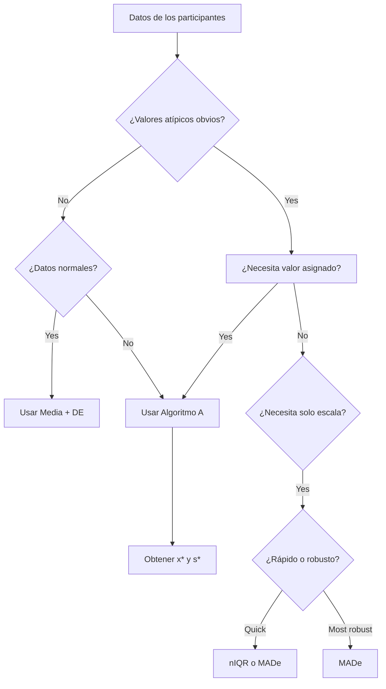

# pt_robust_stats.R: Métodos Estadísticos Robustos (ISO 13528)

## 1. Overview / Descripción General

Este módulo (`pt_robust_stats.R`) implementa estimadores estadísticos robustos utilizados para calcular valores asignados ($x_{pt}$) y desviaciones estándar ($\sigma_{pt}$) resistentes a valores atípicos, siguiendo los métodos descritos en **ISO 13528:2022**.

Las estadísticas robustas proporcionan estimaciones de ubicación (media) y escala (desviación estándar) que son resistentes a los valores atípicos y a las distribuciones no normales. Estos métodos son fundamentales para el análisis de los ensayos de aptitud, asegurando que los valores extremos no distorsionen la evaluación del desempeño del grupo.

### Location in Code / Ubicación
| Elemento | Valor |
|----------|-------|
| Archivo | `ptcalc/R/pt_robust_stats.R` |
| Líneas | 1 - 247 |

---

## 2. Key Robust Estimators / Estimadores Robustos Clave

Este módulo implementa tres estimadores robustos clave utilizados en diferentes etapas del análisis de PT:

1.  **MADe** (Desviación Absoluta de la Mediana Escalada): El estimador de escala simple más robusto.
2.  **nIQR** (Rango Intercuartílico Normalizado): Una escala robusta alternativa basada en cuartiles.
3.  **Algoritmo A** (Media/desviación estándar robusta ISO 13528): El método iterativo principal para calcular valores de consenso.

---

## 3. Algorithm A (ISO 13528 Annex C) / Algoritmo A (Anexo C de ISO 13528)

El Algoritmo A es un procedimiento iterativo utilizado para calcular una media robusta ($x^*$) y una desviación estándar robusta ($s^*$). Es el método principal utilizado en esta aplicación cuando se selecciona la opción "Consenso (Algoritmo A)".

### 3.1 Visual Algorithm Flow / Flujo Visual

```mermaid
flowchart TD
    START[Inicio: Vector de valores] --> CHECK{n ≥ 3?}
    CHECK -- No --> ERR[Error: Requiere al menos 3 observaciones]
    CHECK -- Yes --> INIT[Inicializar x* = mediana, s* = 1.483 × MAD]
    
    INIT --> ZCHECK{s* > 0?}
    ZCHECK -- No --> FALLBACK[Usar DE clásica como respaldo]
    ZCHECK -- Yes --> RESIDUALS[Calcular residuales: u = x - x* / 1.5 × s*]
    FALLBACK --> RESIDUALS
    
    RESIDUALS --> WEIGHTS[Calcular pesos de Huber]
    WEIGHTS --> WEIGHT_DECISION{|u| ≤ 1?}
    WEIGHT_DECISION -- Yes --> WEIGHT1[w = 1]
    WEIGHT_DECISION -- No --> WEIGHT2[w = 1 / u²]
    
    WEIGHT1 --> UPDATE[Actualizar x* = Σw×x / Σw]
    WEIGHT2 --> UPDATE
    
    UPDATE --> UPDATE_S[Actualizar s* = √Σw×x-x*² / Σw]
    UPDATE_S --> CONVERGENCE{Δx < tol and Δs < tol?}
    
    CONVERGENCE -- No --> ITER_CHECK{iter < max_iter?}
    ITER_CHECK -- Yes --> RESIDUALS
    ITER_CHECK -- No --> NO_CONV[Retornar: convergencia = FALSE]
    
    CONVERGENCE -- Yes --> YES_CONV[Retornar: convergencia = TRUE]
    
    style INIT fill:#e3f2fd
    style RESIDUALS fill:#bbdefb
    style WEIGHTS fill:#c8e6c9
    style UPDATE fill:#ffe0b2
    style YES_CONV fill:#c8e6c9
    style NO_CONV fill:#ffcdd2
    style ERR fill:#ffcdd2
```

### 3.2 Step-by-Step Procedure / Procedimiento Paso a Paso

1.  **Inicialización**:
    - Eliminar valores no finitos (`NA`, `Inf`, `-Inf`).
    - Verificar $n \ge 3$.
    - Establecer estimaciones iniciales: $x^* = \text{mediana}(x)$ y $s^* = 1.483 \times \text{MAD}(x)$.
    - Si $s^* \approx 0$, usar la DE clásica como respaldo.
2.  **Calcular Residuales Estandarizados ($u_i$)**:
    $$u_i = \frac{x_i - x^*}{1.5 \times s^*}$$
    El factor 1.5 es la "constante de ajuste" para los pesos de Huber.
3.  **Calcular Pesos de Huber ($w_i$)**:
    $$w_i = \begin{cases} 1 & \text{if } |u_i| \leq 1 \\ 1/u_i^2 & \text{if } |u_i| > 1 \end{cases}$$
4.  **Actualizar Estimaciones**:
    $$x^*_{new} = \frac{\sum w_i x_i}{\sum w_i}$$
    $$s^*_{new} = \sqrt{\frac{\sum w_i (x_i - x^*_{new})^2}{\sum w_i}}$$
5.  **Verificar Convergencia**:
    Converge si $\Delta x < tol$ Y $\Delta s < tol$. Si no ha convergido, repetir desde el paso 2 hasta `max_iter`.

---

## 4. Numerical Examples / Ejemplos Numéricos

### 4.1 Example 1: Standard PT Dataset with Outlier / Ejemplo 1: Conjunto de datos de PT estándar con valor atípico
**Datos:** `[10.1, 10.2, 9.9, 10.0, 10.3, 50.0]`

#### Iteration 0: Initialization / Iteración 0: Inicialización
- Mediana: 10.05
- MAD: 0.15
- $s^*$ inicial: $1.483 \times 0.15 = 0.222$

#### Iteration 1
| Participante | Valor | $x_i - 10.05$ | $u = diff / 0.333$ | $|u|$ | Peso $w$ |
|-------------|--------|-----------------|-------------------------|-------|-----------|
| 1 | 10.1 | 0.05 | 0.150 | 0.150 | 1.000 |
| 2 | 10.2 | 0.15 | 0.451 | 0.451 | 1.000 |
| 3 | 9.9 | -0.15 | -0.451 | 0.451 | 1.000 |
| 4 | 10.0 | -0.05 | -0.150 | 0.150 | 1.000 |
| 5 | 10.3 | 0.25 | 0.751 | 0.751 | 1.000 |
| 6 | 50.0 | 39.95 | **119.97** | 119.97 | **0.00007** |

- **Actualización**: $x^*_{new} = 10.10$, $s^*_{new} = 0.141$.
- **Convergencia**: $\Delta x = 0.05$, $\Delta s = 0.081$. Continúa.

#### Iteration 2
- El valor atípico (50.0) recibe un peso $w \approx 0.000028$.
- **Actualización**: $x^*_{new} = 10.10$ (estacionario), $s^*_{new} = 0.140$.
- **Convergencia**: Alcanzada.

### 4.2 Example 2: Small Dataset with Large Outlier / Ejemplo 2: Conjunto de datos pequeño con un valor atípico grande
**Datos:** `[10.1, 10.2, 10.3, 10.2, 25.0]`
- Mediana inicial: 10.2
- $s^*$ inicial: 0.1483
- Peso del valor atípico en la Iteración 1: $\approx 0.0005$
- **Resultado**: Converge rápidamente a ~10.2, ignorando efectivamente el 25.0.

### 4.3 Comparison with Classical Statistics / Comparación con Estadísticas Clásicas
| Estimador | Valor Ejemplo 1 | Interpretación |
|-----------|--------|----------------|
| **Media aritmética** | 16.75 | **Sesgada al alza** debido al valor atípico |
| **Mediana** | 10.05 | Buena estimación de ubicación |
| **Media robusta (x*)** | 10.10 | Mejor estimación de ubicación (ISO 13528) |
| **DE clásica** | 16.23 | **Inflada** debido al valor atípico |
| **MADe** | 0.222 | Buena estimación de escala |
| **nIQR** | 0.185 | Estimación de escala alternativa |
| **DE robusta (s*)** | 0.140 | Mejor estimación de escala (ISO 13528) |

---

## 5. Convergence Behavior / Comportamiento de Convergencia

### 5.1 Typical Patterns / Patrones Típicos
El Algoritmo A normalmente converge en 3-8 iteraciones dependiendo de:
1. **Proporción de valores atípicos**: Más valores atípicos = más iteraciones.
2. **Magnitud de los valores atípicos**: Los valores atípicos extremos convergen más rápido ya que sus pesos se acercan a cero rápidamente.
3. **Dispersión inicial**: Datos más dispersos = más iteraciones.

#### Convergence Plot Example / Ejemplo de Gráfico de Convergencia
```mermaid
xychart-beta
    title "Ejemplo de Convergencia del Algoritmo A"
    x-axis "Iteración" [1, 2, 3, 4, 5]
    y-axis "Estimación" [9.5, 10.5]
    line [10.05, 10.10, 10.10, 10.10, 10.10]
```

| % Valores Atípicos | Promedio de Iteraciones |
|-------------|-------------------|
| 0% | 2-3 |
| 10% | 4-5 |
| 20% | 5-7 |
| 40% | 8-12 |

### 5.2 Tuning Constant Effect / Efecto de la Constante de Ajuste
El factor 1.5 en $u = \frac{x - x^*}{1.5 \times s^*}$ controla la sensibilidad:
- **1.0**: Desponderación más agresiva, menor eficiencia con datos normales.
- **1.5**: Valor estándar de ISO 13528; robustez y eficiencia equilibradas.
- **2.0**: Más tolerante con valores atípicos moderados.

---

## 6. Edge Cases / Casos Límite

| Escenario | Comportamiento |
|:---|:---|
| **< 3 Participantes** | Retorna `NA`. El Algoritmo A requiere al menos 3 observaciones válidas para ser estadísticamente significativo. |
| **Dispersión Cero** | Si todos los valores son idénticos, $s^* = 0$. El algoritmo utiliza la DE clásica como respaldo. Si esta también es 0, retorna 0. |
| **Valores No Finitos** | `NA`, `Inf`, `-Inf` se filtran automáticamente antes del cálculo. |
| **Alta Proporción de Atípicos** | El punto de ruptura es ~50%. Si >50% de los datos son valores atípicos, los "valores atípicos" se convierten en el consenso. |

---

## 7. Comparison of Scale Estimators / Comparación de Estimadores de Escala

| Característica | MADe | nIQR | Algoritmo A |
|----------------|-------|-------|-------------|
| **Fórmula** | $1.483 \times \text{median}(\|x_i - \tilde{x}\|)$ | $0.7413 \times (Q_3 - Q_1)$ | Iterativo ponderado |
| **Punto de Ruptura** | 50% | 25% | ~50% |
| **Eficiencia (normal)** | 37% | 37% | ~95% |
| **Iterativo** | No | No | Sí |
| **Mejor Uso** | Inicialización; Solo escala | Distribuciones asimétricas | **Valor de consenso principal** |

---

## 8. When to Use Each Estimator / Cuándo Usar Cada Estimador



---

## 9. Implementation Examples (R) / Ejemplos de Implementación (R)

### Basic Usage / Uso Básico
```r
values <- c(10.1, 10.2, 9.9, 10.0, 10.3, 50.0)

# Estimadores de escala robustos
made <- calculate_mad_e(values)  # 0.222
niqr <- calculate_niqr(values)   # 0.185

# Algoritmo A
result <- run_algorithm_a(values)
result$assigned_value  # 10.10
result$robust_sd       # 0.14
```

### Inspecting Weights and History / Inspeccionar Pesos e Historial
```r
# Pesos de los participantes
result$weights
#   id value    weight standardized_residual
# 6  6  50.0    0.000028               282.84

# Historial de convergencia
result$iterations
#   iteration  x_star   s_star   delta
# 1          1   10.10     0.141  0.0810
```

---

## 10. Mathematical Derivations / Derivaciones Matemáticas

- **Constante MADe (1.483)**: Derivada de $1/\Phi^{-1}(0.75)$ para asegurar la consistencia con la DE bajo normalidad.
- **Constante nIQR (0.7413)**: Derivada de $1/(\Phi^{-1}(0.75) - \Phi^{-1}(0.25))$ para coincidir con la DE para datos normales.

---

## References / Referencias
- **ISO 13528:2022** Sección 9.4 y Anexo C.
- Huber, P.J. (1981). *Robust Statistics*. Wiley.

## Cross-References / Referencias Cruzadas
- [04_pt_homogeneity.md](04_pt_homogeneity.md) - Utiliza estadísticas robustas para métricas de calidad.
- [07_valor_asignado.md](07_valor_asignado.md) - Detalles sobre la asignación del valor de consenso.
