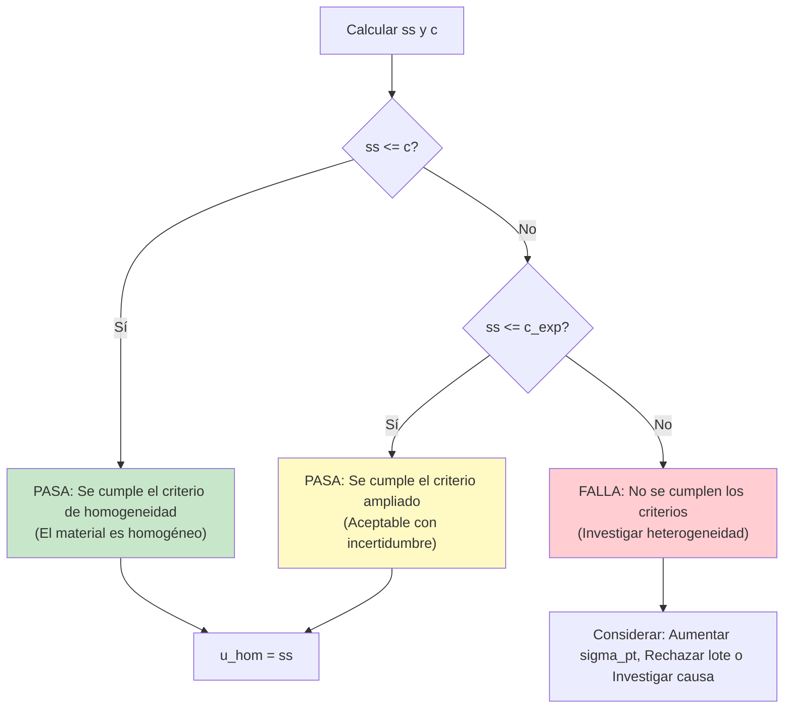
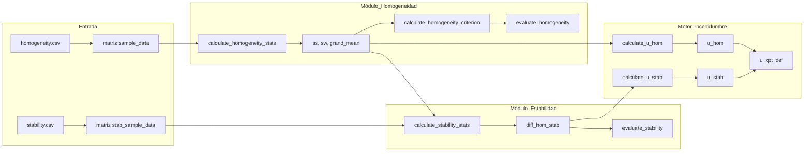

# Evaluación de Homogeneidad y Estabilidad (ISO 13528:2022)

## 1. Descripción general
Este módulo implementa los métodos estadísticos descritos en las **Secciones 7.4 y 7.5 de la norma ISO 13528:2022** para evaluar si los ítems del ensayo de aptitud (PT) son suficientemente homogéneos y estables.

*   **Homogeneidad**: Asegura que cada participante reciba un ítem de prueba equivalente. La falta de homogeneidad hace que la evaluación del desempeño sea injusta.
*   **Estabilidad**: Verifica que las propiedades del material no cambien significativamente durante el período del PT, asegurando la consistencia independientemente de cuándo el participante realice la prueba.

---

## 2. Especificaciones técnicas

| Elemento | Valor |
|:---|:---|
| **Archivo** | `ptcalc/R/pt_homogeneity.R` |
| **Líneas** | 1 - 290 |
| **Norma** | ISO 13528:2022, ISO Guide 35:2017 |

---

## 3. Modelo estadístico: ANOVA de un factor
La evaluación se basa en un modelo de Análisis de Varianza (ANOVA) de un factor:

$$x_{ij} = \mu + \alpha_i + \epsilon_{ij}$$

Donde:
- $x_{ij}$ = $j$-ésima medición de la $i$-ésima muestra.
- $\mu$ = Media general.
- $\alpha_i$ = Efecto de la muestra $i$ (variación entre muestras).
- $\epsilon_{ij}$ = Error de medición (variación dentro de la muestra).

---

## 4. Evaluación de la homogeneidad

### 4.1 Funciones
La función principal para el cálculo de la homogeneidad es:
`calculate_homogeneity_stats(sample_data)`

**Entrada:**
- `sample_data`: Una matriz o data frame donde las filas representan ítems (muestras) y las columnas representan réplicas.

**Devuelve:**
- `g`: Número de muestras.
- `m`: Número de réplicas por muestra.
- `grand_mean`: Media global ($\bar{\bar{x}}$).
- `sample_means`: Vector de medias para cada muestra.
- `sw`: Desviación estándar dentro de la muestra.
- `ss`: Desviación estándar entre muestras.
- `sw_sq`, `ss_sq`: Varianzas respectivas.

### 4.2 Cálculos estadísticos

#### Desviación estándar dentro de la muestra ($s_w$)
Para el caso típico de **$m = 2$ réplicas**:
$$s_w = \sqrt{\frac{\sum_{i=1}^{g} (x_{i1} - x_{i2})^2}{2g}}$$
*Nota: Esto también se puede expresar utilizando el rango $w_i = |x_{i1} - x_{i2}|$ como $s_w = \sqrt{\sum w_i^2 / 2g}$.*

Para **$m > 2$ réplicas**:
$$s_w^2 = \frac{1}{g} \sum_{i=1}^{g} s_i^2$$
Donde $s_i^2$ es la varianza de las réplicas para la muestra $i$.

#### Desviación estándar entre muestras ($s_s$)
$$s_s^2 = \max\left(0, s_{\bar{x}}^2 - \frac{s_w^2}{m}\right)$$
Donde $s_{\bar{x}}^2$ es la varianza de las medias de las muestras. La resta de $s_w^2/m$ elimina la contribución del ruido de medición de la variación observada entre muestras.

### 4.3 Construcción de la tabla ANOVA

| Fuente | Grados de libertad | Suma de cuadrados (SS) | Media cuadrática (MS) |
|:---|:---|:---|:---|
| **Entre muestras** | $g - 1$ | $SS_B = m \sum_{i=1}^{g}(\bar{x}_i - \bar{\bar{x}})^2$ | $MS_B = SS_B / (g-1)$ |
| **Dentro de muestras** | $g(m - 1)$ | $SS_W = \sum_{i=1}^{g}\sum_{j=1}^{m}(x_{ij} - \bar{x}_i)^2$ | $MS_W = SS_W / (g(m-1))$ |
| **Total** | $gm - 1$ | $SS_T = SS_B + SS_W$ | |

**Relación con las estadísticas ISO:**
- $s_w^2 = MS_W$
- $s_s^2 = \max(0, \frac{MS_B - MS_W}{m})$

---

## 5. Criterios de aceptación

### 5.1 Criterio básico ($c$)
El material se considera suficientemente homogéneo si:
$$s_s \leq 0.3 \times \sigma_{pt}$$
Donde $\sigma_{pt}$ es la desviación estándar para la evaluación de la aptitud.

### 5.2 Criterio ampliado ($c_{exp}$)
Si no se cumple el criterio básico, se puede utilizar un criterio ampliado para tener en cuenta la incertidumbre en las estimaciones de $s_s$ y $s_w$:
$$c_{exp} = \sqrt{(0.3 \times \sigma_{pt})^2 \times 1.88 + s_w^2 \times 1.01}$$

*Nota técnica: Los factores 1.88 y 1.01 son factores de cobertura derivados de la distribución $\chi^2$ (para $g=10, m=2$). 1.88 se relaciona con la varianza entre muestras y 1.01 con la varianza dentro de la muestra.*

### 5.3 Árbol de decisión



---

## 6. Evaluación de la estabilidad

### 6.1 Funciones
`calculate_stability_stats(stab_sample_data, hom_grand_mean)`

Esta función compara los resultados del estudio de estabilidad con la línea base del estudio de homogeneidad.

### 6.2 Diferencia de estabilidad ($D$)
La métrica principal es la diferencia absoluta entre la media global de homogeneidad ($\bar{\bar{x}}_{hom}$) y la media global de estabilidad ($\bar{\bar{x}}_{stab}$):
$$D = |\bar{\bar{x}}_{hom} - \bar{\bar{x}}_{stab}|$$

### 6.3 Criterios de estabilidad
- **Básico**: $D \leq 0.3 \times \sigma_{pt}$
- **Ampliado**: $D \leq (0.3 \times \sigma_{pt}) + 2 \times \sqrt{u_{\bar{x}_{hom}}^2 + u_{\bar{x}_{stab}}^2}$
  Donde $u_{\bar{x}} = s_w / \sqrt{g \cdot m}$ es la incertidumbre estándar de la media.

### 6.4 Prueba t para estabilidad
Para determinar si la diferencia es estadísticamente significativa (incluso si pasa el criterio de 0.3):
$$t = \frac{|\bar{\bar{x}}_{hom} - \bar{\bar{x}}_{stab}|}{\sqrt{u_{\bar{x}_{hom}}^2 + u_{\bar{x}_{stab}}^2}}$$

| Resultado | Interpretación |
|:---|:---|
| $|t| < 2$ | Diferencia no significativa (estable) |
| $2 \leq |t| < 3$ | Posible deriva, se recomienda investigación |
| $|t| \geq 3$ | Deriva significativa |

---

## 7. Contribuciones a la incertidumbre

Los componentes de incertidumbre de la homogeneidad y la estabilidad se combinan en la incertidumbre definitiva del valor asignado ($u_{xpt,def}$).

### 7.1 Incertidumbre de homogeneidad ($u_{hom}$)
$$u_{hom} = s_s$$
*Nota: Si $s_s^2 < 0$ y se estableció en 0, $u_{hom} = 0$.*

### 7.2 Incertidumbre de estabilidad ($u_{stab}$)
Asume una distribución rectangular si la diferencia es mayor que el criterio:
$$u_{stab} = \begin{cases} 
0 & \text{si } D \leq 0.3 \times \sigma_{pt} \\ 
\frac{D}{\sqrt{3}} & \text{si } D > 0.3 \times \sigma_{pt} 
\end{cases}$$

### 7.3 Incertidumbre combinada
$$u_{xpt,def} = \sqrt{u_{xpt}^2 + u_{hom}^2 + u_{stab}^2}$$
Donde $u_{xpt}$ es la incertidumbre del método de caracterización (por ejemplo, Algoritmo A).

---

## 8. Flujo de datos en la aplicación



---

## 9. Ejemplo numérico: SO2 en ppm

### 9.1 Datos de homogeneidad (10 muestras, 2 réplicas)
| Muestra | Réplica 1 | Réplica 2 | Media | Rango ($w_i$) |
|:---|:---|:---|:---|:---|
| 1 | 0.0521 | 0.0525 | 0.0523 | 0.0004 |
| ... | ... | ... | ... | ... |
| 10 | 0.0526 | 0.0523 | 0.0525 | 0.0003 |

**Cálculos:**
1.  **Media global**: $\bar{\bar{x}} = 0.0526$
2.  **DE dentro de la muestra**: $s_w = \sqrt{\frac{\sum w_i^2}{20}} = 0.000245$
3.  **Varianza de las medias**: $s_{\bar{x}}^2 = 0.0000000278$
4.  **DE entre muestras**: $s_s^2 = 0.0000000278 - \frac{0.000245^2}{2} = -0.0000000022$
    Dado que es negativo, **$s_s = 0$**.

**Evaluación ($\sigma_{pt} = 0.005$):**
- $c = 0.3 \times 0.005 = 0.0015$
- $0 \leq 0.0015 \implies$ **PASA** (Homogéneo).

### 9.2 Datos de estabilidad (3 muestras después de 30 días)
- $\bar{\bar{x}}_{hom} = 0.0526$
- $\bar{\bar{x}}_{stab} = 0.0527$
- $D = |0.0526 - 0.0527| = 0.0001$

**Evaluación:**
- $0.0001 \leq 0.0015 \implies$ **PASA** (Estable).
- $u_{stab} = 0$.

---

## 10. Implementación del código (R)

```r
library(ptcalc)

# Cargar datos
hom_data <- matrix(c(19.70, 19.72, 19.68, 19.69, ...), ncol=2, byrow=TRUE)

# 1. Homogeneidad
stats <- calculate_homogeneity_stats(hom_data)
c_crit <- calculate_homogeneity_criterion(sigma_pt = 0.5)
eval <- evaluate_homogeneity(stats$ss, c_crit)

# 2. Estabilidad
stab_stats <- calculate_stability_stats(stab_data, stats$grand_mean)
stab_eval <- evaluate_stability(stab_stats$diff_hom_stab, c_crit)

# 3. Incertidumbre
u_hom <- calculate_u_hom(stats$ss)
u_stab <- calculate_u_stab(stab_stats$diff_hom_stab, c_crit)
```

---

## 11. Casos de borde y errores

| Caso | Manejo |
|:---|:---|
| **< 2 Muestras** | `calculate_homogeneity_stats` lanza un error: "At least 2 samples required". |
| **< 2 Réplicas** | `calculate_homogeneity_stats` lanza un error: "At least 2 replicates required". |
| **$s_s^2$ es negativo** | Esto ocurre cuando la variación observada entre las medias es menor de lo esperado por el ruido de medición. La aplicación establece $s_s = 0$ según las directrices de la norma ISO 13528. |

---

## 12. Referencias
- **ISO 13528:2022**: Métodos estadísticos para su uso en ensayos de aptitud mediante comparación interlaboratorio.
- **ISO Guide 35:2017**: Materiales de referencia — Guía para la caracterización y evaluación de la homogeneidad y estabilidad.
- **ISO/IEC 17043:2023**: Evaluación de la conformidad — Requisitos generales para los ensayos de aptitud.
