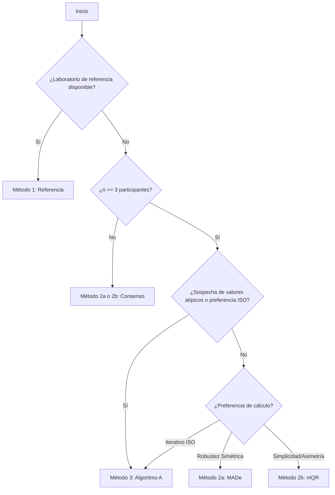
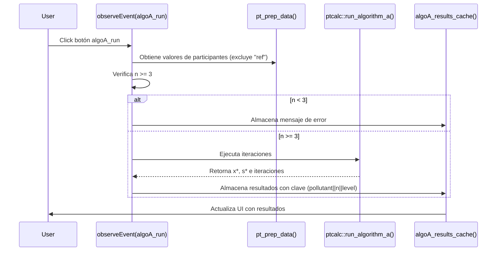
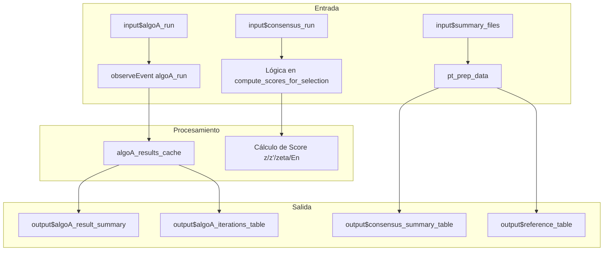

# Módulo: Valor Asignado ($x_{pt}$)

## 1. Descripción General
Este módulo gestiona el cálculo del valor asignado ($x_{pt}$) y su incertidumbre estándar utilizando diferentes métodos según la disponibilidad de datos y las preferencias del usuario, cumpliendo con las directrices de la norma ISO 13528:2022.

| Propiedad | Valor |
|-----------|-------|
| **Archivo** | `cloned_app.R` |
| **Ubicación UI** | Accordion dentro de la pestaña "Valor asignado" |
| **Líneas UI** | 877-946 (tabPanel "Valor asignado") |
| **Líneas Lógica** | 642-715 (`observeEvent algoA_run`), 1926-2098 (`compute_scores_for_selection`), 2480-2658 (compatibilidad) |
| **Dependencias** | `pt_prep_data()`, `algoA_results_cache()`, `consensus_results_cache()`, paquete `ptcalc` |
| **Norma ISO** | ISO 13528:2022 Sección 6 y Anexo C |

---

## 2. Métodos Disponibles

| Método | Código | Descripción | Fórmula $x_{pt}$ | Fórmula $\sigma_{pt}$ | Racional de Uso |
|--------|--------|-------------|------------------|-----------------------|-----------------|
| **Referencia** | 1 | Valor de laboratorio de referencia | $\bar{x}_{ref}$ | MADe del lab ref | Cuando se dispone de un valor trazable o certificado. |
| **Consenso MADe** | 2a | Mediana con MADe | $\text{median}(x_i)$ | $1.483 \times \text{MAD}$ | Sin referencia; preferir robustez frente a valores atípicos. |
| **Consenso nIQR** | 2b | Mediana con nIQR | $\text{median}(x_i)$ | $0.7413 \times \text{IQR}$ | Sin referencia; alternativa robusta si la distribución es asimétrica. |
| **Algoritmo A** | 3 | Estimación robusta iterativa | $x^*$ (robusto) | $s^*$ (robusto) | Sin referencia y $n \geq 3$; elimina influencia de atípicos de forma iterativa. |

---

## 3. Guía de Selección de Método

### Flujo de Decisión


### Criterios de Selección
| Situación | Método Recomendado | Razón |
|-----------|-------------------|-----------|
| Referencia disponible | **Método 1** | Más confiable, utiliza trazabilidad metrológica. |
| Sin referencia, $n < 3$ | **Método 2a o 2b** | El consenso es la única opción estadística viable. |
| Sin referencia, $n \geq 3$ | **Método 3 (Algoritmo A)** | La estimación robusta minimiza el sesgo de valores atípicos. |
| Calidad de datos mixta | **Comparar métodos** | Verificar consistencia entre consenso y algoritmo A. |

---

## 4. Mapa de Componentes UI e Interacciones

| Elemento UI | ID Input | ID Output | Tipo | Descripción |
|-------------|----------|-----------|------|-------------|
| Botón Algoritmo A | `algoA_run` | - | actionButton | Dispara el cálculo iterativo. |
| Botón Consenso | `consensus_run` | - | actionButton | Calcula valores de consenso. |
| Botón Compatibilidad | `run_metrological_compatibility` | - | actionButton | Evalúa compatibilidad Ref vs Consenso. |
| Selector Analito | `assigned_pollutant` | `assigned_pollutant_selector` | selectInput | Filtra por contaminante. |
| Selector Esquema | `assigned_n` | `assigned_n_selector` | selectInput | Filtra por número de participantes. |
| Selector Nivel | `assigned_level` | `assigned_level_selector` | selectInput | Filtra por nivel de concentración. |
| Iteraciones Máx | `algoA_max_iter` | - | numericInput | Límite para la convergencia del Algo A. |
| Tabla Referencia | - | `reference_table` | dataTableOutput | Valores del laboratorio de referencia. |
| Resumen Consenso | - | `consensus_summary_table` | tableOutput | Estadísticos median/MADe/nIQR. |
| Resumen Algo A | - | `algoA_result_summary` | uiOutput | Resultado final de $x^*$ y $s^*$. |
| Histograma | - | `algoA_histogram` | plotlyOutput | Distribución de los valores de entrada. |
| Iteraciones Algo A | - | `algoA_iterations_table` | dataTableOutput | Registro de convergencia del proceso. |
| Compatibilidad | - | `metrological_compatibility_table` | dataTableOutput | Tabla de evaluación $D_{2a}$ y $D_{2b}$. |

---

## 5. Detalles de Implementación por Método

### 5.1 Método 1: Laboratorio de Referencia
Filtra los datos cargados buscando el identificador especial `"ref"`.

**Lógica:**
```r
reference_table_data <- reactive({
  pt_prep_data() %>%
    filter(participant_id == "ref") %>%
    group_by(pollutant, level, n_lab) %>%
    summarise(
      x_pt = mean(mean_value, na.rm = TRUE),
      sigma_pt = 1.483 * median(abs(mean_value - median(mean_value))),
      .groups = "drop"
    )
})
```

**Fórmulas:**
- **Valor Asignado:** $x_{pt} = \bar{x}_{ref} = \frac{1}{n_{ref}} \sum_{i=1}^{n_{ref}} x_i$
- **Desviación Estándar:** $\sigma_{pt} = \text{MADe} \times 1.483$

### 5.2 Métodos 2a y 2b: Consenso (MADe / nIQR)
Utiliza estadísticos robustos simples cuando no se requiere un proceso iterativo.

**Fórmulas:**
- **Valor Asignado:** $x_{pt} = \text{median}(x_i)$
- **Sigma PT (2a - MADe):** $\sigma_{pt} = 1.483 \times \text{median}(|x_i - \text{median}(x)|)$
- **Sigma PT (2b - nIQR):** $\sigma_{pt} = 0.7413 \times (Q_3 - Q_1)$

### 5.3 Método 3: Algoritmo A
Proceso iterativo según ISO 13528, Anexo C.

**Flujo de Ejecución:**


**Mecanismo de Caché:**
Para evitar recalcular en cada cambio menor de la UI, los resultados se almacenan en un `reactiveVal`.
- **Clave:** `"pollutant||n_lab||level"`
- **Limpieza:** El caché se vacía automáticamente si `pt_prep_data()` (los datos de entrada) cambian.

---

## 6. Cálculo de Incertidumbre ($u_{xpt}$)

### 6.1 Incertidumbre Estadística del Método
Para los métodos de consenso y Algoritmo A, la incertidumbre estándar se calcula como:
$$u_{xpt} = 1.25 \times \frac{\sigma_{pt}}{\sqrt{n}}$$
Donde $n$ es el número de participantes.

### 6.2 Incertidumbre Combinada (Definitiva)
La incertidumbre total del valor asignado considera los componentes de homogeneidad y estabilidad:
$$u_{xpt,def} = \sqrt{u_{xpt}^2 + u_{hom}^2 + u_{stab}^2}$$

Donde:
- $u_{hom} = s_s$ (desviación estándar entre muestras del estudio de homogeneidad).
- $u_{stab} = \frac{|y_1 - y_2|}{\sqrt{3}}$ (diferencia de medias del estudio de estabilidad).

---

## 7. Compatibilidad Metrológica
Evalúa si existe un sesgo significativo entre el valor de referencia y los valores de consenso.

**Fórmula de Evaluación ($D$):**
$$D = \frac{|x_{pt,ref} - x_{pt,consenso}|}{\sqrt{u_{ref}^2 + u_{consenso}^2}}$$

Donde $u_{ref} = k \times \frac{s_{ref}}{\sqrt{m}}$.

**Criterio de Aceptación:**
- **$D \leq 1$:** Compatible (no hay evidencia de sesgo).
- **$1 < D \leq 2$:** Cuestionable.
- **$D > 2$:** No compatible (indica sesgo significativo entre métodos).

Alternativamente, el sistema evalúa el cumplimiento del criterio:
$$|x_{pt,ref} - x_{pt,consenso}| \leq \sqrt{u_{xpt,def,consenso}^2 + u_{ref}^2}$$

---

## 8. Arquitectura Reactiva del Módulo



---

## 9. Estados de Error y Validación

| Estado | Mensaje | Causa |
|--------|---------|-------|
| **Datos insuficientes** | "Se requieren al menos tres participantes para ejecutar el Algoritmo A" | $n < 3$ en el nivel seleccionado. |
| **Sin referencia** | "No se encontró información del participante de referencia" | Falta `participant_id == "ref"` en los archivos. |
| **Error de convergencia** | "El Algoritmo A no convergió en el número máximo de iteraciones" | Datos con variabilidad extrema. |

---

## 10. Referencias
- **ISO 13528:2022**: Métodos estadísticos para su uso en ensayos de aptitud por comparación interlaboratorios.
  - Sección 6.3: Valor asignado por consenso de participantes.
  - Sección 6.5: Incertidumbre del valor asignado.
  - Anexo C: Algoritmo A.
- **ISO/IEC 17043:2024**: Evaluación de la conformidad — Requisitos generales para los ensayos de aptitud.

---

## 11. Referencias Cruzadas
- **Estadísticos Robustos:** [../03_pt_robust_stats.md](../03_pt_robust_stats.md)
- **Carga de Datos:** [01_carga_datos.md](01_carga_datos.md)
- **Cálculo de Puntajes PT:** [../05_pt_scores.md](../05_pt_scores.md)
- **Glosario:** [00_glossary.md](00_glossary.md)
