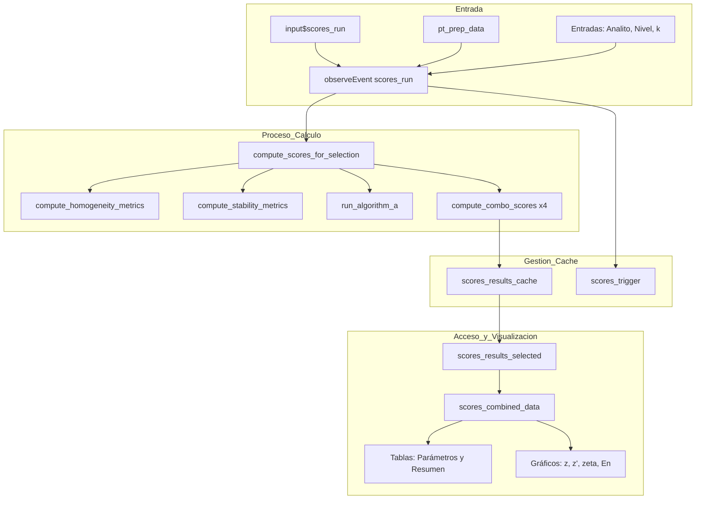

# Módulo Shiny: Puntajes PT

## Descripción General

El módulo de **Puntajes PT** es el motor analítico central para la evaluación de participantes en el ensayo de aptitud. Este módulo orquestra el cálculo de todos los puntajes de desempeño ($z, z', \zeta, E_n$) definidos en la normativa ISO 13528:2022 y proporciona visualizaciones interactivas para interpretar los resultados.

| Propiedad | Valor |
|-----------|-------|
| **Archivo** | `cloned_app.R` |
| **Pestaña UI** | `tabPanel("Puntajes PT")` |
| **Líneas (aprox.)** | 948-982 (UI), 1720-2136 (Lógica) |
| **Norma de Referencia** | ISO 13528:2022 Sección 9 y Anexo D |
| **Dependencias** | `pt_prep_data()`, `scores_results_cache()`, `scores_trigger()` |

---

## Mapa de Componentes UI

El módulo utiliza una interfaz dinámica que permite filtrar por contaminante, esquema y nivel de concentración.

| Elemento UI | ID de Entrada | ID de Salida | Tipo | Descripción |
|-------------|---------------|--------------|------|-------------|
| **Selector Analito** | `scores_pollutant` | `scores_pollutant_selector` | `selectInput` | Filtra por contaminante (CO, NO2, etc.) |
| **Selector Esquema** | `scores_n_lab` | `scores_n_selector` | `selectInput` | Selecciona el esquema PT (número de labs) |
| **Selector Nivel** | `scores_level` | `scores_level_selector` | `selectInput` | Selecciona el nivel de concentración |
| **Factor k** | `k_factor_input` | - | `numericInput` | Factor de cobertura para incertidumbre (def: 2) |
| **Botón Calcular** | `scores_run` | - | `actionButton` | Dispara el proceso de cálculo |
| **Tabla Parámetros** | - | `scores_parameter_table` | `tableOutput` | Resumen de $x_{pt}$, $\sigma_{pt}$, $u(x_{pt})$ por método |
| **Tabla Puntajes** | - | `scores_overview_table` | `dataTableOutput` | Puntajes detallados por participante |
| **Resumen Evaluación**| - | `scores_evaluation_summary` | `tableOutput` | Conteo de participantes por categoría |
| **Panel de Gráficos** | - | `z/zprime/zeta/en_scores_panel` | `uiOutput` | Visualizaciones dinámicas (Lollipop/Barra) |

---

## Flujo de Datos y Lógica Reactiva

El módulo implementa un sistema de caché reactiva para optimizar el rendimiento y evitar recálculos innecesarios al cambiar entre pestañas de visualización.

---

## Integración con ptcalc

El módulo depende de las funciones estadísticas implementadas en el paquete `ptcalc`:

*   `ptcalc::calculate_z_score()`: Cálculo de puntaje z.
*   `ptcalc::calculate_z_prime_score()`: Cálculo de puntaje z'.
*   `ptcalc::calculate_zeta_score()`: Cálculo de puntaje zeta.
*   `ptcalc::calculate_en_score()`: Cálculo de puntaje En.
*   `ptcalc::evaluate_z_score_vec()`: Evaluación vectorizada de z, z' y zeta.
*   `ptcalc::evaluate_en_score_vec()`: Evaluación vectorizada de En.
*   `ptcalc::run_algorithm_a()`: Estimación robusta iterativa para valor asignado (Método 3).
*   `ptcalc::calculate_niqr()`: Cálculo de la desviación estándar robusta nIQR.

---

## Funciones Principales (Análisis Detallado)

### 1. `compute_scores_for_selection()`
Esta función es el orquestador principal del cálculo. Realiza los siguientes pasos:

1.  **Filtrado**: Filtra los datos consolidados por analito, esquema y nivel.
2.  **Homogeneidad**: Obtiene parámetros de homogeneidad ($s_s$, $s_w$) vía `compute_homogeneity_metrics()`. Calcula $u_{hom} = s_s$.
3.  **Estabilidad**: Obtiene parámetros de estabilidad vía `compute_stability_metrics()`. Calcula $u_{stab} = |y_1 - y_2| / \sqrt{3}$.
4.  **Datos de Participantes**: Prepara el marco de datos (dataframe) excluyendo el valor de referencia ("ref") y calcula la incertidumbre estándar del participante ($u_i$).
5.  **Estadísticos de Consenso**: Calcula mediana, MADe y nIQR.
6.  **Algoritmo A**: Ejecuta el Algoritmo A de la ISO 13528 si $n \ge 3$.
7.  **Cálculo Multimétodo**: Llama a `compute_combo_scores()` para los 4 métodos de valor asignado:
    *   **Referencia** (Método 1).
    *   **Consenso MADe** (Método 2a).
    *   **Consenso nIQR** (Método 2b).
    *   **Algoritmo A** (Método 3).

### 2. `compute_combo_scores()`
Calcula todos los puntajes para un método específico.

**Fórmulas Implementadas:**

| Puntaje | Fórmula | Criterio de Satisfacción |
|---------|---------|--------------------------|
| **z** | $(x_i - x_{pt}) / \sigma_{pt}$ | $|z| \le 2$ |
| **z'** | $(x_i - x_{pt}) / \sqrt{\sigma_{pt}^2 + u_{xpt,def}^2}$ | $|z'| \le 2$ |
| **zeta ($\zeta$)** | $(x_i - x_{pt}) / \sqrt{u_i^2 + u_{xpt,def}^2}$ | $|\zeta| \le 2$ |
| **En** | $(x_i - x_{pt}) / \sqrt{U_i^2 + U_{xpt}^2}$ | $|En| \le 1$ |

*Donde:*
*   $u_{xpt,def} = \sqrt{u_{xpt}^2 + u_{hom}^2 + u_{stab}^2}$
*   $U_i = k \times u_i$
*   $U_{xpt} = k \times u_{xpt,def}$

### 3. `plot_scores()`
Genera gráficos de tipo "Lollipop" o barras usando `ggplot2` y los convierte a `plotly` para interactividad.
*   **Zonas de Control**: Incluye líneas horizontales en $\pm 2$ y $\pm 3$ (para z) o $\pm 1$ (para En).
*   **Codificación de Colores**: Basada en la evaluación del puntaje.

---

## Sistema de Clasificación (a1-a7)

El módulo implementa una clasificación combinada **z + En** para proporcionar una visión integral del desempeño:

| Código | Clasificación | Criterio z | Criterio En | Color Sugerido |
|--------|---------------|------------|-------------|----------------|
| **a1** | Totalmente satisfactorio | $|z| \le 2$ | $|En| \le 1$ | Verde Oscuro |
| **a2** | Satisfactorio pero conservador | $|z| \le 2$ | $|En| \ll 1$ | Verde Claro |
| **a3** | Satisfactorio con MU subestimada | $|z| \le 2$ | $|En| > 1$ | Verde Lima |
| **a4** | Cuestionable pero aceptable | $2 < |z| < 3$ | $|En| \le 1$ | Amarillo Claro |
| **a5** | Cuestionable e inconsistente | $2 < |z| < 3$ | $|En| > 1$ | Amarillo Oscuro |
| **a6** | No satisfactorio pero MU cubre | $|z| \ge 3$ | $|En| \le 1$ | Rosa |
| **a7** | No satisfactorio (crítico) | $|z| \ge 3$ | $|En| > 1$ | Rojo Oscuro |

---

## Estrategia de Cache

Para evitar recálculos costosos, se utiliza un `reactiveVal` llamado `scores_results_cache`.

*   **Clave de Cache**: `analito||esquema||nivel` (ej: "CO||4||alto").
*   **Invalidación**: El caché se limpia automáticamente (`NULL`) si se cargan nuevos datos o si el usuario presiona explícitamente el botón "Calcular Puntajes".
*   **Optimización**: Al cambiar de pestaña (ej: de z-score a En-score), la UI accede directamente al caché, garantizando una respuesta instantánea.

---

## Estados de Error Comunes

| Mensaje | Causa |
|---------|-------|
| "Calcule los puntajes..." | `scores_trigger()` es NULL (botón no presionado). |
| "No se encontraron datos..." | Filtro de combinación analito/nivel vacío. |
| "No se encontró info de referencia" | Falta el participante con ID "ref" en los datos. |
| "Se requieren al menos 3 participantes" | $n < 3$ para el Algoritmo A. |

---

## Referencias

*   **ISO 13528:2022**: Statistical methods for use in proficiency testing by interlaboratory comparison.
*   **ISO/IEC 17043:2024**: Conformity assessment — General requirements for the competence of proficiency testing providers.
*   **Documentación Relacionada**:
    *   [05_pt_scores.md](05_pt_scores.md): Teoría de puntajes.
    *   [07_valor_asignado.md](07_valor_asignado.md): Métodos de asignación de valor.
    *   [01_carga_datos.md](01_carga_datos.md): Formatos de entrada de datos.
