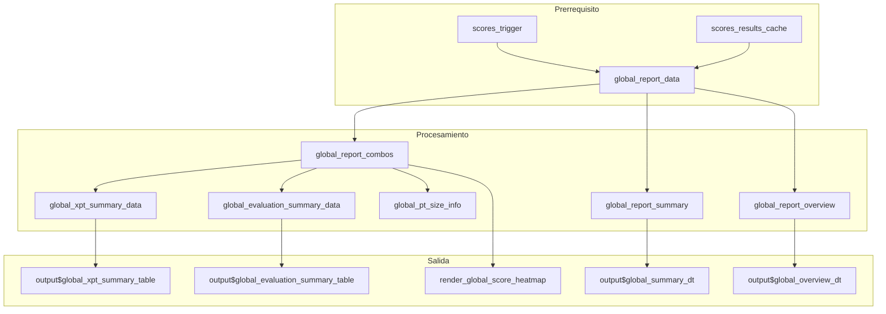

# Módulo: Informe Global

## Descripción General

El módulo de **Informe Global** proporciona una vista consolidada y de alto nivel de los resultados de todo el esquema de ensayos de aptitud (PT). Agrega los resultados de todos los contaminantes, niveles y laboratorios participantes en mapas de calor interactivos y tablas de resumen estadístico.

Este módulo implementa las directrices de la norma **ISO 13528:2022 Sección 10** (Informe del proveedor de PT) e **ISO 17043:2024 Sección 7** (Presentación de resultados).

| Propiedad | Valor |
|-----------|-------|
| **Archivo** | `cloned_app.R` |
| **Pestaña UI** | `tabPanel("Informe global")` |
| **Ubicación UI** | Líneas 984-1084 |
| **Lógica del Servidor** | Líneas 2138-2478 |
| **Dependencias** | `scores_trigger()`, `scores_results_cache()` |

---

## Mapa de Componentes UI

### Entradas
| Elemento UI | ID de Entrada | Tipo | Descripción |
|-------------|--------------|------|-------------|
| Selector de Analito | `global_report_pollutant` | `selectInput` | Filtra por contaminante (CO, NO, NO2, etc.) |
| Selector de Esquema | `global_report_n_lab` | `selectInput` | Filtra por esquema PT (n_lab) |
| Selector de Nivel | `global_report_level` | `selectInput` | Filtra por nivel de concentración |
| Filtro de Método | `global_method_filter` | `selectInput` | Filtra por método de valor asignado (1, 2a, 2b, 3) |

### Salidas
| Elemento UI | ID de Salida | Tipo | Descripción |
|-------------|---------------|------|-------------|
| Información de tamaño PT | `global_report_pt_size_info` | `uiOutput` | Muestra número de participantes y referencia |
| Tabla x_pt | `global_xpt_summary_table` | `dataTableOutput` | Resumen de valores asignados y parámetros |
| Tabla de Evaluaciones | `global_evaluation_summary_table` | `dataTableOutput` | Conteo de resultados por categoría (Satisfactorio, etc.) |
| Tabla de Resumen DT | `global_summary_dt` | `dataTableOutput` | Tabla general de parámetros estadísticos |
| Tabla General DT | `global_overview_dt` | `dataTableOutput` | Tabla detallada de puntajes por participante |
| Mapas de Calor z/z'/ζ/En | `global_heatmap_*_ref` | `plotlyOutput` | Mapas de calor interactivos por método y tipo de puntaje |

---

## Arquitectura y Flujo de Datos

El módulo utiliza un canal de agregación que recolecta datos del caché de resultados de puntajes.

### Canal de Agregación
1.  **Activación:** El reactivo `global_report_data()` se activa cuando cambian los puntajes calculados.
2.  **Recolección:** Itera sobre todos los contaminantes y niveles disponibles en `scores_results_cache`.
3.  **Filtrado:** Excluye automáticamente al laboratorio de referencia (`participant_id == "ref"`) de los cálculos de desempeño para evitar sesgos de autocomparación.
4.  **Transformación:** Pivotea los datos a un formato de matriz adecuado para visualizaciones (Filas: Participantes, Columnas: Niveles).

### Diagrama de Flujo Reactivo


---

## Reactivos Principales

### `global_report_data()`
Agrega todos los resultados de puntajes del caché en estructuras unificadas.

**Estructura de Retorno:**
```r
list(
  error = NULL,         # Mensaje de error si no hay datos
  summary = tibble(),   # Resumen de parámetros por combinación
  overview = tibble(),  # Puntajes detallados por participante
  combos = tibble(),    # Datos completos para visualización
  errors = tibble()     # Registro de errores encontrados en el proceso
)
```

### `global_report_summary()`
Genera la tabla de resumen estadístico incluyendo:
- Parámetros $x_{pt}$ y $\sigma_{pt}$.
- Incertidumbres estándar y expandidas.
- Tasa de aprobación (Pass Rate %):
  $$\text{Tasa de Aprobación} = \frac{\text{Conteo}(|z| \le 2)}{\text{Total de Participantes}} \times 100$$

### `global_report_combos()`
Identifica y normaliza las combinaciones válidas de datos (contaminante, esquema, nivel, método) para asegurar que los selectores y visualizaciones siempre muestren datos existentes.

---

## Visualizaciones: Mapas de Calor

Los mapas de calor permiten identificar rápidamente tendencias de desempeño y posibles problemas sistemáticos.

### Lógica de Generación (`render_global_score_heatmap`)
1.  Filtra los datos según la selección del usuario (Analito, Esquema, Nivel, Método).
2.  Crea una cuadrícula (grid) base de Participante vs. Nivel.
3.  Asocia cada celda con su evaluación correspondiente (Satisfactorio, Cuestionable, No satisfactorio).
4.  Genera el gráfico usando `ggplot2::geom_tile()` y lo convierte a interactivo con `plotly::ggplotly()`.

### Paleta de Colores (Sistema de Semáforo)

| Evaluación | Puntaje z / z' / ζ | Puntaje $E_n$ | Color | Hex |
|------------|---------------------|---------------|-------|-----|
| **Satisfactorio** | $|z| \le 2$ | $|E_n| \le 1$ | Verde | `#00B050` |
| **Cuestionable** | $2 < |z| \le 3$ | - | Amarillo | `#FFEB3B` |
| **No satisfactorio** | $|z| > 3$ | $|E_n| > 1$ | Rojo | `#D32F2F` |
| **N/A** | Sin datos | Sin datos | Gris | `#BDBDBD` |

*Nota: Para el puntaje $E_n$, solo existen dos estados (Satisfactorio y No satisfactorio), mapeando "Cuestionable" también a rojo.*

---

## Estructura de Pestañas del Módulo

### 1. Resumen Global
- **Vista consolidada**: Muestra tablas con los valores asignados y estadísticas de desempeño para todas las combinaciones activas.
- **Resumen de Evaluaciones**: Conteo porcentual de laboratorios en cada categoría de desempeño.

### 2-5. Pestañas por Método
Existen pestañas específicas para cada método de valor asignado configurado en el módulo de [Puntajes PT](09_puntajes_pt.md):
- **Referencia (1)**: Basado en el valor del laboratorio de referencia.
- **Consenso MADe (2a)**: Basado en la mediana y desviación estándar robusta (MADe).
- **Consenso nIQR (2b)**: Basado en la mediana y el rango intercuartílico normalizado.
- **Algoritmo A (3)**: Basado en el Algoritmo A de la ISO 13528.

Cada una incluye sus propios parámetros ($x_{pt}, \sigma_{pt}, u(x_{pt})$) y una cuadrícula de 2x2 con los mapas de calor para los cuatro tipos de puntajes.

---

## Estados de Error y Mensajes

| Estado | Mensaje | Causa Probable |
|--------|---------|----------------|
| Sin cálculo | "Calcule los puntajes para habilitar el reporte global" | El usuario no ha ejecutado el cálculo en la pestaña "PT Scores". |
| Sin resultados | "No se generaron resultados globales" | El caché de resultados está vacío. |
| Sin datos | "No hay datos disponibles para esta combinación" | El filtro aplicado no coincide con ningún dato procesado. |

---

## Consideraciones de Rendimiento
- **Generación Dinámica**: Los mapas de calor se renderizan solo cuando la pestaña correspondiente es visible.
- **Reactividad Eficiente**: El filtrado por contaminante y nivel reduce drásticamente el volumen de datos procesados por Plotly.
- **Normalización**: Se realiza una normalización de tipos de datos (especialmente `n_lab`) para asegurar la consistencia al unir tablas de diferentes esquemas.

---

## Referencias Normativas
- **ISO 13528:2022**: Statistical methods for use in proficiency testing by interlaboratory comparison.
- **ISO/IEC 17043:2024**: Conformity assessment — General requirements for the competence of proficiency testing providers.
