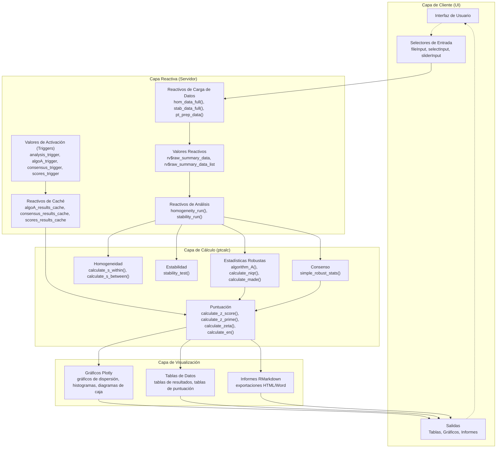
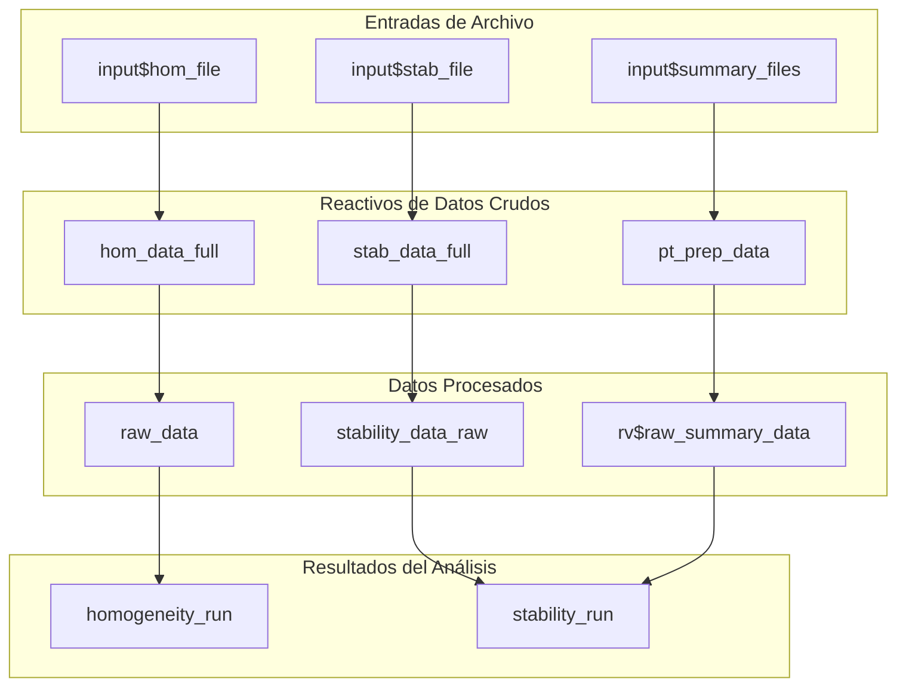
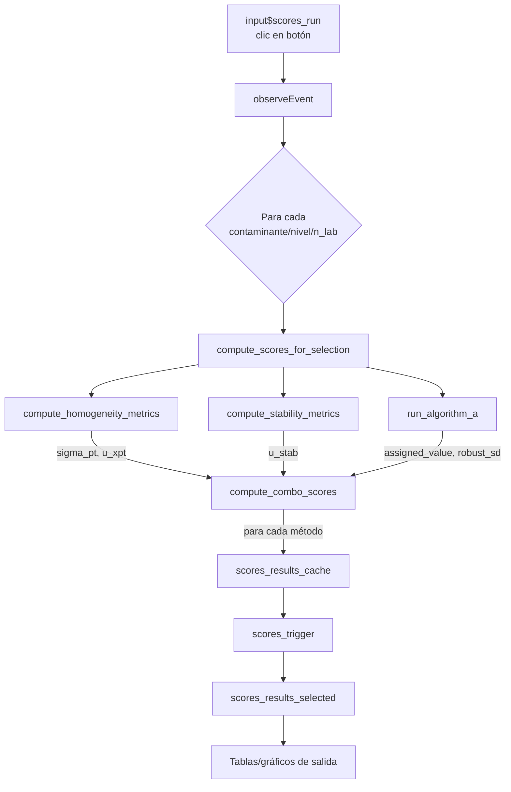
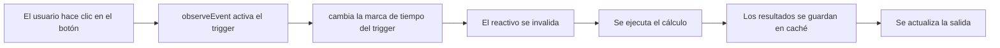
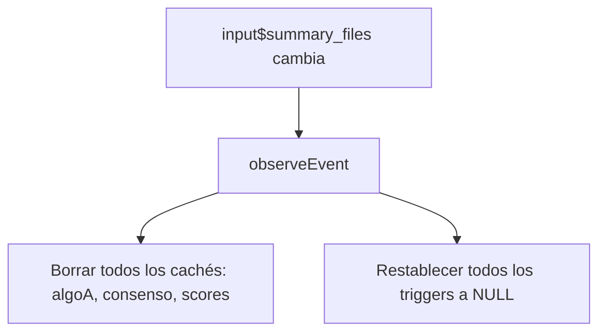
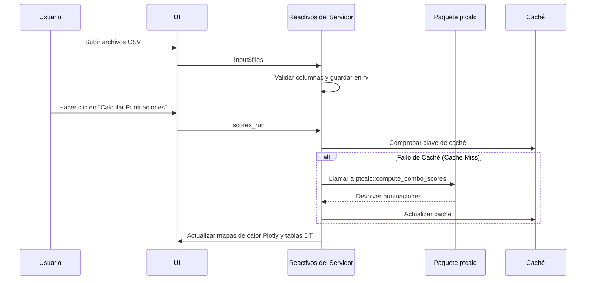

# 15. Arquitectura del Sistema: Análisis Profundo

| Propiedad | Valor |
|----------|-------|
| **Tipo de Documento** | Referencia de Arquitectura |
| **Archivo Principal** | `app.R` (anteriormente `cloned_app.R`) (aprox. 5,184 líneas) |
| **Paquete** | `ptcalc/` |
| **Arquitectura** | MVC (Modelo-Vista-Controlador) con Programación Reactiva |
| **Documentos Relacionados** | `02_ptcalc_package.md`, `README.md`, `01_carga_datos.md`, `03_pt_robust_stats.md`, `05_pt_scores.md` |

---

## 1. Descripción General

La aplicación PT sigue una **separación clara de responsabilidades** y una arquitectura simplificada de **Modelo-Vista-Controlador (MVC)**:

*   **Vista (UI):** Definida usando `fluidPage` con el estilo de `bslib`. Gestiona la interfaz de usuario y los componentes de entrada/salida.
*   **Controlador (Servidor):** Manejadores de eventos reactivos en `app.R` que orquestan las funciones del paquete, gestionan el estado y manejan los eventos del usuario.
*   **Modelo (Lógica/Datos):** 
    *   **`ptcalc/`**: Un paquete R puro que contiene funciones matemáticas y lógica de negocio (sin dependencias de Shiny).
    *   **Procesadores de Datos Reactivos**: Reactivos internos en la lógica del servidor que manejan la transformación y agregación de datos.

### Beneficios Clave
- **Pruebas Unitarias**: Los cálculos pueden probarse independientemente de la UI a través del paquete `ptcalc`.
- **Reutilización**: Las funciones de `ptcalc` pueden usarse en otros contextos como scripts o informes automatizados.
- **Rendimiento**: Los límites claros permiten una optimización específica y estrategias de almacenamiento en caché.

---

## 2. Gráficos de Dependencia

### 2.1 Gráfico Completo de Dependencias Reactivas
Este gráfico ilustra el flujo desde las entradas del lado del cliente a través de la capa reactiva hasta el paquete de cálculo central y finalmente a la capa de visualización.



### 2.2 Flujo de Datos Primario


### 2.3 Cadena de Cálculo de Puntuaciones


---

## 3. Estructura de la Función del Servidor

La función del servidor está organizada en secciones lógicas que cubren la carga de datos, el procesamiento y la lógica específica del módulo.

| Sección | Líneas (aprox.) | Propósito |
|---------|-----------------|-----------|
| **Carga de Datos** | 80-160 | Reactivos de carga de archivos y validación (`hom_data_full`, `stab_data_full`, `pt_prep_data`) |
| **Configuración de Triggers/Caché** | 161-224 | Definiciones de triggers, inicialización de caché y manejadores de reinicio |
| **Funciones Auxiliares** | 226-638 | Lógica interna para la conversión de datos anchos y cálculo de métricas |
| **Manejador del Algoritmo A** | 642-715 | `observeEvent(input$algoA_run)` - estimación robusta iterativa |
| **Diseño Dinámico de la UI** | 717-1165 | Renderizado de `output$main_layout` con navlistPanel adaptativo |
| **Homogeneidad/Estabilidad** | 1168-1390 | Reactivos de análisis central y salidas de incertidumbre |
| **Tablas de Incertidumbre** | 1291-1389 | Generación de `u_hom_data` y `u_stab_data` |
| **Salidas de Previsualización** | 1391-1718 | Tablas, histogramas y pantallas de validación |
| **Módulo de Puntuaciones PT** | 1720-2255 | Selectores de puntuación y lógica de cálculo multimetodo |
| **Módulo de Informe Global** | 2256-3237 | Mapas de calor agregados, tablas resumen y clasificación |
| **Módulo de Participantes** | 3238-3746 | Vistas individuales de laboratorios y gráficos de rendimiento |
| **Generación de Informes** | 3748-4690 | Renderizado RMarkdown y `downloadHandler` |
| **Módulo de Valor Asignado** | 4715-5042 | Controles manuales para valores de consenso y de referencia |
| **Módulo de Valores Atípicos** | 5114-5176 | Visualización y análisis de la prueba de Grubbs |

---

## 4. Gestión del Estado

La aplicación utiliza mecanismos específicos para gestionar el estado y garantizar el rendimiento.

### 4.1 Valores Reactivos (`rv`)
Se utilizan para almacenar un estado mutable que necesita persistir a través de las evaluaciones reactivas o ser modificado dentro de los observadores.

| Variable | Tipo | Propósito | Actualizado Por |
|----------|------|-----------|-----------------|
| `rv$raw_summary_data` | `data.frame` | Datos resumen combinados de todos los archivos subidos | `pt_prep_data()` |
| `rv$raw_summary_data_list` | `list` | Dataframes individuales (uno por archivo subido) | `pt_prep_data()` |

### 4.2 Patrón Trigger-Caché
Para cálculos costosos (como el Algoritmo A o la puntuación de múltiples esquemas), la aplicación utiliza un **patrón trigger-caché**. Esto evita recálculos innecesarios y otorga al usuario un control explícito.



#### Implementación del Trigger-Caché
1. **Inicializar**: `scores_results_cache <- reactiveVal(NULL)` y `scores_trigger <- reactiveVal(NULL)`.
2. **Activación (Trigger)**: El usuario hace clic en ejecutar -> calcular todo -> `scores_results_cache(results)` -> `scores_trigger(Sys.time())`.
3. **Compuerta (Gate)**: Los reactivos de resultado usan `req(scores_trigger())` para esperar la acción explícita del usuario.

#### Pares Principales de Trigger-Caché
| Trigger | Caché | Propósito |
|---------|-------|-----------|
| `analysis_trigger()` | - | Ejecución de homogeneidad/estabilidad |
| `algoA_trigger()` | `algoA_results_cache()` | Resultados iterativos del Algoritmo A |
| `consensus_trigger()` | `consensus_results_cache()` | Estadísticas robustas (MADe/nIQR) |
| `scores_trigger()` | `scores_results_cache()` | Puntuaciones PT finales (z, z', zeta, En) |

### 4.3 Invalidación de Caché
Cuando los archivos resumen cambian, todos los cachés aguas abajo se borran automáticamente para evitar datos obsoletos:


---

## 5. Optimización del Rendimiento

### 1. Procesamiento por Lotes
En lugar de actualizaciones reactivas individuales, todas las combinaciones se procesan en un solo bucle durante el clic de un botón:
```r
observeEvent(input$algoA_run, {
  combos <- unique(data[, c("pollutant", "n_lab", "level")])
  results <- list()
  for (i in seq_len(nrow(combos))) {
    key <- paste(combos$pollutant[i], combos$n_lab[i], combos$level[i], sep = "||")
    results[[key]] <- run_algorithm_a(...)
  }
  algoA_results_cache(results) # Actualización única
})
```

### 2. Búsquedas de Clave Compuesta
Utiliza el formato `pollutant||n_lab||level` para un acceso a caché O(1) en lugar de costosos filtrados de dataframes.

### 3. Aislamiento Reactivo
Utiliza `isolate()` para evitar la re-ejecución al leer valores que no deberían activar actualizaciones.

### 4. Renderizado y Carga
- **vroom**: Utiliza `vroom::vroom` para una lectura rápida y diferida (lazy) de archivos CSV.
- **DataTables**: Implementa el procesamiento del lado del servidor (`server = TRUE`) para tablas receptivas con grandes conjuntos de datos.
- **Vectorización**: Las funciones principales en `ptcalc` están vectorizadas para minimizar los bucles a nivel de R.

---

## 6. Arquitectura de Manejo de Errores

### 1. Capas de Validación
- **Validación de Entrada**: Restricciones en la UI y `validate(need())` para errores de cara al usuario.
- **Validación Reactiva**: Comprueba la disponibilidad de datos antes del procesamiento (`req()`).
- **Validación Matemática**: Verificaciones internas en `ptcalc` para datos suficientes (por ejemplo, $n \ge 3$ para el Algoritmo A).

### 2. Patrón de Lista de Errores
Las funciones devuelven una lista estructurada que contiene tanto el resultado como un mensaje de error opcional:
```r
# Patrón
list(result = calculation, error = NULL)
# En caso de fallo
list(result = NULL, error = "Réplicas insuficientes...")
```

### 3. Flujo de Propagación de Errores
```
Error de Usuario -> Validación UI -> Compuerta Reactiva -> Verificación del Paquete -> Visualización de Error Estructurado
```

---

## 7. Integración del Paquete ptcalc

El paquete `ptcalc` sirve como núcleo matemático.

### 7.1 Funciones Clave Exportadas
| Categoría | Funciones |
|-----------|-----------|
| **Estadísticas Robustas** | `calculate_niqr()`, `calculate_mad_e()`, `run_algorithm_a()` |
| **Homogeneidad** | `calculate_homogeneity_stats()`, `evaluate_homogeneity()`, `calculate_u_hom()` |
| **Estabilidad** | `calculate_stability_stats()`, `evaluate_stability()`, `calculate_u_stab()` |
| **Puntuaciones** | `calculate_z_score()`, `calculate_z_prime()`, `calculate_zeta()`, `calculate_en()` |
| **Evaluación** | `evaluate_z_score_vec()`, `evaluate_en_score_vec()`, `classify_with_en()` |

### 7.2 Método de Integración
La aplicación carga el paquete al inicio mediante `library(ptcalc)`. Durante el desarrollo, se utiliza `devtools::load_all("ptcalc")` para sincronizar los cambios.

---

## 8. Secuencia del Flujo de Datos


---

## 9. Concurrencia e Hilos
- **Estado Actual**: La aplicación es de un solo hilo. Shiny gestiona la cola reactiva.
- **Gestión del Rendimiento**: El trabajo pesado se mitiga mediante el patrón Trigger-Caché y el procesamiento por lotes en lugar de la paralelización.
- **Oportunidad Futura**: Implementación de `future` y `promises` para el análisis independiente de contaminantes.

---

## 10. Ver También
- [01_carga_datos.md](01_carga_datos.md) - Cadenas detalladas de carga de datos.
- [03_pt_robust_stats.md](03_pt_robust_stats.md) - Detalles de implementación del Algoritmo A.
- [02a_ptcalc_api.md](02a_ptcalc_api.md) - Referencia completa de la API del paquete.
- [09_puntajes_pt.md](09_puntajes_pt.md) - Implementación del módulo de puntuación.
