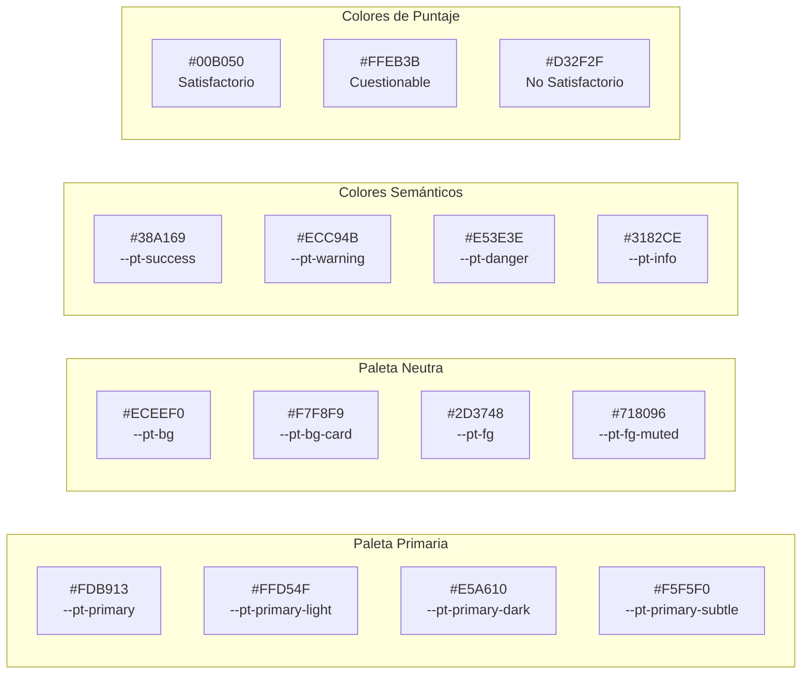
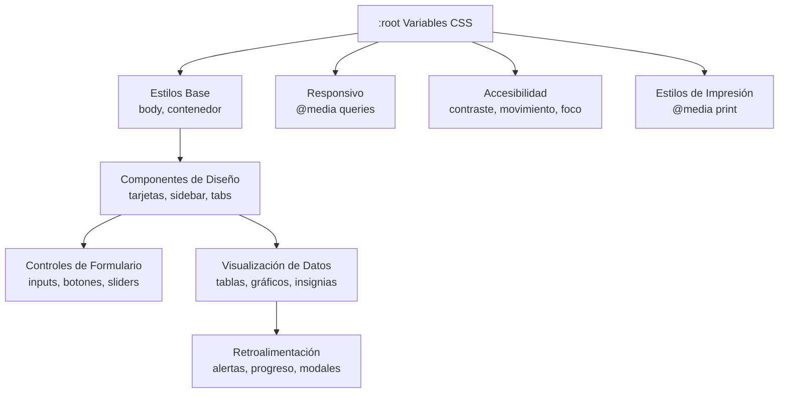

# 18. Estilos de UI y Arquitectura CSS

| Propiedad | Valor |
|-----------|-------|
| **Tipo de Documento** | Referencia UI/CSS |
| **Archivo Principal** | `www/appR.css` (913 líneas) |
| **Framework** | CSS3 con Propiedades Personalizadas |
| **Sistema de Diseño** | Tema PT Personalizado (Primario: #FDB913) |
| **Documentos Relacionados** | `15_architecture.md`, `16_customization.md`, `README.md` |

---

## 1. Descripción General

La aplicación PT utiliza un tema CSS personalizado (`www/appR.css`) que proporciona una apariencia moderna, accesible y profesional. La hoja de estilos está organizada en secciones lógicas y utiliza Propiedades Personalizadas de CSS (variables) para una tematización consistente y fácil personalización.

### Características Principales
- **Diseño Moderno**: Estética limpia con sombras sutiles y gradientes
- **Tematización Consistente**: Variables CSS para colores, espaciado y tipografía
- **Diseño Responsivo**: Puntos de quiebre adaptados a móviles
- **Accesibilidad**: Modo de alto contraste, movimiento reducido y soporte de foco para teclado
- **Rendimiento**: Transiciones optimizadas y repintados mínimos

### Ubicación del Archivo
```
pt_app/
└── www/
    └── appR.css    # Hoja de estilos principal (913 líneas)
```

### Carga en Shiny
El CSS se carga automáticamente cuando se coloca en `www/`. Se incluye en la aplicación mediante:
```r
# En la definición de UI en app.R
fluidPage(
  theme = bs_theme(...),  # Tema base bslib
  includeCSS("www/appR.css"),  # Sobrescrituras personalizadas
  ...
)
```

---

## 2. Arquitectura CSS

### 2.1 Estructura de Secciones

| Sección | Líneas | Propósito |
|---------|--------|-----------|
| **Variables CSS** | 1-61 | Propiedades personalizadas para tematización |
| **Estilos Base** | 63-83 | Valores predeterminados de body y contenedor |
| **Tipografía** | 84-130 | Encabezados, párrafos, enlaces |
| **Líneas Horizontales** | 132-140 | Separadores decorativos |
| **Tarjetas y Paneles** | 142-175 | Estilos de well, card, panel |
| **Barra Lateral** | 177-191 | Barra lateral de navegación |
| **Pestañas de Navegación** | 193-269 | Tabs, pills, paneles navlist |
| **Controles de Formulario** | 271-399 | Inputs, selects, sliders, carga de archivos |
| **Botones** | 401-472 | Botones de acción, variantes de botones |
| **Tablas** | 474-563 | DataTables, estilos de tabla |
| **Alertas y Notificaciones** | 565-602 | Notificaciones Shiny, alertas |
| **Barras de Progreso** | 604-618 | Indicadores de progreso |
| **Insignias de Puntaje** | 620-651 | Indicadores de estado de puntaje PT |
| **Gráficos** | 653-663 | Gráficos Shiny, contenedores Plotly |
| **Modales** | 667-699 | Diálogos modales |
| **Tooltips** | 701-709 | Estilos de tooltip |
| **Diseño Responsivo** | 711-735 | Puntos de quiebre móviles |
| **Estilos de Impresión** | 737-759 | Sobrescrituras para impresión |
| **Accesibilidad** | 761-807 | Foco, lectores de pantalla, contraste |
| **Cajas de Valor/KPI** | 809-844 | Componentes de tarjeta KPI |
| **Pie de Página** | 846-857 | Pie de página de la aplicación |
| **Barras de Desplazamiento** | 859-886 | Estilos personalizados de scrollbar |
| **RHandsontable** | 888-913 | Estilos del componente de hoja de cálculo |

---

## 3. Variables CSS (Propiedades Personalizadas)

El tema utiliza Propiedades Personalizadas de CSS definidas en `:root` para estilos consistentes en todos los componentes.

### 3.1 Paleta de Colores

```css
:root {
  /* Colores Primarios - Amarillo de Marca */
  --pt-primary: #FDB913;        /* Color principal de marca */
  --pt-primary-light: #FFD54F;  /* Estados hover */
  --pt-primary-dark: #E5A610;   /* Estados activos */
  --pt-primary-subtle: #F5F5F0; /* Fondos */
  
  /* Colores Neutros - Paleta Gris */
  --pt-bg: #ECEEF0;             /* Fondo de página */
  --pt-bg-card: #F7F8F9;        /* Fondos de tarjetas */
  --pt-fg: #2D3748;             /* Texto primario */
  --pt-fg-muted: #718096;       /* Texto secundario */
  --pt-border: #CBD5E0;         /* Color de borde */
  --pt-border-focus: #FDB913;   /* Borde de foco */
  
  /* Secundario y Acento */
  --pt-secondary: #1A202C;      /* Texto oscuro/encabezados */
  --pt-success: #38A169;        /* Estados de éxito */
  --pt-warning: #ECC94B;        /* Estados de advertencia */
  --pt-danger: #E53E3E;         /* Estados de error */
  --pt-info: #3182CE;           /* Estados informativos */
  
  /* Colores de Estado de Puntaje (ISO 13528) */
  --pt-satisfactory: #00B050;   /* |z| ≤ 2.0 */
  --pt-questionable: #FFEB3B;   /* 2.0 < |z| < 3.0 */
  --pt-unsatisfactory: #D32F2F; /* |z| ≥ 3.0 */
}
```

### 3.2 Efectos Visuales

```css
:root {
  /* Sombras - Niveles de profundidad */
  --shadow-xs: 0 1px 2px rgba(0, 0, 0, 0.06);
  --shadow-sm: 0 2px 4px rgba(0, 0, 0, 0.08);
  --shadow-md: 0 4px 12px rgba(0, 0, 0, 0.10);
  --shadow-lg: 0 8px 24px rgba(0, 0, 0, 0.14);
  --shadow-focus: 0 0 0 3px rgba(253, 185, 19, 0.3);
  
  /* Radio de Borde */
  --radius-sm: 6px;   /* Elementos pequeños */
  --radius-md: 8px;   /* Botones, inputs */
  --radius-lg: 12px;  /* Tarjetas, paneles */
  --radius-xl: 16px;  /* Contenedores grandes */
  
  /* Transiciones */
  --transition-fast: 150ms ease;
  --transition-normal: 250ms ease;
  --transition-slow: 350ms cubic-bezier(0.4, 0, 0.2, 1);
}
```

### 3.3 Escala de Espaciado

```css
:root {
  --space-xs: 0.25rem;   /* 4px */
  --space-sm: 0.5rem;    /* 8px */
  --space-md: 1rem;      /* 16px */
  --space-lg: 1.5rem;    /* 24px */
  --space-xl: 2rem;      /* 32px */
  --space-xxl: 3rem;     /* 48px */
}
```

---

## 4. Estilos de Componentes

### 4.1 Estilos Base

```css
body {
  background-color: var(--pt-bg);
  color: var(--pt-fg);
  font-family: 'Droid Sans', -apple-system, BlinkMacSystemFont, 
               'Segoe UI', Roboto, 'Helvetica Neue', Arial, sans-serif;
  font-size: 0.9375rem;  /* 15px */
  line-height: 1.6;
  -webkit-font-smoothing: antialiased;
}

.container-fluid {
  max-width: 1600px;
  margin: 0 auto;
  padding: var(--space-lg) var(--space-xl);
}
```

### 4.2 Tarjetas y Paneles

Las tarjetas usan un diseño limpio con sombras sutiles y efectos hover:

```css
.well, .card, .panel {
  background-color: var(--pt-bg-card);
  border: 1px solid var(--pt-border);
  border-radius: var(--radius-lg);
  box-shadow: var(--shadow-sm);
  padding: var(--space-lg);
  transition: box-shadow var(--transition-normal);
}

.well:hover, .card:hover {
  box-shadow: var(--shadow-md);
}

.card-header {
  background: linear-gradient(135deg, 
    var(--pt-primary-subtle) 0%, 
    var(--pt-bg-card) 100%);
  border-bottom: 1px solid var(--pt-border);
}
```

### 4.3 Navegación de Barra Lateral

La barra lateral tiene un distintivo borde de acento amarillo:

```css
.sidebar .well {
  background: linear-gradient(180deg, 
    var(--pt-bg-card) 0%, 
    var(--pt-primary-subtle) 100%);
  border-left: 4px solid var(--pt-primary);
  border-radius: 0 var(--radius-lg) var(--radius-lg) 0;
}
```

### 4.4 Pestañas de Navegación

Las pestañas presentan un subrayado amarillo animado para el estado activo:

```css
.nav-tabs .nav-link.active::after {
  content: '';
  position: absolute;
  bottom: -2px;
  left: 0;
  right: 0;
  height: 3px;
  background: var(--pt-primary);
  border-radius: 3px 3px 0 0;
}

.navlist-panel .nav-link.active {
  background: linear-gradient(90deg, 
    var(--pt-primary) 0%, 
    var(--pt-primary-light) 100%);
  color: var(--pt-secondary);
}
```

### 4.5 Controles de Formulario

Todos los inputs de formulario tienen estilos consistentes con estados de foco:

```css
.form-control, input, select, textarea {
  background-color: var(--pt-bg-card);
  border: 1.5px solid var(--pt-border);
  border-radius: var(--radius-md);
  padding: var(--space-sm) var(--space-md);
  transition: border-color var(--transition-fast), 
              box-shadow var(--transition-fast);
}

.form-control:focus {
  border-color: var(--pt-primary);
  box-shadow: var(--shadow-focus);
  outline: none;
}
```

#### Input de Archivo (Estilo Arrastrar y Soltar)

```css
input[type="file"] {
  padding: var(--space-md);
  background-color: var(--pt-primary-subtle);
  border: 2px dashed var(--pt-primary);
  border-radius: var(--radius-md);
  cursor: pointer;
}

input[type="file"]:hover {
  background-color: var(--pt-primary-light);
  border-color: var(--pt-primary-dark);
}
```

#### Input de Slider (Plugin IRS)

```css
.irs--shiny .irs-bar {
  background: var(--pt-primary);
  border-color: var(--pt-primary);
}

.irs--shiny .irs-handle {
  background: var(--pt-primary);
  border-color: var(--pt-primary-dark);
}
```

### 4.6 Botones

Los botones usan gradientes para profundidad con efectos de elevación al hover:

```css
.btn, button, .action-button {
  font-weight: 500;
  padding: var(--space-sm) var(--space-lg);
  border-radius: var(--radius-md);
  transition: all var(--transition-fast);
}

.btn-primary, .btn-default {
  background: linear-gradient(135deg, 
    var(--pt-primary) 0%, 
    var(--pt-primary-dark) 100%);
  color: var(--pt-secondary);
  box-shadow: var(--shadow-sm);
}

.btn-primary:hover {
  background: linear-gradient(135deg, 
    var(--pt-primary-light) 0%, 
    var(--pt-primary) 100%);
  transform: translateY(-1px);
  box-shadow: var(--shadow-md);
}

.btn-primary:active {
  transform: translateY(0);
  box-shadow: var(--shadow-xs);
}
```

#### Variantes de Botones

| Clase | Color | Caso de Uso |
|-------|-------|-------------|
| `.btn-primary` | Gradiente amarillo | Acciones principales |
| `.btn-success` | Gradiente verde | Confirmaciones |
| `.btn-danger` | Gradiente rojo | Acciones destructivas |
| `.btn-info` | Gradiente azul | Informativas |
| `.btn-secondary` | Contorno gris | Acciones secundarias |

### 4.7 Tablas y DataTables

Las tablas tienen encabezados estilizados con acento amarillo:

```css
.table thead th {
  background: linear-gradient(180deg, 
    var(--pt-primary-subtle) 0%, 
    var(--pt-bg-card) 100%);
  color: var(--pt-secondary);
  font-weight: 600;
  border-bottom: 2px solid var(--pt-primary);
  text-transform: uppercase;
  letter-spacing: 0.03em;
}

.table tbody tr:hover {
  background-color: var(--pt-primary-subtle);
}

/* Filas alternadas */
.table tbody tr:nth-child(even) {
  background-color: rgba(253, 185, 19, 0.03);
}
```

#### Paginación de DataTables

```css
.dataTables_paginate .paginate_button.current,
.dataTables_paginate .paginate_button:hover {
  background: var(--pt-primary) !important;
  color: var(--pt-secondary) !important;
}
```

### 4.8 Insignias de Estado de Puntaje

Estas insignias muestran las clasificaciones de puntaje PT según ISO 13528:

```css
/* Satisfactorio: |z| ≤ 2.0 */
.badge-satisfactory, .status-satisfactory {
  background-color: var(--pt-satisfactory);  /* #00B050 */
  color: white;
  padding: var(--space-xs) var(--space-sm);
  border-radius: var(--radius-sm);
  font-weight: 500;
}

/* Cuestionable: 2.0 < |z| < 3.0 */
.badge-questionable, .status-questionable {
  background-color: var(--pt-questionable);  /* #FFEB3B */
  color: var(--pt-secondary);
}

/* No Satisfactorio: |z| ≥ 3.0 */
.badge-unsatisfactory, .status-unsatisfactory {
  background-color: var(--pt-unsatisfactory);  /* #D32F2F */
  color: white;
}
```

### 4.9 Alertas y Notificaciones

Las notificaciones de Shiny usan bordes izquierdos coloreados:

```css
.alert-success, .shiny-notification-message {
  background-color: #D4EDDA;
  color: #155724;
  border-left: 4px solid var(--pt-success);
}

.alert-warning, .shiny-notification-warning {
  background-color: #FFF3CD;
  color: #856404;
  border-left: 4px solid var(--pt-warning);
}

.alert-danger, .shiny-notification-error {
  background-color: #F8D7DA;
  color: #721C24;
  border-left: 4px solid var(--pt-danger);
}
```

### 4.10 Tarjetas de Valor/KPI

Estilos especiales para visualización de métricas:

```css
.value-box, .kpi-card {
  background: linear-gradient(135deg, 
    var(--pt-bg-card) 0%, 
    var(--pt-primary-subtle) 100%);
  border-radius: var(--radius-lg);
  padding: var(--space-lg);
  text-align: center;
  box-shadow: var(--shadow-md);
  border-left: 4px solid var(--pt-primary);
  transition: transform var(--transition-normal);
}

.value-box:hover {
  transform: translateY(-4px);
  box-shadow: var(--shadow-lg);
}

.value-box .value {
  font-size: 2.5rem;
  font-weight: 700;
  color: var(--pt-primary-dark);
}

.value-box .label {
  font-size: 0.875rem;
  color: var(--pt-fg-muted);
  text-transform: uppercase;
  letter-spacing: 0.05em;
}
```

---

## 5. Diseño Responsivo

### 5.1 Punto de Quiebre Móvil (≤768px)

```css
@media (max-width: 768px) {
  .container-fluid {
    padding: var(--space-md);
  }
  
  .well, .card {
    padding: var(--space-md);
  }
  
  .nav-tabs .nav-link {
    padding: var(--space-xs) var(--space-md);
    font-size: 0.875rem;
  }
  
  .table thead th,
  .table tbody td {
    padding: var(--space-sm);
    font-size: 0.875rem;
  }
}
```

---

## 6. Estilos de Impresión

Para generar informes imprimibles:

```css
@media print {
  body {
    background: white;
  }
  
  /* Ocultar elementos interactivos */
  .btn, .nav-tabs, .dataTables_filter,
  .dataTables_length, .dataTables_paginate {
    display: none !important;
  }
  
  /* Eliminar sombras para impresión más limpia */
  .well, .card, .table {
    box-shadow: none;
    border: 1px solid #ddd;
  }
}
```

---

## 7. Características de Accesibilidad

### 7.1 Indicadores de Foco

```css
:focus-visible {
  outline: 2px solid var(--pt-primary);
  outline-offset: 2px;
}
```

### 7.2 Soporte para Lectores de Pantalla

```css
.sr-only {
  position: absolute;
  width: 1px;
  height: 1px;
  padding: 0;
  margin: -1px;
  overflow: hidden;
  clip: rect(0, 0, 0, 0);
  white-space: nowrap;
  border: 0;
}
```

### 7.3 Modo de Alto Contraste

```css
@media (prefers-contrast: high) {
  :root {
    --pt-border: #333;
    --shadow-sm: none;
    --shadow-md: none;
    --shadow-lg: none;
  }
  
  .btn, .form-control, .well, .card {
    border: 2px solid currentColor;
  }
}
```

### 7.4 Movimiento Reducido

```css
@media (prefers-reduced-motion: reduce) {
  *, *::before, *::after {
    animation-duration: 0.01ms !important;
    animation-iteration-count: 1 !important;
    transition-duration: 0.01ms !important;
  }
}
```

---

## 8. Barras de Desplazamiento Personalizadas

### 8.1 Navegadores WebKit (Chrome, Safari, Edge)

```css
::-webkit-scrollbar {
  width: 10px;
  height: 10px;
}

::-webkit-scrollbar-track {
  background: var(--pt-bg);
  border-radius: var(--radius-sm);
}

::-webkit-scrollbar-thumb {
  background: linear-gradient(180deg, 
    var(--pt-primary-light) 0%, 
    var(--pt-primary) 100%);
  border-radius: var(--radius-sm);
  border: 2px solid var(--pt-bg);
}

::-webkit-scrollbar-thumb:hover {
  background: var(--pt-primary-dark);
}
```

### 8.2 Firefox

```css
* {
  scrollbar-width: thin;
  scrollbar-color: var(--pt-primary) var(--pt-bg);
}
```

---

## 9. Estilos de Componentes de Terceros

### 9.1 RHandsontable (Hoja de Cálculo)

```css
.handsontable {
  font-family: inherit;
}

.handsontable th {
  background: var(--pt-primary-subtle) !important;
  color: var(--pt-secondary) !important;
  font-weight: 600;
}

.handsontable th, .handsontable td {
  border-color: var(--pt-border) !important;
}

/* Resaltado de celda seleccionada */
.handsontable td.current {
  background-color: rgba(253, 185, 19, 0.15) !important;
}

.handsontable td.area {
  background-color: rgba(253, 185, 19, 0.1) !important;
}
```

### 9.2 Menús Desplegables Selectize

```css
.selectize-dropdown {
  border: 1px solid var(--pt-border);
  border-radius: var(--radius-md);
  box-shadow: var(--shadow-md);
}

.selectize-dropdown .option:hover,
.selectize-dropdown .option.active {
  background-color: var(--pt-primary-subtle);
}

.selectize-dropdown .option.selected {
  background-color: var(--pt-primary);
  color: var(--pt-secondary);
}
```

### 9.3 Contenedores Plotly

```css
.shiny-plot-output, .plotly {
  background-color: var(--pt-bg-card);
  border-radius: var(--radius-lg);
  padding: var(--space-md);
  box-shadow: var(--shadow-sm);
  margin-bottom: var(--space-lg);
}
```

---

## 10. Referencia Visual de Componentes

### Diagrama de Paleta de Colores



### Jerarquía de Componentes



---

## 11. Guía de Personalización

### 11.1 Cambiar el Color Primario

Para cambiar el color de marca de amarillo a otro color:

```css
:root {
  /* Ejemplo: Tema azul */
  --pt-primary: #3182CE;
  --pt-primary-light: #63B3ED;
  --pt-primary-dark: #2B6CB0;
  --pt-primary-subtle: #EBF8FF;
  --pt-border-focus: #3182CE;
}
```

### 11.2 Agregar Nuevas Categorías de Puntaje

```css
/* Ejemplo: Agregar un nivel de "Advertencia" */
.badge-warning-level, .status-warning-level {
  background-color: #FF9800;
  color: white;
  padding: var(--space-xs) var(--space-sm);
  border-radius: var(--radius-sm);
  font-weight: 500;
}
```

### 11.3 Crear Cajas de Valor Personalizadas

```css
/* Variante de caja de valor de éxito */
.value-box.success {
  border-left-color: var(--pt-success);
}

.value-box.success .value {
  color: var(--pt-success);
}
```

---

## 12. Solución de Problemas

| Problema | Causa | Solución |
|----------|-------|----------|
| Estilos no se aplican | CSS no cargado | Verificar que `www/appR.css` existe y la ruta es correcta |
| Variables indefinidas | Navegador antiguo | Usar valores de respaldo: `color: #FDB913; color: var(--pt-primary);` |
| Conflictos con bslib | Problemas de especificidad | Agregar `!important` o aumentar especificidad del selector |
| Diseño de impresión roto | Elementos interactivos | Verificar que reglas `@media print` ocultan botones/filtros |
| Scrollbar sin estilos | Firefox | Firefox usa la propiedad `scrollbar-color` |

---

## 13. Consideraciones de Rendimiento

1. **Transiciones**: Limitadas a propiedades rápidas (`transform`, `opacity`, `box-shadow`)
2. **Sombras**: Usar variables CSS para niveles de sombra consistentes
3. **Gradientes**: Aplicados a elementos estáticos, no animados
4. **Efectos Hover**: Transformaciones sutiles (`translateY(-1px)`) en lugar de reflujos costosos

---

## 14. Ver También

- [15_architecture.md](15_architecture.md) - Descripción general de la arquitectura del sistema
- [16_customization.md](16_customization.md) - Personalización de tema y diseño
- [Documentación de bslib](https://rstudio.github.io/bslib/) - Integración de Bootstrap para Shiny
