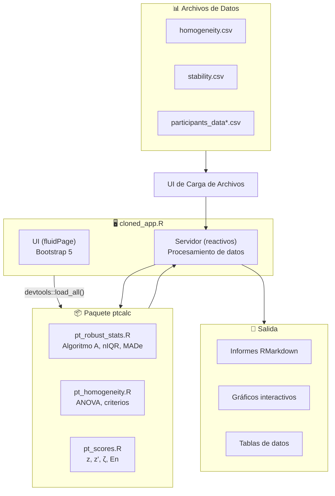
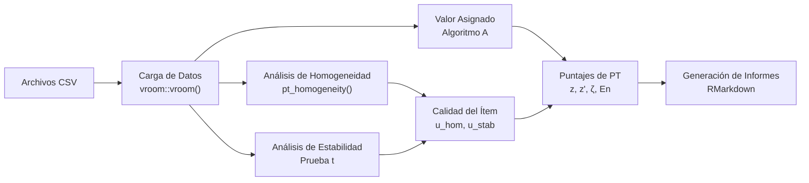

# Aplicación de Ensayos de Aptitud para Gases Contaminantes Criterio

Esta aplicación Shiny proporciona un conjunto completo de herramientas para analizar datos de esquemas de ensayos de aptitud (PT). Implementa los métodos estadísticos descritos en las normas ISO 13528:2022 e ISO 17043:2024 para evaluar la homogeneidad y estabilidad de los ítems de PT y para calcular los puntajes de desempeño de los participantes.

La aplicación ha sido refactorizada para implementar una **separación de responsabilidades**:
- **`ptcalc/`**: Paquete de R con funciones matemáticas puras (ISO 13528).
- **`cloned_app.R`**: Lógica reactiva de Shiny para la interfaz de usuario.


*Figura 1: Vista general del tablero de la aplicación de análisis de datos de PT*

```
┌─────────────────────────────────────────────────────────────────┐
│  Aplicativo para Evaluación de Ensayos de Aptitud             │
│  Gases Contaminantes Criterio                                 │
│  Laboratorio Calaire                                           │
├─────────────────────────────────────────────────────────────────┤
│  [☰ Carga de Datos] [Homogeneidad] [Estabilidad] [Valor Asig.] │
│  [Puntajes PT] [Informe Global] [Participantes] [Informes]    │
├─────────────────────────────────────────────────────────────────┤
│  Panel Lateral                                                  │
│  ├── Carga de archivo de homogeneidad                          │
│  ├── Carga de archivo de estabilidad                           │
│  └── Carga de datos de participantes                           │
├─────────────────────────────────────────────────────────────────┤
│  Área de Contenido Principal                                     │
│  ├── Tablas de datos                                            │
│  ├── Gráficos interactivos                                      │
│  └── Resultados del análisis                                     │
└─────────────────────────────────────────────────────────────────┘
```

## Inicio Rápido

```r
# 1. Establecer el directorio de trabajo
setwd("/ruta/al/pt_app")

# 2. Iniciar la aplicación
shiny::runApp("cloned_app.R")
```

La aplicación se abrirá en `http://127.0.0.1:3838` en su navegador predeterminado. Para un recorrido completo de 5 minutos, consulte [00_quickstart.md](../00_quickstart.md).

---

## Instalación y Requisitos Previos

### Entorno de R

| Requisito | Versión | Notas |
|-------------|---------|-------|
| R | ≥ 4.3.0 | [Descargar de CRAN](https://cran.r-project.org/) |
| RStudio | ≥ 2023.06 | Opcional pero recomendado |
| Sistema Operativo | Windows 10+, macOS 11+, o Linux | Cualquier SO moderno |

### Paquetes de R Requeridos

```r
# Instalar todas las dependencias
install.packages(c(
  "shiny", "bslib", "tidyverse", "vroom", "DT",
  "rhandsontable", "plotly", "patchwork", "outliers",
  "rmarkdown", "devtools", "shinythemes", "bsplus"
))
```

### Instalación del paquete ptcalc

El paquete `ptcalc` contiene todas las funciones de cálculo de las normas ISO 13528/17043.

**Para desarrollo:**

```r
devtools::load_all("ptcalc")
```

**Para despliegue en producción:**

```r
devtools::install("ptcalc")
library(ptcalc)
```

---

## Arquitectura del Sistema



---

## Flujo de Datos



---

## Módulos de la Aplicación

### 1. Carga de datos
Este módulo maneja la carga inicial de archivos CSV para su análisis.
*   **Entradas:** Archivos `homogeneity.csv`, `stability.csv` y `summary_n*.csv`.
*   **Validación:** Verifica las columnas requeridas (`value`, `pollutant`, `level`).

### 2. Análisis de Homogeneidad y Estabilidad
Evalúa si los ítems del ensayo de aptitud son suficientemente homogéneos y estables.
*   **Entradas:** Elección del contaminante, nivel de concentración.
*   **Salidas:** Vista previa de datos, resumen de ANOVA, evaluaciones de homogeneidad y estabilidad ($s_s$, $s_w$, verificación de criterios ISO).

### 3. Preparación de PT
Analiza los resultados de los participantes de diferentes rondas.
*   **Funcionalidad:** Crea pestañas dinámicamente para cada contaminante.
*   **Salidas:** Gráficos de barras, distribuciones y prueba de Grubbs para valores atípicos.

### 4. Valor Asignado / Puntajes PT
Calcula los valores de referencia y los puntajes de desempeño de los participantes.
*   **Funcionalidad:** Admite Algoritmo A, Consenso (MADe/nIQR) o Laboratorio de referencia.
*   **Puntuación:** Calcula los puntajes z, z', zeta y En utilizando estadística robusta.
*   **Incertidumbre:** Incorpora la incertidumbre estándar del valor asignado ($u(x_{pt})$).

### 5. Informe Global y Generación de Informes
*   **Informe Global:** Visualización de mapa de calor de los resultados en todos los niveles y contaminantes.
*   **Generación de informes:** Interfaz para configurar y descargar el informe final en RMarkdown.

---

## Datos de Ejemplo

Se proporcionan archivos de datos de muestra en el directorio `data/`:

| Archivo | Descripción |
|------|-------------|
| `homogeneity.csv` | Mediciones de la prueba de homogeneidad |
| `stability.csv` | Mediciones de la prueba de estabilidad |
| `summary_n4.csv` | Resultados de los participantes (escenario n=4) |
| `summary_n7.csv` | Resultados de los participantes (escenario n=7) |
| `summary_n10.csv` | Resultados de los participantes (escenario n=10) |
| `summary_n13.csv` | Resultados de los participantes (escenario n=13) |

---

## Índice de Módulos

### Introducción
- [Guía de Inicio Rápido](../00_quickstart.md) - Tutorial de 5 minutos
- [Glosario](../00_glossary.md) - Referencia de terminología español/inglés

### Documentación del paquete ptcalc
1. [Descripción General del Paquete](../02_ptcalc_package.md) - Arquitectura y exportaciones
2. [Referencia de la API](../02a_ptcalc_api.md) - Referencia completa de funciones
3. [Estadística Robusta](../03_pt_robust_stats.md) - nIQR, MADe, Algoritmo A
4. [Homogeneidad y Estabilidad](../04_pt_homogeneity.md) - Criterios de la norma ISO 13528
5. [Cálculos de Puntajes](../05_pt_scores.md) - Fórmulas de z, z', zeta, En

### Documentación de la Aplicación Shiny
6. [Carga de Datos](../01_carga_datos.md) - Carga y validación de archivos
7. [Formatos de Datos](../01a_data_formats.md) - Referencia completa del esquema CSV
8. [Módulo de Homogeneidad](../06_shiny_homogeneidad.md) - Componentes de la UI
9. [Valor Asignado](../07_valor_asignado.md) - Métodos de consenso y referencia
10. [Módulo de Puntajes PT](../09_puntajes_pt.md) - Cálculo y visualización de puntajes
11. [Informe Global](../10_informe_global.md) - Mapas de calor de resumen
12. [Detalle del Participante](../11_participantes.md) - Resultados individuales
13. [Generación de Informes](../12_generacion_informes.md) - Exportación a RMarkdown
14. [Detección de Valores Atípicos](../13_valores_atipicos.md) - Prueba de Grubbs
15. [Plantilla de Informe](../14_report_template.md) - Estructura de RMarkdown

### Temas Avanzados
16. [Arquitectura del Sistema](../15_architecture.md) - Grafo de dependencias reactivas, optimización del rendimiento
17. [Guía de Personalización](../16_customization.md) - Tema, diseño, extensión de ptcalc
18. [Solución de Problemas y Preguntas Frecuentes](../17_troubleshooting.md) - Errores comunes, problemas de formato de datos

---

## Solución de Problemas

### Errores Comunes

| Error | Causa | Solución |
|-------|-------|----------|
| `Error: could not find function "xxx"` | `ptcalc` no cargado | Ejecutar `devtools::load_all("ptcalc")` |
| `Error: El archivo debe contener las columnas...` | Encabezados CSV incorrectos | Asegurar encabezados: `pollutant`, `level`, `value` |
| `disconnected from the server` | Caída de la sesión de R | Revisar la consola para logs de error. Reiniciar la app. |
| `package 'outliers' not found` | Dependencia faltante | Ejecutar `install.packages("outliers")` |
| `Insufficient data for Algorithm A` | < 3 participantes | Verificar que los datos/selección tengan suficientes valores numéricos válidos. |

### Problemas de Formato de Datos
Los archivos de resumen deben seguir el patrón `summary_n{N}.csv` donde `{N}` es un número entero.

### Problemas de Rendimiento
Para conjuntos de datos grandes (>100 participantes), considere usar `data.table` o reducir el análisis simultáneo de contaminantes.

---

## Documentación para Desarrolladores

### Inmersión en `app.R`
La función del servidor contiene la lógica para el procesamiento de datos:
1. **Carga de Datos**: Lee `homogeneity.csv`, `stability.csv` y `summary_n*.csv`.
2. **Expresiones Reactivas**:
    - `homogeneity_run`: Cálculos de ANOVA e ISO.
    - `scores_run`: Puntajes z y otras métricas.
3. **UI Dinámica**: Utiliza `renderUI` y `navlistPanel` for flexible layout.

### Ejecución de Verificaciones de Sintaxis
```bash
./Rscript -e "source('cloned_app.R')"
```
*Note: El stub `Rscript` en la raíz del proyecto solo realiza validación estructural.*

---

## Directrices de Contribución
- Siga la [guía de estilo tidyverse](https://style.tidyverse.org/).
- Documente las funciones con comentarios de roxygen2.
- Escriba pruebas unitarias para nuevos cálculos (`devtools::test()`).
- Utilice diagramas de mermaid para el flujo de datos en las actualizaciones de la documentación.

---

## Normas y Referencias

| Norma | Título | Estado |
|----------|-------|--------|
| ISO 13528:2022 | Statistical methods for use in proficiency testing | Implementado |
| ISO 17043:2024 | Conformity assessment — General requirements for proficiency testing | Implementado |

---

## Historial de Versiones

| Versión | Fecha | Cambios |
|---------|------|---------|
| 0.1.0 | 2024 | Versión refactorizada inicial con separación del paquete ptcalc |
| - | 2025 | Actualización de documentación (Fase 1) |

---

## Licencia y Contacto
Desarrollado bajo el contrato OSE-282-3065-2025 por:
- **Laboratorio CALAIRE** - Universidad Nacional de Colombia
- **Instituto Nacional de Metrología (INM)**

Autor: Wilson Rafael Salas Chavez (wrsalasc@unal.edu.co)
Licencia: MIT
