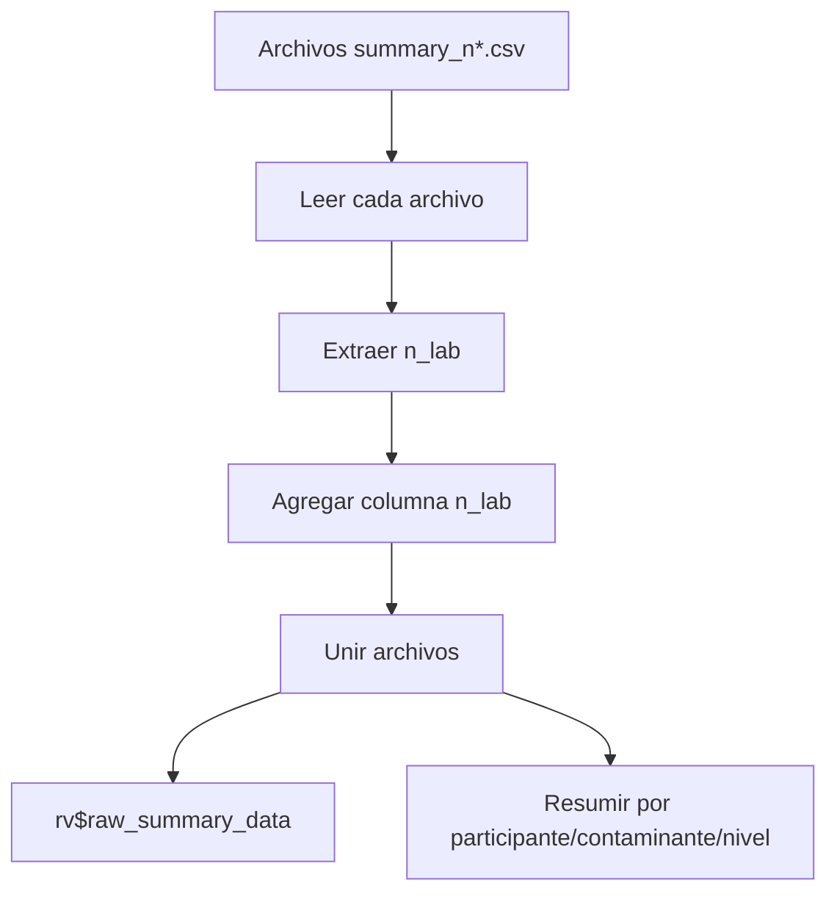

# Formatos de datos y transformación

Este documento describe los esquemas de archivo aceptados y cómo se transforman internamente para análisis ISO 13528/17043.

---

## 1. Visión general

La aplicación utiliza tres tipos de CSV (codificación UTF-8):

1. **Homogeneidad** (`homogeneity.csv`)
2. **Estabilidad** (`stability.csv`)
3. **Resúmenes de participantes** (`summary_n*.csv`)

Todos usan separador coma y encabezados en minúsculas.

---

## 2. Resumen de formatos

| Tipo de archivo | Formato | Columnas requeridas | Columnas opcionales |
|---|---|---|---|
| Homogeneidad | Largo | `pollutant`, `level`, `value` | `replicate`, `sample_id`, `date` |
| Estabilidad | Largo | `pollutant`, `level`, `value` | `replicate`, `sample_id`, `date` |
| Resumen | Largo | `participant_id`, `pollutant`, `level`, `mean_value`, `sd_value` | `replicate`, `sample_group` |

---

## 3. Esquemas completos

### 3.1 Homogeneidad y estabilidad (formato largo)

| Columna | Requerida | Tipo | Descripción | Ejemplo |
|---|:---:|---|---|---|
| `pollutant` | Sí | texto | Identificador del analito | `co`, `no`, `so2` |
| `level` | Sí | texto | Nivel de concentración | `0-umol/mol`, `121-nmol/mol` |
| `replicate` | No* | entero | Réplica (1 o 2) | `1` |
| `sample_id` | No | entero | Identificador de ítem | `1` |
| `value` | Sí | numérico | Resultado medido | `2.0115` |
| `date` | No | fecha | Fecha de medición | `2023-10-01` |

> *Aunque `replicate` no se valida estrictamente, es esencial para `pivot_wider` en `get_wide_data()`.*

Ejemplo real (`data/homogeneity.csv`):

```csv
"pollutant","level","replicate","sample_id","value"
"co","0-umol/mol",1,1,0.00670
"co","0-umol/mol",2,1,-0.04796
```

### 3.2 Resúmenes de participantes (`summary_n*.csv`)

| Columna | Requerida | Tipo | Descripción | Ejemplo |
|---|:---:|---|---|---|
| `participant_id` | Sí | texto | ID laboratorio | `part_1`, `LAB_01`, `ref` |
| `pollutant` | Sí | texto | Analito | `co`, `no`, `so2` |
| `level` | Sí | texto | Nivel | `0-umol/mol`, `2-umol/mol` |
| `mean_value` | Sí | numérico | Media reportada | `2.01215` |
| `sd_value` | Sí | numérico | Desv. estándar reportada | `0.00359` |
| `replicate` | No | entero | Número de réplicas | `2` |
| `sample_group` | No | texto | Grupo de muestras | `1-10` |

**Valor especial**: `participant_id = "ref"` identifica el laboratorio de referencia.

**Convención de nombre**: se extrae un número como `n_lab`.

| Archivo | Regex | n_lab |
|---|---|---|
| `summary_n4.csv` | `\d+` | 4 |
| `summary_123_final.csv` | `\d+` | 123 |

---

## 4. Transformación de datos

### 4.1 Flujo general

```mermaid
graph LR
    A[CSV formato largo] --> B[vroom::vroom]
    B --> C[hom_data_full / stab_data_full]
    C --> D[get_wide_data()]
    D --> E[Formato ancho]
    E --> F[ANOVA y métricas]
```

### 4.2 `get_wide_data()`

Convierte datos largos a ancho por contaminante:

```r
filtered %>%
  select(-pollutant) %>%
  pivot_wider(
    names_from = replicate,
    values_from = value,
    names_prefix = "sample_"
  )
```

### 4.3 Agregación de resúmenes (`pt_prep_data()`)



Resultado: una fila por `participant_id`, `pollutant`, `level`, `n_lab` con medias agregadas de `mean_value` y `sd_value`.

---

## 5. Generación rápida de datos (opcional)

### 5.1 Homogeneidad de prueba

```r
pollutants <- c("co", "no", "so2")
levels <- list(
  co = c("0-umol/mol", "2-umol/mol"),
  no = c("0-nmol/mol", "121-nmol/mol"),
  so2 = c("0-nmol/mol", "50-nmol/mol")
)

hom_data <- do.call(rbind, lapply(pollutants, function(p) {
  do.call(rbind, lapply(levels[[p]], function(lv) {
    expand.grid(pollutant = p, level = lv, sample_id = 1:10, replicate = 1:2)
  }))
}))

hom_data$value <- rnorm(nrow(hom_data), 1, 0.01)
write.csv(hom_data, "homogeneity_test.csv", row.names = FALSE)
```

### 5.2 Resumen de participantes

```r
summary_data <- expand.grid(
  participant_id = c("part_1", "part_2", "ref"),
  pollutant = c("co", "no"),
  level = c("low", "medium", "high")
)
summary_data$mean_value <- runif(nrow(summary_data), 10, 15)
summary_data$sd_value <- runif(nrow(summary_data), 0.1, 0.5)
write.csv(summary_data, "summary_n4.csv", row.names = FALSE)
```

---

## 6. Checklist de calidad de datos

### Homogeneidad/estabilidad

- [ ] Encabezados exactos: `pollutant`, `level`, `value`, `replicate`.
- [ ] `value` numérico y sin texto.
- [ ] `replicate` coherente (1 y 2).
- [ ] Valores de contaminante en minúsculas y consistentes.

### Resúmenes

- [ ] Encabezados exactos: `participant_id`, `pollutant`, `level`, `mean_value`, `sd_value`.
- [ ] Nombre de archivo con número (para `n_lab`).
- [ ] Existe `participant_id = "ref"`.

---

## 7. Problemas comunes

| Problema | Síntoma | Solución |
|---|---|---|
| Encabezados incorrectos | Error de columnas | Usar nombres exactos en minúsculas. |
| Falta `replicate` | Formato ancho incorrecto | Añadir columna `replicate`. |
| Espacios extra | No se filtra por contaminante | Recortar espacios en valores. |
| Mayúsculas en contaminante | “No data found” | Estandarizar en minúsculas. |
| Sin `ref` | Fallan puntajes | Añadir laboratorio de referencia. |
| Encoding no UTF-8 | Caracteres corruptos | Re-guardar como UTF-8. |

---

## 8. Referencias cruzadas

- Módulo de carga: `01_carga_datos.md`
- Homogeneidad: `04_pt_homogeneity.md`
- Glosario: `00_glossary.md`
- Ejemplos: carpeta `data/`
