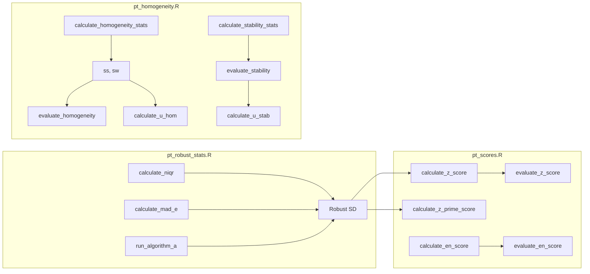

# Paquete `ptcalc`: documentación completa

## Información general

| Atributo | Valor |
|---|---|
| Ubicación | `ptcalc/` |
| Versión | 0.1.0 |
| Licencia | MIT |
| Estándares | ISO 13528:2022, ISO 17043:2024 |
| Autor | Wilson Rafael Salas Chavez (wrsalasc@unal.edu.co) |
| Dependencias | `stats`, `dplyr` |
| Uso en app | `devtools::load_all("ptcalc")` |

---

## Descripción

`ptcalc` encapsula todas las funciones matemáticas para cálculos PT. Está diseñado sin dependencias de Shiny, lo que permite:

- Uso independiente en scripts R.
- Pruebas unitarias sin UI.
- Integración con APIs externas.
- Procesamiento por lotes.

---

## Instalación y uso

```r
# Desde la raíz del proyecto
install.packages("devtools")

devtools::load_all("ptcalc")   # desarrollo
# devtools::install("ptcalc")  # instalación local
```

---

## Estructura del paquete

```
ptcalc/
├── DESCRIPTION              # Metadatos
├── LICENSE                  # MIT
├── NAMESPACE                # Funciones exportadas
├── README.md                # Referencia rápida
├── R/
│   ├── ptcalc-package.R     # Documentación del paquete
│   ├── pt_robust_stats.R    # Estadística robusta
│   ├── pt_homogeneity.R     # Homogeneidad y estabilidad
│   └── pt_scores.R          # Puntajes PT
└── man/                     # Documentación roxygen2 (Rd)
```

---

## Filosofía de diseño

| Principio | Implementación | Beneficio |
|---|---|---|
| Separación de responsabilidades | Lógica matemática separada de UI | Mantenibilidad |
| Funciones puras | Sin efectos secundarios | Reproducibilidad |
| Documentación roxygen2 | Ejemplos ejecutables | Usabilidad |
| Testabilidad | Funciones independientes | Confiabilidad |
| Estándares ISO | Referencias explícitas | Trazabilidad |

---

## Flujo de datos interno



---

## Funciones exportadas (resumen)

### Estadística robusta (`pt_robust_stats.R`)

| Función | Descripción | ISO |
|---|---|---|
| `calculate_niqr()` | nIQR = 0.7413 × IQR | 13528:2022 S9.4 |
| `calculate_mad_e()` | MADe = 1.483 × MAD | 13528:2022 S9.4 |
| `run_algorithm_a()` | Algoritmo A iterativo | 13528:2022 Anexo C |

### Homogeneidad y estabilidad (`pt_homogeneity.R`)

| Función | Descripción | ISO |
|---|---|---|
| `calculate_homogeneity_stats()` | ss, sw y medias | 13528:2022 S9.2 |
| `calculate_homogeneity_criterion()` | c = 0.3 × σₚₜ | 13528:2022 S9.2.3 |
| `calculate_homogeneity_criterion_expanded()` | Criterio expandido | 13528:2022 S9.2.4 |
| `evaluate_homogeneity()` | PASS/FAIL | 13528:2022 S9.2 |
| `calculate_stability_stats()` | Estadística de estabilidad | 13528:2022 S9.3 |
| `calculate_stability_criterion()` | Criterio de estabilidad | 13528:2022 S9.3.3 |
| `calculate_stability_criterion_expanded()` | Criterio expandido | 13528:2022 S9.3.4 |
| `evaluate_stability()` | PASS/FAIL | 13528:2022 S9.3 |
| `calculate_u_hom()` | Incertidumbre por homogeneidad | 13528:2022 S9.5 |
| `calculate_u_stab()` | Incertidumbre por estabilidad | 13528:2022 S9.5 |

### Puntajes (`pt_scores.R`)

| Función | Fórmula | ISO |
|---|---|---|
| `calculate_z_score()` | z = (x − xₚₜ) / σₚₜ | 13528:2022 S10.2 |
| `calculate_z_prime_score()` | z′ = (x − xₚₜ) / √(σₚₜ² + uₚₜ²) | 13528:2022 S10.3 |
| `calculate_zeta_score()` | ζ = (x − xₚₜ) / √(uₓ² + uₚₜ²) | 13528:2022 S10.4 |
| `calculate_en_score()` | Eₙ = (x − xₚₜ) / √(Uₓ² + Uₚₜ²) | 13528:2022 S10.5 |
| `evaluate_z_score()` | Evaluación z/z′/ζ | 13528:2022 S10.6 |
| `evaluate_en_score()` | Evaluación Eₙ | 13528:2022 S10.6 |
