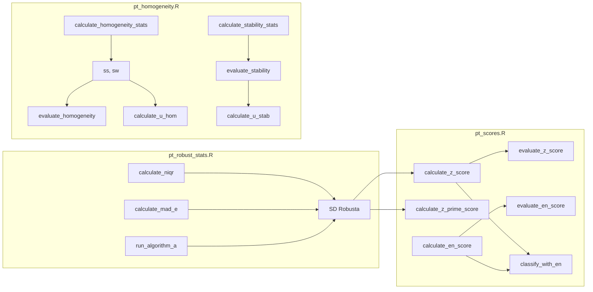

# Paquete ptcalc: Documentación Completa

## Información del Documento

| Atributo | Valor |
|----------|-------|
| Paquete | `ptcalc` |
| Versión | 0.1.0 |
| Ubicación | `pt_app/ptcalc/` |
| Dependencias | stats, dplyr |
| Uso en App | `devtools::load_all("ptcalc")` |

---

## Descripción General

`ptcalc` es un paquete de R desarrollado específicamente para esta aplicación. Encapsula todas las **funciones matemáticas puras** necesarias para los cálculos de ensayos de aptitud según las normas **ISO 13528:2022** e **ISO 17043:2024**.

### Principio de Diseño: Separación de Responsabilidades
La lógica matemática está completamente desacoplada de la interfaz de usuario (Shiny). Esto asegura que:
1.  **Independencia:** Puede usarse en otros scripts de R sin cargar la aplicación web.
2.  **Testabilidad:** Las funciones pueden probarse unitariamente sin la sobrecarga de la UI.
3.  **Mantenibilidad:** La capa de UI permanece ligera y enfocada en la interacción.

---

## Instalación y Uso

### Instalación Local
Dado que es un paquete local dentro de la estructura del proyecto, se instala utilizando `devtools`:

```r
# Desde la raíz del proyecto
devtools::install("ptcalc")
```

### Carga en Desarrollo
Para una iteración rápida durante el desarrollo, utilice `load_all` en lugar de instalar:

```r
devtools::load_all("ptcalc")
```

---

## Estructura del Paquete

```
ptcalc/
├── DESCRIPTION           # Metadatos y dependencias del paquete
├── NAMESPACE             # Funciones exportadas (24 funciones)
├── LICENSE               # Licencia MIT
├── R/
│   ├── ptcalc-package.R       # Documentación general del paquete
│   ├── pt_robust_stats.R      # Estadísticos robustos (nIQR, MADe, Algoritmo A)
│   ├── pt_homogeneity.R       # Homogeneidad y estabilidad (ANOVA, criterios)
│   └── pt_scores.R            # Puntajes PT (z, z', zeta, En)
└── man/                       # Documentación generada automáticamente (roxygen2)
```

---

## Flujo de Datos en el Paquete



---

## Resumen de Funciones Exportadas

### Estadísticos Robustos (pt_robust_stats.R)

| Función | Descripción | Referencia ISO |
|---------|-------------|----------------|
| `calculate_niqr()` | Rango intercuartílico normalizado ($0.7413 \times IQR$) | 13528:2022 S9.4 |
| `calculate_mad_e()` | MAD escalado ($1.483 \times MAD$) | 13528:2022 S9.4 |
| `run_algorithm_a()` | Algoritmo A iterativo para media y SD robustas | 13528:2022 Anexo C |

### Homogeneidad y Estabilidad (pt_homogeneity.R)

| Función | Descripción | Referencia ISO |
|---------|-------------|----------------|
| `calculate_homogeneity_stats()` | Cálculo de ANOVA, $s_s$, $s_w$, medias | 13528:2022 S9.2 |
| `calculate_homogeneity_criterion()` | Criterio $c = 0.3 \times \sigma_{pt}$ | 13528:2022 S9.2.3 |
| `evaluate_homogeneity()` | Evaluación PASA/FALLA | 13528:2022 S9.2 |
| `calculate_stability_stats()` | Estadísticos de estabilidad y diferencias | 13528:2022 S9.3 |
| `calculate_u_hom()` | Incertidumbre por homogeneidad | 13528:2022 S9.5 |
| `calculate_u_stab()` | Incertidumbre por estabilidad | 13528:2022 S9.5 |

### Puntajes (pt_scores.R)

| Función | Fórmula Básica | Referencia ISO |
|---------|----------------|----------------|
| `calculate_z_score()` | $z = (x - x_{pt}) / \sigma_{pt}$ | 13528:2022 S10.2 |
| `calculate_z_prime_score()` | $z' = (x - x_{pt}) / \sqrt{\sigma_{pt}^2 + u_{xpt}^2}$ | 13528:2022 S10.3 |
| `calculate_zeta_score()` | $\zeta = (x - x_{pt}) / \sqrt{u_x^2 + u_{xpt}^2}$ | 13528:2022 S10.4 |
| `calculate_en_score()` | $E_n = (x - x_{pt}) / \sqrt{U_x^2 + U_{xpt}^2}$ | 13528:2022 S10.5 |
| `evaluate_z_score()` | Evalúa z/z'/zeta (Satisfactorio, Cuestionable, No sat.) | 13528:2022 S10.6 |
| `classify_with_en()` | Clasificación combinada (códigos a1-a7) | 13528:2022 S10.7 |

---

## Flujo de Desarrollo Recomendado

1.  **Modificar:** Editar archivos en `ptcalc/R/`.
2.  **Cargar:** Ejecutar `devtools::load_all("ptcalc")` para probar cambios inmediatamente en la sesión de R.
3.  **Documentar:** Si se cambian comentarios roxygen, ejecutar `devtools::document("ptcalc")` para actualizar la carpeta `man/`.
4.  **Probar:** Ejecutar `devtools::test("ptcalc")` para correr pruebas unitarias.

---

## Documentos Relacionados

- [Referencia API](02a_ptcalc_api.md) - Documentación detallada de cada función.
- [Estadísticos Robustos](03_pt_robust_stats.md) - Explicación matemática detallada.
- [Homogeneidad y Estabilidad](04_pt_homogeneity.md) - Metodología de evaluación de ítems.
