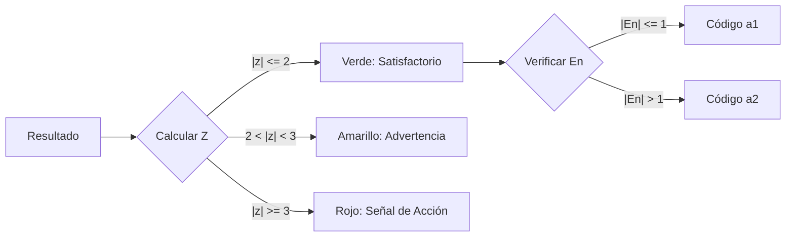

# Puntuación y Evaluación del Desempeño

## 1. Descripción General
Este módulo detalla el cálculo de los puntajes de desempeño de los participantes ($z$, $z'$, $\zeta$, $E_n$) y su lógica de clasificación. Estos puntajes cuantifican qué tan bien se alinea el resultado de un participante con el valor asignado.

**Archivo:** `ptcalc/R/pt_scores.R`

---

## 2. Definiciones y Fórmulas de Puntajes

### 2.1 Puntaje z (z-score)
La métrica de desempeño estándar. Se utiliza cuando la incertidumbre del valor asignado es despreciable ($u(x_{pt}) \le 0.3 \sigma_{pt}$).
$$z = \frac{x_i - x_{pt}}{\sigma_{pt}}$$

### 2.2 Puntaje z' (z-prima)
Se utiliza cuando la incertidumbre del valor asignado es significativa ($u(x_{pt}) > 0.3 \sigma_{pt}$). Amplía los límites de aceptación para tener en cuenta esta incertidumbre.
$$z' = \frac{x_i - x_{pt}}{\sqrt{\sigma_{pt}^2 + u(x_{pt})^2}}$$

### 2.3 Puntaje zeta ($\zeta$)
Evalúa la concordancia entre el resultado del participante y el valor asignado, considerando **ambas** incertidumbres ($u(x_i)$ y $u(x_{pt})$). Útil para evaluar la validez de la estimación de incertidumbre de un participante.
$$\zeta = \frac{x_i - x_{pt}}{\sqrt{u^2(x_i) + u^2(x_{pt})}}$$

### 2.4 Puntaje $E_n$ (Error Normalizado)
Similar al puntaje zeta pero utiliza Incertidumbres Expandidas ($U = k \cdot u$, usualmente $k=2$).
$$E_n = \frac{x_i - x_{pt}}{\sqrt{U^2(x_i) + U^2(x_{pt})}}$$

---

## 3. Guía de Selección de Puntajes

| Condición | Puntaje Recomendado | ¿Por qué? |
|:---|:---|:---|
| **PT Estándar** | **Puntaje z** | Estándar, comparable entre rondas. |
| **Alta $u(x_{pt})$** | **Puntaje z'** | Evita penalizar laboratorios por la incertidumbre del valor de referencia. |
| **Verificación de Incertidumbre** | **$\zeta$ o $E_n$** | Verifica si la incertidumbre reportada por el laboratorio es realista. |

---

## 4. Propagación de Incertidumbre

La incertidumbre estándar del valor definido ($u(x_{pt\_def})$) generalmente incluye contribuciones de la caracterización (homogeneidad y estabilidad).

$$u(x_{pt\_def}) = \sqrt{u(x_{pt})^2 + u_{hom}^2 + u_{stab}^2}$$

*   $u(x_{pt})$: Error estándar de la media (ej: $1.25 \cdot MAD_e / \sqrt{p}$ para Algoritmo A).
*   $u_{hom}$: Desviación estándar entre muestras ($s_s$).
*   $u_{stab}$: Contribución de incertidumbre por estabilidad.

Esta incertidumbre combinada es la que entra en el denominador de $z'$.

---

## 5. Lógica de Clasificación

La aplicación asigna un código de clasificación (`a1` a `a7`) a cada participante basado en una evaluación combinada de su puntaje de desempeño (usualmente $z'$) y su evaluación de incertidumbre ($E_n$).

### 5.1 Tabla de Códigos de Clasificación

| Código | Evaluación | Condición $z'$ | Condición $E_n$ | Interpretación |
|:---:|:---|:---|:---|:---|
| **a1** | **Excelente** | $|z'| \le 2$ | $|E_n| \le 1$ | Resultado exacto e incertidumbre reportada válida. |
| **a2** | Bueno | $|z'| \le 2$ | $|E_n| > 1$ | Resultado exacto, pero la incertidumbre reportada es probablemente muy pequeña (subestimada). |
| **a3** | Aceptable | $|z'| \le 2$ | N/A | Resultado exacto (sin información de incertidumbre). |
| **a4** | **Advertencia** | $2 < |z'| < 3$ | $|E_n| \le 1$ | Resultado muestra sesgo, pero está cubierto por la incertidumbre reportada. |
| **a5** | Advertencia | $2 < |z'| < 3$ | $|E_n| > 1$ | Resultado muestra sesgo y la incertidumbre no está bien estimada. |
| **a6** | **Acción** | $|z'| \ge 3$ | $|E_n| \le 1$ | Resultado es un valor atípico, pero la gran incertidumbre del laboratorio lo cubre (poco común). |
| **a7** | **Acción** | $|z'| \ge 3$ | $|E_n| > 1$ | Resultado es un valor atípico y la incertidumbre no explica la desviación. Falla crítica. |

### 5.2 Referencia de Paleta de Colores

Estos colores se utilizan en los mapas de calor y tablas de resultados.

| Estado | Código de Color | Descripción |
|:---|:---|:---|
| **Satisfactorio** | `#4DB848` (Verde) | $|z| \le 2$ |
| **Cuestionable** | `#FDB913` (Amarillo) | $2 < |z| < 3$ |
| **No Satisfactorio** | `#E03C31` (Rojo) | $|z| \ge 3$ |

### 5.3 Interpretación Visual

