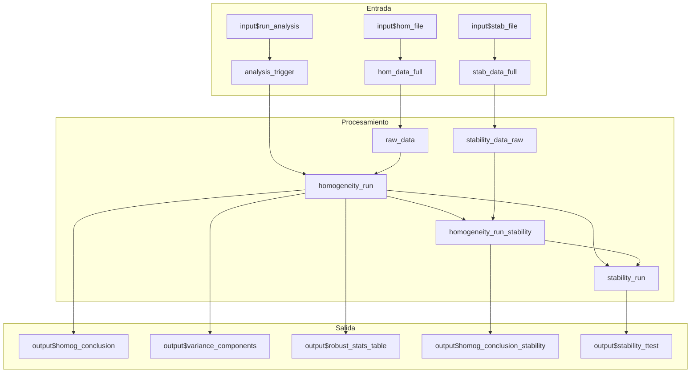

# Modulo Shiny: Homogeneidad y Estabilidad

## Descripcion General

| Propiedad | Valor |
|-----------|-------|
| Archivo | `cloned_app.R` |
| Lineas UI | 761-856 (tabPanel "Analisis de homogeneidad y estabilidad") |
| Lineas Logica | 240-558 (compute_homogeneity_metrics, compute_stability_metrics) |
| Dependencias | `hom_data_full()`, `stab_data_full()`, `analysis_trigger()` |
| Norma ISO | ISO 13528:2022 Seccion 7 |

Este modulo implementa la evaluacion de homogeneidad y estabilidad del item de ensayo segun ISO 13528:2022. Permite verificar que los materiales distribuidos a los participantes sean suficientemente homogeneos y estables para el ensayo de aptitud.

---

## Mapa de Componentes UI

| Elemento UI | Input ID | Output ID | Tipo | Descripcion |
|-------------|----------|-----------|------|-------------|
| Boton Ejecutar | `run_analysis` | - | actionButton | Dispara el calculo |
| Selector Analito | `pollutant_analysis` | `pollutant_selector_analysis` | selectInput | Filtra por contaminante |
| Selector Nivel | `target_level` | `level_selector` | selectInput | Filtra por nivel de concentracion |
| Vista previa datos | - | `raw_data_preview` | dataTableOutput | Datos de homogeneidad |
| Vista previa estabilidad | - | `stability_data_preview` | dataTableOutput | Datos de estabilidad |
| Histograma | - | `results_histogram` | plotlyOutput | Distribucion de resultados |
| Diagrama de caja | - | `results_boxplot` | plotlyOutput | Diagrama de caja por nivel |
| Conclusion homogeneidad | - | `homog_conclusion` | uiOutput | Alerta con resultado |
| Conclusion estabilidad | - | `homog_conclusion_stability` | uiOutput | Alerta estabilidad |
| Tabla estadisticos robustos | - | `robust_stats_table` | tableOutput | MADe, nIQR, mediana |
| Componentes varianza | - | `variance_components` | tableOutput | ss, sw, criterios |
| Tabla u_hom | - | `u_hom_table` | dataTableOutput | Incertidumbre por homogeneidad |
| Tabla u_stab | - | `u_stab_table` | dataTableOutput | Incertidumbre por estabilidad |

---

## Flujo Reactivo Completo



---

## Funciones de Calculo

### `compute_homogeneity_metrics(target_pollutant, target_level)`

**Proposito**: Calcula todos los estadisticos de homogeneidad para un analito y nivel especifico.

**Parametros**:
- `target_pollutant` (character): Nombre del contaminante (SO2, CO, O3, NO/NO2)
- `target_level` (character): Nivel de concentracion

**Proceso**:
1. Obtiene datos en formato ancho via `get_wide_data()`
2. Calcula estadisticos robustos (mediana, MADe, nIQR)
3. Calcula componentes de varianza (ss, sw) mediante ANOVA
4. Evalua criterio de homogeneidad: `ss <= 0.3 * sigma_pt`
5. Retorna lista con todos los resultados

**Retorno** (lista):
```r
list(
  summary = hom_anova_summary,      # Tabla ANOVA
  ss = hom_ss,                      # DE entre muestras
  sw = hom_sw,                      # DE dentro de la muestra
  conclusion = hom_conclusion,      # Texto HTML con resultado
  conclusion_class = "alert-success|alert-warning",
  g = g,                            # Numero de items
  m = m,                            # Numero de replicas
  sigma_pt = hom_sigma_pt,          # MADe como sigma_pt
  u_xpt = u_xpt,                    # Incertidumbre del valor asignado
  c_criterion = hom_c_criterion,    # Criterio c = 0.3 * sigma_pt
  c_criterion_expanded = hom_c_criterion_expanded,  # Criterio expandido
  error = NULL                      # NULL si exito
)
```

### `compute_stability_metrics(target_pollutant, target_level, hom_results)`

**Proposito**: Evalua la estabilidad comparando datos de homogeneidad y estabilidad.

**Parametros**:
- `target_pollutant` (character): Contaminante
- `target_level` (character): Nivel
- `hom_results` (list): Resultado de `compute_homogeneity_metrics()`

**Formulas Clave**:
```
diff_hom_stab = |media_homogeneidad - media_estabilidad|
c_criterion = 0.3 * sigma_pt
c_criterion_expanded = c + 2 * sqrt(u_hom_mean^2 + u_stab_mean^2)
```

---

## Formulas Matematicas

### Calculo de sigma_pt (MADe)
$$\sigma_{pt} = 1.483 \times \text{mediana}(|x_i - \text{mediana}(x)|)$$

### Calculo de nIQR
$$nIQR = 0.7413 \times (Q_3 - Q_1)$$

### Incertidumbre del Valor Asignado
$$u_{xpt} = 1.25 \times \frac{\sigma_{pt}}{\sqrt{n}}$$

### Criterio de Homogeneidad (ISO 13528)
$$s_s \leq c = 0.3 \times \sigma_{pt}$$

### Criterio Expandido
$$s_s \leq \sqrt{(0.3\sigma_{pt})^2 \times 1.88 + s_w^2 \times 1.01}$$

### Componentes de Varianza
- **Entre muestras (ss)**: $s_s = \sqrt{s_{\bar{x}}^2 - \frac{s_w^2}{m}}$
- **Dentro de la muestra (sw)**: $s_w = \sqrt{\frac{\sum w_t^2}{2g}}$ donde $w_t$ = rango

### Incertidumbre por Homogeneidad
$$u_{hom} = s_s$$

### Incertidumbre por Estabilidad
$$u_{stab} = \frac{D_{max}}{\sqrt{3}}$$

donde $D_{max} = |y_1 - y_2|$ (diferencia entre medias de homogeneidad y estabilidad)

---

## Estados de Error

| Estado | Mensaje | Causa | Solucion |
|--------|---------|-------|----------|
| Datos faltantes | "No se encontraron datos de homogeneidad para el analito 'X'" | Archivo no cargado o analito invalido | Verificar archivo CSV |
| Columna faltante | "La columna 'level' no se encuentra" | Formato CSV incorrecto | Revisar estructura del archivo |
| Replicas insuficientes | "No hay suficientes replicas (se requieren al menos 2)" | Menos de 2 columnas sample_* | Agregar mas mediciones |
| Items insuficientes | "No hay suficientes items (se requieren al menos 2)" | Menos de 2 filas por nivel | Agregar mas items |

---

## Pestanas de Analisis

### 1. Vista Previa de Datos
- Muestra primeras 10 filas de datos
- Histograma y diagrama de caja por nivel
- Mensaje de validacion de columnas requeridas

### 2. Evaluacion de Homogeneidad
- Conclusion con alerta colorizada (verde=cumple, amarillo=no cumple)
- Tabla de estadisticos robustos (mediana, MADe, nIQR)
- Componentes de varianza (xpt, sigma_pt, u_xpt, ss, sw, criterios)
- Calculos detallados por item (promedio, rango)

### 3. Evaluacion de Estabilidad
- Conclusion sobre estabilidad del item
- Comparacion entre medias de homogeneidad y estabilidad
- Criterio expandido con incertidumbres combinadas

### 4. Contribuciones a la Incertidumbre
- Tabla u_hom para todos los analitos/niveles
- Tabla u_stab con Dmax y u_stab calculados

---

## Integracion con ptcalc

El modulo utiliza funciones del paquete `ptcalc` para calculos:
- `calculate_niqr()`: Calculo de nIQR
- `run_algorithm_a()`: Algoritmo A para valor asignado robusto

---

## Referencias

- ISO 13528:2022 Seccion 7.2 (Evaluacion de homogeneidad)
- ISO 13528:2022 Seccion 7.3 (Evaluacion de estabilidad)
- ISO 13528:2022 Anexo B (Estimacion robusta)
