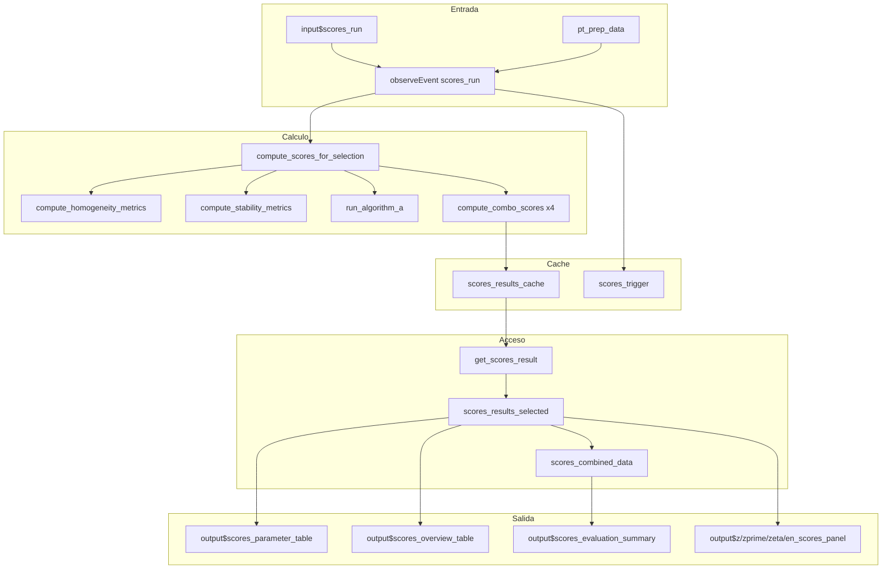

# Modulo Shiny: Puntajes PT

## Descripcion General

| Propiedad | Valor |
|-----------|-------|
| Archivo | `cloned_app.R` |
| Lineas UI | 948-982 (tabPanel "Puntajes PT") |
| Lineas Logica | 1720-2136 (selectores, compute_scores_for_selection) |
| Dependencias | `pt_prep_data()`, `scores_results_cache()`, `scores_trigger()` |
| Norma ISO | ISO 13528:2022 Seccion 9 |

Este modulo calcula y visualiza los puntajes de desempeno de los participantes en el ensayo de aptitud, incluyendo puntajes z, z', zeta y En.

---

## Mapa de Componentes UI

| Elemento UI | Input ID | Output ID | Tipo | Descripcion |
|-------------|----------|-----------|------|-------------|
| Boton Calcular | `scores_run` | - | actionButton | Dispara calculo de puntajes |
| Selector Analito | `scores_pollutant` | `scores_pollutant_selector` | selectInput | Filtra contaminante |
| Selector n | `scores_n_lab` | `scores_n_selector` | selectInput | Esquema PT |
| Selector Nivel | `scores_level` | `scores_level_selector` | selectInput | Nivel concentracion |
| Tabla parametros | - | `scores_parameter_table` | tableOutput | Resumen x_pt, sigma_pt |
| Tabla puntajes | - | `scores_overview_table` | dataTableOutput | Puntajes por participante |
| Resumen evaluacion | - | `scores_evaluation_summary` | tableOutput | Conteo por categoria |
| Panel z | - | `z_scores_panel` | uiOutput | Tablas y graficos z |
| Panel z' | - | `zprime_scores_panel` | uiOutput | Tablas y graficos z' |
| Panel zeta | - | `zeta_scores_panel` | uiOutput | Tablas y graficos zeta |
| Panel En | - | `en_scores_panel` | uiOutput | Tablas y graficos En |

---

## Flujo Reactivo Completo



---

## Funcion Principal: compute_scores_for_selection()

### Ubicacion
Lineas 1926-2098 en `cloned_app.R`

### Firma
```r
compute_scores_for_selection(
  target_pollutant,    # character: contaminante
  target_n_lab,        # numeric/character: numero de laboratorio
  target_level,        # character: nivel
  summary_data,        # data.frame: datos de pt_prep_data()
  max_iter = 50,       # numeric: iteraciones maximas Algoritmo A
  k_factor = 2         # numeric: factor de cobertura
)
```

### Proceso Interno

1. **Filtrar datos** por pollutant, n_lab, level
2. **Obtener parametros de homogeneidad** via `compute_homogeneity_metrics()`
3. **Calcular u_hom** = ss (desviacion entre muestras)
4. **Obtener parametros de estabilidad** via `compute_stability_metrics()`
5. **Calcular u_stab** = Dmax / sqrt(3)
6. **Preparar datos de participantes** (excluir "ref")
7. **Calcular estadisticos de consenso** (mediana, MADe, nIQR)
8. **Ejecutar Algoritmo A** si n >= 3
9. **Calcular puntajes para cada metodo** via `compute_combo_scores()`:
   - ref (Metodo 1)
   - consensus_ma (Metodo 2a)
   - consensus_niqr (Metodo 2b)
   - algo (Metodo 3)

### Retorno
```r
list(
  error = NULL,
  combos = list(ref = ..., consensus_ma = ..., consensus_niqr = ..., algo = ...),
  summary = tibble(...),    # Resumen por metodo
  overview = tibble(...),   # Puntajes por participante
  k = k_factor
)
```

---

## Funcion: compute_combo_scores()

### Ubicacion
Lineas 1806-1893 en `cloned_app.R`

### Proposito
Calcula todos los puntajes (z, z', zeta, En) para un metodo especifico de valor asignado.

### Parametros
```r
compute_combo_scores(
  participants_df,  # data.frame con columnas: result, uncertainty_std
  x_pt,             # numeric: valor asignado
  sigma_pt,         # numeric: desviacion estandar de aptitud
  u_xpt,            # numeric: incertidumbre del valor asignado
  combo_meta,       # list(title, label): metadata del metodo
  k = 2,            # numeric: factor de cobertura
  u_hom = 0,        # numeric: incertidumbre por homogeneidad
  u_stab = 0        # numeric: incertidumbre por estabilidad
)
```

### Formulas Implementadas

| Puntaje | Formula | Limites |
|---------|---------|---------|
| z | $(x_i - x_{pt}) / \sigma_{pt}$ | \|z\| <= 2: Satisfactorio |
| z' | $(x_i - x_{pt}) / \sqrt{\sigma_{pt}^2 + u_{xpt,def}^2}$ | \|z'\| <= 2: Satisfactorio |
| zeta | $(x_i - x_{pt}) / \sqrt{u_i^2 + u_{xpt,def}^2}$ | \|zeta\| <= 2: Satisfactorio |
| En | $(x_i - x_{pt}) / \sqrt{U_i^2 + U_{xpt}^2}$ | \|En\| <= 1: Satisfactorio |

donde:
- $u_{xpt,def} = \sqrt{u_{xpt}^2 + u_{hom}^2 + u_{stab}^2}$
- $U_i = k \times u_i$ (incertidumbre expandida del participante)
- $U_{xpt} = k \times u_{xpt,def}$ (incertidumbre expandida del valor asignado)

---

## Paleta de Colores para Evaluacion

```r
score_heatmap_palettes <- list(
  z = c(
    "Satisfactorio" = "#00B050",      # Verde
    "Cuestionable" = "#FFEB3B",       # Amarillo
    "No satisfactorio" = "#D32F2F",   # Rojo
    "N/A" = "#BDBDBD"                 # Gris
  )
)
```

---

## Funcion: plot_scores()

### Ubicacion
Lineas 1895-1924 en `cloned_app.R`

### Proposito
Genera graficos de paleta (lollipop) para visualizar puntajes por participante.

### Parametros
```r
plot_scores(
  df,              # data.frame con columnas participant_id y score_col
  score_col,       # character: nombre de la columna de puntaje
  title,           # character: titulo del grafico
  subtitle,        # character: subtitulo
  ylab,            # character: etiqueta eje Y
  warn_limits,     # numeric vector: lineas de advertencia (ej: c(-2, 2))
  action_limits    # numeric vector: lineas de accion (ej: c(-3, 3))
)
```

---

## Estrategia de Cache

### Clave de Cache
```r
key <- paste(pollutant, as.character(n_lab), level, sep = "||")
# Ejemplo: "SO2||5||bajo"
```

### Acceso a Cache
```r
get_scores_result <- function(pollutant, n_lab, level) {
  if (is.null(scores_trigger())) {
    return(list(error = "Calcule los puntajes..."))
  }
  cache <- scores_results_cache()
  key <- paste(pollutant, as.character(n_lab), level, sep = "||")
  res <- cache[[key]]
  if (is.null(res)) {
    return(list(error = "No se encontraron resultados..."))
  }
  res
}
```

---

## Pestanas del Modulo

### 1. Resultados de Puntajes
- **Tabla de parametros**: x_pt, x_pt_def, sigma_pt, u(x_pt), u(x_pt)_def por metodo
- **Tabla de puntajes**: Participante, Resultado, u(xi), z, z', zeta, En + evaluaciones
- **Resumen de evaluacion**: Conteo y porcentaje por criterio

### 2-5. Pestanas por Tipo de Puntaje (Z, Z', Zeta, En)
Cada pestana muestra para los 4 metodos:
- Tabla con valores y evaluaciones
- Grafico de paleta con lineas de control

---

## Comportamiento de Cambio de Pestanas

Los paneles de puntajes se generan dinamicamente usando `renderUI`:

```r
output$z_scores_panel <- renderUI({
  res <- scores_results_selected()
  if (!is.null(res$error)) {
    return(div(class = "alert alert-danger", res$error))
  }
  tagList(lapply(names(score_combo_info), function(key) {
    combo <- res$combos[[key]]
    # ... generar tabla y grafico para cada metodo
  }))
})
```

---

## Estados de Error

| Estado | Mensaje | Causa |
|--------|---------|-------|
| Sin calculo | "Calcule los puntajes para habilitar esta seccion" | scores_trigger() == NULL |
| Sin datos | "No se encontraron datos para la combinacion seleccionada" | Filtro vacio |
| Sin referencia | "No se encontro informacion del participante de referencia" | ref ausente |
| Pocos participantes | "Se requieren al menos tres participantes" | n < 3 para Algo A |

---

## Integracion con ptcalc

El modulo utiliza las siguientes funciones del paquete `ptcalc`:

| Funcion | Proposito |
|---------|-----------|
| `calculate_niqr()` | Calculo de nIQR |
| `run_algorithm_a()` | Estimacion robusta iterativa |
| `evaluate_z_score_vec()` | Evaluacion vectorizada de puntajes z |

---

## Referencias

- ISO 13528:2022 Seccion 9.2 (Puntaje z)
- ISO 13528:2022 Seccion 9.3 (Puntaje z')
- ISO 13528:2022 Seccion 9.4 (Puntaje zeta)
- ISO 13528:2022 Seccion 9.5 (Puntaje En)
- ISO 13528:2022 Anexo D (Interpretacion de puntajes)
