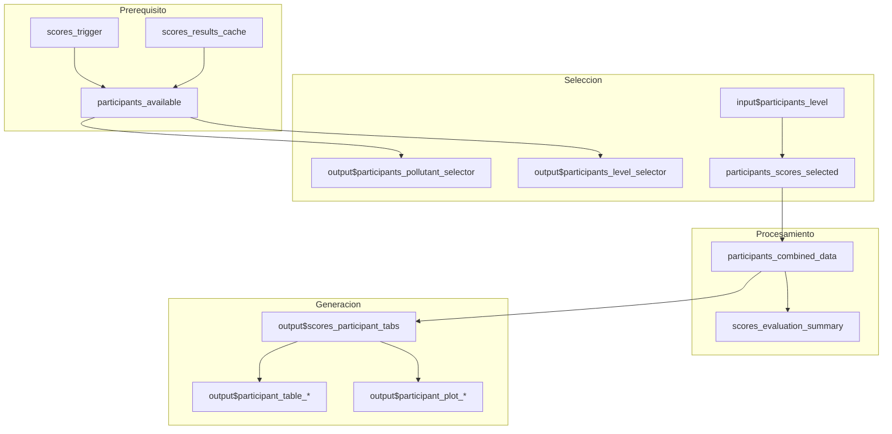

# Modulo: Detalle por Participante

## Descripcion General

| Propiedad | Valor |
|-----------|-------|
| Archivo | `cloned_app.R` |
| Lineas UI | 1086-1101 (tabPanel "Participantes") |
| Lineas Logica | 3238-3746 (participants_available, scores_participant_tabs) |
| Dependencias | `scores_trigger()`, `scores_results_cache()` |
| Norma ISO | ISO 13528:2022 Seccion 10.2 |

Este modulo genera pestanas dinamicas con el detalle de desempeno para cada laboratorio participante, permitiendo analisis individualizado.

---

## Mapa de Componentes UI

| Elemento UI | Input ID | Output ID | Tipo | Descripcion |
|-------------|----------|-----------|------|-------------|
| Selector Analito | `participants_pollutant` | `participants_pollutant_selector` | selectInput | Filtro contaminante |
| Selector Nivel | `participants_level` | `participants_level_selector` | selectInput | Nivel (incluye n_lab) |
| Pestanas participantes | - | `scores_participant_tabs` | uiOutput | Contenedor dinamico |
| Tabla participante | - | `participant_table_[ID]` | dataTableOutput | Tabla por participante |
| Grafico participante | - | `participant_plot_[ID]` | plotlyOutput | Graficos por participante |

---

## Flujo Reactivo



---

## Reactive: participants_available()

### Ubicacion
Lineas 3238-3262 en `cloned_app.R`

### Proposito
Identifica que combinaciones (pollutant, n_lab, level) tienen datos validos.

### Retorno
```r
tibble(
  pollutant = character(),    # Contaminante
  n_lab = character(),        # Numero de laboratorio
  level = character(),        # Nivel
  has_data = logical()        # TRUE si hay datos validos
)
```

### Filtrado
Solo se incluyen combinaciones donde al menos un combo (ref, consensus_ma, etc) tiene datos no vacios.

---

## Generacion Dinamica de Pestanas

### Patron de Implementacion (lineas 3615-3746)

```r
output$scores_participant_tabs <- renderUI({
  info <- participants_combined_data()
  if (!is.null(info$error)) {
    return(helpText(info$error))
  }
  
  # Excluir participante de referencia
  combined <- info$data %>% filter(participant_id != "ref")
  participants <- sort(unique(combined$participant_id))
  
  # Crear una pestana por participante
  tab_panels <- lapply(participants, function(pid) {
    # Generar ID seguro (sin caracteres especiales)
    safe_id <- gsub("[^A-Za-z0-9]", "_", pid)
    table_id <- paste0("participant_table_", safe_id)
    plot_id <- paste0("participant_plot_", safe_id)
    
    # Crear outputs dinamicos
    output[[table_id]] <- renderDataTable({...})
    output[[plot_id]] <- renderPlotly({...})
    
    # Retornar tabPanel
    tabPanel(
      pid,
      h4("Resumen"),
      dataTableOutput(table_id),
      hr(),
      h4("Graficos"),
      plotlyOutput(plot_id, height = "600px")
    )
  })
  
  do.call(tabsetPanel, c(list(id = "scores_participants_tabs"), tab_panels))
})
```

---

## Contenido por Participante

### 1. Tabla de Resultados

| Columna | Descripcion |
|---------|-------------|
| Combinacion | Metodo de valor asignado |
| Analito | Contaminante |
| Esquema PT (n) | Numero de laboratorio |
| Nivel | Nivel de concentracion |
| Resultado | Valor medido |
| x_pt | Valor asignado |
| sigma_pt | Desviacion estandar de aptitud |
| u(x_pt) | Incertidumbre del valor asignado |
| u(x_pt_def) | Incertidumbre definitiva |
| Puntaje z | z-score |
| Evaluacion z | Satisfactorio/Cuestionable/No satisfactorio |
| Puntaje z' | z'-score |
| Evaluacion z' | Evaluacion |
| Puntaje zeta | zeta-score |
| Evaluacion zeta | Evaluacion |
| Puntaje En | En-score |
| Puntaje En Eval | Evaluacion |

### 2. Panel de Graficos (2x2)

Se generan 4 graficos combinados usando `plotly::subplot()`:

| Posicion | Grafico | Descripcion |
|----------|---------|-------------|
| Superior izq | Valores (Ref) | Participante vs Referencia por nivel |
| Superior der | Puntaje Z | Tendencia z-score con lineas de control |
| Inferior izq | Puntaje Zeta | Tendencia zeta-score |
| Inferior der | Puntaje En | Tendencia En-score |

---

## Graficos Detallados

### Grafico de Valores (Ref vs Participante)
```r
p_values <- ggplot(plot_df, aes(x = factor(level))) +
  geom_point(aes(y = result, color = "Participante"), size = 3) +
  geom_line(aes(y = result, group = 1, color = "Participante")) +
  geom_point(aes(y = x_pt, color = "Referencia"), size = 3) +
  geom_line(aes(y = x_pt, group = 1, color = "Referencia"), linetype = "dashed") +
  scale_color_manual(values = c("Participante" = "#1F78B4", "Referencia" = "#E31A1C"))
```

### Grafico de Puntaje Z
```r
p_z <- ggplot(participant_df, aes(x = level_factor, y = z_score, group = combination)) +
  geom_hline(yintercept = c(-3, 3), linetype = "dashed", color = "#C0392B") +
  geom_hline(yintercept = c(-2, 2), linetype = "dashed", color = "#E67E22") +
  geom_hline(yintercept = 0, color = "grey50") +
  geom_line(position = position_dodge(width = 0.3)) +
  geom_point(size = 3, position = position_dodge(width = 0.3))
```

---

## Selector de Nivel Compuesto

El selector de nivel combina nivel y n_lab para facilitar la navegacion:

```r
combos <- combos %>%
  mutate(
    key = paste(pollutant, n_lab, level, sep = "||"),
    label = ifelse(is.na(n_lab), paste("Nivel", level), paste0("Nivel ", level, " (n=", n_lab, ")"))
  )

selectInput("participants_level", "Seleccionar nivel:",
  choices = setNames(combos$key, combos$label))
```

---

## Filtrado de Datos

### Acceso a Datos del Participante
```r
participants_scores_selected <- reactive({
  key <- input$participants_level
  parts <- strsplit(key, "\\|\\|")[[1]]
  # parts[1] = pollutant, parts[2] = n_lab, parts[3] = level
  get_scores_result(parts[1], parts[2], parts[3])
})
```

### Combinacion de Resultados
```r
participants_combined_data <- reactive({
  combine_scores_result(participants_scores_selected())
})
```

---

## Consideraciones de Rendimiento

| Aspecto | Estrategia |
|---------|------------|
| Muchos participantes | Las pestanas se generan bajo demanda via renderUI |
| Outputs dinamicos | Se crean dentro del lapply para evitar colisiones |
| IDs seguros | Se sanitizan IDs para evitar caracteres invalidos |
| Altura fija | plotlyOutput con height="600px" para consistencia |

---

## Estados de Error

| Estado | Mensaje | Causa |
|--------|---------|-------|
| Sin calculo | "Calcule los puntajes para habilitar esta seccion" | scores_trigger() == NULL |
| Sin datos | "No hay participantes disponibles para esta seleccion" | Filtro vacio |
| Seleccion invalida | "Seleccione un analito y nivel" | Inputs no seleccionados |

---

## Personalizacion de Graficos

### Lineas de Control
- **Advertencia (naranja)**: |z| = 2, |zeta| = 2
- **Accion (rojo)**: |z| = 3, |zeta| = 3, |En| = 1

### Colores de Series
- **Participante**: Azul (#1F78B4)
- **Referencia**: Rojo (#E31A1C)

### Combinaciones (por metodo)
Los graficos de tendencia muestran todas las combinaciones superpuestas con `position_dodge` para comparacion.

---

## Referencias

- ISO 13528:2022 Seccion 10.2 (Informes individuales)
- ISO 17043:2024 Anexo A (Contenido del informe al participante)
