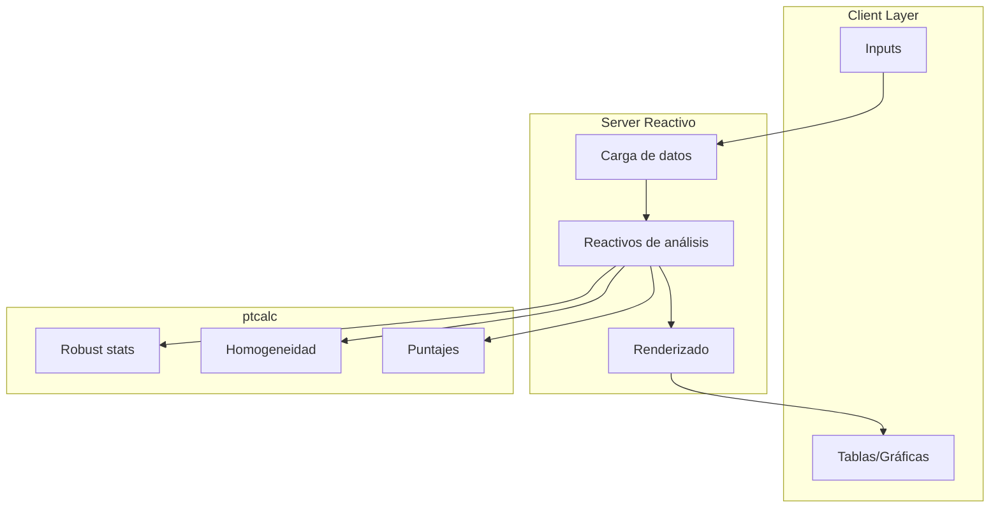
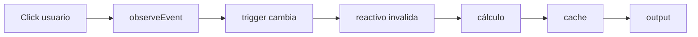

# Arquitectura del sistema

Este documento describe la arquitectura de la aplicación, el patrón reactivo, la estructura del servidor y consideraciones de rendimiento.

---

## Ubicación en el código

| Elemento | Valor |
|---|---|
| Archivo principal | `cloned_app.R` |
| Paquete lógico | `ptcalc/` |
| Arquitectura | MVC simplificado (UI–Server–Logic) |
| Documentos relacionados | `02_ptcalc_package.md`, `README.md` |

---

## Visión general

La aplicación separa responsabilidades:

- **Vista (UI)**: `fluidPage` con estilos `bslib`.
- **Controlador (Server)**: reactivos y `observeEvent`.
- **Modelo (Logic)**: funciones puras en `ptcalc` + transformaciones en `cloned_app.R`.

Beneficios: pruebas unitarias, reutilización de cálculos y UI ligera.

---

## Estructura del servidor

| Sección | Líneas aprox. | Propósito |
|---|---|---|
| Carga de datos | 84–151 | `hom_data_full`, `stab_data_full`, `pt_prep_data` |
| Triggers y caché | 162–224 | `analysis_trigger`, `scores_trigger`, etc. |
| Funciones helper | 226–638 | `get_wide_data`, `compute_homogeneity_metrics` |
| Algoritmo A | 642–715 | `observeEvent(input$algoA_run)` |
| UI dinámica | 717–1165 | `output$main_layout` |
| Homogeneidad/Estabilidad | 1168–1390 | Reactivos y salidas |
| Puntajes PT | 1720–2255 | Cálculos y selección |
| Informe global | 2256–3237 | Resúmenes y heatmaps |
| Participantes | 3238–3746 | Detalles individuales |
| Reportes | 3748–4690 | `downloadHandler` |
| Valor asignado | 4715–5042 | Consenso, referencia |
| Atípicos | 5114–5176 | Grubbs y visualización |

---

## Grafo de dependencias (alto nivel)



---

## Gestión de estado

### `reactiveValues`

```r
rv <- reactiveValues(
  raw_summary_data = NULL,
  raw_summary_data_list = NULL
)
```

- `rv$raw_summary_data`: tabla combinada de resúmenes.
- `rv$raw_summary_data_list`: lista de data.frames por archivo.

### Patrón trigger-caché

La app evita recomputaciones costosas con triggers + caché.



Cachés principales:
- `algoA_results_cache`
- `consensus_results_cache`
- `scores_results_cache`

---

## Consideraciones de rendimiento

- **Lectura rápida**: `vroom` para CSV grandes.
- **Renderizado**: `DT::renderDataTable` con paginación.
- **Vectorización**: funciones `ptcalc` vectorizadas.
- **Plots interactivos**: `plotly` solo cuando es necesario.

---

## Capa de visualización

Incluye:
- Tablas de resultados y resúmenes.
- Gráficas (histogramas, boxplots, dispersión).
- Reportes en RMarkdown (HTML/Word).
