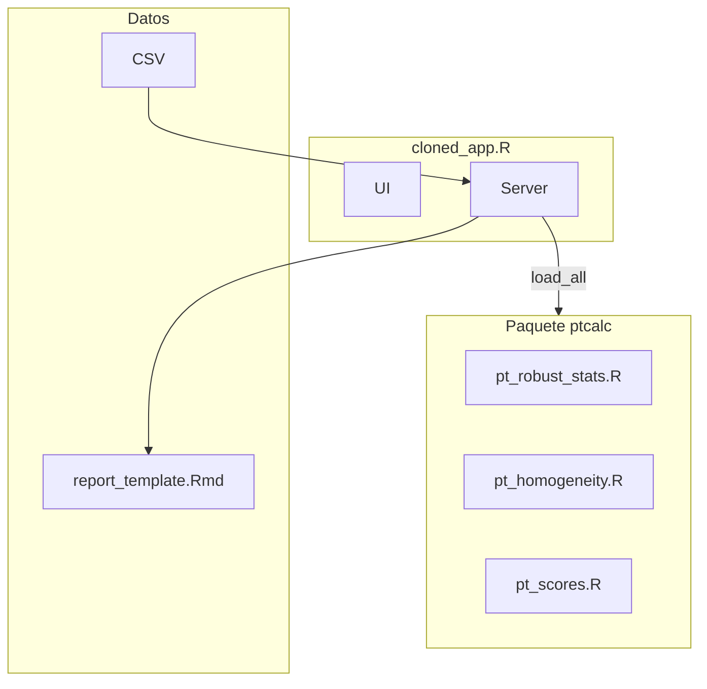
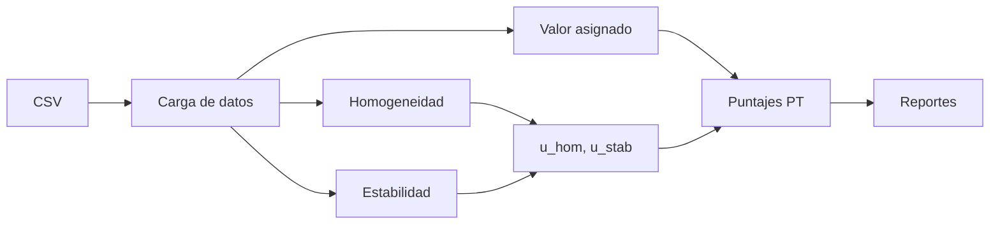

# Aplicación de Ensayos de Aptitud (PT)

Esta documentación corresponde a la versión refactorizada que separa:

- **`ptcalc/`**: paquete R con funciones matemáticas (ISO 13528/17043).
- **`cloned_app.R`**: lógica reactiva Shiny y UI.

---

## Requisitos e instalación

### Entorno R

| Requisito | Versión recomendada |
|---|---|
| R | 4.3.0+ |
| RStudio | 2023.06+ (opcional) |
| SO | Windows 10+, macOS 11+, Linux |

### Paquetes R requeridos

```r
install.packages(c(
  "shiny", "bslib", "shinythemes", "bsplus",
  "tidyverse", "vroom",
  "DT", "rhandsontable",
  "plotly", "ggplot2", "patchwork",
  "outliers", "rmarkdown", "devtools"
))
```

### Instalar `ptcalc`

```r
# Desarrollo
devtools::load_all("ptcalc")

# Producción
# devtools::install("ptcalc")
# library(ptcalc)
```

---

## Inicio rápido

```r
setwd("/path/to/pt_app")
shiny::runApp("cloned_app.R")
```

Guía completa: `00_quickstart.md`.

---

## Arquitectura



---

## Flujo de datos



---

## Datos de ejemplo

En `data/`:

| Archivo | Descripción |
|---|---|
| `homogeneity.csv` | Medidas de homogeneidad |
| `stability.csv` | Medidas de estabilidad |
| `summary_n*.csv` | Resúmenes de participantes por esquema |
| `participants_data*.csv` | Alternativas de ejemplo (si existen) |

---

## Módulos principales

1. **Carga de datos**: validación y lectura CSV.
2. **Homogeneidad & Estabilidad**: ANOVA, criterios ISO, u_hom/u_stab.
3. **Valor asignado**: algoritmo A, consenso MADe/nIQR, referencia.
4. **Puntajes PT**: z, z′, ζ, En y clasificación.
5. **Informe global & Reportes**: visualización y exportación.

---

## Documentación clave

- Guía rápida: `00_quickstart.md`
- Glosario: `00_glossary.md`
- Formatos de datos: `01a_data_formats.md`
- Arquitectura: `15_architecture.md`
