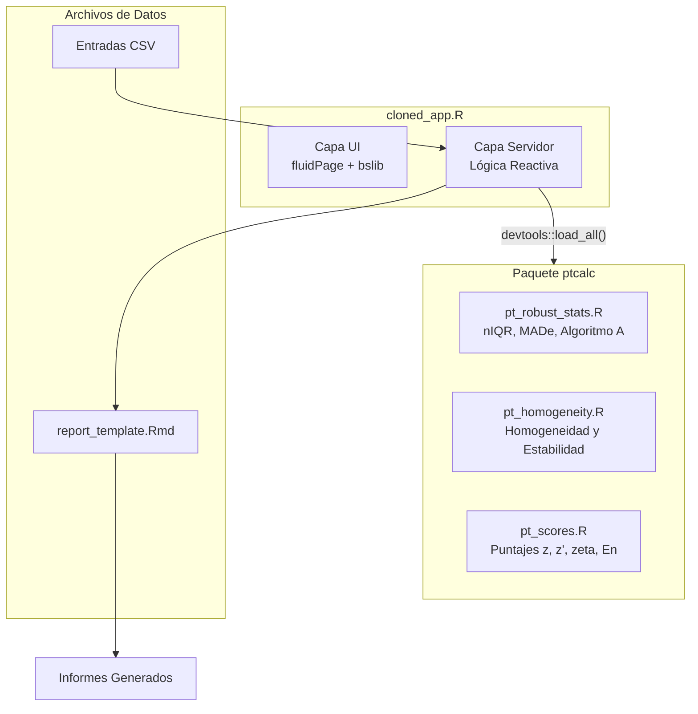
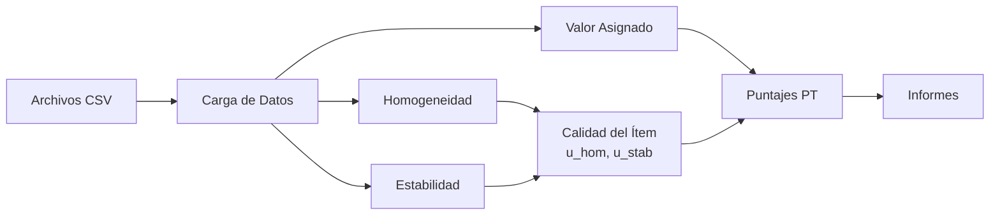

# Aplicación de Ensayos de Aptitud para Gases Contaminantes Criterio

## Documentación de la Aplicación Refactorizada

Esta documentación corresponde a la versión refactorizada de la aplicación de ensayos de aptitud (PT), implementando una **separación de responsabilidades** entre:

- **`ptcalc/`**: Paquete de R con funciones matemáticas puras (basadas en ISO 13528/17043).
- **`cloned_app.R`**: Lógica reactiva de Shiny para la interfaz de usuario.

---

## Inicio Rápido

```r
# 1. Establecer el directorio de trabajo
setwd("/ruta/a/pt_app")

# 2. Ejecutar la aplicación
shiny::runApp("cloned_app.R")
```

Para instrucciones detalladas de configuración, consulte la [Guía de Inicio Rápido](00_quickstart.md).

---

## Requisitos de Software

### Versión de R
- **Mínimo:** R 4.1.0
- **Recomendado:** R 4.3.0 o superior

### Dependencias del Paquete

| Paquete | Versión | Propósito |
|---------|---------|-----------|
| shiny | >= 1.7.0 | Framework web |
| bslib | >= 0.4.0 | Temas Bootstrap 5 |
| tidyverse | >= 1.3.0 | Manipulación de datos (dplyr, tidyr, ggplot2) |
| vroom | >= 1.5.0 | Lectura rápida de CSV |
| DT | >= 0.20 | Tablas de datos interactivas |
| rhandsontable | >= 0.3.8 | Widget de hoja de cálculo editable |
| plotly | >= 4.10.0 | Visualizaciones interactivas |
| patchwork | >= 1.1.0 | Composición de gráficos |
| outliers | >= 0.15 | Prueba de Grubbs para valores atípicos |
| rmarkdown | >= 2.14 | Generación de informes |
| devtools | >= 2.4.0 | Herramientas de desarrollo de paquetes |
| shinythemes | >= 1.2.0 | Temas de UI |
| bsplus | >= 0.1.4 | Extensiones de Bootstrap |

### Instalación

```r
# Instalar todas las dependencias
install.packages(c(
  "shiny", "bslib", "tidyverse", "vroom", "DT",
  "rhandsontable", "plotly", "patchwork", "outliers",
  "rmarkdown", "devtools", "shinythemes", "bsplus"
))
```

### Instalación del Paquete ptcalc

El paquete `ptcalc` contiene todas las funciones de cálculo ISO 13528/17043.

**Para desarrollo:**

```r
devtools::load_all("ptcalc")
```

**Para despliegue en producción:**

```r
devtools::install("ptcalc")
library(ptcalc)
```

---

## Arquitectura del Sistema



---

## Flujo de Datos



---

## Datos de Ejemplo

Se proporcionan archivos de datos de muestra en el directorio `data/`:

| Archivo | Descripción |
|---------|-------------|
| `homogeneity.csv` | Mediciones de prueba de homogeneidad |
| `stability.csv` | Mediciones de prueba de estabilidad |
| `summary_n4.csv` | Resultados de participantes (escenario n=4) |
| `summary_n7.csv` | Resultados de participantes (escenario n=7) |
| `summary_n10.csv` | Resultados de participantes (escenario n=10) |
| `summary_n13.csv` | Resultados de participantes (escenario n=13) |

### Carga de Datos de Ejemplo

```r
# Leer datos de homogeneidad
hom_data <- vroom::vroom("data/homogeneity.csv")

# Leer resumen de participantes
summary_data <- vroom::vroom("data/summary_n7.csv")
```

---

## Índice de Módulos

### Primeros Pasos
- [Guía de Inicio Rápido](00_quickstart.md) - Instalación y primer análisis
- [Glosario](00_glossary.md) - Referencia terminológica Español/Inglés

### Paquete ptcalc
1. [Visión General del Paquete](02_ptcalc_package.md) - Arquitectura y exportaciones
2. [Referencia API](02a_ptcalc_api.md) - Referencia completa de funciones
3. [Estadística Robusta](03_pt_robust_stats.md) - nIQR, MADe, Algoritmo A
4. [Homogeneidad y Estabilidad](04_pt_homogeneity.md) - Evaluación de calidad del ítem
5. [Cálculo de Puntajes](05_pt_scores.md) - Fórmulas z, z', zeta, En

### Aplicación Shiny
6. [Carga de Datos](01_carga_datos.md) - Carga y validación de archivos
7. [Formatos de Datos](01a_data_formats.md) - Referencia completa de esquemas CSV
8. [Módulo de Homogeneidad](06_shiny_homogeneidad.md) - Componentes UI
9. [Valor Asignado](07_valor_asignado.md) - Métodos de consenso y referencia
10. [Puntajes PT](09_puntajes_pt.md) - Computación y visualización de puntajes
11. [Informe Global](10_informe_global.md) - Mapas de calor de resumen
12. [Detalle por Participante](11_participantes.md) - Resultados individuales
13. [Generación de Informes](12_generacion_informes.md) - Exportación RMarkdown
14. [Detección de Valores Atípicos](13_valores_atipicos.md) - Prueba de Grubbs

### Temas Avanzados
15. [Arquitectura del Sistema](15_architecture.md) - Gráfico de dependencia reactiva
16. [Guía de Personalización](16_customization.md) - Temas, diseño, extensión
17. [Solución de Problemas](17_troubleshooting.md) - Errores comunes

---

## Solución de Problemas

### La Aplicación No Inicia

**Problema:** Error al cargar el paquete ptcalc

```r
# Solución: Cargar manualmente el paquete
devtools::load_all("ptcalc")
```

**Problema:** Dependencias faltantes

```r
# Verificar qué paquetes faltan
required <- c("shiny", "bslib", "tidyverse", "vroom", "DT",
              "rhandsontable", "plotly", "patchwork", "outliers",
              "rmarkdown", "devtools", "shinythemes", "bsplus")
missing <- required[!required %in% installed.packages()[,"Package"]]
if(length(missing)) install.packages(missing)
```

### Errores de Carga de Datos

**Problema:** Error "Column not found" (Columna no encontrada)

Asegúrese de que sus archivos CSV contengan las columnas requeridas con los nombres exactos:
- Homogeneidad/Estabilidad: `pollutant`, `level`, `replicate`, `value`
- Archivos resumen: `participant_id`, `pollutant`, `level`, `mean_value`, `sd_value`

**Problema:** Patrón de nombre de archivo no reconocido

Los archivos resumen deben seguir el patrón `summary_n{N}.csv` donde `{N}` es un número entero:
- Válido: `summary_n7.csv`, `summary_n10.csv`
- Inválido: `summary_7.csv`, `summary-n7.csv`

---

## Referencias

- **ISO 13528:2022** - Métodos estadísticos para su uso en ensayos de aptitud por comparación interlaboratorios
- **ISO 17043:2024** - Evaluación de la conformidad — Requisitos generales para los ensayos de aptitud

---

## Licencia

Licencia MIT

Desarrollado bajo contrato OSE-282-3065-2025 por:
- **Laboratorio CALAIRE** - Universidad Nacional de Colombia
- **Instituto Nacional de Metrología (INM)**

Autor: Wilson Rafael Salas Chavez (wrsalasc@unal.edu.co)
