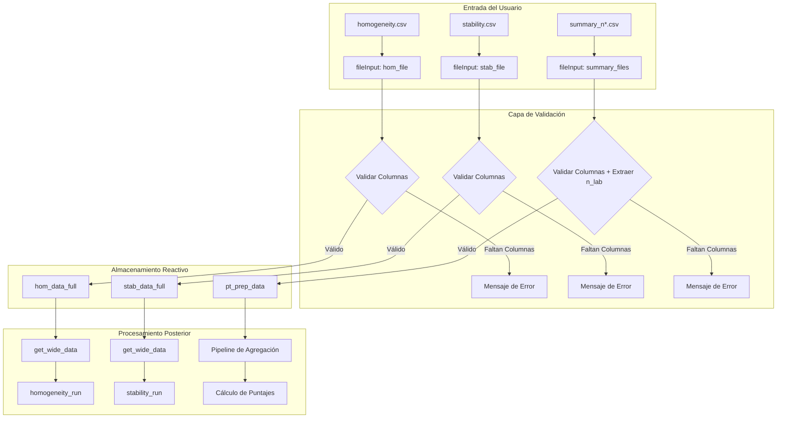
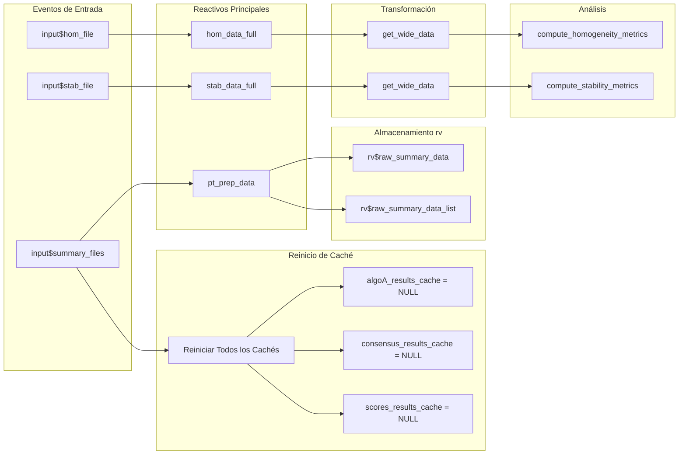

# Módulo: Carga de Datos

## Descripción

Este módulo gestiona la carga inicial y validación de los archivos CSV de entrada. Es el punto de partida para todos los análisis en la aplicación, asegurando la integridad de los datos antes de comenzar cualquier procesamiento estadístico.

---

## Ubicación en el Código

| Elemento | Valor |
|----------|-------|
| Archivo | `cloned_app.R` |
| Líneas | 79 - 156 (función server) |
| UI | `tabPanel("Carga de datos")` |
| Dependencias | `vroom`, `stringr`, `dplyr` |

---

## Diagrama de Flujo de Datos



---

## Archivos de Datos de Ejemplo

La aplicación espera tres tipos de archivos CSV. A continuación se muestran ejemplos basados en la carpeta `data/` del proyecto.

### 1. Datos de Homogeneidad (`homogeneity.csv`)

Contiene mediciones replicadas para cada combinación de contaminante/nivel a través de múltiples ítems (muestras).

```csv
"pollutant","level","replicate","sample_id","value"
"co","0-umol/mol",1,1,0.00670
"co","0-umol/mol",1,2,0.00479
"co","0-umol/mol",2,1,-0.0480
"co","2-umol/mol",1,1,2.01153
```

**Estructura Clave:**
- Cada `sample_id` representa un ítem físico.
- Cada `replicate` (1 o 2) es una medición repetida en el mismo ítem.
- Múltiples valores de `level` por contaminante (ej: "0-umol/mol", "2-umol/mol").

### 2. Datos de Estabilidad (`stability.csv`)

Misma estructura que homogeneidad, pero medido al final del periodo del PT.

```csv
"pollutant","level","replicate","sample_id","value"
"co","0-umol/mol",1,1,-0.0481
"co","0-umol/mol",1,2,0.0051
```

### 3. Datos Resumen de Participantes (`summary_n*.csv`)

Contiene resultados agregados de cada participante. El número `n` en el nombre del archivo se extrae como `n_lab` (número de laboratorios).

**Patrón de Nombre:** `summary_n(\d+).csv`

```csv
"pollutant","level","participant_id","replicate","sample_group","mean_value","sd_value"
"co","0-umol/mol","part_1",2,"1-10",-0.0279,0.0282
"co","0-umol/mol","ref",1,"1-10",-0.0217,0.0275
```

**Nota:** El `participant_id` con valor "ref" designa al laboratorio de referencia.

---

## Reglas de Validación

### 1. Archivos de Homogeneidad y Estabilidad

**Reactivos:** `hom_data_full()` y `stab_data_full()`

| Validación | Regla | Mensaje de Error Mostrado |
|------------|-------|---------------------------|
| Columnas Requeridas | Deben existir `value`, `pollutant`, `level` | "Error: El archivo de homogeneidad debe contener las columnas 'value', 'pollutant' y 'level'." |
| Presencia de Archivo | Debe cargarse mediante `req(input$hom_file)` | Silencioso - sin salida hasta que se carga el archivo |

### 2. Archivos Resumen de Participantes

**Reactivo:** `pt_prep_data()`

| Validación | Regla | Mensaje de Error Mostrado |
|------------|-------|---------------------------|
| Columnas Requeridas | `participant_id`, `pollutant`, `level`, `mean_value`, `sd_value` | "Error: Los archivos resumen deben contener las columnas..." |
| Patrón de Nombre | Debe contener un número para extraer `n_lab` | Valores extraídos vía `str_extract` |
| Datos no vacíos | `data_list` debe tener entradas | Retorna `NULL` si está vacío |

**Lógica de Extracción n_lab:**
```r
n <- as.integer(stringr::str_extract(input$summary_files$name[i], "\\d+"))
df$n_lab <- n
```

---

## Cadena Reactiva Completa



---

## Convenciones de Nombres de Columnas

| Patrón de Columna | Uso | Ejemplo |
|-------------------|-----|---------|
| `sample_*` | Columnas de formato ancho creadas por `pivot_wider` | `sample_1`, `sample_2` |
| `participant_id` | Identificador del laboratorio ("ref" reservado) | `LAB_01`, `ref` |
| `n_lab` | ID del esquema extraído del nombre del archivo | `4`, `7`, `10` |

---

## Explicación de Mensajes de Error Comunes

| Mensaje de Error | Causa | Solución |
|------------------|-------|----------|
| "El archivo de homogeneidad debe contener las columnas..." | Faltan columnas requeridas | Verifique que los nombres coincidan exactamente (mayúsculas/minúsculas). |
| "Los archivos resumen deben contener las columnas..." | Falta columna en archivo resumen | Verifique las 5 columnas requeridas. |
| "No se encontraron datos para el analito" | El filtro retornó vacío | Asegúrese de que el nombre del contaminante en el archivo coincida con el selector. |

---

## Invalidación de Caché

Cuando `input$summary_files` cambia, todos los cachés posteriores se reinician para asegurar que no persistan resultados de cálculos antiguos con datos nuevos.

```r
observeEvent(input$summary_files, {
  algoA_results_cache(NULL)
  # ... otros reinicios ...
}, ignoreNULL = FALSE)
```

---

## Referencias Cruzadas

- **Formatos de Datos:** Ver [01a_data_formats.md](01a_data_formats.md) para el esquema CSV completo.
- **Análisis de Homogeneidad:** Ver [04_pt_homogeneity.md](04_pt_homogeneity.md).
- **Cálculo de Puntajes:** Ver [05_pt_scores.md](05_pt_scores.md).
