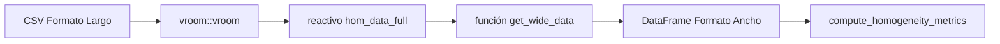

# Formatos de Datos y Pipeline de Transformación

Este documento proporciona una referencia completa de los formatos de datos aceptados por la aplicación y explica la lógica interna de transformación utilizada para preparar los datos para el análisis estadístico ISO 13528/17043.

---

## 1. Referencia Completa del Esquema CSV

### 1.1 Datos de Homogeneidad y Estabilidad

Utilizado para `homogeneity.csv` y `stability.csv`. Este formato representa **Formato Largo** donde cada fila es una medición única.

| Columna | Requerido | Tipo | Descripción | Ejemplos |
|:--------|:---------:|:-----|:------------|:---------|
| `pollutant` | **Sí** | Texto | Identificador del analito (distingue mayúsculas) | `co`, `no`, `so2`, `o3` |
| `level` | **Sí** | Texto | Nivel de concentración con unidades | `0-umol/mol`, `20-nmol/mol` |
| `replicate` | No* | Entero | Número de réplica (típicamente 1 o 2) | `1`, `2` |
| `sample_id` | No | Entero | Identificador del ítem/muestra | `1`, `2` ... `10` |
| `value` | **Sí** | Numérico | Valor de concentración medido | `0.00670`, `19.70` |

> **Nota:** Aunque `replicate` no es verificado por el validador inicial, es **esencial** para la transformación a formato ancho (`pivot_wider`). Sin esta columna, la conversión fallará o producirá resultados inesperados.

#### Ejemplo de Datos Reales

```csv
"pollutant","level","replicate","sample_id","value"
"co","0-umol/mol",1,1,0.00670
"co","0-umol/mol",1,2,0.00479
"co","0-umol/mol",2,1,-0.0480
"co","0-umol/mol",2,2,-0.0488
```

---

### 1.2 Datos Resumen de Participantes

Utilizado para archivos `summary_n*.csv`. Contiene resultados agregados de los participantes del PT.

| Columna | Requerido | Tipo | Descripción | Ejemplos |
|:--------|:---------:|:-----|:------------|:---------|
| `participant_id` | **Sí** | Texto | ID único del laboratorio | `part_1`, `ref`, `LAB_01` |
| `pollutant` | **Sí** | Texto | Identificador del analito | `co`, `so2` |
| `level` | **Sí** | Texto | Nivel de concentración | `0-umol/mol` |
| `mean_value` | **Sí** | Numérico | Media reportada por el participante | `2.01215` |
| `sd_value` | **Sí** | Numérico | Desviación estándar reportada | `0.00360` |
| `replicate` | No | Entero | Número de réplicas | `2`, `3` |
| `sample_group` | No | Texto | Grupo de muestra | `1-10` |

#### Valores Especiales

| Valor | Significado |
|-------|-------------|
| `ref` (en participant_id) | Laboratorio de referencia - usado como valor asignado $x_{pt}$ en el Método 1 |

#### Convención de Nombres de Archivo

El nombre del archivo **debe** contener un número que identifique el esquema (número de laboratorios):

| Patrón | Regex | Ejemplo | `n_lab` Extraído |
|--------|-------|---------|------------------|
| `summary_n4.csv` | `\d+` | `summary_n4.csv` | `4` |
| `summary_n10.csv` | `\d+` | `summary_n10.csv` | `10` |

---

## 2. Pipeline de Transformación de Datos

La aplicación almacena los datos cargados en **Formato Largo** pero requiere **Formato Ancho** para los cálculos de homogeneidad basados en ANOVA según ISO 13528.

### 2.1 Flujo de Transformación



### 2.2 La Función `get_wide_data()`

Ubicación: `cloned_app.R`

Esta función filtra los datos por contaminante y pivota de formato largo a ancho.

```r
get_wide_data <- function(df, target_pollutant) {
  # Paso 1: Filtrar por contaminante
  filtered <- df %>% filter(pollutant == target_pollutant)

  # Paso 2: Retornar NULL si no hay datos
  if (is.null(filtered) || nrow(filtered) == 0) {
    return(NULL)
  }

  # Paso 3: Retornar NULL si falta la columna crítica
  if (!"value" %in% names(filtered)) {
    return(NULL)
  }

  # Paso 4: Pivotar a Formato Ancho
  filtered %>%
    select(-pollutant) %>%
    pivot_wider(
      names_from = replicate,
      values_from = value,
      names_prefix = "sample_"
    )
}
```

### 2.3 Ejemplo de Transformación

**Entrada (Formato Largo):**

| pollutant | level | replicate | sample_id | value |
|-----------|-------|-----------|-----------|-------|
| SO2 | low | 1 | 1 | 0.05 |
| SO2 | low | 2 | 1 | 0.06 |
| SO2 | low | 1 | 2 | 0.07 |
| SO2 | low | 2 | 2 | 0.08 |

**Operación:** `get_wide_data(df, "SO2")`

**Salida (Formato Ancho):**

| level | sample_id | sample_1 | sample_2 |
|-------|-----------|----------|----------|
| low | 1 | 0.05 | 0.06 |
| low | 2 | 0.07 | 0.08 |

---

## 3. Script Generador de Datos de Ejemplo

Utilice este script en R para generar datos ficticios válidos para probar la aplicación.

```r
# Generador de Datos de Homogeneidad
# Configuración
pollutants <- c("co", "no", "so2")
levels <- list(
  co = c("0-umol/mol", "2-umol/mol"),
  no = c("0-nmol/mol", "121-nmol/mol"),
  so2 = c("0-nmol/mol", "50-nmol/mol")
)
n_items <- 10
n_replicates <- 2

# Generar datos
hom_data <- do.call(rbind, lapply(pollutants, function(p) {
  do.call(rbind, lapply(levels[[p]], function(lv) {
    expand.grid(
      pollutant = p,
      level = lv,
      sample_id = 1:n_items,
      replicate = 1:n_replicates,
      stringsAsFactors = FALSE
    )
  }))
}))

# Agregar valores realistas (base + pequeña variación)
# Nota: Esto es solo un ejemplo, ajuste los valores base según necesidad
hom_data$value <- runif(nrow(hom_data), 10, 20)

write.csv(hom_data, "homogeneity_test.csv", row.names = FALSE)
```

---

## 4. Lista de Verificación de Calidad de Datos

Antes de subir archivos, verifique:

### Archivos de Homogeneidad/Estabilidad

- [ ] Nombres de columnas exactos: `pollutant`, `level`, `value`, `replicate`.
- [ ] Columna `value` contiene solo datos numéricos.
- [ ] Los valores de `replicate` son consistentes (típicamente 1 y 2).
- [ ] Codificación del archivo es UTF-8 (para caracteres como "µmol").

### Archivos Resumen

- [ ] Nombres de columnas exactos: `participant_id`, `pollutant`, `level`, `mean_value`, `sd_value`.
- [ ] El nombre del archivo contiene un número (ej: `summary_n4.csv`).
- [ ] Contiene una fila con `participant_id = "ref"` para valores de referencia.

---

## 5. Referencias Cruzadas

- **Módulo de Carga de Datos:** [01_carga_datos.md](01_carga_datos.md)
- **Cálculos de Homogeneidad:** [04_pt_homogeneity.md](04_pt_homogeneity.md)
- **Glosario:** [00_glossary.md](00_glossary.md)
