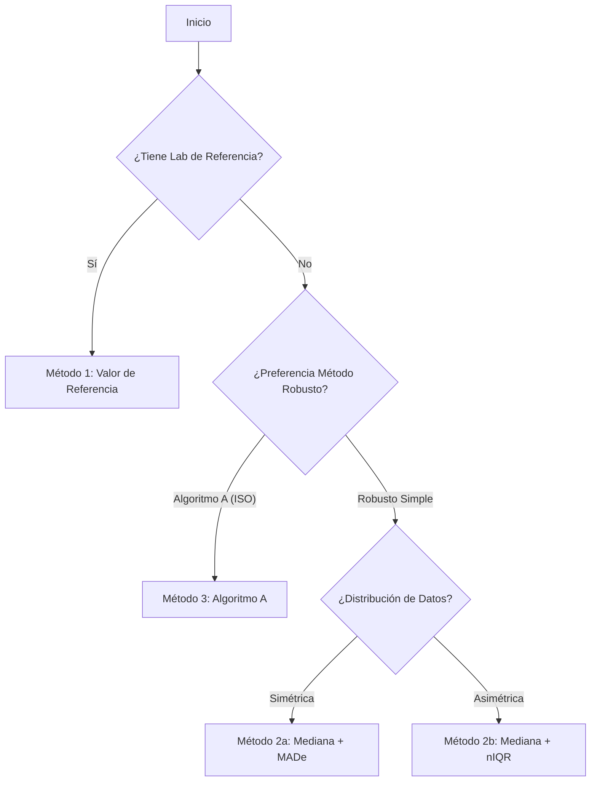

# Módulo Shiny: Valor Asignado ($x_{pt}$)

## 1. Descripción General
Este módulo gestiona el cálculo del valor asignado ($x_{pt}$) y su incertidumbre estándar. Soporta múltiples métodos (Referencia, Consenso, Algoritmo A) y permite al usuario seleccionar el más apropiado para el esquema de ensayo de aptitud.

**Ubicación del Archivo:** `cloned_app.R` (UI: Acordeón en "Valor Asignado")

---

## 2. Diagrama de Flujo de Selección de Método



## 3. Detalles de Implementación

### 3.1 Método 1: Laboratorio de Referencia
*   **Lógica:** Filtra `pt_prep_data` para `participant_id == "ref"`.
*   **Reactivo:** `reference_table_data`.
*   **Validación:** Verifica si "ref" existe en los archivos resumen cargados.

### 3.2 Método 3: Algoritmo A (Interactivo)
Este es el método más complejo ya que es iterativo y se activa mediante un botón específico.

*   **Botón:** `input$algoA_run`
*   **Cadena Reactiva:**
    1.  `observeEvent(input$algoA_run)`: Establece `algoA_trigger`.
    2.  `algoA_result_data`: Escucha el trigger, llama a `ptcalc::run_algorithm_a()`.
    3.  `algoA_results_cache`: Almacena el resultado para evitar re-ejecuciones en actualizaciones menores de la UI.

**Mecanismo de Caché:**
```r
algoA_results_cache <- reactiveVal(NULL)
observeEvent(input$algoA_run, {
  # ... cálculo ...
  algoA_results_cache(result)
})
```

### 3.3 Verificación de Trazabilidad Metrológica
La aplicación calcula la compatibilidad entre la Media de Consenso y la Media de Referencia (si está disponible).

$$D = \frac{|x_{cons} - x_{ref}|}{\sqrt{u_{cons}^2 + u_{ref}^2}}$$

Si $D > 2$, el valor de consenso puede estar sesgado en comparación con la referencia.

---

## 4. Cálculo de Incertidumbre ($u(x_{pt})$)

Para métodos de consenso, la incertidumbre estándar se calcula como:
$$u(x_{pt}) = 1.25 \times \frac{\sigma_{pt}}{\sqrt{p}}$$
Donde $p$ es el número de participantes.

*   **Reactivo:** `consensus_summary_data`.
*   **Salida:** Se muestra en la tabla de resumen junto con $x_{pt}$ y $\sigma_{pt}$.

---

## 5. Referencias Cruzadas

- **Estadísticos Robustos:** [03_pt_robust_stats.md](03_pt_robust_stats.md)
- **Carga de Datos:** [01_carga_datos.md](01_carga_datos.md)
- **Puntajes PT:** [05_pt_scores.md](05_pt_scores.md)
