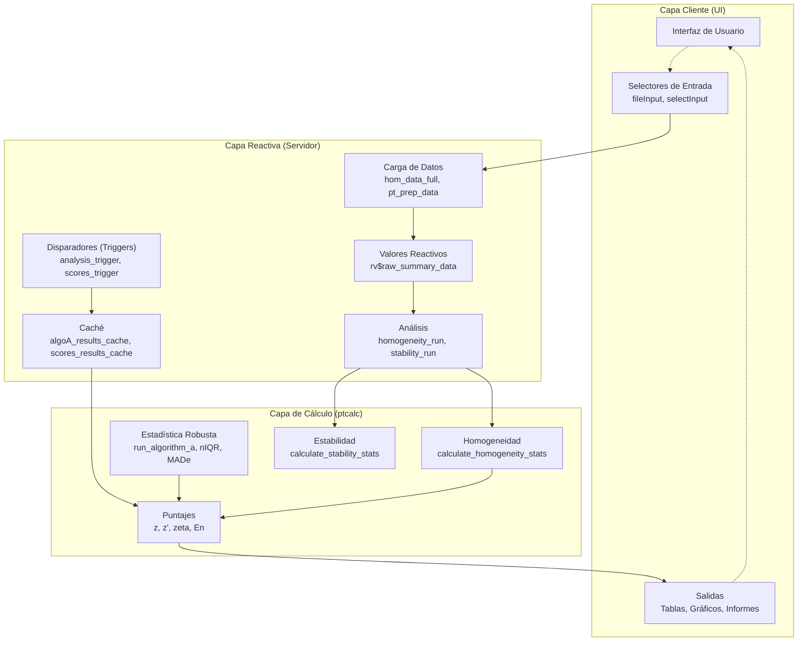
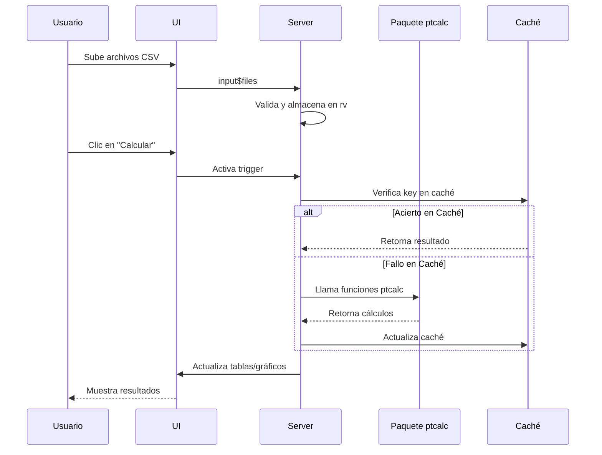

# Arquitectura del Sistema

Este documento proporciona una visión completa de la arquitectura de la aplicación, incluyendo gráficos de dependencia reactiva, estructura de funciones del servidor, estrategias de optimización de rendimiento y patrones de gestión de estado.

---

## Ubicación en el Código

| Elemento | Valor |
|----------|-------|
| Archivo Principal | `cloned_app.R` |
| Líneas | 1 - ~2500 |
| Patrón | MVC (Modelo-Vista-Controlador) con programación reactiva |

---

## Descripción General

La aplicación sigue una arquitectura simplificada Modelo-Vista-Controlador (MVC):

| Capa | Componente | Descripción |
|------|------------|-------------|
| **Vista (UI)** | `fluidPage` con estilos `bslib` | Definición de la interfaz de usuario. |
| **Controlador** | Manejadores reactivos del servidor | Gestión de entradas del usuario y manejo de eventos. |
| **Modelo** | Paquete `ptcalc` + procesadores de datos | Funciones puras y lógica de negocio. |

---

## Gráfico de Dependencia Reactiva Completo



---

## Estructura de la Función Server

La función del servidor está organizada en secciones lógicas:

| Sección | Líneas (aprox.) | Propósito |
|---------|-----------------|-----------|
| **Carga de Datos** | 80-160 | Carga y validación de archivos CSV subidos por el usuario. |
| **Gestión de Caché** | 161-185 | Gestión de disparadores reactivos y almacenes de caché. |
| **Homogeneidad** | 186-320 | Pruebas de homogeneidad basadas en ANOVA. |
| **Estabilidad** | 321-450 | Análisis de estabilidad a corto plazo. |
| **Valor Asignado** | 451-700 | Cálculo de Algoritmo A y valores de consenso. |
| **Puntajes** | 701-1100 | Cálculos de puntajes z, z', zeta, En. |
| **Informe Global** | 1101-1350 | Generación de datos agregados para reportes. |
| **Participantes** | 1351-1600 | Análisis individual por participante. |
| **Generación Informes** | 1601-1850 | Renderizado de plantillas RMarkdown. |
| **Valores Atípicos** | 1851-2100 | Prueba de Grubbs y análisis de atípicos. |

---

## Gestión de Estado

### Valores Reactivos (`rv`)

La aplicación utiliza `reactiveValues` para almacenar estado mutable que persiste a través de evaluaciones reactivas:

| Variable | Tipo | Propósito |
|----------|------|-----------|
| `rv$raw_summary_data` | DataFrame | Almacena datos resumen de participantes cargados. |
| `rv$raw_summary_data_list` | Lista | Almacena referencias individuales de archivos. |

### Patrón Disparador-Caché (Trigger-Cache)

La aplicación utiliza extensivamente `reactiveVal` para almacenar en caché resultados de cálculos costosos, evitando re-ejecuciones innecesarias.

| Variable Caché | Almacena | Disparador | Propósito |
|----------------|----------|------------|-----------|
| `algoA_results_cache` | Resultados Algoritmo A | `algoA_trigger` | Evitar re-ejecutar algoritmo iterativo. |
| `consensus_results_cache` | Estadísticos robustos | `consensus_trigger` | Caché de valores de consenso. |
| `scores_results_cache` | Dataframes de puntajes | `scores_trigger` | Caché de resultados de puntajes. |

**Implementación del Patrón:**

```r
# Inicializar caché
algoA_results_cache <- reactiveVal(NULL)
algoA_trigger <- reactiveVal(NULL)

# Observador: Ejecuta y actualiza caché
observeEvent(input$algoA_run, {
  algoA_trigger(Sys.time())  # Actualizar timestamp

  # Verificar caché
  cache <- algoA_results_cache()
  key <- paste(pollutant, level, sep = "_")

  if (!is.null(cache[[key]])) return() # Ya calculado

  # Calcular y guardar
  result <- ptcalc::run_algorithm_a(data)
  cache[[key]] <- result
  algoA_results_cache(cache)
})
```

---

## Estrategias de Optimización

### 1. Carga de Datos
- Uso de `vroom::vroom()` para lectura rápida de CSV.
- Validación temprana de columnas requeridas para fallar rápido ante datos inválidos.

### 2. Renderizado
- Uso de `DT::renderDataTable` con procesamiento del lado del servidor para tablas grandes.
- Gráficos interactivos con `plotly` para exploración eficiente.

### 3. Cálculos
- **Vectorización:** Todas las funciones de `ptcalc` utilizan operaciones vectorizadas.
- **Caché:** El patrón Trigger-Cache evita recálculos cuando se cambia de pestaña.
- **Separación de Responsabilidades:** La lógica pesada está en el paquete `ptcalc`, optimizada y aislada.

---

## Flujo de Datos entre Módulos



---

## Manejo de Errores

### Capas de Validación

1.  **Validación de Entrada:** Restricciones en la UI (ej: tipos de archivo).
2.  **Validación Reactiva:** Uso de `validate(need(...))` para verificar requisitos de datos antes de procesar.
3.  **Validación del Paquete:** Chequeos internos en `ptcalc` (ej: n < 3 para Algoritmo A).

**Flujo de Propagación:**
`Error Usuario -> Validación UI -> Validación Reactiva -> Error Paquete -> Mensaje en UI`

---

## Referencias Cruzadas

- **Módulo de Datos**: Ver `01_carga_datos.md` para cadenas reactivas de carga.
- **Cálculos**: Ver `03_pt_robust_stats.md` para implementación del Algoritmo A.
- **API del Paquete**: Ver `02_ptcalc_package.md` y `02a_ptcalc_api.md`.
