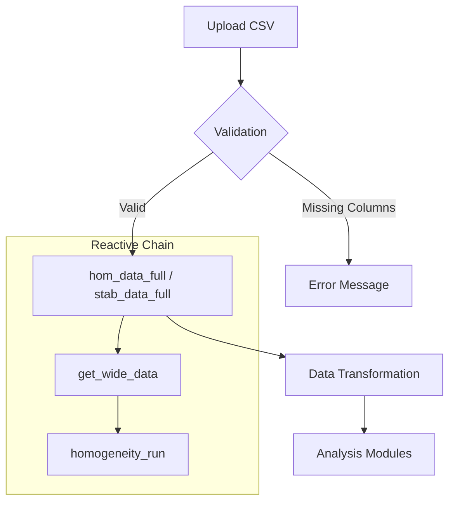

# Module: Data Loading

## Description
This module manages the initial loading and validation of input CSV files. It is the starting point for all analyses in the application, ensuring data integrity before processing.

## Location in Code
| Element | Value |
|---------|-------|
| File | `cloned_app.R` |
| Lines | 79 - 151 |
| UI | `tabPanel("Carga de datos")` |

## Data Flow Diagram



## Example Data Files

To test the application, structure your CSV files as follows:

**homogeneity.csv / stability.csv**
```csv
pollutant,level,replicate,value
SO2,low,1,0.0523
SO2,low,2,0.0528
SO2,medium,1,0.1045
SO2,medium,2,0.1050
```

**summary_n01.csv** (Participant Results)
```csv
participant_id,pollutant,level,mean_value,sd_value
LAB01,SO2,low,0.0525,0.0012
LAB02,SO2,low,0.0530,0.0010
ref,SO2,low,0.0524,0.0005
```

## Validation Rules

The application enforces specific validation rules to prevent runtime errors during analysis.

### 1. Homogeneity & Stability Files
*   **Reactive**: `hom_data_full()`, `stab_data_full()`
*   **Required Columns**: `value`, `pollutant`, `level`
*   **Data Types**: 
    *   `value`: Numeric (measurements)
    *   `pollutant`: Text (analyte code, e.g., "CO")
    *   `level`: Text (concentration level, e.g., "low")
*   **Error Condition**: If any required column is missing, the app stops execution and displays:
    > "Error: El archivo de [tipo] debe contener las columnas 'value', 'pollutant' y 'level'..."

### 2. Participant Summary Files
*   **Reactive**: `pt_prep_data()`
*   **File Name Requirement**: Must contain a number to identify the scheme ID (e.g., `summary_123.csv`). The app extracts this number (`\\d+`) as `n_lab`.
*   **Required Columns**: `participant_id`, `pollutant`, `level`, `mean_value`, `sd_value`
*   **Error Condition**: 
    > "Error: Los archivos resumen deben contener las columnas..."

## Reactive Architecture

The data loading process triggers a chain of reactive expressions:

1.  **Input**: User uploads file via `fileInput` (`input$hom_file`).
2.  **Reading**: `vroom::vroom()` reads the raw CSV.
3.  **Validation**: `validate(need(...))` checks structure.
4.  **Storage**: Valid data is returned by `hom_data_full()` as a dataframe.
5.  **Transformation**: Downstream modules call `get_wide_data(hom_data_full(), "SO2")` to pivot data for analysis.

## Common Error Messages

| Error Message | Cause | Solution |
|---------------|-------|----------|
| `must contain the columns 'value', 'pollutant' and 'level'` | CSV headers are incorrect or case-sensitive mismatch. | Rename columns to exact lowercase matches. |
| `File must be a CSV` | Uploaded non-CSV file or file with wrong extension. | Ensure file ends in `.csv` and is comma-separated. |
| `disconnected from the server` | File might be too large or malformed, causing R crash. | Check for special characters or extremely large files. |
