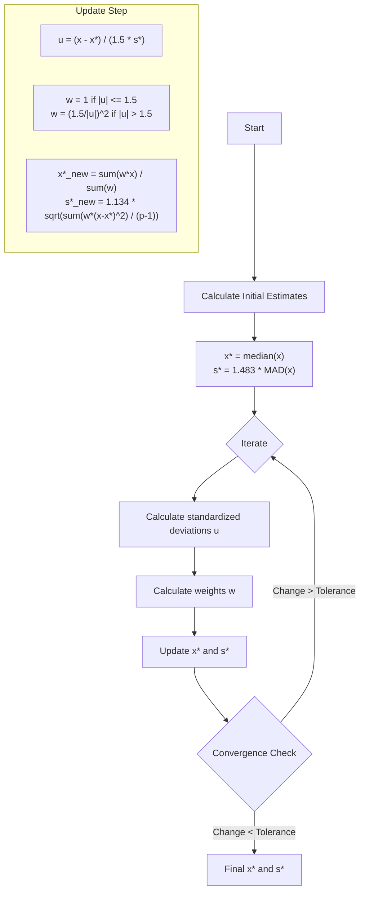

# Robust Statistical Methods (ISO 13528)

## 1. Overview
This module implements robust statistical estimators used to calculate assigned values ($x_{pt}$) and standard deviations ($\sigma_{pt}$) that are resistant to outliers. These methods are fundamental to the proficiency testing analysis, ensuring that extreme values do not distort the evaluation of the group's performance.

**File:** `ptcalc/R/pt_robust_stats.R`

---

## 2. Algorithm A (ISO 13528 Annex C)

Algorithm A is an iterative procedure used to calculate a robust mean ($x^*$) and a robust standard deviation ($s^*$). It is the primary method used in this application when the "Consensus (Algorithm A)" option is selected.

### 2.1 Visual Algorithm Flow

### 2.2 Numerical Example
Let's trace Algorithm A with a small dataset containing an outlier.

**Data:** `x = [10.1, 10.2, 10.3, 10.2, 25.0]` (The 25.0 is an outlier)

**Step 0: Initial Estimates**
*   Median ($x^*_0$) = 10.2
*   Absolute deviations: `|10.1-10.2|=0.1`, `0`, `0.1`, `0`, `14.8`
*   Median Absolute Deviation (MAD): 0.1
*   Robust SD ($s^*_0$) = $1.483 \times 0.1 = 0.1483$

**Step 1: Iteration 1**
*   **Calculate u**: $u_i = (x_i - 10.2) / (1.5 \times 0.1483)$
    *   $u \approx [-0.45, 0, 0.45, 0, 66.5]$
*   **Calculate w (Huber's weights)**: Limit is 1.5.
    *   Values $\le 1.5$ get weight 1.
    *   Outlier ($u=66.5$) gets weight $(1.5 / 66.5)^2 \approx 0.0005$.
    *   Weights $\approx [1, 1, 1, 1, 0.0005]$
*   **Update x\***: Weighted mean is essentially $(10.1+10.2+10.3+10.2)/4 = 10.2$. The outlier 25.0 is effectively ignored.
*   **Update s\***: Weighted SD calculation proceeds similarly.

**Result:** The algorithm rapidly "downweights" the outlier, converging on the properties of the main group (~10.2).

### 2.3 Convergence Behavior
The algorithm usually converges within 5-10 iterations for typical PT data.
*   **Fast Convergence:** Well-behaved data (normal-ish distribution).
*   **Slow/No Convergence:** Bimodal distributions or datasets with very high variance relative to the spread of the core group.
*   **Limit:** The app sets a hard limit of `max_iter` (default 50) to prevent infinite loops.

### 2.4 Edge Cases
| Scenario | Behavior |
|:---|:---|
| **< 2 Participants** | Returns `NA`. Algorithm requires at least 2 points to estimate variance. |
| **All values identical** | $s^* = 0$. Algorithm may fail or return 0 variance. |
| **High outlier ratio (>50%)** | Algorithm A breakdown point is 50%. If >50% data are outliers, the "outliers" become the "consensus". |

---

## 3. Other Robust Estimators

### 3.1 Comparison Table

| Feature | MADe (Median Absolute Deviation) | nIQR (Normalized IQR) | Algorithm A |
|:---|:---|:---|:---|
| **Formula** | $1.483 \times \text{median}(\|x_i - \tilde{x}\|)$ | $0.7413 \times (Q_3 - Q_1)$ | Iterative weighted mean/SD |
| **Complexity** | Low | Low | High (Iterative) |
| **Efficiency** | Lower efficiency for normal data | Medium | Higher efficiency for normal data |
| **Breakdown Point** | 50% | 25% | 50% |
| **Best Use** | Quick estimate of spread; Initial step for Algo A | When distribution is slightly asymmetric | **Primary method for PT consensus value** |

### 3.2 Normalized Interquartile Range (nIQR)
$$nIQR = 0.7413 \times (Q_3 - Q_1)$$
Calculated using the `calculate_niqr(x)` function. It provides a robust standard deviation estimate based on the middle 50% of the data.

### 3.3 Scaled MAD (MADe)
$$MADe = 1.483 \times \text{median}(|x_i - \text{median}(x)|)$$
Calculated using `calculate_mad_e(x)`. It is the most robust simple scale estimator and serves as the starting point for Algorithm A.
