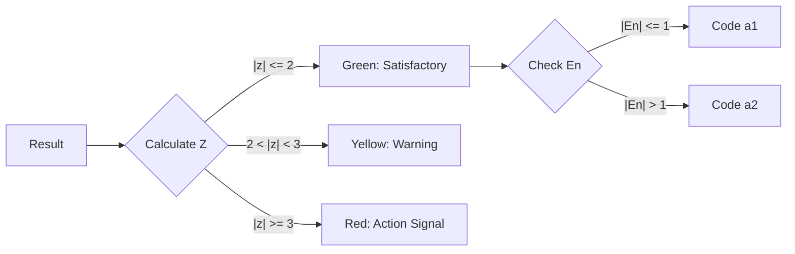

# Performance Scoring & Evaluation

## 1. Overview
This module details the calculation of participant performance scores ($z$, $z'$, $\zeta$, $E_n$) and their classification logic. These scores quantify how well a participant's result aligns with the assigned value.

**File:** `ptcalc/R/pt_scores.R`

---

## 2. Score Definitions & Formulas

### 2.1 z-score
The standard performance metric. Used when the uncertainty of the assigned value is negligible ($u(x_{pt}) \le 0.3 \sigma_{pt}$).
$$z = \frac{x_i - x_{pt}}{\sigma_{pt}}$$

### 2.2 z'-score (z-prime)
Used when the uncertainty of the assigned value is significant ($u(x_{pt}) > 0.3 \sigma_{pt}$). It widens the acceptance limits to account for this uncertainty.
$$z' = \frac{x_i - x_{pt}}{\sqrt{\sigma_{pt}^2 + u(x_{pt})^2}}$$

### 2.3 zeta-score ($\zeta$)
Evaluates the agreement between the participant's result and the assigned value, considering **both** uncertainties ($u(x_i)$ and $u(x_{pt})$). Useful for assessing the validity of a participant's uncertainty estimate.
$$\zeta = \frac{x_i - x_{pt}}{\sqrt{u^2(x_i) + u^2(x_{pt})}}$$

### 2.4 $E_n$ score (Normalized Error)
Similar to zeta-score but uses Expanded Uncertainties ($U = k \cdot u$, usually $k=2$).
$$E_n = \frac{x_i - x_{pt}}{\sqrt{U^2(x_i) + U^2(x_{pt})}}$$

---

## 3. Score Selection Guide

| Condition | Recommended Score | Why? |
|:---|:---|:---|
| **Standard PT** | **z-score** | Standard, comparable across rounds. |
| **High $u(x_{pt})$** | **z'-score** | Prevents penalizing labs for reference value uncertainty. |
| **Uncertainty Check** | **$\zeta$ or $E_n$** | Checks if lab's reported uncertainty is realistic. |

---

## 4. Uncertainty Propagation

The standard uncertainty of the defined value ($u(x_{pt\_def})$) usually includes contributions from characterization (homogeneity and stability).

$$u(x_{pt\_def}) = \sqrt{u(x_{pt})^2 + u_{hom}^2 + u_{stab}^2}$$

*   $u(x_{pt})$: Standard error of the mean (e.g., $1.25 \cdot MAD_e / \sqrt{p}$ for Algorithm A).
*   $u_{hom}$: Between-sample standard deviation ($s_s$).
*   $u_{stab}$: Stability uncertainty contribution.

This combined uncertainty is what enters the $z'$ denominator.

---

## 5. Classification Logic

The application assigns a classification code (`a1` to `a7`) to each participant based on a combined evaluation of their performance score (usually $z'$) and their uncertainty evaluation ($E_n$).

### 5.1 Classification Codes Table

| Code | Evaluation | $z'$ Condition | $E_n$ Condition | Interpretation |
|:---:|:---|:---|:---|:---|
| **a1** | **Excellent** | $|z'| \le 2$ | $|E_n| \le 1$ | Result is accurate and reported uncertainty is valid. |
| **a2** | Good | $|z'| \le 2$ | $|E_n| > 1$ | Accurate result, but reported uncertainty is likely too small (underestimated). |
| **a3** | Acceptable | $|z'| \le 2$ | N/A | Accurate result (no uncertainty info provided). |
| **a4** | **Warning** | $2 < |z'| < 3$ | $|E_n| \le 1$ | Result shows bias, but it is covered by the reported uncertainty. |
| **a5** | Warning | $2 < |z'| < 3$ | $|E_n| > 1$ | Result shows bias and uncertainty is not properly estimated. |
| **a6** | **Action** | $|z'| \ge 3$ | $|E_n| \le 1$ | Result is an outlier, but the lab's large uncertainty covers it (uncommon). |
| **a7** | **Action** | $|z'| \ge 3$ | $|E_n| > 1$ | Result is an outlier and uncertainty does not explain the deviation. Critical failure. |

### 5.2 Color Palette Reference

These colors are used in the heatmaps and results tables.

| Status | Color Code | Description |
|:---|:---|:---|
| **Satisfactory** | `#4DB848` (Green) | $|z| \le 2$ |
| **Questionable** | `#FDB913` (Yellow) | $2 < |z| < 3$ |
| **Unsatisfactory** | `#E03C31` (Red) | $|z| \ge 3$ |

### 5.3 Visual Interpretation

