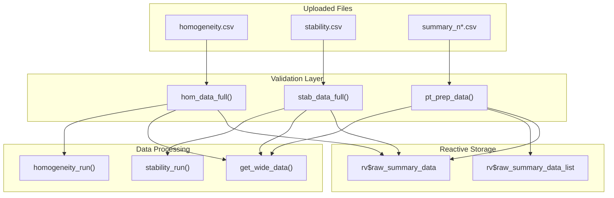
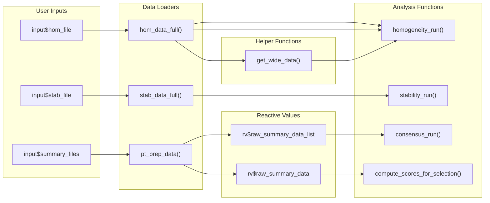

# Module: Data Loading (Carga de Datos)

This module manages the loading and validation of input CSV files. It is the entry point for all analyses in the application.

---

## Location in Code

| Element | Value |
|---------|-------|
| File | `cloned_app.R` |
| Lines | 79 - 156 |
| UI | `tabPanel("Carga de datos")` |

---

## Data Flow Overview



---

## Main Reactives

### `hom_data_full()`
| Property | Value |
|-----------|-------|
| Description | Loads and validates the homogeneity file |
| Depends on | `input$hom_file` |
| Returns | DataFrame with columns `value`, `pollutant`, `level` |
| Validation | Requires columns: `value`, `pollutant`, `level` |

**Implementation:**
```r
hom_data_full <- reactive({
  req(input$hom_file)
  df <- vroom::vroom(input$hom_file$datapath, show_col_types = FALSE)
  validate(
    need(
      all(c("value", "pollutant", "level") %in% names(df)),
      "Error: El archivo de homogeneidad debe contener las columnas 'value', 'pollutant' y 'level'."
    )
  )
  df
})
```

### `stab_data_full()`
| Property | Value |
|-----------|-------|
| Description | Loads and validates the stability file |
| Depends on | `input$stab_file` |
| Returns | DataFrame with columns `value`, `pollutant`, `level` |
| Validation | Requires columns: `value`, `pollutant`, `level` |

**Implementation:**
```r
stab_data_full <- reactive({
  req(input$stab_file)
  df <- vroom::vroom(input$stab_file$datapath, show_col_types = FALSE)
  validate(
    need(
      all(c("value", "pollutant", "level") %in% names(df)),
      "Error: El archivo de estabilidad debe contener las columnas 'value', 'pollutant' y 'level'."
    )
  )
  df
})
```

### `pt_prep_data()`
| Property | Value |
|-----------|-------|
| Description | Consolidates participant summary files |
| Depends on | `input$summary_files` |
| Returns | Aggregated DataFrame grouped by `participant_id`, `pollutant`, `level`, `n_lab` |
| Validation | Requires columns: `participant_id`, `pollutant`, `level`, `mean_value`, `sd_value` |

**Implementation:**
```r
pt_prep_data <- reactive({
  req(input$summary_files)

  data_list <- lapply(seq_len(nrow(input$summary_files)), function(i) {
    df <- vroom::vroom(input$summary_files$datapath[i], show_col_types = FALSE)
    n <- as.integer(stringr::str_extract(input$summary_files$name[i], "\\d+"))
    df$n_lab <- n
    return(df)
  })

  if (length(data_list) == 0) {
    return(NULL)
  }

  raw_data <- do.call(rbind, data_list)
  if (is.null(raw_data) || nrow(raw_data) == 0) {
    return(NULL)
  }

  validate(
    need(
      all(c("participant_id", "pollutant", "level", "mean_value", "sd_value") %in% names(raw_data)),
      "Error: Los archivos resumen deben contener las columnas 'participant_id', 'pollutant', 'level', 'mean_value' y 'sd_value'."
    )
  )

  rv$raw_summary_data <- raw_data

  data_list <- lapply(seq_len(nrow(input$summary_files)), function(i) {
    vroom::vroom(input$summary_files$datapath[i], show_col_types = FALSE)
  })
  rv$raw_summary_data_list <- data_list

  raw_data %>%
    group_by(participant_id, pollutant, level, n_lab) %>%
    summarise(
      mean_value = mean(mean_value, na.rm = TRUE),
      sd_value = mean(sd_value, na.rm = TRUE),
      .groups = "drop"
    )
})
```

---

## Example Data Files

### Homogeneity File (homogeneity.csv)

**Format:** Long format, one row per measurement

```csv
pollutant,level,replicate,sample_id,value
so2,20-nmol/mol,1,1,19.70
so2,20-nmol/mol,1,2,19.72
so2,20-nmol/mol,1,3,19.71
so2,20-nmol/mol,2,1,19.68
so2,20-nmol/mol,2,2,19.69
co,2-μmol/mol,1,1,2.0115
co,2-μmol/mol,1,2,2.0162
o3,120-nmol/mol,1,1,120.7152
o3,120-nmol/mol,1,2,119.0554
```

**Required columns:**
- `pollutant`: Pollutant name (e.g., "so2", "co", "o3", "no", "no2")
- `level`: Concentration level (e.g., "20-nmol/mol", "2-μmol/mol")
- `value`: Numeric measurement value

**Optional columns:**
- `replicate`: Replicate number (1, 2, 3, ...)
- `sample_id`: Sample identifier (1, 2, 3, ...)

### Stability File (stability.csv)

Same format as homogeneity file:

```csv
pollutant,level,replicate,sample_id,value
so2,20-nmol/mol,1,1,19.70
so2,20-nmol/mol,1,2,19.72
so2,20-nmol/mol,2,1,19.68
so2,20-nmol/mol,2,2,19.69
```

### Summary Files (summary_n*.csv)

**Format:** Summary statistics per participant

```csv
pollutant,level,participant_id,replicate,sample_group,mean_value,sd_value
so2,20-nmol/mol,part_1,2,1-10,19.73,0.046
so2,20-nmol/mol,part_1,2,11-20,19.70,0.050
so2,20-nmol/mol,part_1,2,21-30,19.74,0.033
so2,20-nmol/mol,part_2,3,1-10,19.73,0.038
so2,20-nmol/mol,part_2,3,11-20,19.73,0.043
so2,20-nmol/mol,ref,1,1-10,19.74,0.045
```

**Required columns:**
- `pollutant`: Pollutant name
- `level`: Concentration level
- `participant_id`: Laboratory identifier (e.g., "part_1", "part_2", "ref")
- `mean_value`: Mean value from participant measurements
- `sd_value`: Standard deviation of participant measurements

**Optional columns:**
- `replicate`: Number of replicates used
- `sample_group`: Group identifier for measurements (e.g., "1-10", "11-20")

---

## File Naming Convention

### Summary Files

**Pattern:** `summary_n{number}.csv`

**Regex:** `summary_(\d+)\.csv`

**Examples:**
- `summary_n4.csv` - Summary for 4 participants
- `summary_n7.csv` - Summary for 7 participants
- `summary_n10.csv` - Summary for 10 participants
- `summary_n13.csv` - Summary for 13 participants

The number is extracted automatically using:
```r
n <- as.integer(stringr::str_extract(input$summary_files$name[i], "\\d+"))
```

---

## Data Validation Rules

### Homogeneity/Stability Files

| Validation | Rule | Error Message |
|-------------|------|---------------|
| Required Columns | Must have `value`, `pollutant`, `level` | "Error: El archivo debe contener las columnas 'value', 'pollutant' y 'level'." |
| File Format | Must be valid CSV | "Error reading CSV file" |
| Data Types | `value` must be numeric | Numeric conversion error |
| File Upload | File must be selected | Application waits for input |

### Summary Files

| Validation | Rule | Error Message |
|-------------|------|---------------|
| Required Columns | Must have `participant_id`, `pollutant`, `level`, `mean_value`, `sd_value` | "Error: Los archivos resumen deben contener las columnas..." |
| File Naming | Must follow `summary_n*.csv` pattern | Number extraction fails |
| Non-empty | Must have data rows | Returns NULL |
| Participant ID | Can include "ref" for reference lab | Accepted |

---

## Error Messages and Solutions

### "Error: El archivo de homogeneidad debe contener las columnas 'value', 'pollutant' y 'level'."

**Cause:** Missing required columns in the CSV file.

**Solution:**
1. Open your CSV file
2. Ensure the header row contains: `pollutant,level,value`
3. Check for extra spaces or typos (e.g., "Pollutant" vs "pollutant")
4. Save as UTF-8 encoded CSV

**Example correct header:**
```csv
pollutant,level,replicate,sample_id,value
```

### "Error: El archivo de estabilidad debe contener las columnas 'value', 'pollutant' y 'level'."

**Cause:** Same as homogeneity file error.

**Solution:** Same as above.

### "Error: Los archivos resumen deben contener las columnas 'participant_id', 'pollutant', 'level', 'mean_value' y 'sd_value'."

**Cause:** Missing required columns in summary file(s).

**Solution:**
1. Check summary file headers
2. Ensure all required columns are present:
   - `participant_id`
   - `pollutant`
   - `level`
   - `mean_value`
   - `sd_value`

**Example correct header:**
```csv
pollutant,level,participant_id,replicate,sample_group,mean_value,sd_value
```

### Application shows empty tables after upload

**Cause:** File uploaded but data didn't pass validation or is empty.

**Solution:**
1. Check that file has data rows (not just header)
2. Verify file encoding is UTF-8
3. Open CSV in text editor to check format
4. Look for any validation error messages in red

### Participant data not appearing in analysis

**Cause:** `participant_id` or `pollutant` values don't match between files.

**Solution:**
1. Ensure `pollutant` names are consistent (e.g., "so2" not "SO2" or "sulphur")
2. Check `participant_id` spelling (case-sensitive)
3. Verify `level` format matches (e.g., "20-nmol/mol" vs "20 nmol/mol")

---

## Column Naming Conventions

### Pollutant Names

Use lowercase pollutant codes:

| Pollutant | Correct | Incorrect |
|-----------|---------|------------|
| Sulfur dioxide | `so2` | `SO2`, `Sulfur`, `sulphur_dioxide` |
| Carbon monoxide | `co` | `CO`, `carbon_monoxide` |
| Ozone | `o3` | `O3`, `Ozone`, `ozone` |
| Nitric oxide | `no` | `NO`, `nitric_oxide` |
| Nitrogen dioxide | `no2` | `NO2`, `nitrogen_dioxide` |

### Level Names

Use format: `{value}-{unit}`

| Example | Correct | Incorrect |
|---------|---------|------------|
| Zero level | `0-nmol/mol` | `0`, `zero`, `blank` |
| Low concentration | `20-nmol/mol` | `20`, `20 nmol/mol`, `low` |
| High concentration | `180-nmol/mol` | `180`, `180 nmol/mol`, `high` |
| Micro units | `2-μmol/mol` | `2-umol/mol`, `2uM` |

### Sample Column Names (After `get_wide_data()`)

After transforming to wide format, replicate columns are named:

| Original | Transformed |
|----------|-------------|
| `replicate` = 1 | `sample_1` |
| `replicate` = 2 | `sample_2` |
| `replicate` = 3 | `sample_3` |

---

## Complete Reactive Chain



---

## Helper Functions

### `get_wide_data(df, target_pollutant)`

**Description:** Transforms long-format data to wide format for ANOVA analysis.

**Location:** Lines 227-238 in `cloned_app.R`

**Implementation:**
```r
get_wide_data <- function(df, target_pollutant) {
  filtered <- df %>% filter(pollutant == target_pollutant)
  if (is.null(filtered) || nrow(filtered) == 0) {
    return(NULL)
  }
  if (!"value" %in% names(filtered)) {
    return(NULL)
  }
  filtered %>%
    select(-pollutant) %>%
    pivot_wider(names_from = replicate, values_from = value, names_prefix = "sample_")
}
```

**Input Example (Long Format):**
```r
# pollutant,level,replicate,value
# so2,20-nmol/mol,1,19.70
# so2,20-nmol/mol,2,19.68
# so2,20-nmol/mol,1,19.72
```

**Output Example (Wide Format):**
```r
# level,replicate,sample_1,sample_2
# 20-nmol/mol,1,19.70,19.68
# 20-nmol/mol,2,19.72,19.69
```

**Parameters:**
- `df`: Input data frame with long format
- `target_pollutant`: Pollutant name to filter (e.g., "so2")

**Returns:**
- Data frame in wide format with `sample_1`, `sample_2`, ... columns
- `NULL` if pollutant not found or `value` column missing

---

## Cross-References

- **Data Format Reference:** [01a_data_formats.md](01a_data_formats.md)
- **Homogeneity Analysis:** [04_pt_homogeneity.md](cloned_docs/04_pt_homogeneity.md)
- **PT Scores:** [05_pt_scores.md](cloned_docs/05_pt_scores.md)
- **Quick Start Guide:** [00_quickstart.md](00_quickstart.md)
- **Glossary:** [00_glossary.md](00_glossary.md)
