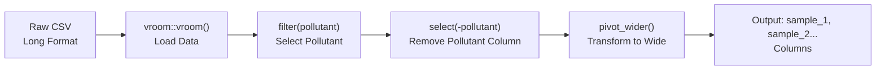

# Data Formats Reference

This document provides complete specifications for all data file formats used in the application.

---

## Overview

The application uses three types of CSV files:

1. **Homogeneity file** - Tests sample uniformity within a batch
2. **Stability file** - Tests sample consistency over time
3. **Summary files** - Participant measurement summaries

All files use UTF-8 encoding and comma-separated values format.

---

## File Format Summary

| File Type | Format | Required Columns | Optional Columns |
|-----------|--------|------------------|------------------|
| Homogeneity | Long | `pollutant`, `level`, `value` | `replicate`, `sample_id` |
| Stability | Long | `pollutant`, `level`, `value` | `replicate`, `sample_id` |
| Summary | Long/Summary | `pollutant`, `level`, `participant_id`, `mean_value`, `sd_value` | `replicate`, `sample_group` |

---

## Complete CSV Schema

### Homogeneity/Stability File Schema

```
pollutant,level,replicate,sample_id,value
<text>,<text>,<integer>,<integer>,<numeric>
```

| Column | Type | Required | Description | Valid Values |
|--------|------|----------|-------------|--------------|
| `pollutant` | text | Yes | Pollutant identifier | `so2`, `co`, `o3`, `no`, `no2` |
| `level` | text | Yes | Concentration level | e.g., `20-nmol/mol`, `2-μmol/mol` |
| `replicate` | integer | No | Replicate number | `1`, `2`, `3`, ... |
| `sample_id` | integer | No | Sample identifier | `1`, `2`, `3`, ... |
| `value` | numeric | Yes | Measured value | Any real number |

**Full Example:**
```csv
pollutant,level,replicate,sample_id,value
so2,20-nmol/mol,1,1,19.70235
so2,20-nmol/mol,1,2,19.72471
so2,20-nmol/mol,1,3,19.70706
so2,20-nmol/mol,1,4,19.75882
so2,20-nmol/mol,1,5,19.75765
so2,20-nmol/mol,1,6,19.73176
so2,20-nmol/mol,1,7,19.71765
so2,20-nmol/mol,1,8,19.68941
so2,20-nmol/mol,1,9,19.66118
so2,20-nmol/mol,1,10,19.72235
so2,20-nmol/mol,2,1,19.67882
so2,20-nmol/mol,2,2,19.67765
so2,20-nmol/mol,2,3,19.70353
so2,20-nmol/mol,2,4,19.72471
so2,20-nmol/mol,2,5,19.74824
so2,20-nmol/mol,2,6,19.71059
co,2-μmol/mol,1,1,2.01154
co,2-μmol/mol,1,2,2.01617
co,2-μmol/mol,1,3,2.02053
co,2-μmol/mol,1,4,2.01064
o3,120-nmol/mol,1,1,120.71523
o3,120-nmol/mol,1,2,119.05542
o3,120-nmol/mol,1,3,119.01107
```

### Summary File Schema

```
pollutant,level,participant_id,replicate,sample_group,mean_value,sd_value
<text>,<text>,<text>,<integer>,<text>,<numeric>,<numeric>
```

| Column | Type | Required | Description | Valid Values |
|--------|------|----------|-------------|--------------|
| `pollutant` | text | Yes | Pollutant identifier | `so2`, `co`, `o3`, `no`, `no2` |
| `level` | text | Yes | Concentration level | e.g., `20-nmol/mol`, `2-μmol/mol` |
| `participant_id` | text | Yes | Laboratory ID | `part_1`, `part_2`, `ref`, etc. |
| `replicate` | integer | No | Number of replicates used | `1`, `2`, `3`, ... |
| `sample_group` | text | No | Measurement group | e.g., `1-10`, `11-20`, `21-30` |
| `mean_value` | numeric | Yes | Participant's mean value | Any real number |
| `sd_value` | numeric | Yes | Participant's standard deviation | Non-negative number |

**Full Example:**
```csv
pollutant,level,participant_id,replicate,sample_group,mean_value,sd_value
so2,20-nmol/mol,part_1,2,1-10,19.73129,0.04615
so2,20-nmol/mol,part_1,2,11-20,19.70635,0.05271
so2,20-nmol/mol,part_1,2,21-30,19.74106,0.03301
so2,20-nmol/mol,part_2,3,1-10,19.73047,0.03797
so2,20-nmol/mol,part_2,3,11-20,19.73047,0.04288
so2,20-nmol/mol,part_2,3,21-30,19.71553,0.03899
so2,20-nmol/mol,part_3,4,1-10,19.74200,0.04428
so2,20-nmol/mol,part_3,4,11-20,19.71188,0.04459
so2,20-nmol/mol,part_3,4,21-30,19.72800,0.06208
so2,20-nmol/mol,ref,1,1-10,19.73835,0.04503
so2,20-nmol/mol,ref,1,11-20,19.74000,0.03141
so2,20-nmol/mol,ref,1,21-30,19.71459,0.05730
co,2-μmol/mol,part_1,2,1-10,2.01215,0.00360
co,2-μmol/mol,part_1,2,11-20,2.01724,0.00320
co,2-μmol/mol,ref,1,1-10,2.01367,0.00408
```

---

## Pollutant Codes

### Supported Pollutants

| Code | English Name | Chemical Formula | Typical Units |
|------|-------------|------------------|---------------|
| `so2` | Sulfur dioxide | SO₂ | nmol/mol, μmol/mol |
| `co` | Carbon monoxide | CO | μmol/mol |
| `o3` | Ozone | O₃ | nmol/mol |
| `no` | Nitric oxide | NO | nmol/mol |
| `no2` | Nitrogen dioxide | NO₂ | nmol/mol |

**Important:** Use lowercase codes only. The application is case-sensitive.

### Common Level Values

| Pollutant | Typical Levels | Example Format |
|-----------|----------------|----------------|
| SO2 | 0, 20, 60, 61, 100, 140, 180 nmol/mol | `0-nmol/mol`, `20-nmol/mol`, `180-nmol/mol` |
| CO | 0, 2, 4, 6, 8 μmol/mol | `0-μmol/mol`, `2-μmol/mol`, `8-μmol/mol` |
| O3 | 0, 40, 80, 120, 180 nmol/mol | `0-nmol/mol`, `120-nmol/mol`, `180-nmol/mol` |
| NO | 0, 42, 81, 82, 121, 122, 180, 181, 182 nmol/mol | `42-nmol/mol`, `121-nmol/mol` |
| NO2 | 0, 30, 60, 90, 120 nmol/mol | `30-nmol/mol`, `90-nmol/mol` |

---

## Participant ID Convention

| ID Pattern | Meaning | Example |
|------------|---------|---------|
| `part_N` | Regular participant N | `part_1`, `part_2`, `part_13` |
| `ref` | Reference laboratory | `ref` |
| Custom | Any identifier | `LAB01`, `Lab_A`, `participant-3` |

**Note:** The `ref` participant is automatically excluded from PT score calculations but included for consensus calculations.

---

## Sample Data Generator Script

Below is an R script to generate synthetic test data for all file types:

```r
# ============================================================================
# Sample Data Generator for PT Application
# ============================================================================

library(tidyverse)

set.seed(42)

# Configuration
n_samples <- 10          # Number of samples per replicate
n_replicates <- 2       # Number of replicates
n_participants <- 4     # Number of participants
n_groups <- 3           # Number of sample groups for summary file

# Define pollutants and levels
pollutants <- list(
  so2 = list(
    levels = c("0-nmol/mol", "20-nmol/mol", "60-nmol/mol", "100-nmol/mol", "140-nmol/mol", "180-nmol/mol"),
    target_values = c(0, 20, 60, 100, 140, 180),
    noise = 0.05
  ),
  co = list(
    levels = c("0-μmol/mol", "2-μmol/mol", "4-μmol/mol", "6-μmol/mol", "8-μmol/mol"),
    target_values = c(0, 2, 4, 6, 8),
    noise = 0.005
  ),
  o3 = list(
    levels = c("0-nmol/mol", "40-nmol/mol", "80-nmol/mol", "120-nmol/mol", "180-nmol/mol"),
    target_values = c(0, 40, 80, 120, 180),
    noise = 0.06
  ),
  no = list(
    levels = c("0-nmol/mol", "42-nmol/mol", "81-nmol/mol", "82-nmol/mol", "121-nmol/mol", "122-nmol/mol", 
               "180-nmol/mol", "181-nmol/mol", "182-nmol/mol"),
    target_values = c(0, 42, 81, 82, 121, 122, 180, 181, 182),
    noise = 0.12
  ),
  no2 = list(
    levels = c("0-nmol/mol", "30-nmol/mol", "60-nmol/mol", "90-nmol/mol", "120-nmol/mol"),
    target_values = c(0, 30, 60, 90, 120),
    noise = 0.04
  )
)

# ============================================================================
# Generate Homogeneity Data
# ============================================================================

generate_homogeneity <- function(pollutants) {
  data_list <- list()
  
  for (pol_name in names(pollutants)) {
    pol <- pollutants[[pol_name]]
    
    for (i in seq_along(pol$levels)) {
      target <- pol$target_values[i]
      level <- pol$levels[i]
      
      for (rep in 1:n_replicates) {
        for (sample in 1:n_samples) {
          # Add small random noise
          noise <- rnorm(1, mean = 0, sd = pol$noise * target)
          value <- target + noise
          
          data_list[[length(data_list) + 1]] <- data.frame(
            pollutant = pol_name,
            level = level,
            replicate = rep,
            sample_id = sample,
            value = round(value, 5)
          )
        }
      }
    }
  }
  
  bind_rows(data_list)
}

homogeneity_data <- generate_homogeneity(pollutants)
write_csv(homogeneity_data, "homogeneity_generated.csv")
cat("Generated homogeneity_data.csv with", nrow(homogeneity_data), "rows\n")

# ============================================================================
# Generate Stability Data
# ============================================================================

stability_data <- generate_homogeneity(pollutants)
write_csv(stability_data, "stability_generated.csv")
cat("Generated stability_data.csv with", nrow(stability_data), "rows\n")

# ============================================================================
# Generate Participant Summary Data
# ============================================================================

generate_summary <- function(pollutants, n_participants, n_groups) {
  data_list <- list()
  
  # Participant IDs
  participant_ids <- c("ref", paste0("part_", 1:(n_participants - 1)))
  
  for (pol_name in names(pollutants)) {
    pol <- pollutants[[pol_name]]
    
    for (i in seq_along(pol$levels)) {
      target <- pol$target_values[i]
      level <- pol$levels[i]
      
      for (participant_id in participant_ids) {
        # Reference lab has less bias
        lab_bias <- ifelse(participant_id == "ref", 0, runif(1, -0.02, 0.02) * target)
        lab_noise <- runif(1, 0.8, 1.5) * pol$noise * target
        
        for (group in 1:n_groups) {
          # Different groups have slight variations
          group_bias <- runif(1, -0.01, 0.01) * target
          
          n_rep <- sample(1:4, 1)  # Random replicates
          mean_val <- target + lab_bias + group_bias + rnorm(1, 0, lab_noise / sqrt(n_rep))
          sd_val <- lab_noise / sqrt(n_rep)
          
          sample_group <- ifelse(group == 1, "1-10", 
                               ifelse(group == 2, "11-20", "21-30"))
          
          data_list[[length(data_list) + 1]] <- data.frame(
            pollutant = pol_name,
            level = level,
            participant_id = participant_id,
            replicate = n_rep,
            sample_group = sample_group,
            mean_value = round(mean_val, 5),
            sd_value = round(sd_val, 5)
          )
        }
      }
    }
  }
  
  bind_rows(data_list)
}

summary_data <- generate_summary(pollutants, n_participants, n_groups)
write_csv(summary_data, paste0("summary_n", n_participants, "_generated.csv"))
cat("Generated summary_n", n_participants, "_generated.csv with", nrow(summary_data), "rows\n")

# ============================================================================
# Summary
# ============================================================================

cat("\n=== Generation Complete ===\n")
cat("Files created:\n")
cat("  - homogeneity_generated.csv\n")
cat("  - stability_generated.csv\n")
cat("  - summary_n", n_participants, "_generated.csv\n")
```

**Usage:**
1. Save the script as `generate_data.R`
2. Run in R: `source("generate_data.R")`
3. Upload the generated CSV files to the application

---

## Data Transformation Pipeline

### Long to Wide Format

The application transforms long-format data to wide format for ANOVA calculations.

**Original (Long Format):**
```csv
pollutant,level,replicate,sample_id,value
so2,20-nmol/mol,1,1,19.70
so2,20-nmol/mol,1,2,19.72
so2,20-nmol/mol,2,1,19.68
so2,20-nmol/mol,2,2,19.69
```

**Transformed (Wide Format):**
```csv
level,replicate,sample_1,sample_2
20-nmol/mol,1,19.70,19.72
20-nmol/mol,2,19.68,19.69
```

### Transformation Flow



---

## `get_wide_data()` Function Explanation

**Location:** Lines 227-238 in `cloned_app.R`

### Function Signature

```r
get_wide_data <- function(df, target_pollutant)
```

### Parameters

| Parameter | Type | Description |
|-----------|------|-------------|
| `df` | DataFrame | Input data frame in long format |
| `target_pollutant` | string | Pollutant name to filter (e.g., "so2") |

### Return Value

| Value | Condition |
|-------|-----------|
| Wide format DataFrame | Success |
| `NULL` | Pollutant not found or `value` column missing |

### Implementation

```r
get_wide_data <- function(df, target_pollutant) {
  # Step 1: Filter by pollutant
  filtered <- df %>% filter(pollutant == target_pollutant)
  
  # Step 2: Check if data exists
  if (is.null(filtered) || nrow(filtered) == 0) {
    return(NULL)
  }
  
  # Step 3: Check for required column
  if (!"value" %in% names(filtered)) {
    return(NULL)
  }
  
  # Step 4: Remove pollutant column and pivot to wide format
  filtered %>%
    select(-pollutant) %>%
    pivot_wider(names_from = replicate, values_from = value, names_prefix = "sample_")
}
```

### Step-by-Step Example

**Input Data:**
```r
df <- tribble(
  ~pollutant, ~level,           ~replicate, ~value,
  "so2",      "20-nmol/mol",    1,          19.70,
  "so2",      "20-nmol/mol",    2,          19.68,
  "so2",      "20-nmol/mol",    1,          19.72,
  "so2",      "20-nmol/mol",    2,          19.69,
  "co",       "2-μmol/mol",     1,          2.01
)
```

**Step 1: Filter by pollutant**
```r
filtered <- df %>% filter(pollutant == "so2")
# Result: Only SO2 rows
```

**Step 2: Check if data exists**
```r
nrow(filtered)  # Returns 4 (not NULL)
```

**Step 3: Check for value column**
```r
"value" %in% names(filtered)  # Returns TRUE
```

**Step 4: Transform to wide**
```r
filtered %>%
  select(-pollutant) %>%  # Remove pollutant column
  pivot_wider(names_from = replicate, values_from = value, names_prefix = "sample_")
```

**Output:**
```r
# A tibble: 2 × 4
  level         replicate sample_1 sample_2
  <chr>             <dbl>    <dbl>    <dbl>
1 20-nmol/mol           1    19.70    19.68
2 20-nmol/mol           2    19.72    19.69
```

### Error Handling

| Scenario | Return | Reason |
|----------|---------|--------|
| Pollutant not in data | `NULL` | `nrow(filtered) == 0` |
| `value` column missing | `NULL` | Required for pivot |
| Empty input | `NULL` | `nrow(df) == 0` |

### Usage in Application

The function is used in:
- `compute_homogeneity_metrics()` (line 242)
- `compute_stability_metrics()` (similar)

**Example call:**
```r
wide_df <- get_wide_data(hom_data_full(), "so2")
```

---

## Data Validation Checklist

Use this checklist before uploading files:

### Homogeneity/Stability Files

- [ ] File saved as CSV (UTF-8)
- [ ] Header row present
- [ ] Required columns: `pollutant`, `level`, `value`
- [ ] Pollutant codes are lowercase
- [ ] Level format matches: `value-unit` (e.g., `20-nmol/mol`)
- [ ] `value` column contains only numeric data
- [ ] No empty rows between data rows
- [ ] At least 2 replicates per level
- [ ] At least 2 samples per replicate

### Summary Files

- [ ] File saved as CSV (UTF-8)
- [ ] Header row present
- [ ] Required columns: `participant_id`, `pollutant`, `level`, `mean_value`, `sd_value`
- [ ] File name follows pattern: `summary_n*.csv`
- [ ] `sd_value` values are non-negative
- [ ] At least one row with `participant_id == "ref"`
- [ ] Consistent pollutant and level names across files

---

## Cross-References

- **Data Loading Module:** [01_carga_datos.md](01_carga_datos.md)
- **Quick Start:** [00_quickstart.md](00_quickstart.md)
- **Glossary:** [00_glossary.md](00_glossary.md)
- **Homogeneity Analysis:** [04_pt_homogeneity.md](cloned_docs/04_pt_homogeneity.md)
