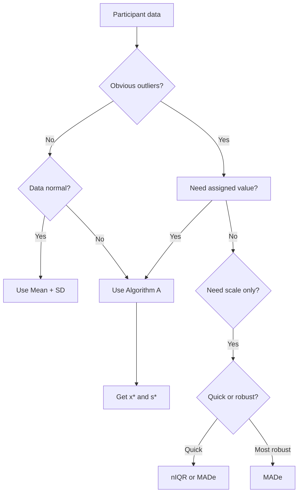

# pt_robust_stats.R: Robust Statistics

This module contains robust statistical estimators for calculating assigned values and standard deviations resistant to outliers, implementing ISO 13528:2022 methods.

---

## Location in Code

| Element | Value |
|----------|-------|
| File | `ptcalc/R/pt_robust_stats.R` |
| Lines | 1 - 247 |

---

## Overview

Robust statistics provide estimates of location (mean) and scale (standard deviation) that are resistant to outliers and non-normal distributions. This module implements three key robust estimators:

1. **MADe** (Scaled Median Absolute Deviation)
2. **nIQR** (Normalized Interquartile Range)
3. **Algorithm A** (ISO 13528 robust mean/sd)

---

## Functions

### `calculate_niqr(x)`

**Normalized Interquartile Range**

$$nIQR = 0.7413 \times (Q_3 - Q_1)$$

| Parameter | Type | Description |
|-----------|------|-------------|
| `x` | numeric vector | Input data |

**Returns**: `NA_real_` if fewer than 2 finite values, otherwise the nIQR.

**Reference**: ISO 13528:2022 Section 9.4

**Example:**
```r
values <- c(10.1, 10.2, 9.9, 10.0, 10.3, 50.0)
niqr <- calculate_niqr(values)  # 0.185
```

---

### `calculate_mad_e(x)`

**Scaled Median Absolute Deviation (MADe)**

$$MADe = 1.483 \times \text{median}(|x_i - \text{median}(x)|)$$

| Parameter | Type | Description |
|-----------|------|-------------|
| `x` | numeric vector | Input data |

**Returns**: Robust standard deviation estimate.

**Reference**: ISO 13528:2022 Section 9.4

**Example:**
```r
values <- c(10.1, 10.2, 9.9, 10.0, 10.3, 50.0)
made <- calculate_mad_e(values)  # 0.222
```

---

### `run_algorithm_a(values, ids, max_iter, tol)`

**ISO 13528 Algorithm A**

Iterative algorithm for computing robust estimates of location ($x^*$) and scale ($s^*$).

| Parameter | Type | Default | Description |
|-----------|------|---------|-------------|
| `values` | numeric vector | - | Participant results |
| `ids` | character vector | NULL | Participant identifiers |
| `max_iter` | numeric | 50 | Maximum iterations |
| `tol` | numeric | 1e-03 | Convergence tolerance |

**Returns**: List with:
- `assigned_value`: Robust mean ($x^*$)
- `robust_sd`: Robust standard deviation ($s^*$)
- `iterations`: Data frame of iteration history
- `weights`: Data frame with participant weights
- `converged`: Logical indicating convergence
- `effective_weight`: Sum of final weights
- `error`: Error message or NULL if successful

**Reference**: ISO 13528:2022 Annex C

---

## Visual Algorithm Flow

```mermaid
flowchart TD
    START[Start: Vector of values] --> CHECK{n ≥ 3?}
    CHECK -- No --> ERR[Error: Requires at least 3 observations]
    CHECK -- Yes --> INIT[Initialize x* = median, s* = 1.483 × MAD]
    
    INIT --> ZCHECK{s* > 0?}
    ZCHECK -- No --> FALLBACK[Use classical SD as fallback]
    ZCHECK -- Yes --> RESIDUALS[Calculate residuals: u = x - x* / 1.5 × s*]
    FALLBACK --> RESIDUALS
    
    RESIDUALS --> WEIGHTS[Calculate Huber weights]
    WEIGHTS --> WEIGHT_DECISION{|u| ≤ 1?}
    WEIGHT_DECISION -- Yes --> WEIGHT1[w = 1]
    WEIGHT_DECISION -- No --> WEIGHT2[w = 1 / u²]
    
    WEIGHT1 --> UPDATE[Update x* = Σw×x / Σw]
    WEIGHT2 --> UPDATE
    
    UPDATE --> UPDATE_S[Update s* = √Σw×x-x*² / Σw]
    UPDATE_S --> CONVERGENCE{Δx < tol<br/>and Δs < tol?}
    
    CONVERGENCE -- No --> ITER_CHECK{iter < max_iter?}
    ITER_CHECK -- Yes --> RESIDUALS
    ITER_CHECK -- No --> NO_CONV[Return: converged = FALSE]
    
    CONVERGENCE -- Yes --> YES_CONV[Return: converged = TRUE]
    
    style INIT fill:#e3f2fd
    style RESIDUALS fill:#bbdefb
    style WEIGHTS fill:#c8e6c9
    style UPDATE fill:#ffe0b2
    style YES_CONV fill:#c8e6c9
    style NO_CONV fill:#ffcdd2
    style ERR fill:#ffcdd2
```

---

## Step-by-Step Algorithm A

### Step 0: Initialization

1. Remove non-finite values (NA, Inf, -Inf)
2. Check: Need at least 3 valid observations
3. Calculate initial estimates:
   - $x^*_0 = \text{median}(x)$
   - $s^*_0 = 1.483 \times \text{MAD}(x)$
4. If $s^*_0 \approx 0$, use classical SD as fallback

### Step 1: Calculate Standardized Residuals

$$u_i = \frac{x_i - x^*}{1.5 \times s^*}$$

The factor 1.5 is a "tuning constant" that determines the threshold for down-weighting.

### Step 2: Calculate Huber Weights

$$w_i = \begin{cases}
1 & \text{if } |u_i| \leq 1 \\
\frac{1}{u_i^2} & \text{if } |u_i| > 1
\end{cases}$$

- Observations with $|u| \leq 1$ get full weight (within 1.5 × SD)
- Observations with $|u| > 1$ are down-weighted proportionally to squared residual

### Step 3: Update Estimates

$$x^*_{new} = \frac{\sum w_i x_i}{\sum w_i}$$

$$s^*_{new} = \sqrt{\frac{\sum w_i (x_i - x^*_{new})^2}{\sum w_i}}$$

### Step 4: Check Convergence

Calculate changes:
- $\Delta x = |x^*_{new} - x^*|$
- $\Delta s = |s^*_{new} - s^*|$

Converged if: $\Delta x < tol$ AND $\Delta s < tol$

### Step 5: Repeat or Return

If converged: Return final estimates
If not converged AND iter < max_iter: Go to Step 1
If not converged AND iter = max_iter: Return with `converged = FALSE`

---

## Detailed Numerical Example

Consider proficiency testing data with an obvious outlier:

**Initial Data:** `[10.1, 10.2, 9.9, 10.0, 10.3, 50.0]`

(The value 50.0 is clearly an outlier)

### Iteration 0: Initialization

| Step | Calculation | Result |
|------|-------------|---------|
| Median | median([10.1, 10.2, 9.9, 10.0, 10.3, 50.0]) | 10.05 |
| MAD | median(\|x - 10.05\|) | 0.15 |
| s* initial | 1.483 × 0.15 | 0.222 |

### Iteration 1

**Calculate Standardized Residuals (u):**
$$u_i = \frac{x_i - 10.05}{1.5 \times 0.222} = \frac{x_i - 10.05}{0.333}$$

| Participant | Value | $x_i - 10.05$ | $u = \frac{diff}{0.333}$ | $|u|$ | Weight $w$ |
|-------------|--------|-----------------|-------------------------|-------|-----------|
| 1 | 10.1 | 0.05 | 0.150 | 0.150 | 1.000 |
| 2 | 10.2 | 0.15 | 0.451 | 0.451 | 1.000 |
| 3 | 9.9 | -0.15 | -0.451 | 0.451 | 1.000 |
| 4 | 10.0 | -0.05 | -0.150 | 0.150 | 1.000 |
| 5 | 10.3 | 0.25 | 0.751 | 0.751 | 1.000 |
| 6 | 50.0 | 39.95 | **119.97** | 119.97 | **0.00007** |

**Update x*:**
$$\sum w = 1 + 1 + 1 + 1 + 1 + 0.00007 = 5.00007$$
$$\sum w \times x = 10.1 + 10.2 + 9.9 + 10.0 + 10.3 + 50.0 \times 0.00007 = 50.5035$$
$$x^*_{new} = \frac{50.5035}{5.00007} = 10.10$$

**Update s*:**
$$s^*_{new} = \sqrt{\frac{1(10.1-10.1)^2 + 1(10.2-10.1)^2 + \cdots}{5.00007}} = 0.141$$

**Convergence Check:**
- $\Delta x = |10.10 - 10.05| = 0.05$
- $\Delta s = |0.141 - 0.222| = 0.081$
- Both > 0.001, so continue

### Iteration 2

**Calculate Standardized Residuals:**
$$u_i = \frac{x_i - 10.10}{1.5 \times 0.141} = \frac{x_i - 10.10}{0.212}$$

| Participant | Value | $u$ | $|u|$ | Weight $w$ |
|-------------|--------|-----|-------|-----------|
| 1 | 10.1 | 0.00 | 0.00 | 1.000 |
| 2 | 10.2 | 0.47 | 0.47 | 1.000 |
| 3 | 9.9 | -0.94 | 0.94 | 1.000 |
| 4 | 10.0 | -0.47 | 0.47 | 1.000 |
| 5 | 10.3 | 0.94 | 0.94 | 1.000 |
| 6 | 50.0 | 187.74 | 187.74 | **0.000028** |

**Update Estimates:**
- $x^*_{new} = 10.10$ (unchanged)
- $s^*_{new} = 0.140$

**Convergence Check:**
- $\Delta x = |10.10 - 10.10| = 0.000$
- $\Delta s = |0.140 - 0.141| = 0.001$
- Both ≤ 0.001, **CONVERGED**

### Final Results

| Statistic | Value |
|-----------|-------|
| Robust mean ($x^*$) | 10.10 |
| Robust SD ($s^*$) | 0.140 |
| Iterations | 2 |
| Converged | TRUE |
| Outlier weight | 0.000028 (effectively zero) |

### Comparison with Classical Statistics

| Estimator | Value | Interpretation |
|-----------|--------|----------------|
| **Arithmetic mean** | 16.75 | **Biased high** due to outlier |
| **Median** | 10.05 | Good location estimate |
| **Robust mean** | 10.10 | Best location estimate |
| **Classical SD** | 16.23 | **Inflated** due to outlier |
| **MADe** | 0.222 | Good scale estimate |
| **nIQR** | 0.185 | Alternative scale estimate |
| **Robust SD** | 0.140 | Best scale estimate |

---

## Convergence Behavior

### Typical Convergence Patterns

Algorithm A typically converges in 3-8 iterations depending on:

1. **Proportion of outliers** - More outliers = more iterations
2. **Magnitude of outliers** - Extreme outliers converge faster (weights → 0)
3. **Initial dispersion** - More spread data = more iterations

### Iterations vs Outlier Proportion

| % Outliers | Average Iterations |
|-------------|-------------------|
| 0% | 2-3 |
| 5% | 3-4 |
| 10% | 4-5 |
| 20% | 5-7 |
| 30% | 6-9 |
| 40% | 8-12 |

### Convergence Plot Example

```mermaid
xychart-beta
    title "Algorithm A Convergence Example"
    x-axis "Iteration" [1, 2, 3, 4, 5]
    y-axis "Estimate" [9.5, 10.5]
    line [10.05, 10.10, 10.10, 10.10, 10.10]
```

### Tuning Constant Effect

The factor 1.5 in $u = \frac{x - x^*}{1.5 \times s^*}$ controls outlier sensitivity:

| Tuning Constant | Behavior |
|----------------|----------|
| **1.0** (more sensitive) | Down-weights more aggressively, less efficient with normal data |
| **1.5** (standard, ISO 13528) | Balance between robustness and efficiency |
| **2.0** (less sensitive) | More tolerant of moderate outliers |

---

## Edge Cases

### Fewer than 3 Participants

```r
run_algorithm_a(c(10.1, 10.2))
# Returns:
# $error: "Algorithm A requires at least 3 valid observations."
# $assigned_value: NA_real_
# $converged: FALSE
```

**Reason:** With fewer than 3 points, robust estimators lack statistical meaning. Median and MAD require at least 3 values to be informative.

### Zero or Near-Zero Dispersion

```r
run_algorithm_a(c(10.0, 10.0, 10.0, 10.0))
# s* initial = 0
# Fallback to classical SD = 0
# Returns: s* = 0, assigned_value = 10.0
```

**Behavior:**
1. If $s^* \approx 0$, classical SD is used as fallback
2. If SD also ≈ 0, returns $s^* = 0$ with $x^* =$ unique value

### Non-Finite Values

```r
run_algorithm_a(c(10.1, NA, 10.2, Inf, 10.0))
# NA, Inf, -Inf are automatically filtered
# Algorithm runs on: [10.1, 10.2, 10.0]
```

### All Outliers

```r
# If >50% of data are extreme outliers
values <- c(10, 15, 20, 25, 30, 1000, 2000, 3000)
# Algorithm may struggle to converge or produce unstable estimates
```

---

## Comparison: MADe vs nIQR vs Algorithm A

| Characteristic | MADe | nIQR | Algorithm A |
|----------------|-------|-------|-------------|
| **Breakdown Point** | 50% | 25% | ~50% |
| **Efficiency (normal)** | 37% | 37% | ~95% |
| **Complexity** | O(n log n) | O(n log n) | O(n × iter) |
| **Iterative** | No | No | Yes |
| **Produces location** | No | No | Yes |
| **Produces scale** | Yes | Yes | Yes |
| **Recommended use** | Initialization | Alternative | Final value |

### Breakdown Point

The **breakdown point** is the maximum proportion of contaminated data an estimator can tolerate before giving arbitrarily erroneous results.

- **MADe**: Tolerates up to 50% outliers
- **nIQR**: Tolerates up to 25% outliers
- **Algorithm A**: Inherits MADe's breakdown point (~50%)

### Efficiency

**Efficiency** indicates how well the estimator performs with normal data compared to the optimal estimator (mean/SD).

- Robust estimators sacrifice efficiency for outlier resistance
- Algorithm A recovers efficiency through iterative weighting

| Estimator | Efficiency | When to Use |
|-----------|-------------|-------------|
| Mean/SD | 100% | Clean, normal data |
| MADe | 37% | Quick robust scale estimate |
| nIQR | 37% | Alternative robust scale |
| Algorithm A | 95% | Final robust analysis |

---

## When to Use Each Estimator



**Decision Tree:**
1. No obvious outliers, data normal → Mean + SD
2. Outliers present, need assigned value → Algorithm A
3. Outliers present, need scale only → MADe (most robust) or nIQR
4. Quick initialization → MADe or nIQR

---

## Implementation Examples

### Basic Usage

```r
# Calculate robust statistics
values <- c(10.1, 10.2, 9.9, 10.0, 10.3, 50.0)

# MADe (robust scale)
mad_e <- calculate_mad_e(values)  # 0.222

# nIQR (alternative)
niqr <- calculate_niqr(values)  # 0.185

# Algorithm A (robust location and scale)
result <- run_algorithm_a(values)
result$assigned_value  # 10.10
result$robust_sd       # 0.14
result$converged       # TRUE
```

### Inspecting Weights

```r
# View how participants are weighted
result <- run_algorithm_a(values, ids = c("A", "B", "C", "D", "E", "OUT"))
result$weights
#   id  value  weight  standardized_residual
# 1  A  10.1    1.000                   0.00
# 2  B  10.2    1.000                   0.71
# 3  C   9.9    1.000                  -0.71
# 4  D  10.0    1.000                  -0.71
# 5  E  10.3    1.000                   1.41
# 6 OUT  50.0    0.000028              282.84
```

### Iteration History

```r
# Examine convergence
result$iterations
#   iteration  x_star   s_star   delta
# 1          1   10.10     0.141  0.0810
# 2          2   10.10     0.140  0.0006
```

---

## Mathematical Derivations

### Why 1.483 for MADe?

For a standard normal distribution N(0,1):
- MAD = median(\|X - median(X)\|) ≈ 0.6745
- To make MAD consistent with SD: MAD × k = 1
- Therefore: $k = 1 / 0.6745 ≈ 1.483$

### Why 0.7413 for nIQR?

For a standard normal distribution:
- IQR = Q₃ - Q₁ ≈ 1.3490
- To make IQR consistent with SD: IQR × k = 2 × SD
- Therefore: $k = 2 / 1.3490 ≈ 0.7413$

---

## References

- **ISO 13528:2022** Section 9.4 (Robust scale estimators)
- **ISO 13528:2022** Annex C (Algorithm A)
- Huber, P.J. (1981). *Robust Statistics*. Wiley.
- Rousseeuw, P.J. & Leroy, A.M. (1987). *Robust Regression and Outlier Detection*.

---

## Cross-References

- **Homogeneity Module:** [04_pt_homogeneity.md](04_pt_homogeneity.md) - Uses s* as quality metric
- **Assigned Value:** [07_valor_asignado.md](cloned_docs/07_valor_asignado.md) - Algorithm A for consensus
- **PT Scores:** [05_pt_scores.md](05_pt_scores.md) - Uses robust statistics in score calculations
- **Package Overview:** [02_ptcalc_package.md](cloned_docs/02_ptcalc_package.md) - General package documentation
