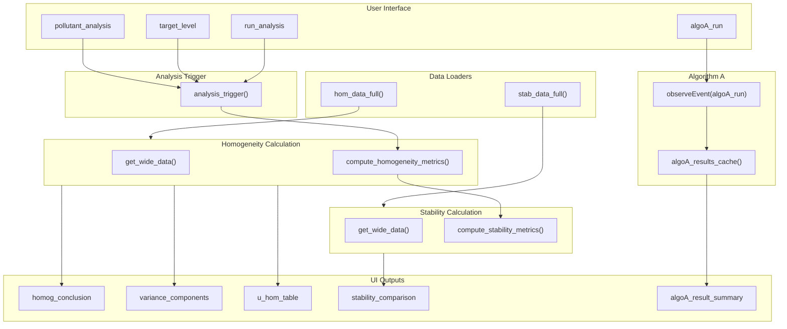
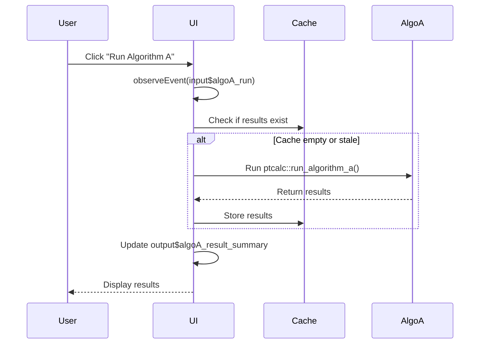
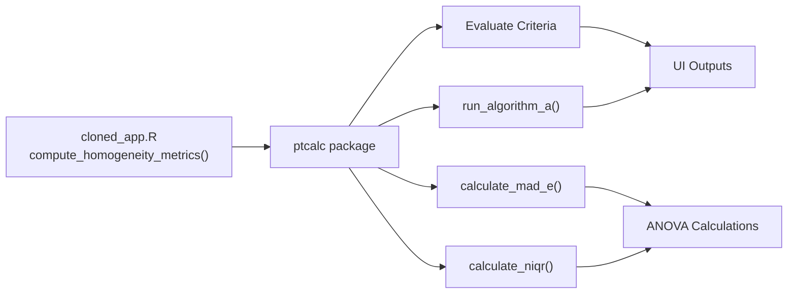

# Shiny Module: Homogeneity and Stability

This module implements the user interface and reactive logic for homogeneity and stability analysis of proficiency test items. It uses pure functions from the `ptcalc` package for calculations.

---

## Location in Code

| Element | Value |
|---------|-------|
| File | `cloned_app.R` |
| Lines | 239 - 486 (Logic) |
| Lines | 642 - 690 (Algorithm A observer) |
| UI | `tabPanel("Análisis de homogeneidad y estabilidad")` |

---

## UI Component Map

| UI Element | Input ID | Output ID | Reactive |
|------------|----------|-----------|----------|
| Pollutant dropdown | `pollutant_analysis` | - | `pollutant_selector_analysis()` |
| Level dropdown | `target_level` | - | `level_selector_analysis()` |
| Run button | `run_analysis` | - | `analysis_trigger()` |
| Conclusion alert | - | `homog_conclusion` | `homogeneity_run()` |
| Variance components table | - | `variance_components` | `homogeneity_run()` |
| Details per item table | - | `details_per_item_table` | `homogeneity_run()` |
| Homogeneity uncertainty table | - | `u_hom_table` | `homogeneity_run()` |
| Stability uncertainty table | - | `u_stab_table` | `stability_run()` |
| Stability comparison table | - | `stability_comparison` | `stability_run()` |
| Algorithm A max iterations | `algoA_max_iter` | - | `input$algoA_max_iter` |
| Algorithm A run button | `algoA_run` | - | `observeEvent(input$algoA_run)` |
| Algorithm A results table | - | `algoA_result_summary` | `algoA_results_cache()` |

---

## Data Flow Overview



---

## Wrapper Functions

### `compute_homogeneity_metrics(target_pollutant, target_level)`

**Description:** Wrapper function that performs complete homogeneity analysis.

**Steps:**
1. Gets data in wide format via `get_wide_data()`
2. Calculates statistics with internal ANOVA computation
3. Evaluates criterion: `ss <= 0.3 * sigma_pt`
4. Evaluates expanded criterion: `ss <= sqrt(sigma_allowed_sq * 1.88 + sw^2 * 1.01)`
5. Returns complete list with results and conclusions

**Location:** Lines 240-387

**Parameters:**
| Parameter | Type | Description |
|-----------|------|-------------|
| `target_pollutant` | string | Pollutant name (e.g., "so2") |
| `target_level` | string | Concentration level (e.g., "20-nmol/mol") |

**Returns:**
```r
list(
  summary = hom_anova_summary,      # ANOVA table
  ss = hom_ss,                      # Between-item SD
  sw = hom_sw,                      # Within-item SD
  conclusion = hom_conclusion,      # HTML-formatted conclusion
  conclusion_class = "alert alert-success" | "alert alert-warning",
  g = g,                            # Number of items
  m = m,                            # Number of replicates
  c_criterion = hom_c_criterion,    # 0.3 * sigma_pt
  c_criterion_expanded = hom_c_criterion_expanded,
  sigma_pt = hom_sigma_pt,          # Robust SD of first sample
  u_xpt = u_xpt,                    # Uncertainty of x_pt
  ...
)
```

**Error Conditions:**
| Error | Condition |
|-------|-----------|
| "No se encontraron datos de homogeneidad para el analito..." | Pollutant not found |
| "El nivel 'X' no existe para el analito..." | Level not found for pollutant |
| "No hay suficientes réplicas (se requieren al menos 2)" | m < 2 |
| "No hay suficientes ítems (se requieren al menos 2)" | g < 2 |

### `compute_stability_metrics(target_pollutant, target_level, hom_results)`

**Description:** Similar to `compute_homogeneity_metrics()` but for stability testing.

**Additional Step:** Compares mean of stability samples vs homogeneity samples to calculate stability uncertainty.

**Location:** Lines 389-514

**Returns:**
```r
list(
  ...
  diff_hom_stab = abs(stab_x_t_bar - hom_results$general_mean),
  stab_general_mean = stab_x_t_bar,
  ...
)
```

---

## Reactives

### `analysis_trigger()`

| Property | Value |
|-----------|-------|
| Depends on | `input$run_analysis` |
| Returns | Timestamp of analysis run |

**Purpose:** Invalidates cached results when user clicks "Run Analysis" button.

### `homogeneity_run()`

| Property | Value |
|-----------|-------|
| Depends on | `input$pollutant_analysis`, `input$target_level`, `analysis_trigger()` |
| Returns | Result of `compute_homogeneity_metrics()` |

### `stability_run()`

| Property | Value |
|-----------|-------|
| Depends on | `homogeneity_run()`, `analysis_trigger()` |
| Returns | Result of `compute_stability_metrics()` |

### `algoA_results_cache()`

| Property | Value |
|-----------|-------|
| Type | `reactiveVal(NULL)` |
| Depends on | `input$algoA_run` |
| Returns | Cached Algorithm A results |

**Cache Mechanism:**
```r
# Set cache
algoA_results_cache(algo_result)

# Clear cache (when data changes)
algoA_results_cache(NULL)
```

---

## Output Details

### `output$homog_conclusion`

Displays alert box with PASS/FAIL result based on homogeneity criteria.

**Classes:**
- `"alert alert-success"` - Green box when `ss <= c_criterion`
- `"alert alert-warning"` - Yellow box when `ss > c_criterion`

**Example Output:**
```html
<div class="alert alert-success">
  ss (0.0123) <= c_criterion (0.0150): CUMPLE CRITERIO HOMOGENEIDAD<br>
  ss (0.0123) <= c_expanded (0.0180): CUMPLE CRITERIO EXP HOMOGENEIDAD
</div>
```

### `output$variance_components`

ANOVA table showing variance decomposition:

| Source | DF | Sum of Squares | Mean of Squares |
|--------|----|----------------|-----------------|
| Ítem | g-1 | ... | ... |
| Residuos | g*(m-1) | ... | ... |

### `output$details_per_item_table`

Per-item statistics including:
- Item number
- Mean of replicates
- Variance
- Range (max - min)

### `output$u_hom_table`, `output$u_stab_table`

Uncertainty tables:
- `u_hom` = ss (between-item standard deviation)
- `u_stab` = |y1 - y2| / sqrt(3) where y1 and y2 are means of homogeneity and stability samples

---

## Error State Documentation

### Error: "No hay datos cargados"

**Cause:** User hasn't uploaded homogeneity.csv or stability.csv files.

**Solution:**
1. Go to "Carga de datos" tab
2. Upload homogeneity.csv
3. Upload stability.csv
4. Return to "Análisis de homogeneidad y estabilidad"

### Error: "No se encontraron datos de homogeneidad para el analito 'X'"

**Cause:** Selected pollutant not in the homogeneity file.

**Solution:**
1. Check homogeneity.csv contains the pollutant
2. Ensure pollutant name matches exactly (case-sensitive)
3. Verify file was loaded correctly

### Error: "El nivel 'X' no existe para el analito 'Y'"

**Cause:** Selected level not in the homogeneity file for the given pollutant.

**Solution:**
1. Verify level format (e.g., "20-nmol/mol" not "20nmol/mol")
2. Check that level exists in homogeneity.csv
3. Ensure consistency between homogeneity and stability files

### Error: "No hay suficientes réplicas (se requieren al menos 2)"

**Cause:** Less than 2 replicates in the data.

**Solution:**
Add more replicate measurements to your homogeneity file.

### Error: "No hay suficientes ítems (se requieren al menos 2)"

**Cause:** Less than 2 items (samples) in the data.

**Solution:**
Add more items (sample_id values) to your homogeneity file.

---

## Algorithm A Button Behavior

### Trigger Flow



### `observeEvent(input$algoA_run)` Implementation

**Location:** Lines 642-690

**Steps:**
1. Check if summary data is loaded
2. Get selected pollutant, level
3. Check if results already cached
4. If not cached, run `ptcalc::run_algorithm_a()`
5. Store results in `algoA_results_cache()`
6. Render results table

**Caching Logic:**
```r
observeEvent(input$algoA_run, {
  req(pt_prep_data())
  summary_data <- isolate(pt_prep_data())

  # Get max iterations from input
  max_iter_algo <- if (!is.null(input$algoA_max_iter)) input$algoA_max_iter else 50

  # Process for each pollutant/level combo
  for (i in seq_len(nrow(combos_df))) {
    # Check cache first
    cache_key <- paste0(algo_res$key, "_", pollutant_val, "_", level_val)

    cached_algo <- algoA_results_cache()
    if (is.null(cached_algo[[cache_key]])) {
      # Run Algorithm A
      algo_res <- ptcalc::run_algorithm_a(
        values = values,
        ids = participant_ids,
        max_iter = max_iter_algo
      )
      cached_algo[[cache_key]] <- algo_res
      algoA_results_cache(cached_algo)
    }
  }
})
```

---

## Integration with ptcalc



---

## Cross-References

- **Data Loading:** [01_carga_datos.md](01_carga_datos.md)
- **Homogeneity Theory:** [04_pt_homogeneity.md](04_pt_homogeneity.md)
- **Algorithm A:** [03_pt_robust_stats.md](03_pt_robust_stats.md)
- **Data Formats:** [01a_data_formats.md](01a_data_formats.md)
- **Glossary:** [00_glossary.md](00_glossary.md)
