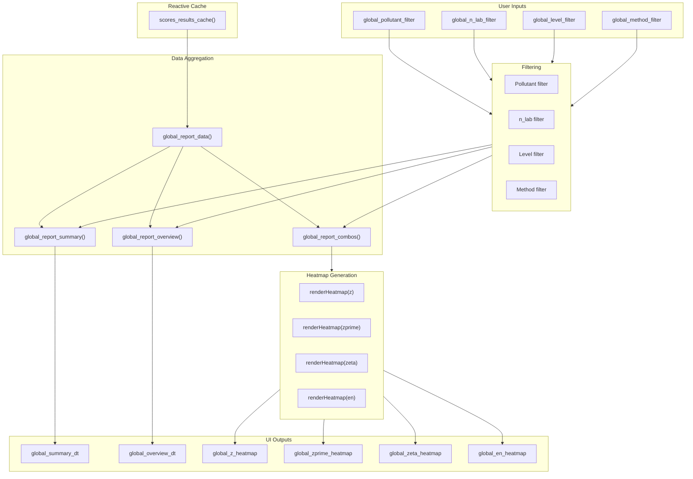
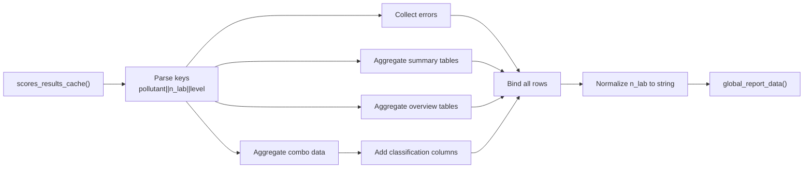
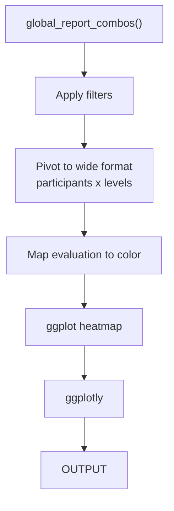

# Module: Global Report

Consolidated view of all participant results through summary tables and interactive heatmaps.

---

## Location in Code

| Element | Value |
|---------|-------|
| File | `cloned_app.R` |
| UI | `tabPanel("Informe global")` |
| Lines | 2256-2338 |

---

## UI Component Map

| UI Element | Input ID | Output ID | Reactive |
|------------|----------|-----------|----------|
| Pollutant filter | `global_pollutant_filter` | - | - |
| n_lab filter | `global_n_lab_filter` | - | - |
| Level filter | `global_level_filter` | - | - |
| Method filter | `global_method_filter` | - | - |
| Summary table | - | `global_summary_dt` | `global_report_summary()` |
| Overview table | - | `global_overview_dt` | `global_report_overview()` |
| z-scores heatmap | - | `global_z_heatmap` | `renderHeatmap("z")` |
| z'-scores heatmap | - | `global_zprime_heatmap` | `renderHeatmap("zprime")` |
| zeta-scores heatmap | - | `global_zeta_heatmap` | `renderHeatmap("zeta")` |
| En-scores heatmap | - | `global_en_heatmap` | `renderHeatmap("en")` |

---

## Data Flow Overview



---

## Color Palette

### Score Color Mapping

| Evaluation | z / z' / zeta | En | Color Code |
|------------|---------------|-----|------------|
| Satisfactory | |z| ≤ 2 | |En| ≤ 1 | #00B050 (Green) |
| Questionable | 2 < |z| ≤ 3 | - | #FFEB3B (Yellow) |
| Unsatisfactory | |z| > 3 | |En| > 1 | #D32F2F (Red) |
| N/A | N/A | N/A | #BDBDBD (Gray) |

### Implementation

```r
score_heatmap_palettes <- list(
  z = c(
    "Satisfactorio" = "#00B050",
    "Cuestionable" = "#FFEB3B",
    "No satisfactorio" = "#D32F2F",
    "N/A" = "#BDBDBD"
  ),
  zprime = c(
    "Satisfactorio" = "#00B050",
    "Cuestionable" = "#FFEB3B",
    "No satisfactorio" = "#D32F2F",
    "N/A" = "#BDBDBD"
  ),
  zeta = c(
    "Satisfactorio" = "#00B050",
    "Cuestionable" = "#FFEB3B",
    "No satisfactorio" = "#D32F2F",
    "N/A" = "#BDBDBD"
  ),
  en = c(
    "Satisfactorio" = "#00B050",
    "Cuestionable" = "#D32F2F",
    "No satisfactorio" = "#D32F2F",
    "N/A" = "#BDBDBD"
  )
)
```

---

## Reactives

### `global_report_data()`

**Location:** Lines 2138-2245

| Property | Value |
|-----------|-------|
| Depends on | `scores_trigger()`, `scores_results_cache()` |
| Returns | Aggregated list with summary, overview, combos, errors |

**Purpose:** Aggregates all cached score results into a unified structure.

#### Return Structure

```r
list(
  error = NULL | string,
  summary = tibble(
    pollutant,
    n_lab,
    level,
    Combinación,
    Etiqueta,
    x_pt,
    x_pt_def,
    sigma_pt,
    u(x_pt),
    u(x_pt)_def,
    Nota
  ),
  overview = tibble(
    pollutant,
    n_lab,
    level,
    Combinación,
    Participante,
    Resultado,
    u(xi),
    Puntaje z,
    Evaluación z,
    Puntaje z',
    Evaluación z',
    Puntaje zeta,
    Evaluación zeta,
    Puntaje En,
    Puntaje En Eval
  ),
  combos = tibble(
    pollutant,
    n_lab,
    level,
    combo_key,
    participant_id,
    result,
    x_pt,
    sigma_pt,
    u_xpt,
    u_xpt_def,
    z_score,
    z_prime_score,
    zeta_score,
    En_score,
    ...
  ),
  errors = tibble(
    pollutant,
    n_lab,
    level,
    source,
    message
  )
)
```

#### Implementation Details

```r
global_report_data <- reactive({
  if (is.null(scores_trigger())) {
    return(list(
      error = "Calcule los puntajes para habilitar el reporte global.",
      summary = tibble(),
      overview = tibble(),
      combos = tibble(),
      errors = tibble()
    ))
  }

  cache <- scores_results_cache()
  if (is.null(cache) || length(cache) == 0) {
    return(list(
      error = "No se generaron resultados globales. Ejecute 'Calcular puntajes'.",
      summary = tibble(),
      overview = tibble(),
      combos = tibble(),
      errors = tibble()
    ))
  }

  # Initialize lists
  summary_rows <- list()
  overview_rows <- list()
  combo_rows <- list()
  error_rows <- list()

  # Walk through cached results
  purrr::iwalk(cache, function(res, key) {
    # Parse key: "pollutant||n_lab||level"
    parts <- strsplit(key, "\\|\\|")[[1]]
    pollutant_val <- parts[1]
    n_lab_val <- suppressWarnings(as.numeric(parts[2]))
    level_val <- parts[3]

    # Handle errors
    if (!is.null(res$error)) {
      error_rows[[length(error_rows) + 1]] <<- tibble(
        pollutant = pollutant_val,
        n_lab = n_lab_val,
        level = level_val,
        source = "scores",
        message = res$error
      )
      return()
    }

    # Aggregate summary rows
    if (!is.null(res$summary) && nrow(res$summary) > 0) {
      summary_rows[[length(summary_rows) + 1]] <<- res$summary %>%
        mutate(
          pollutant = pollutant_val,
          n_lab = n_lab_val,
          level = level_val
        )
    }

    # Aggregate overview rows
    if (!is.null(res$overview) && nrow(res$overview) > 0) {
      overview_rows[[length(overview_rows) + 1]] <<- res$overview %>%
        mutate(
          pollutant = pollutant_val,
          n_lab = n_lab_val,
          level = level_val
        )
    }

    # Aggregate combo rows
    purrr::iwalk(res$combos, function(combo_res, combo_key) {
      if (!is.null(combo_res$error)) {
        error_rows[[length(error_rows) + 1]] <<- tibble(
          pollutant = pollutant_val,
          n_lab = n_lab_val,
          level = level_val,
          source = combo_key,
          message = combo_res$error
        )
        return()
      }
      if (is.null(combo_res$data) || nrow(combo_res$data) == 0) {
        return()
      }
      combo_rows[[length(combo_rows) + 1]] <<- combo_res$data %>%
        mutate(
          pollutant = pollutant_val,
          n_lab = n_lab_val,
          level = level_val,
          combo_key = combo_key
        )
    })
  })

  # Normalize n_lab to string
  normalize_n <- function(df) {
    if (is.null(df) || nrow(df) == 0) {
      return(df)
    }
    df %>%
      mutate(
        n_lab = as.character(n_lab),
        n_lab_numeric = suppressWarnings(as.numeric(n_lab))
      )
  }

  list(
    error = NULL,
    summary = normalize_n(if (length(summary_rows) > 0) dplyr::bind_rows(summary_rows) else tibble()),
    overview = normalize_n(if (length(overview_rows) > 0) dplyr::bind_rows(overview_rows) else tibble()),
    combos = normalize_n(if (length(combo_rows) > 0) dplyr::bind_rows(combo_rows) else tibble()),
    errors = normalize_n(if (length(error_rows) > 0) dplyr::bind_rows(error_rows) else tibble())
  )
})
```

---

### `global_report_summary()`

**Location:** Lines 2305-2320

| Property | Value |
|-----------|-------|
| Depends on | `global_report_data()` |
| Returns | Summary tibble with x_pt parameters |

```r
global_report_summary <- reactive({
  data <- global_report_data()
  if (!is.null(data$error)) {
    return(tibble())
  }
  summary_df <- data$summary
  if (is.null(summary_df) || nrow(summary_df) == 0) {
    return(tibble())
  }
  summary_df %>%
    mutate(
      pollutant = as.character(pollutant),
      n_lab = as.character(n_lab),
      level = as.character(level)
    )
})
```

---

### `global_report_overview()`

**Location:** Lines 2322-2337

| Property | Value |
|-----------|-------|
| Depends on | `global_report_data()` |
| Returns | Overview tibble with all participant scores |

```r
global_report_overview <- reactive({
  data <- global_report_data()
  if (!is.null(data$error)) {
    return(tibble())
  }
  overview_df <- data$overview
  if (is.null(overview_df) || nrow(overview_df) == 0) {
    return(tibble())
  }
  overview_df %>%
    mutate(
      pollutant = as.character(pollutant),
      n_lab = as.character(n_lab),
      level = as.character(level)
    )
})
```

---

### `global_report_combos()`

**Location:** Lines 2284-2303

| Property | Value |
|-----------|-------|
| Depends on | `global_report_data()` |
| Returns | Combo data for heatmap generation |

```r
global_report_combos <- reactive({
  data <- global_report_data()
  if (!is.null(data$error)) {
    return(tibble())
  }
  combos <- data$combos
  if (is.null(combos) || nrow(combos) == 0) {
    return(tibble())
  }
  combos %>%
    mutate(
      pollutant = as.character(pollutant),
      n_lab = as.character(n_lab),
      level = as.character(level),
      combination = as.character(combination),
      combination_label = as.character(combination_label),
      participant_id = as.character(participant_id)
    ) %>%
    ensure_classification_columns()
})
```

---

## Data Aggregation Pipeline



---

## Heatmap Generation Logic

### `renderHeatmap(score_type)` Function

**Purpose:** Generate interactive heatmap for specified score type.

**Parameters:**
- `score_type`: One of "z", "zprime", "zeta", "en"

### Heatmap Structure



### Implementation Pattern

```r
output$global_z_heatmap <- renderPlotly({
  data <- global_report_combos()

  # Apply filters
  if (!is.null(input$global_pollutant_filter)) {
    data <- data %>% filter(pollutant == input$global_pollutant_filter)
  }
  if (!is.null(input$global_n_lab_filter)) {
    data <- data %>% filter(n_lab == input$global_n_lab_filter)
  }
  if (!is.null(input$global_level_filter)) {
    data <- data %>% filter(level == input$global_level_filter)
  }
  if (!is.null(input$global_method_filter)) {
    data <- data %>% filter(combination_label == input$global_method_filter)
  }

  # Pivot to wide format
  heatmap_data <- data %>%
    select(participant_id, level, z_score, z_score_eval) %>%
    pivot_wider(names_from = level, values_from = c(z_score, z_score_eval))

  # Generate heatmap
  p <- ggplot(heatmap_data, aes(x = level, y = participant_id, fill = z_score_eval)) +
    geom_tile() +
    scale_fill_manual(values = score_heatmap_palettes$z) +
    labs(
      title = "Z-Scores Heatmap",
      x = "Nivel",
      y = "Participante",
      fill = "Evaluación"
    ) +
    theme_minimal() +
    theme(axis.text.x = element_text(angle = 45, hjust = 1))

  ggplotly(p)
})
```

---

## Participant Filtering

### Excluding "ref" Participant

**Rule:** The reference laboratory (`participant_id = "ref"`) is automatically excluded from score calculations and global reports.

**Implementation:**
```r
# In compute_scores_for_selection()
participant_data <- subset_data %>%
  filter(participant_id != "ref") %>%
  group_by(participant_id) %>%
  summarise(...)
```

**Reasoning:**
- Reference lab is used to calculate $x_{pt}$ for Method 1
- Should not be compared against itself
- Prevents self-comparison bias

---

## Filter Logic

### Filter Application Order

1. **Pollutant filter** - Filter by pollutant name
2. **n_lab filter** - Filter by number of participants
3. **Level filter** - Filter by concentration level
4. **Method filter** - Filter by assigned value method

### Example Filtered Data

**Before filtering:**
| pollutant | n_lab | level | participant_id | z_score |
|-----------|-------|-------|---------------|---------|
| so2 | 4 | 20-nmol/mol | part_1 | 0.85 |
| so2 | 4 | 20-nmol/mol | part_2 | -1.23 |
| co | 4 | 2-μmol/mol | part_1 | 0.45 |
| so2 | 7 | 20-nmol/mol | part_1 | 1.10 |

**After filtering (pollutant=so2, n_lab=4, level=20-nmol/mol):**
| pollutant | n_lab | level | participant_id | z_score |
|-----------|-------|-------|---------------|---------|
| so2 | 4 | 20-nmol/mol | part_1 | 0.85 |
| so2 | 4 | 20-nmol/mol | part_2 | -1.23 |

---

## Output Details

### Summary Table

Columns: pollutant, n_lab, level, Combinación, Etiqueta, x_pt, x_pt_def, sigma_pt, u(x_pt), u(x_pt)_def, Nota

### Overview Table

Columns: pollutant, n_lab, level, Combinación, Participante, Resultado, u(xi), all scores and evaluations

### Heatmap Features

- **Interactive hover** - Show exact score values on hover
- **Color-coded** - Based on evaluation thresholds
- **Responsive** - Scales with data size
- **Filterable** - Apply multiple filters simultaneously

---

## Cross-References

- **PT Scores:** [09_puntajes_pt.md](09_puntajes_pt.md)
- **Assigned Value:** [07_valor_asignado.md](07_valor_asignado.md)
- **Data Loading:** [01_carga_datos.md](01_carga_datos.md)
- **Glossary:** [00_glossary.md](00_glossary.md)
