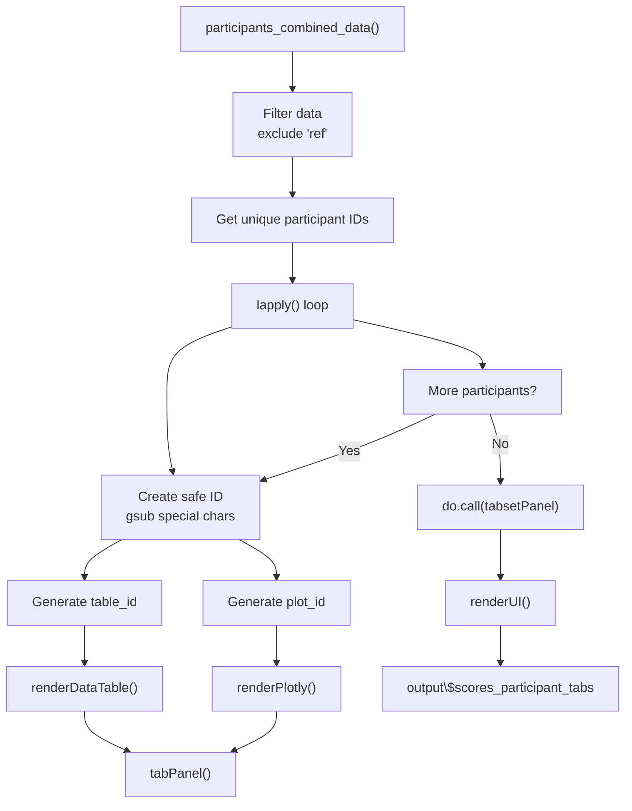
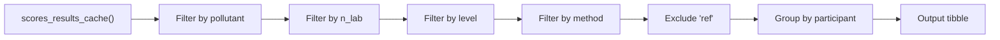

# Module: Participant Detail (Detalle por Participante)

Generates dynamic tabs with performance details for each participating laboratory.

---

## Location in Code

| Element | Value |
|---------|-------|
| File | `cloned_app.R` |
| UI | `tabPanel("Participantes")` |
| Lines | 3615-3746 |

---

## UI Component Map

| UI Element | Input ID | Output ID | Reactive |
|------------|----------|-----------|----------|
| Pollutant selector | `participants_pollutant` | - | - |
| n_lab selector | `participants_n_lab` | - | - |
| Level selector | `participants_level` | - | - |
| Method selector | `participants_method` | - | - |
| Tab container | - | `scores_participant_tabs` | `renderUI()` |
| Participant table (dynamic) | - | `participant_table_[ID]` | `renderDataTable()` |
| Participant plot (dynamic) | - | `participant_plot_[ID]` | `renderPlotly()` |

---

## Dynamic Tab Generation Pattern

### Overview



### Implementation

**Location:** Lines 3615-3746

```r
output$scores_participant_tabs <- renderUI({
  # Get data
  info <- participants_combined_data()
  if (!is.null(info$error)) {
    return(helpText(info$error))
  }

  # Exclude reference lab
  combined <- info$data %>% filter(participant_id != "ref")
  if (nrow(combined) == 0) {
    return(helpText("No hay participantes disponibles para esta selección."))
  }

  # Get unique participant IDs
  participants <- sort(unique(combined$participant_id))

  # Generate tabs for each participant
  tab_panels <- lapply(participants, function(pid) {
    # Create safe ID for Shiny outputs
    safe_id <- gsub("[^A-Za-z0-9]", "_", pid)
    table_id <- paste0("participant_table_", safe_id)
    plot_id <- paste0("participant_plot_", safe_id)

    # ... (define outputs and tabPanel)

    tabPanel(
      pid,
      h4("Resumen"),
      dataTableOutput(table_id),
      hr(),
      h4("Gráficos"),
      plotlyOutput(plot_id, height = "600px")
    )
  })

  do.call(tabsetPanel, c(list(id = "scores_participants_tabs"), tab_panels))
})
```

### Safe ID Generation

```r
# Replace special characters with underscores
safe_id <- gsub("[^A-Za-z0-9]", "_", pid)

# Example:
# "part_1"      -> "part_1"
# "LAB-01"      -> "LAB_01"
# "Participant 3" -> "Participant_3"
```

### Output ID Patterns

| Element | Pattern | Example |
|---------|---------|---------|
| Table | `participant_table_{safe_id}` | `participant_table_part_1` |
| Plot | `participant_plot_{safe_id}` | `participant_plot_part_1` |

---

## Per-Participant Data Filtering Logic

### `participants_combined_data()` Reactive

| Property | Value |
|-----------|-------|
| Depends on | Scores cache, filter inputs |
| Returns | Filtered data for selected participant |

### Filter Chain



### Implementation

```r
participants_combined_data <- reactive({
  # Get cached results
  cache <- scores_results_cache()
  if (is.null(cache) || length(cache) == 0) {
    return(list(error = "No hay resultados disponibles."))
  }

  # Filter by selections
  if (!is.null(input$participants_pollutant)) {
    cache <- cache[grepl(paste0("^", input$participants_pollutant), names(cache))]
  }
  if (!is.null(input$participants_n_lab)) {
    cache <- cache[grepl(paste0("\\|\\|", input$participants_n_lab, "\\|\\|"), names(cache))]
  }
  if (!is.null(input$participants_level)) {
    cache <- cache[grepl(paste0("\\|\\|", input$participants_level, "$"), names(cache))]
  }

  # Aggregate and return
  list(error = NULL, data = combined_data)
})
```

### Individual Participant Filter

```r
# Inside tab generation loop
participant_df <- info$data %>%
  filter(participant_id == pid)
```

---

## Content per Participant

### 1. Table of Results

**Location:** Lines 3632-3665

**Columns:**
| Column | Description |
|--------|-------------|
| Combinación | Method used (1, 2a, 2b, 3) |
| Analito | Pollutant name |
| Esquema PT (n) | Number of participants |
| Nivel | Concentration level |
| Resultado | Participant's mean value |
| x_pt | Assigned value |
| sigma_pt | Standard deviation for score calculation |
| u(x_pt) | Uncertainty of x_pt |
| u(x_pt)_def | Combined uncertainty (includes hom/stab) |
| Puntaje z | z-score |
| Evaluación z | z-score evaluation |
| Puntaje z' | z'-score |
| Evaluación z' | z'-score evaluation |
| Puntaje zeta | zeta-score |
| Evaluación zeta | zeta-score evaluation |
| Puntaje En | En-score |
| Puntaje En Eval | En-score evaluation |

**Implementation:**
```r
output[[table_id]] <- renderDataTable({
  info <- participants_combined_data()
  participant_df <- info$data %>%
    filter(participant_id == pid)

  table_df <- participant_df %>%
    arrange(combination_label, level) %>%
    transmute(
      Combinación = combination,
      Analito = pollutant,
      `Esquema PT (n)` = n_lab,
      Nivel = level,
      Resultado = result,
      `x_pt` = x_pt,
      `sigma_pt` = sigma_pt,
      `u(x_pt)` = u_xpt,
      `u(x_pt)_def` = u_xpt_def,
      `Puntaje z` = z_score,
      `Evaluación z` = z_score_eval,
      `Puntaje z'` = z_prime_score,
      `Evaluación z'` = z_prime_score_eval,
      `Puntaje zeta` = zeta_score,
      `Evaluación zeta` = zeta_score_eval,
      `Puntaje En` = En_score,
      `Puntaje En Eval` = En_score_eval
    )

  datatable(table_df, options = list(scrollX = TRUE, pageLength = 10), rownames = FALSE) %>%
    formatRound(columns = c("Resultado", "x_pt", "sigma_pt", "u(x_pt)", "u(x_pt)_def",
                          "Puntaje z", "Puntaje z'", "Puntaje zeta", "Puntaje En"),
              digits = 3)
})
```

### 2. Comparative Plot (Result vs Reference)

**Purpose:** Compare participant values against assigned value across levels.

**Location:** Lines 3667-3692

**Features:**
- Participant values (blue points and lines)
- Reference values (red dashed points and lines)
- Separate plot for each combination

**Implementation:**
```r
output[[plot_id]] <- renderPlotly({
  participant_df <- info$data %>% filter(participant_id == pid)

  # Filter for first method
  plot_df <- participant_df %>%
    filter(combination_label == "1" | combination_label == min(combination_label)) %>%
    head(n = n_distinct(.$level))

  p_values <- ggplot(plot_df, aes(x = factor(level, levels = sort(unique(level))))) +
    geom_point(aes(y = result, color = "Participante"), size = 3) +
    geom_line(aes(y = result, group = 1, color = "Participante")) +
    geom_point(aes(y = x_pt, color = "Referencia"), size = 3) +
    geom_line(aes(y = x_pt, group = 1, color = "Referencia"), linetype = "dashed") +
    scale_color_manual(values = c("Participante" = "#1F78B4", "Referencia" = "#E31A1C")) +
    labs(title = paste("Valores (Referencia) -", pid),
         x = "Nivel", y = "Valor", color = NULL) +
    theme_minimal() +
    theme(axis.text.x = element_text(angle = 45, hjust = 1), legend.position = "bottom")

  plotly::ggplotly(p_values)
})
```

### 3. Z-Score Trend Plot

**Purpose:** Show z-score evolution across levels with control lines.

**Location:** Lines 3694-3702

**Features:**
- Z-scores by level
- Lines at ±2 (questionable threshold)
- Lines at ±3 (unsatisfactory threshold)
- Separate lines for each method

**Control Lines:**
- |z| ≤ 2: Satisfactory (no line shown)
- 2 < |z| ≤ 3: Questionable (orange dashed line)
- |z| > 3: Unsatisfactory (red dashed line)

**Implementation:**
```r
p_z <- ggplot(participant_df, aes(x = level_factor, y = z_score, group = combination, color = combination)) +
  geom_hline(yintercept = c(-3, 3), linetype = "dashed", color = "#C0392B") +
  geom_hline(yintercept = c(-2, 2), linetype = "dashed", color = "#E67E22") +
  geom_hline(yintercept = 0, color = "grey50") +
  geom_line(position = position_dodge(width = 0.3)) +
  geom_point(size = 3, position = position_dodge(width = 0.3)) +
  labs(title = "Puntaje Z", x = "Nivel", y = "Z", color = "Combinación") +
  theme_minimal() +
  theme(axis.text.x = element_text(angle = 45, hjust = 1), legend.position = "bottom")

plotly::ggplotly(p_z)
```

### 4. Zeta-Score Trend Plot

**Purpose:** Similar to z-score but uses uncertainty information.

**Location:** Lines 3704-3712

**Features:** Same as z-score but uses zeta values.

### 5. En-Score Trend Plot

**Purpose:** Show En-score evolution across levels with control line.

**Location:** Lines 3714-3721

**Features:**
- En-scores by level
- Line at ±1 (unsatisfactory threshold)
- Separate lines for each method

**Control Lines:**
- |En| ≤ 1: Satisfactory
- |En| > 1: Unsatisfactory (red dashed line)

**Implementation:**
```r
p_en <- ggplot(participant_df, aes(x = level_factor, y = En_score, group = combination, color = combination)) +
  geom_hline(yintercept = c(-1, 1), linetype = "dashed", color = "#C0392B") +
  geom_hline(yintercept = 0, color = "grey50") +
  geom_line(position = position_dodge(width = 0.3)) +
  geom_point(size = 3, position = position_dodge(width = 0.3)) +
  labs(title = "Puntaje En", x = "Nivel", y = "En", color = "Combinación") +
  theme_minimal() +
  theme(axis.text.x = element_text(angle = 45, hjust = 1), legend.position = "bottom")

plotly::ggplotly(p_en)
```

---

## Chart Customization Options

### Subplot Layout

**Location:** Lines 3723-3732

**Structure:**
```
[Values vs Reference]    [Z-Score]
[Zeta-Score]           [En-Score]
```

**Implementation:**
```r
plotly::subplot(
  plotly::ggplotly(p_values),
  plotly::ggplotly(p_z),
  plotly::ggplotly(p_zeta),
  plotly::ggplotly(p_en),
  nrows = 2,
  shareX = FALSE,
  titleX = TRUE,
  titleY = TRUE
)
```

### Theme Options

**Current theme:** `theme_minimal()`

**Features:**
- Clean, minimal design
- 45° rotated x-axis labels
- Bottom legend position
- Horizontal grid lines for thresholds

### Color Palettes

| Element | Color | Hex |
|---------|-------|-----|
| Participant | Blue | #1F78B4 |
| Reference | Red | #E31A1C |
| Questionable threshold (±2) | Orange | #E67E22 |
| Unsatisfactory threshold (±3) | Red | #C0392B |
| Zero line | Gray | #grey50 |

---

## Performance Considerations

### Large Number of Participants

**Impact:**
- More tabs = more DOM elements
- More `renderDataTable()` calls
- More `renderPlotly()` calls

**Optimizations:**
1. **Lazy loading:** Each tab only renders when active
2. **Caching:** Data is cached in `participants_combined_data()`
3. **Pagination:** Tables limited to 10 rows per page

**Example Performance:**

| Participants | Tabs | Estimated DOM Elements | Initial Load |
|-------------|-------|---------------------|--------------|
| 5 | 5 | ~250 | < 1 second |
| 10 | 10 | ~500 | 1-2 seconds |
| 20 | 20 | ~1000 | 2-4 seconds |
| 50 | 50 | ~2500 | 5-10 seconds |

### Many Levels per Participant

**Impact:**
- More data points in plots
- Wider x-axis

**Handling:**
- Factor levels sorted automatically
- X-axis labels rotated 45°
- Interactive zoom in plotly

### Many Methods per Participant

**Impact:**
- More lines in trend plots
- More colors in legend

**Handling:**
- `position_dodge(width = 0.3)` prevents overlap
- Auto-scaling legend width
- Separate plots for each score type

---

## Error State Documentation

### "No hay participantes disponibles para esta selección."

**Cause:** No participants in data after excluding "ref".

**Solutions:**
1. Check that `participant_id` values are not all "ref"
2. Verify data loaded correctly
3. Check filter selections

### "No hay resultados disponibles."

**Cause:** No cached score results.

**Solutions:**
1. Run "Calcular puntajes" first
2. Check that data files are loaded
3. Verify no errors in score calculation

### "Sin datos para este participante."

**Cause:** Participant ID not found in filtered data.

**Solutions:**
1. Check participant ID spelling
2. Verify participant exists in loaded data
3. Check filter selections

---

## Cross-References

- **PT Scores:** [09_puntajes_pt.md](09_puntajes_pt.md)
- **Global Report:** [10_informe_global.md](10_informe_global.md)
- **Data Loading:** [01_carga_datos.md](01_carga_datos.md)
- **Glossary:** [00_glossary.md](00_glossary.md)
