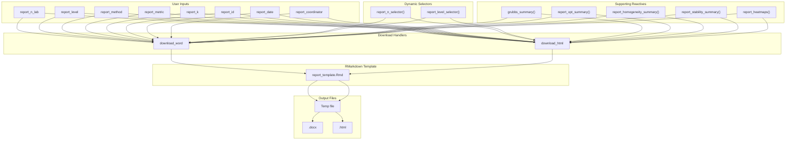

# Module: Report Generation (Generación de Informes)

Export of consolidated results to Word (.docx) and HTML documents via RMarkdown.

---

## Location in Code

| Element | Value |
|---------|-------|
| File | `cloned_app.R` |
| Template | `reports/report_template.Rmd` |
| UI | `tabPanel("Generación de informes")` |
| Lines | 3748-4077 |

---

## UI Component Map

| UI Element | Input ID | Output ID | Reactive |
|------------|----------|-----------|----------|
| PT scheme selector | `report_n_lab` | - | `report_n_selector()` |
| Level selector | `report_level` | - | `report_level_selector()` |
| Method selector | `report_method` | - | - |
| Metric selector | `report_metric` | - | - |
| k-factor input | `report_k` | - | - |
| Report ID input | `report_id` | - | - |
| Date input | `report_date` | - | - |
| Coordinator input | `report_coordinator` | - | - |
| Word download button | `download_word` | - | `downloadHandler()` |
| HTML download button | `download_html` | - | `downloadHandler()` |

---

## Input Parameters

| Parameter | Input ID | Type | Required | Options | Default |
|-----------|-----------|------|----------|----------|---------|
| PT scheme | `report_n_lab` | select | Yes | Available n values | First available |
| Level | `report_level` | select | Yes | Available levels | First available |
| Method | `report_method` | select | Yes | 1, 2a, 2b, 3 | 1 |
| Metric | `report_metric` | select | Yes | z, z', ζ, En | z |
| k-factor | `report_k` | numeric | Yes | Any positive number | 2 |
| Report ID | `report_id` | text | No | Any text | "" |
| Date | `report_date` | date | No | Any date | Today |
| Coordinator | `report_coordinator` | text | No | Any text | "" |

---

## Data Flow Overview



---

## RMarkdown Template Structure

### Template Location

**File:** `reports/report_template.Rmd`

### Template Parameters

```yaml
---
title: "Informe de Ensayo de Aptitud"
params:
  report_id: "PT-001"
  report_date: "2025-01-10"
  coordinator: "Dr. Juan Pérez"
  n_lab: 4
  level: "20-nmol/mol"
  method: "1"
  metric: "z"
  k_factor: 2
  grubbs_data: data.frame(...)
  xpt_data: data.frame(...)
  hom_data: data.frame(...)
  stab_data: data.frame(...)
  heatmaps: list(...)
  participants_data: data.frame(...)
---
```

### Template Sections

1. **Header**
   - Title: "Informe de Ensayo de Aptitud"
   - Report ID, Date, Coordinator info

2. **Executive Summary**
   - PT scheme overview
   - Number of participants
   - Selected level and method

3. **Homogeneity and Stability**
   - Homogeneity results table
   - Stability results table
   - Pass/fail conclusions

4. **Assigned Value**
   - Method description
   - $x_{pt}$ and $\sigma_{pt}$ values
   - Uncertainty calculations

5. **Participant Scores**
   - Summary table of all scores
   - Performance statistics

6. **Outlier Detection**
   - Grubbs test results
   - Identified outliers

7. **Visualizations**
   - Score heatmaps
   - Distribution plots

8. **Conclusions**
   - Overall PT scheme performance
   - Recommendations

---

## Parameter Passing to Template

### Report Parameters Reactive

```r
report_params <- reactive({
  list(
    report_id = input$report_id %||% "",
    report_date = as.character(input$report_date %||% Sys.Date()),
    coordinator = input$report_coordinator %||% "",
    n_lab = input$report_n_lab,
    level = input$report_level,
    method = input$report_method,
    metric = input$report_metric,
    k_factor = input$report_k %||% 2
  )
})
```

### Data Parameters

```r
# Grubbs summary
grubbs_params <- reactive({
  grubbs_summary()
})

# Assigned value summary
xpt_params <- reactive({
  report_xpt_summary()
})

# Homogeneity summary
hom_params <- reactive({
  report_homogeneity_summary()
})

# Stability summary
stab_params <- reactive({
  report_stability_summary()
})

# Heatmaps
heatmap_params <- reactive({
  report_heatmaps()
})
```

### Render Function

```r
render_report <- function(format = "word") {
  params <- c(
    report_params(),
    list(
      grubbs_data = grubbs_params(),
      xpt_data = xpt_params(),
      hom_data = hom_params(),
      stab_data = stab_params(),
      heatmaps = heatmap_params()
    )
  )

  rmarkdown::render(
    input = "reports/report_template.Rmd",
    output_format = if (format == "word") "word_document" else "html_document",
    params = params,
    quiet = TRUE
  )
}
```

---

## Support Reactives

### `grubbs_summary()`

**Location:** Lines 3801-3903

**Returns:** Data frame with Grubbs test results per pollutant/level combo.

**Columns:**
- pollutant
- n_lab
- level
- n_participants
- p_value
- is_outlier (0/1)
- outlier_id
- outlier_value

### `report_xpt_summary()`

**Purpose:** Extract assigned value information for report.

**Implementation:**
```r
report_xpt_summary <- reactive({
  data <- get_scores_result(input$report_pollutant, input$report_n_lab, input$report_level)
  if (!is.null(data$error)) {
    return(tibble())
  }
  data$summary
})
```

### `report_homogeneity_summary()`

**Purpose:** Extract homogeneity analysis results.

**Implementation:**
```r
report_homogeneity_summary <- reactive({
  hom_res <- compute_homogeneity_metrics(
    input$report_pollutant,
    input$report_level
  )
  if (!is.null(hom_res$error)) {
    return(tibble())
  }
  # Convert to tibble for report
  tibble(
    ss = hom_res$ss,
    sw = hom_res$sw,
    c_criterion = hom_res$c_criterion,
    c_criterion_expanded = hom_res$c_criterion_expanded,
    conclusion = hom_res$conclusion
  )
})
```

### `report_stability_summary()`

**Purpose:** Extract stability analysis results.

**Implementation:**
```r
report_stability_summary <- reactive({
  hom_res <- compute_homogeneity_metrics(
    input$report_pollutant,
    input$report_level
  )
  if (!is.null(hom_res$error)) {
    return(tibble())
  }
  stab_res <- compute_stability_metrics(
    input$report_pollutant,
    input$report_level,
    hom_res
  )
  if (!is.null(stab_res$error)) {
    return(tibble())
  }
  tibble(
    diff_hom_stab = stab_res$diff_hom_stab,
    u_stab = abs(stab_res$stab_general_mean - hom_res$general_mean) / sqrt(3)
  )
})
```

### `report_heatmaps()`

**Purpose:** Generate static heatmap images for report.

**Implementation:**
```r
report_heatmaps <- reactive({
  # Generate ggplot objects
  z_heatmap <- create_heatmap("z")
  zprime_heatmap <- create_heatmap("zprime")
  zeta_heatmap <- create_heatmap("zeta")
  en_heatmap <- create_heatmap("en")

  # Save to temp files
  list(
    z = save_plot_to_temp(z_heatmap, "z_heatmap.png"),
    zprime = save_plot_to_temp(zprime_heatmap, "zprime_heatmap.png"),
    zeta = save_plot_to_temp(zeta_heatmap, "zeta_heatmap.png"),
    en = save_plot_to_temp(en_heatmap, "en_heatmap.png")
  )
})
```

---

## `downloadHandler` Pattern

### Word Download Handler

**Location:** Lines 3940-3985

```r
output$download_word <- downloadHandler(
  filename = function() {
    paste0("informe_pt_", input$report_n_lab, "_", input$report_level, "_", Sys.Date(), ".docx")
  },
  content = function(file) {
    # Create temp file
    temp_file <- tempfile(fileext = ".docx")

    # Render report
    rmarkdown::render(
      input = "reports/report_template.Rmd",
      output_file = temp_file,
      output_format = "word_document",
      params = c(
        report_params(),
        list(
          grubbs_data = grubbs_params(),
          xpt_data = xpt_params(),
          hom_data = hom_params(),
          stab_data = stab_params(),
          heatmaps = heatmap_params()
        )
      ),
      quiet = TRUE
    )

    # Copy temp file to download location
    file.copy(temp_file, file, overwrite = TRUE)
  },
  contentType = "application/vnd.openxmlformats-officedocument.wordprocessingml.document"
)
```

### HTML Download Handler

**Location:** Lines 3987-4032

```r
output$download_html <- downloadHandler(
  filename = function() {
    paste0("informe_pt_", input$report_n_lab, "_", input$report_level, "_", Sys.Date(), ".html")
  },
  content = function(file) {
    # Create temp file
    temp_file <- tempfile(fileext = ".html")

    # Render report
    rmarkdown::render(
      input = "reports/report_template.Rmd",
      output_file = temp_file,
      output_format = "html_document",
      params = c(
        report_params(),
        list(
          grubbs_data = grubbs_params(),
          xpt_data = xpt_params(),
          hom_data = hom_params(),
          stab_data = stab_params(),
          heatmaps = heatmap_params()
        )
      ),
      quiet = TRUE
    )

    # Copy temp file to download location
    file.copy(temp_file, file, overwrite = TRUE)
  },
  contentType = "text/html"
)
```

---

## Temp File Management

### Temp File Creation

```r
temp_file <- tempfile(fileext = ".docx")
# Example: /tmp/RtmpXXX/informe_pt_4_20-nmol/mol_20250110.docx
```

### Temp File Cleanup

**Automatic:** R automatically cleans up temp files when the session ends.

**Manual:** If needed, use:
```r
unlink(temp_file)
```

### Temp Directory Pattern

```
/tmp/RtmpXXXXX/
  ├── file123.docx    (rendered output)
  ├── z_heatmap.png   (saved heatmaps)
  ├── zprime_heatmap.png
  ├── zeta_heatmap.png
  └── en_heatmap.png
```

---

## Report Customization Options

### Customization Fields

| Field | Purpose | Example |
|-------|---------|---------|
| `report_id` | Unique report identifier | "PT-2025-001", "SO2-Q1-2025" |
| `report_date` | Report date | "2025-01-10", "2025-03-15" |
| `coordinator` | Coordinator name | "Dr. Juan Pérez", " María González" |

### Template Customization

To customize the template:

1. Open `reports/report_template.Rmd`
2. Add or modify sections
3. Use parameter placeholders: `` `r params$report_id` ``
4. Save changes

### Logo Customization

Add logo to template header:

```markdown
---
title: "Informe de Ensayo de Aptitud"
output:
  word_document:
    reference_docx: "custom_style.docx"
params: ...
---


```

---

## Output Format Differences

### Word (.docx)

**Advantages:**
- Widely compatible with Microsoft Word
- Easy to edit and share
- Professional formatting

**Features:**
- Rich text formatting
- Embedded tables
- Page breaks
- Headers and footers
- Custom styles

**Limitations:**
- Requires Word to view properly
- Larger file size
- Limited interactivity

### HTML (.html)

**Advantages:**
- Opens in any web browser
- Smaller file size
- Interactive features possible
- Mobile-friendly

**Features:**
- Responsive design
- Interactive tables
- Embedded charts
- Hyperlinks

**Limitations:**
- Not ideal for printing
- Less professional for formal reports
- Formatting can vary by browser

### Comparison Table

| Feature | Word (.docx) | HTML (.html) |
|----------|---------------|---------------|
| Editability | ✓ High | ✓ Medium |
| Compatibility | ✓ MS Word | ✓ All browsers |
| Interactivity | ✗ Limited | ✓ Full |
| File Size | Large (500KB-2MB) | Small (100KB-500KB) |
| Print Quality | ✓ Professional | ⚠ Variable |
| Distribution | ✓ Email/SharePoint | ✓ Web/Email |
| Offline Access | ✓ | ✓ |

---

## Error Handling

### Common Errors

#### "No se encontraron datos para generar el informe"

**Cause:** No score data available for selected parameters.

**Solution:**
1. Load data files
2. Run "Calcular puntajes"
3. Verify selections match available data

#### "Error al renderizar el informe"

**Cause:** Template file missing or RMarkdown error.

**Solution:**
1. Check `reports/report_template.Rmd` exists
2. Verify all required parameters are passed
3. Check RMarkdown template syntax

#### "Cannot create temp file"

**Cause:** Temp directory permissions issue.

**Solution:**
1. Check temp directory write permissions
2. Try setting a different temp directory:
   ```r
   options(tempdir = "/path/to/writable/dir")
   ```

---

## Cross-References

- **Global Report:** [10_informe_global.md](10_informe_global.md)
- **PT Scores:** [09_puntajes_pt.md](09_puntajes_pt.md)
- **Outliers:** [13_valores_atipicos.md](13_valores_atipicos.md)
- **Data Loading:** [01_carga_datos.md](01_carga_datos.md)
- **Glossary:** [00_glossary.md](00_glossary.md)
