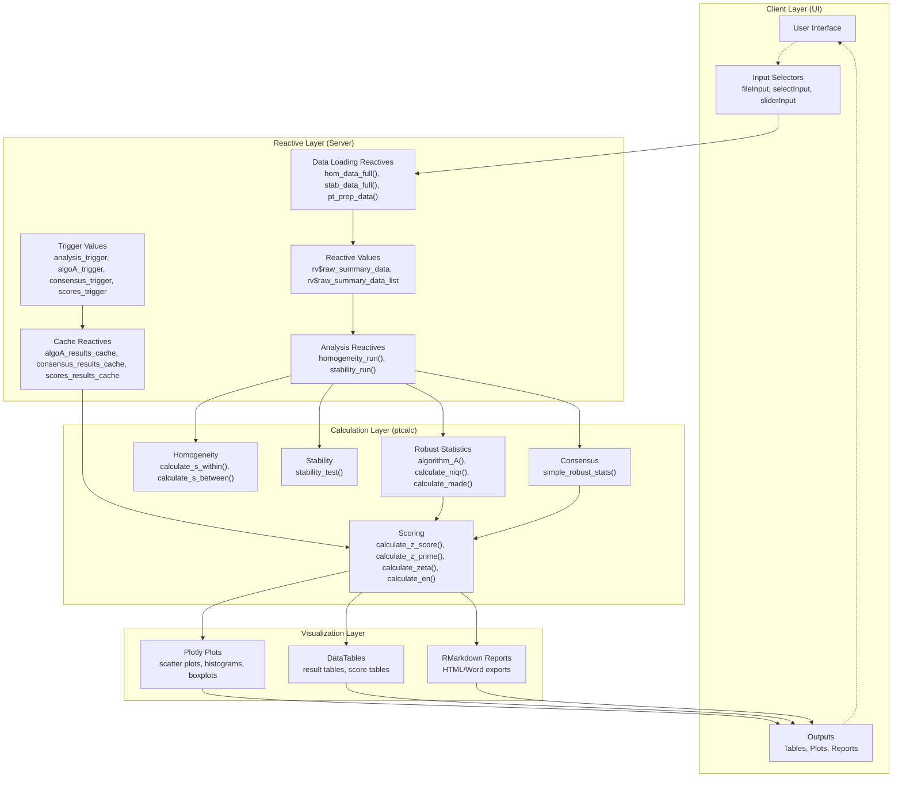
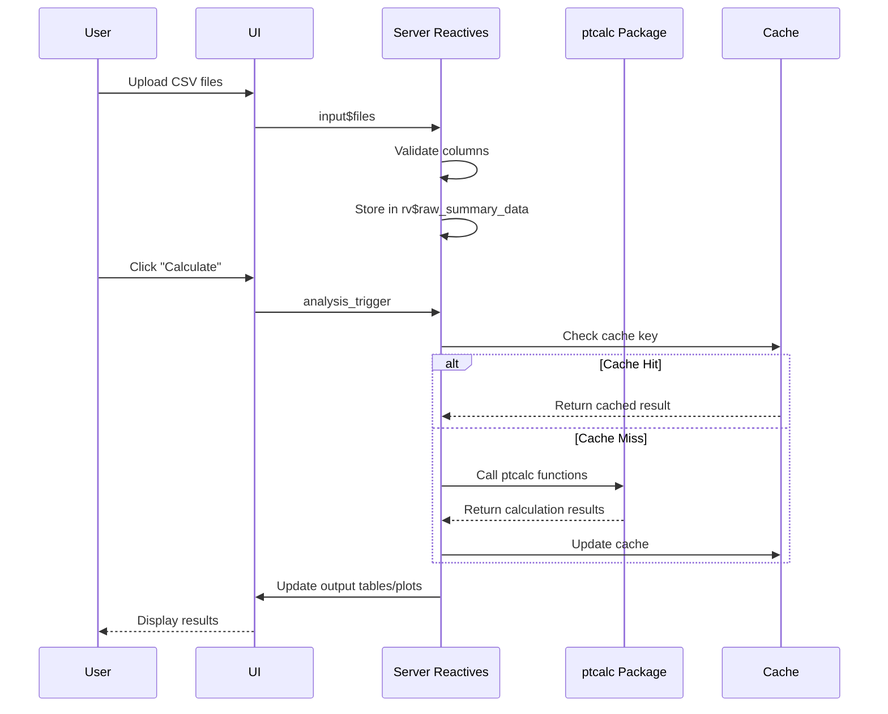

# System Architecture

This document provides a comprehensive overview of the application's architecture, including reactive dependency graphs, server function structure, performance optimization strategies, and state management patterns.

---

## Location in Code

| Element | Value |
|---------|-------|
| File | `cloned_app.R` |
| Lines | 1 - ~2500 |
| Architecture | MVC (Model-View-Controller) pattern with reactive programming |

---

## Overview

The application follows a simplified Model-View-Controller (MVC) architecture:

| Layer | Component | Description |
|-------|-----------|-------------|
| **View (UI)** | `fluidPage` with `bslib` styling | User interface definition |
| **Controller** | Server reactive handlers | User input management and event handling |
| **Model** | `ptcalc` package + reactive data processors | Pure functions and business logic |

---

## Complete Reactive Dependency Graph



---

## Server Function Structure

### Main Server Function Definition

```r
server <- function(input, output, session) {
  # Section 1: Data Loading and Processing (lines 80-160)
  # Section 2: Analysis Triggers and Cache Management (lines 161-185)
  # Section 3: Homogeneity Module (lines 186-320)
  # Section 4: Stability Module (lines 321-450)
  # Section 5: Value Assignment Module (lines 451-700)
  # Section 6: Scoring Module (lines 701-1100)
  # Section 7: Global Report Module (lines 1101-1350)
  # Section 8: Participant Reports Module (lines 1351-1600)
  # Section 9: Report Generation Module (lines 1601-1850)
  # Section 10: Outlier Detection Module (lines 1851-2100)
}
```

### Section Breakdown

| Section | Lines | Purpose |
|---------|-------|---------|
| Data Loading | 80-160 | Load and validate CSV files from user uploads |
| Cache Management | 161-185 | Manage reactive triggers and cache stores |
| Homogeneity | 186-320 | ANOVA-based homogeneity testing |
| Stability | 321-450 | Short-term stability analysis |
| Value Assignment | 451-700 | Algorithm A and consensus value calculation |
| Scoring | 701-1100 | z, z', zeta, En score calculations |
| Global Report | 1101-1350 | Aggregate report data generation |
| Participant Reports | 1351-1600 | Individual participant analysis |
| Report Generation | 1601-1850 | RMarkdown template rendering |
| Outlier Detection | 1851-2100 | Grubbs test and outlier analysis |

---

## State Management

### Reactive Values (`rv`)

The application uses `reactiveValues` to store mutable state that persists across reactive evaluations:

| Variable | Type | Purpose | Updated By |
|----------|------|---------|------------|
| `rv$raw_summary_data` | DataFrame | Stores loaded participant summary data | `pt_prep_data()` reactive |
| `rv$raw_summary_data_list` | List of DataFrames | Stores individual summary file references | `pt_prep_data()` reactive |

**Usage Pattern:**
```r
rv <- reactiveValues(raw_summary_data = NULL, raw_summary_data_list = NULL)

# Update in reactive
pt_prep_data <- reactive({
  rv$raw_summary_data <- raw_data
  rv$raw_summary_data_list <- data_list
})
```

### Reactive Val as Cache

The application extensively uses `reactiveVal` for caching expensive calculation results:

| Cache Variable | Stores | Trigger Key | Purpose |
|----------------|--------|-------------|---------|
| `algoA_results_cache` | Algorithm A convergence results | `algoA_trigger` | Avoid re-running iterative algorithm |
| `consensus_results_cache` | Simple robust stats (MADe/nIQR) | `consensus_trigger` | Cache consensus value calculations |
| `scores_results_cache` | Final scoring dataframes | `scores_trigger` | Cache score calculation results |

**Cache Pattern Implementation:**
```r
# Initialize cache
algoA_results_cache <- reactiveVal(NULL)
algoA_trigger <- reactiveVal(NULL)

# Check and update cache in observer
observeEvent(input$algoA_run, {
  algoA_trigger(as.character(Sys.time()))  # Update trigger
  
  cache <- algoA_results_cache()
  key <- paste(pollutant, level, sep = "_")
  
  if (!is.null(cache) && key %in% names(cache)) {
    return(cache[[key]])  # Use cached result
  }
  
  # Calculate and cache
  result <- ptcalc::algorithm_A(data)
  algoA_results_cache(c(cache, setNames(list(result), key)))
})
```

---

## Performance Optimization Notes

### 1. Data Loading Optimization

| Technique | Implementation | Benefit |
|-----------|----------------|---------|
| `vroom` library | `vroom::vroom(input$file$datapath)` | Fast CSV reading with lazy evaluation |
| Column type skipping | `show_col_types = FALSE` | Reduces parsing overhead |
| Validation first | Check required columns before full processing | Fail fast on invalid data |

### 2. Rendering Optimization

| Component | Optimization | Details |
|-----------|-------------|---------|
| DataTables | Server-side processing | `DT::renderDataTable` with `options = list(server = TRUE)` for large datasets |
| Plots | Downsampling | Not currently implemented, but recommended for >10,000 points |
| Reactive Throttling | `eventReactive` with `ignoreInit` | Prevents initial unnecessary calculations |

### 3. Calculation Optimization

| Strategy | Implementation | Impact |
|----------|----------------|--------|
| Vectorization | All `ptcalc` functions use vectorized operations | Reduces R-level loops |
| Cache layer | `reactiveVal` for expensive results | Avoids re-calculating unchanged parameters |
| Group-wise operations | `dplyr::group_by()` before calculations | Efficient aggregation |

### 4. Memory Management

```r
# Explicit NULL assignment for large objects
large_data <- NULL
gc()  # Force garbage collection (rarely needed)

# Use data.table for very large datasets (optional enhancement)
# Currently using tibble/dplyr for readability
```

---

## Reactive Dependency Patterns

### Pattern 1: Input Chain
```
input$file -> validation reactive -> processing reactive -> cache
```

**Example:**
```r
input$hom_file -> hom_data_full() -> homogeneity_run() -> rv$homogeneity_results
```

### Pattern 2: Trigger-Based Calculation
```
input$button -> observer -> update trigger -> reactive checks cache -> return cached or calculate
```

**Example:**
```r
input$algoA_run -> observeEvent -> algoA_trigger() -> algoA_results_cached() -> display
```

### Pattern 3: Cross-Tab Dependency
```
input$pollutant & input$level -> filtered data -> calculation -> plot/table
```

**Example:**
```r
input$pollutant_selector & input$level_selector -> filter_data() -> calculate_scores() -> renderPlot
```

---

## Data Flow Between Modules



---

## Concurrency and Threading

### Current Implementation
- **Single-threaded**: All calculations run on the main R thread
- **Reactive execution**: Shiny automatically manages reactive dependencies
- **Observer queue**: Observers execute in priority order based on dependency graph

### Potential Enhancements
| Feature | Current Status | Enhancement Opportunity |
|---------|----------------|------------------------|
| Parallel Processing | Not implemented | Use `future` + `promises` for independent calculations |
| Background Tasks | Not implemented | `shiny::reactivePoll` for periodic checks |
| Progress Indicators | Basic | Add `shiny::Progress` for long-running tasks |

---

## Error Handling Architecture

### Validation Layers

| Layer | Location | Purpose |
|-------|----------|---------|
| Input Validation | UI constraints | Prevent invalid input types |
| Reactive Validation | `validate(need(...))` | Check data requirements before processing |
| Package Validation | `ptcalc` internal checks | Mathematical validity of calculations |

**Error Propagation Flow:**
```
User Error -> Input Validation -> Reactive Validation -> Package Validation -> Display to UI
```

---

## Cross-References

- **Data Module**: See `01_carga_datos.md` for detailed data loading reactive chains
- **Calculations**: See `03_pt_robust_stats.md` for Algorithm A implementation
- **Scoring**: See `05_pt_scores.md` for score calculation reactivity
- **Package API**: See `02a_ptcalc_api.md` for ptcalc function reference
