# Documentation: Proficiency Testing Application (Refactored Version)

This documentation corresponds to the refactored version of the application that implements **separation of concerns** between:
- **`ptcalc/`**: R package with pure mathematical functions (ISO 13528).
- **`cloned_app.R`**: Shiny reactive logic for the user interface.

---

## Installation Prerequisites

### R Environment

| Requirement | Version | Notes |
|-------------|---------|-------|
| R | ≥ 4.3.0 | [Download from CRAN](https://cran.r-project.org/) |
| RStudio | ≥ 2023.06 | Optional but recommended |
| Operating System | Windows 10+, macOS 11+, or Linux | Any modern OS |

### Required R Packages

```r
# Core framework
install.packages(c("shiny", "bslib", "shinythemes", "bsplus"))

# Data processing
install.packages(c("tidyverse", "vroom"))

# Interactive components
install.packages(c("DT", "rhandsontable"))

# Visualization
install.packages(c("plotly", "ggplot2", "patchwork"))

# Statistics and reports
install.packages(c("outliers", "rmarkdown", "devtools"))
```

### Installing the ptcalc Package

The `ptcalc` package contains all ISO 13528/17043 calculation functions.

**For development:**

```r
devtools::load_all("ptcalc")
```

**For production deployment:**

```r
devtools::install("ptcalc")
library(ptcalc)
```

---

## Quick Start

Launch the application with:

```r
shiny::runApp("cloned_app.R")
```

The application will open at `http://127.0.0.1:3838` in your default browser.

**For a complete 5-minute walkthrough, see:** [00_quickstart.md](00_quickstart.md)

---

## Example Data Files

The `data/` directory contains example CSV files:

| File | Purpose |
|------|---------|
| `homogeneity.csv` | Homogeneity study data |
| `stability.csv` | Stability study data |
| `participants_data.csv` | Participant results (4 labs) |
| `participants_data7.csv` | Participant results (7 labs) |
| `participants_data10.csv` | Participant results (10 labs) |
| `participants_data13.csv` | Participant results (13 labs) |
| `summary_n4.csv` | Summary report template (n=4) |

---

## Application Screenshot

```
┌─────────────────────────────────────────────────────────────────┐
│  Aplicativo para Evaluación de Ensayos de Aptitud             │
│  Gases Contaminantes Criterio                                 │
│  Laboratorio Calaire                                           │
├─────────────────────────────────────────────────────────────────┤
│  [☰ Carga de Datos] [Homogeneidad] [Estabilidad] [Valor Asig.] │
│  [Puntajes PT] [Informe Global] [Participantes] [Informes]    │
├─────────────────────────────────────────────────────────────────┤
│  Sidebar                                                        │
│  ├── Homogeneity file upload                                   │
│  ├── Stability file upload                                     │
│  └── Participant data upload                                   │
├─────────────────────────────────────────────────────────────────┤
│  Main Content Area                                              │
│  ├── Data tables                                                │
│  ├── Interactive plots                                         │
│  └── Analysis results                                           │
└─────────────────────────────────────────────────────────────────┘
```

---

## System Architecture

```mermaid
flowchart TB
    subgraph ptcalc["📦 Paquete ptcalc"]
        ROBUST["pt_robust_stats.R<br/>Algorithm A, nIQR, MADe"]
        HOM["pt_homogeneity.R<br/>ANOVA, criteria"]
        SCORES["pt_scores.R<br/>z, z', ζ, En"]
    end

    subgraph APP["🖥️ cloned_app.R"]
        UI["UI (fluidPage)<br/>Bootstrap 5"]
        SERVER["Server (reactives)<br/>Data processing"]
    end

    subgraph DATA["📊 Data Files"]
        HOMCSV["homogeneity.csv"]
        STABCSV["stability.csv"]
        PARTCSV["participants_data*.csv"]
    end

    subgraph OUTPUT["📄 Output"]
        REPORTS["RMarkdown reports"]
        PLOTS["Interactive plots"]
        TABLES["Data tables"]
    end

    APP -->|"devtools::load_all()"| ptcalc
    DATA --> UPLOAD["File Upload UI"]
    UPLOAD --> SERVER
    SERVER --> ptcalc
    ptcalc --> SERVER
    SERVER --> OUTPUT
```



---

## Data Flow


---

## Module Index

### Getting Started
1. **[Quick Start Guide](00_quickstart.md)** - 5-minute tutorial
2. **[Glossary](00_glossary.md)** - Spanish/English terminology

### ptcalc Package Documentation
3. **[Package Overview](02_ptcalc_package.md)** - Package structure
4. **[API Reference](02a_ptcalc_api.md)** - Complete function reference
5. **[Robust Statistics](03_pt_robust_stats.md)** - nIQR, MADe, Algorithm A
6. **[Homogeneity & Stability](04_pt_homogeneity.md)** - ISO 13528 criteria
7. **[PT Scores](05_pt_scores.md)** - z, z', ζ, En calculations

### Shiny Application Documentation
8. **[Data Loading](01_carga_datos.md)** - File upload and validation
9. **[Data Formats](01a_data_formats.md)** - Complete CSV schema reference
10. **[Homogeneity Module](06_shiny_homogeneidad.md)** - Shiny UI for homogeneity
11. **[Assigned Value](07_valor_asignado.md)** - Consensus and robust methods
12. **[PT Scores Module](09_puntajes_pt.md)** - Score computation UI
13. **[Global Report](10_informe_global.md)** - Summary visualization
14. **[Participant Details](11_participantes.md)** - Individual lab reports
15. **[Report Generation](12_generacion_informes.md)** - RMarkdown templates
16. **[Outlier Detection](13_valores_atipicos.md)** - Grubbs test

### Advanced Topics
17. **[System Architecture](15_architecture.md)** - Reactive dependency graph, performance optimization
18. **[Customization Guide](16_customization.md)** - Theme, layout, extending ptcalc
19. **[Troubleshooting & FAQ](17_troubleshooting.md)** - Common errors, data format issues

---

## Troubleshooting

### Common Errors

| Error | Solution |
|-------|----------|
| `Error: could not find function "xxx"` | Run `devtools::load_all("ptcalc")` |
| `Error: El archivo debe contener las columnas...` | Check CSV has required columns: `pollutant`, `level`, `value` |
| `package 'outliers' not found` | Run `install.packages("outliers")` |
| Application won't start | Check all packages are installed: `installed.packages()` |
| Port 3838 already in use | Use: `shiny::runApp("cloned_app.R", port=3839)` |

### Data Format Issues

**Homogeneity file requires:**
- `pollutant`: Pollutant name (e.g., "so2", "co", "o3")
- `level`: Concentration level (e.g., "20-nmol/mol", "2-μmol/mol")
- `value`: Measured value (numeric)
- Optional: `replicate`, `sample_id`

**Participant file requires:**
- First row: Laboratory codes (e.g., "REFERENCIA", "PART1", "PART2")
- First column: Pollutant/Analyzer names
- Header row: Analyzer model names

### Performance Problems

For large datasets (>100 participants):
- Use `data.table` instead of `dplyr` for faster processing
- Reduce number of pollutants analyzed simultaneously
- Increase R memory limit: `memory.limit(size=16000)` (Windows)

---

## Standards and References

This application implements:

| Standard | Title | Status |
|----------|-------|--------|
| ISO 13528:2022 | Statistical methods for use in proficiency testing | Implemented |
| ISO 17043:2024 | Conformity assessment — General requirements for proficiency testing | Implemented |
| ISO 5725 series | Accuracy (trueness and precision) | Referenced |

---

## Contribution Guidelines

### Code Style

- Follow [tidyverse style guide](https://style.tidyverse.org/)
- Use meaningful variable names
- Document functions with roxygen2 comments
- Write unit tests for new calculations

### Documentation Updates

- Include mermaid diagrams for data flow
- Add LaTeX formulas for mathematical derivations
- Provide code examples in code blocks with syntax highlighting
- Update line number references when modifying code

### Testing

Before submitting changes:
1. Run unit tests: `devtools::test()`
2. Check documentation: `devtools::document()`
3. Test with example data files
4. Verify RMarkdown reports generate correctly

---

## License

This application is developed by:
- **Laboratorio CALAIRE**, Universidad Nacional de Colombia
- **Instituto Nacional de Metrología (INM)**

Contract OSE-282-3065-2025

License: MIT + file LICENSE

---

## Contact

For technical support or questions:
- **Laboratorio CALAIRE**: Universidad Nacional de Colombia
- **Lead Developer**: Wilson Rafael Salas Chavez (wrsalasc@unal.edu.co)

---

## Version History

| Version | Date | Changes |
|---------|------|---------|
| 0.1.0 | 2024 | Initial refactored release with ptcalc package separation |
| - | 2025 | Documentation upgrade (Phase 1) |

---

## Additional Resources

- [Shiny Documentation](https://shiny.rstudio.com/)
- [ISO 13528 Standard](https://www.iso.org/standard/78630.html)
- [ptcalc Package Documentation](02_ptcalc_package.md)
- [Quick Start Tutorial](00_quickstart.md)
- [System Architecture](15_architecture.md)
- [Customization Guide](16_customization.md)
- [Troubleshooting](17_troubleshooting.md)
