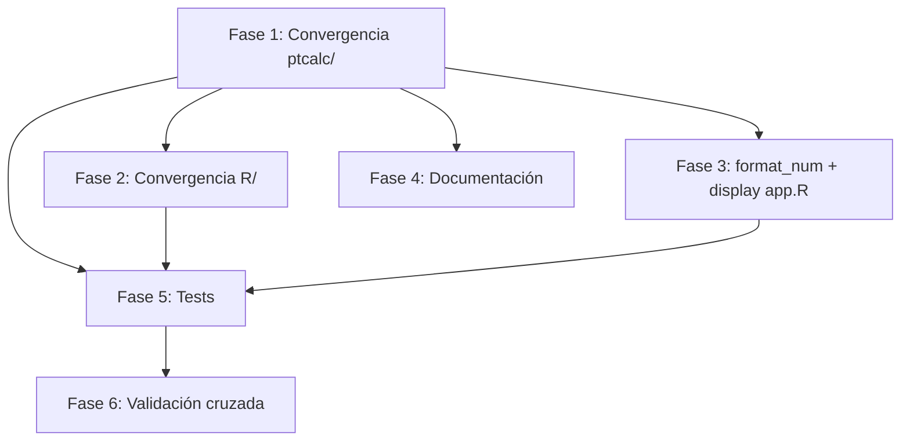

# Plan: Implementación de Cifras Significativas en Algoritmo A

**Timestamp:** 260420_1459
**Slug:** cifras-significativas-implementacion
**Estado:** En progreso
**Documento base:** `mods/plan_cifras_significativas.md`

---

## Objetivo

Alinear el criterio de convergencia del Algoritmo A y el formato de salida numérica con ISO 13528:2022 NOTE 1, reemplazando la tolerancia absoluta `tol` por comparación de 3ª cifra significativa (`signif(x, 3)`), y cambiando el formato de display de 5 decimales fijos a 3 cifras significativas.

---

## Resumen de Hallazgos del Análisis

### Estado actual del código

| Componente | Archivo | Estado actual | Problema |
|---|---|---|---|
| Convergencia (R/) | `R/pt_robust_stats.R:259` | `delta_x < tol && delta_s < tol` con `tol=1e-06` | Magnitud-dependiente |
| Convergencia (ptcalc/) | `ptcalc/R/pt_robust_stats.R:285` | `delta_x < tol && delta_s < tol` con `tol=1e-03` | Magnitud-dependiente |
| Convergencia (app.R) | `app.R:127` | `ALGO_A_TOL <- 1e-04` usado en 5 llamadas | Sobre-itera o sub-itera |
| Formato display | `app.R:206-211` | `sprintf("%.5f", x)` | 5 decimales fijos ≠ 3 sig figs |
| Rounding intermedio | `app.R:1810,1951,2060,2253` | `round(.x, 5)` | 5 decimales fijos para display |
| Sprintf adicional | `app.R:1716,1726,1821,3466-3468` | `sprintf("%.5f", ...)` | Más puntos de formato fijo |
| Función deprecada | `R/utils.R:44` | `signif(x_star, 3) == signif(x_star_prev, 3)` | ✅ Ya implementa ISO correctamente |

### Dependencias del cambio



---

## Fases

### Fase 1: Criterio de Convergencia en `ptcalc/R/pt_robust_stats.R` (CRÍTICA)

**Racional:** Este es el paquete canónico. La copia en `R/` se sincroniza desde aquí. Todo downstream depende de este cambio.

| Item | Estado | Archivo | Notas |
|------|--------|---------|-------|
| 1.1 Cambiar criterio de convergencia | Pendiente | `ptcalc/R/pt_robust_stats.R:285` | `signif(x_new,3)==signif(x_star,3) && signif(s_new,3)==signif(s_star,3)` |
| 1.2 Mantener `tol` como guardia numérica | Pendiente | `ptcalc/R/pt_robust_stats.R:285` | Agregar check secundario `tol = 1e-10` para colapso numérico |
| 1.3 Actualizar `@param tol` | Pendiente | `ptcalc/R/pt_robust_stats.R:96` | Redefinir: guardia numérica, no criterio primario |
| 1.4 Actualizar `@details` step 5 | Pendiente | `ptcalc/R/pt_robust_stats.R:86` | "Repeat until no change in 3rd significant figure (ISO 13528:2022 NOTE 1)" |
| 1.5 Agregar campo `convergence_method` a la salida | Pendiente | `ptcalc/R/pt_robust_stats.R:319-334` | `convergence_method = "signif3"` para trazabilidad |
| 1.6 Agregar columna `signif3_x`/`signif3_s` al iteration record | Pendiente | `ptcalc/R/pt_robust_stats.R:250-266` | Para auditoría de convergencia |

#### Detalle técnico del cambio 1.1-1.2

```r
# ANTES (línea 285):
if (delta_x < tol && delta_s < tol) {

# DESPUÉS:
# Primary: ISO 13528:2022 NOTE 1 — 3rd significant figure
sig_converged <- signif(x_new, 3) == signif(x_star, 3) &&
                 signif(s_new, 3) == signif(s_star, 3)
# Secondary: numerical guard against machine-precision stall
num_converged <- delta_x < 1e-10 && delta_s < 1e-10

if (sig_converged || num_converged) {
  converged <- TRUE
  convergence_method <- if (sig_converged) "signif3" else "numerical_guard"
  break
}
```

#### Detalle técnico del cambio 1.6

```r
# Agregar a iteration_records[[iter]]:
iteration_records[[iter]] <- data.frame(
  # ... campos existentes ...
  signif3_x_prev = signif(x_star, 3),
  signif3_s_prev = signif(s_star, 3),
  signif3_x_new = signif(x_new, 3),
  signif3_s_new = signif(s_new, 3),
  signif3_converged = signif(x_new, 3) == signif(x_star, 3) &&
                      signif(s_new, 3) == signif(s_star, 3),
  stringsAsFactors = FALSE
)
```

---

### Fase 2: Sincronizar Convergencia en `R/pt_robust_stats.R`

**Racional:** `R/pt_robust_stats.R` es la copia usada en producción cuando `!interactive()`. Debe replicar exactamente el cambio de Fase 1.

| Item | Estado | Archivo | Notas |
|------|--------|---------|-------|
| 2.1 Replicar cambio de convergencia | Pendiente | `R/pt_robust_stats.R:259` | Copiar lógica idéntica de Fase 1.1-1.2 |
| 2.2 Actualizar `@param tol` | Pendiente | `R/pt_robust_stats.R:96` | Misma documentación que Fase 1.3 |
| 2.3 Actualizar `@details` | Pendiente | `R/pt_robust_stats.R:86` | Misma documentación que Fase 1.4 |
| 2.4 Agregar `convergence_method` a salida | Pendiente | `R/pt_robust_stats.R:290-303` | Misma estructura que Fase 1.5 |
| 2.5 Agregar `signif3_*` a iteration records | Pendiente | `R/pt_robust_stats.R:225-239` | Misma estructura que Fase 1.6 |

**NOTA:** La estructura de salida de `R/pt_robust_stats.R` difiere ligeramente de `ptcalc/R/pt_robust_stats.R` (falta `winsorized_values`, `n_participants`). Los cambios deben respetar cada estructura. Considerar unificarlas en una tarea futura.

---

### Fase 3: Formato de Salida Numérica en `app.R`

**Racional:** Todo el display numérico de la aplicación pasa por `format_num()` y/o `round(.x, 5)`. Ambos deben alinearse a 3 cifras significativas.

| Item | Estado | Archivo:Línea | Notas |
|------|--------|--------------|-------|
| 3.1 Reescribir `format_num()` | Completado | `app.R:208-279` | Lógica por rango de magnitud + soporte para `NA`, `Inf`, `-Inf`, `0` |
| 3.2 Cambiar `ALGO_A_TOL` | Completado | `app.R:129` | Conservado como guardia numérica en `1e-10` |
| 3.3 Actualizar `round(.x, 5)` → display con signif | Completado | `app.R:1953` | Preview homogeneidad ahora usa `format_numeric_columns()` |
| 3.4 Actualizar `round(.x, 5)` → display con signif | Completado | `app.R:2096` | Tabla homogeneidad ahora usa `format_numeric_columns()` |
| 3.5 Actualizar `round(.x, 5)` → display con signif | Completado | `app.R:2205` | Detalles por ítem ahora usan `format_numeric_columns()` |
| 3.6 Actualizar `round(.x, 5)` → display con signif | Completado | `app.R:2397` | Tabla estabilidad ahora usa `format_numeric_columns()` |
| 3.7 Actualizar `sprintf("%.5f", ...)` en tabla robusta | Completado | `app.R:1967` | Tabla y resumen robusto migrados a `format_num()` |
| 3.8 Actualizar `sprintf("%.5f", ...)` en tablas resumen | Completado | `app.R:1862-1869` | Previews y tablas auxiliares migrados a 3 cifras significativas |
| 3.9 Actualizar `sprintf("%.5f", ...)` en tabla consenso | Completado | `app.R:3607-3612` | `x_pt`, `sigma_pt`, `u(x_pt)` ahora usan `format_num()` |
| 3.10 Remover `digits = 5` en renderTable | Completado | `app.R:2208` | Ajustado a `digits = 3`; tabla ya llega preformateada |
| 3.11 Actualizar mensajes de convergencia Algoritmo A | Completado | `app.R:5538-5742` | UI y export CSV reflejan `signif3` como criterio primario |
| 3.12 Corregir tabla de iteraciones para nuevas columnas `signif3_*` | Completado | `app.R:5631-5660` | Renombrado/select robusto para la estructura posterior a Fase 2 |

#### Detalle técnico del cambio 3.1

```r
format_num <- function(x, n_sig = 3) {
  if (length(x) == 0) return(NA_character_)
  sapply(x, function(v) {
    if (is.na(v)) return(NA_character_)
    av <- abs(v)
    if (!is.finite(av)) return(as.character(v))
    if (av == 0) return("0")
    # Use signif() for correct significant figures, then format for display
    v_sig <- signif(v, n_sig)
    # Determine appropriate format based on magnitude
    if (av < 0.001) return(formatC(v_sig, format = "g", digits = n_sig))
    if (av < 10)    return(sprintf("%.2f", v_sig))
    if (av < 100)   return(sprintf("%.1f", v_sig))
    if (av < 1000)  return(sprintf("%.0f", v_sig))
    return(formatC(v_sig, format = "fg", digits = n_sig))
  }, USE.NAMES = FALSE)
}
```

#### Decisión de diseño: `round()` → `signif()` en tablas intermedias

**Precaución documentada en el plan original:** Las líneas 1810, 1951, 2060, 2253 aplican rounding **antes** del display. Hay que verificar que NO se usen estos datos para cálculos posteriores.

Análisis del contexto:
- **L1810** (`homogeneity_preview_table`): Solo display → ✅ Seguro cambiar a `signif(.x, 3)`
- **L1951** (`hom_data_table`): Solo display en DT::datatable → ✅ Seguro
- **L2060** (`details_per_item_table`): Solo display en renderTable → ✅ Seguro
- **L2253** (`stab_data_table`): Solo display en DT::datatable → ✅ Seguro

**Conclusión:** Todos los `round(.x, 5)` son exclusivamente para display. El cambio a `signif(.x, 3)` es seguro.

#### Decisión de diseño: `ALGO_A_TOL`

`ALGO_A_TOL <- 1e-04` se usa en 5 llamadas a `run_algorithm_a()` (L895, L2523, L4375, L4559, L4983). Con el nuevo criterio de convergencia `signif3`:
- El parámetro `tol` ya no controla la convergencia primaria.
- **Opción A:** Eliminar `ALGO_A_TOL` y dejar que las funciones usen su default interno (`1e-10`).
- **Opción B:** Mantener `ALGO_A_TOL` como referencia, cambiándolo a `1e-10`.

**Recomendación:** Opción B — mantener la constante pero actualizarla para documentar el cambio. Esto facilita la reversión si es necesario.

```r
# ANTES:
ALGO_A_TOL <- 1e-04

# DESPUÉS:
# Guardia numérica para convergencia; el criterio primario es signif3 (ISO 13528:2022 NOTE 1)
ALGO_A_TOL <- 1e-10
```

---

### Fase 4: Documentación Interna

| Item | Estado | Archivo | Notas |
|------|--------|---------|-------|
| 4.1 Documentación roxygen2 `@details` | Completado | `ptcalc/R/pt_robust_stats.R` | `@return` actualizado con `convergence_method` |
| 4.2 Documentación roxygen2 `@details` | Completado | `R/pt_robust_stats.R` | `@return` actualizado con `convergence_method` |
| 4.3 Actualizar `NAMESPACE` y `man/` | Pendiente | `ptcalc/` | `devtools::document("ptcalc")` |
| 4.4 Agregar nota de cambio en `README.md` | Pendiente | `README.md` | Sección de changelog |
| 4.5 Actualizar `mods/plan_cifras_significativas.md` | Pendiente | `mods/plan_cifras_significativas.md` | Marcar como "En progreso" → "Completado" |
| 4.6 Comentario inline en `app.R:127` | Pendiente | `app.R` | Explicar el cambio de `ALGO_A_TOL` |

---

### Fase 5: Tests

**Racional:** Los tests existentes en `tests/testthat/test-algorithm-a.R` validan convergencia y estructura. Deben adaptarse al nuevo criterio y se necesitan tests nuevos específicos para:
1. El criterio `signif3`
2. La función `format_num()` actualizada
3. Validación con datos ISO Annex C

| Item | Estado | Archivo | Notas |
|------|--------|---------|-------|
| 5.1 Actualizar test "accepts explicit tolerance" | Pendiente | `tests/testthat/test-algorithm-a.R:190-205` | Verificar `convergence_method` en output |
| 5.2 Nuevo test: convergencia signif3 con datos ~60 | Pendiente | `tests/testthat/test-algorithm-a.R` | SO₂ 60 nmol/mol: esperar **menos** iteraciones |
| 5.3 Nuevo test: convergencia signif3 con datos ~0.02 | Pendiente | `tests/testthat/test-algorithm-a.R` | CO 0 µmol/mol: verificar no prematura |
| 5.4 Nuevo test: convergencia signif3 con datos ~500 | Pendiente | `tests/testthat/test-algorithm-a.R` | Valores altos: verificar formato `###` |
| 5.5 Nuevo test: ISO Annex C reference values | Pendiente | `tests/testthat/test-algorithm-a.R` | Comparar x*, s* con valores tabulados |
| 5.6 Nuevo test: `format_num()` por rangos | Pendiente | `tests/testthat/test-format-num.R` | Crear archivo nuevo |
| 5.7 Nuevo test: `format_num()` edge cases | Pendiente | `tests/testthat/test-format-num.R` | `0`, `NA`, `Inf`, `-Inf`, valores negativos |
| 5.8 Nuevo test: scores no afectados | Pendiente | `tests/testthat/test-algorithm-a.R` | z ∈ [-3,3] → formato `#.##` correcto |
| 5.9 Verificar tests existentes pasan | Pendiente | `tests/testthat/` | `testthat::test_dir("tests/testthat")` |

#### Detalle técnico test 5.2

```r
test_that("signif3 convergence fewer iterations for magnitude ~60", {
  old_wd <- setwd("../..")
  on.exit(setwd(old_wd))
  devtools::load_all("ptcalc")

  # SO2 data at ~60 nmol/mol
  values <- c(58.2, 60.1, 59.8, 61.3, 57.9, 60.5, 59.2, 62.0, 58.7, 60.0)
  result <- ptcalc::run_algorithm_a(values)

  expect_true(result$converged)
  expect_null(result$error)
  expect_equal(result$convergence_method, "signif3")
  # With signif3, should converge in very few iterations (~2-5)
  expect_true(nrow(result$iterations) <= 10)
  # Result should be close to median
  expect_true(abs(result$assigned_value - median(values)) < 2)
})
```

#### Detalle técnico test 5.6

```r
test_that("format_num produces correct significant figures by range", {
  old_wd <- setwd("../..")
  on.exit(setwd(old_wd))
  source("app.R", local = TRUE)  # or extract format_num to a shared file

  # Range 0 < |x| < 10: format #.##
  expect_equal(format_num(9.8765), "9.88")
  expect_equal(format_num(1.2345), "1.23")  # signif(1.2345, 3) = 1.23

  # Range 10 <= |x| < 100: format ##.#
  expect_equal(format_num(60.451), "60.5")
  expect_equal(format_num(12.345), "12.3")

  # Range 100 <= |x| < 1000: format ###
  expect_equal(format_num(456.7), "457")
  expect_equal(format_num(123.4), "123")

  # Zero
  expect_equal(format_num(0), "0")

  # NA
  expect_equal(format_num(NA), NA_character_)

  # Negative values
  expect_equal(format_num(-60.451), "-60.5")
})
```

---

### Fase 6: Validación Cruzada (Validation Pipeline)

**Racional:** Los scripts en `validation/` implementan una versión propia del Algoritmo A con convergencia diferente (`tol = 0.5` relativa). Deben revisarse para consistencia, pero su criterio no es necesariamente el mismo que el de ISO — son scripts de validación cruzada.

| Item | Estado | Archivo | Notas |
|------|--------|---------|-------|
| 6.1 Revisar convergencia en `stage_04` R | Pendiente | `validation/stage_04_uncertainty_chain.R:46,86` | Usa `tol = 0.5` relativa — diferente criterio, documentar razón |
| 6.2 Revisar convergencia en `stage_04` Python | Pendiente | `validation/stage_04_uncertainty_chain.py:91,122` | Mismo criterio relativo — documentar |
| 6.3 Agregar comentario de discrepancia intencional | Pendiente | `validation/stage_04_*` | "Convergence criterion differs from app: validation uses relative tol, app uses signif3 per ISO" |
| 6.4 Opcional: agregar validación signif3 como alternativa | Pendiente | `validation/stage_04_*` | Si se quiere validar el nuevo criterio contra el viejo |
| 6.5 Regenerar hojas de validación | Pendiente | `validation_parte_1/` | Con el nuevo criterio de convergencia |
| 6.6 Verificar que los valores x*, s* no cambian significativamente | Pendiente | — | Comparar salida old vs new para los datasets existentes |

---

## Orden de Ejecución Recomendado

```
Fase 1 (ptcalc/ convergencia)  ← PRIMERO, es la fuente canónica
    ↓
Fase 2 (R/ convergencia)       ← Sincronizar
    ↓
Fase 3 (app.R display)         ← Formato de salida
    ↓
Fase 4 (Documentación)         ← Actualizar docs
    ↓
Fase 5 (Tests)                 ← Validar todo
    ↓
Fase 6 (Validation pipeline)   ← Verificación cruzada
```

## Estimación de Esfuerzo

| Fase | Complejidad | Archivos | Riesgo |
|------|-------------|----------|--------|
| 1 | Media | 1 | Alto — cambia el corazón del algoritmo |
| 2 | Baja | 1 | Bajo — copia directa de Fase 1 |
| 3 | Media-Alta | 1 (app.R, 10+ puntos) | Medio — afecta toda la UI |
| 4 | Baja | 3 | Bajo — solo documentación |
| 5 | Media | 2 | Medio — tests nuevos + regresión |
| 6 | Baja-Media | 4 | Bajo — revisión + documentación |

## Criterios de Aceptación

1. ✅ `run_algorithm_a()` converge usando `signif(x, 3)` comparison
2. ✅ Para datos ~60: menos iteraciones que con `tol=1e-06`
3. ✅ Para datos ~0.02: convergencia NO prematura
4. ✅ `format_num(9.8765)` → `"9.88"`, `format_num(60.451)` → `"60.5"`, `format_num(456.7)` → `"457"`
5. ✅ Todos los tests existentes pasan (posiblemente con ajustes mínimos)
6. ✅ Valores x*, s* del Annex C de ISO 13528:2022 se reproducen correctamente
7. ✅ Scores z, z', ζ, En se evalúan correctamente contra umbrales

## Log de Ejecución

- [260420 23:11] Fase 3 implementada en `app.R`: `format_num()` reescrito, display migrado a 3 cifras significativas y textos de convergencia actualizados.
- [260420 23:11] Validación local: `Rscript -e 'parse(file="app.R")'` OK.
- [260420 23:11] Revisión local completada: la tabla de iteraciones del Algoritmo A quedó alineada con columnas `signif3_*` y `convergence_method`.
- [260420] Fase 4.1: `@return` de `ptcalc/R/pt_robust_stats.R` actualizado para documentar `convergence_method` e indicar columnas `signif3_*` en `iterations`.
- [260420] Fase 4.2: `@return` de `R/pt_robust_stats.R` actualizado ídem.
