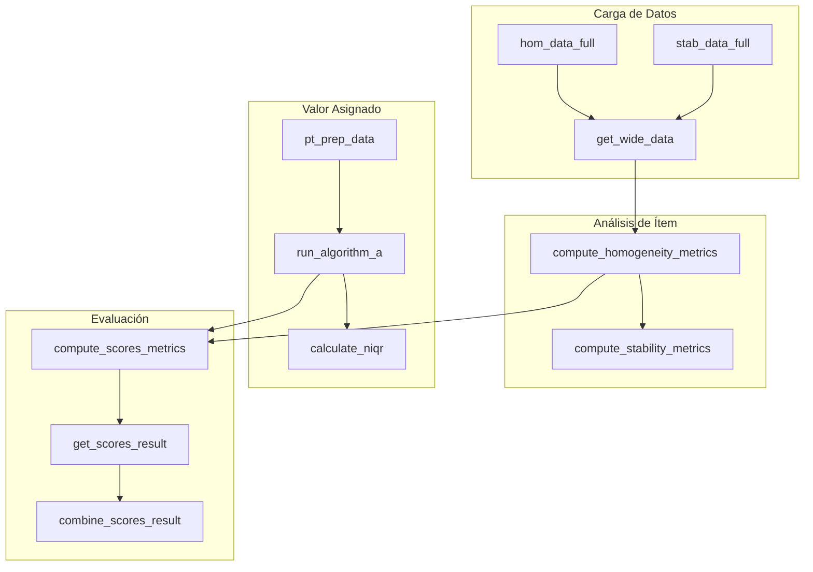

# Entregable 2: Catálogo Detallado de Funciones

**Proyecto:** Aplicativo para Evaluación de Ensayos de Aptitud (PT App)  
**Organización:** Laboratorio CALAIRE - Universidad Nacional de Colombia  
**Normas de Referencia:** ISO 17043:2023, ISO 13528:2022  
**Fecha:** 2026-01-03

---

## 1. Resumen Ejecutivo

Este documento constituye el inventario completo de todas las funciones implementadas en el aplicativo PT. El catálogo está organizado por archivo fuente y proporciona información detallada sobre parámetros, valores de retorno y referencias a las líneas de código.

**Estadísticas del Código:**
| Archivo | Líneas Totales | Funciones Definidas |
|---------|----------------|---------------------|
| `app.R` | 5,430 | 9 funciones principales |
| `report_template.Rmd` | 507 | 4 funciones auxiliares |
| `R/utils.R` | 90 | 3 funciones modulares |

---

## 2. Funciones en `app.R`

### 2.1. `calculate_niqr(x)`

**Ubicación:** Líneas 24-31  
**Propósito:** Calcula el rango intercuartílico normalizado (nIQR) como estimador robusto de la desviación estándar.

| Aspecto | Detalle |
|---------|---------|
| **Parámetro** | `x` — Vector numérico de valores. |
| **Retorna** | Valor numérico: $0.7413 \times (Q_3 - Q_1)$. |
| **Manejo de NA** | Filtra valores no finitos antes del cálculo. |
| **Referencia** | ISO 13528:2022, Anexo C. |

**Código:**
```r
calculate_niqr <- function(x) {
  x_clean <- x[is.finite(x)]
  if (length(x_clean) < 2) return(NA_real_)
  quartiles <- stats::quantile(x_clean, probs = c(0.25, 0.75), na.rm = TRUE, type = 7)
  0.7413 * (quartiles[2] - quartiles[1])
}
```

---

### 2.2. `format_num(x)`

**Ubicación:** Líneas 144-146  
**Propósito:** Formatea valores numéricos a 5 decimales para visualización en tablas.

| Aspecto | Detalle |
|---------|---------|
| **Parámetro** | `x` — Valor numérico o vector. |
| **Retorna** | Cadena de texto formateada (ej: "10.12345"). |
| **Manejo de NA** | Retorna `NA_character_` si el valor es `NA`. |

**Código:**
```r
format_num <- function(x) {
  ifelse(is.na(x), NA_character_, sprintf("%.5f", x))
}
```

---

### 2.3. `get_wide_data(df, target_pollutant)`

**Ubicación:** Líneas 214-225  
**Propósito:** Transforma datos de formato largo (long) a formato ancho (wide), pivoteando las réplicas como columnas separadas.

| Aspecto | Detalle |
|---------|---------|
| **Parámetros** | `df` — Data frame con columnas `pollutant`, `replicate`, `value`. |
|  | `target_pollutant` — Nombre del analito a filtrar. |
| **Retorna** | Data frame con columnas `level`, `sample_1`, `sample_2`, etc. |
| **Dependencias** | `dplyr::filter`, `tidyr::pivot_wider`. |

**Código:**
```r
get_wide_data <- function(df, target_pollutant) {
  filtered <- df %>% filter(pollutant == target_pollutant)
  if (is.null(filtered) || nrow(filtered) == 0) return(NULL)
  if (!"value" %in% names(filtered)) return(NULL)
  filtered %>%
    select(-pollutant) %>%
    pivot_wider(names_from = replicate, values_from = value, names_prefix = "sample_")
}
```

---

### 2.4. `compute_homogeneity_metrics(target_pollutant, target_level)`

**Ubicación:** Líneas 227-374  
**Propósito:** Ejecuta el análisis estadístico de homogeneidad del ítem de ensayo según ISO 13528.

| Aspecto | Detalle |
|---------|---------|
| **Parámetros** | `target_pollutant` — Analito objetivo. |
|  | `target_level` — Nivel de concentración. |
| **Retorna** | Lista con: `ss`, `sw`, `sigma_pt`, `c_criterion`, `conclusion`, `g`, `m`, etc. |
| **Cálculos** | ANOVA de un factor, MADe, criterios de aceptación simple y expandido. |
| **Dependencias** | `hom_data_full()` (reactivo). |

**Fórmulas implementadas:**
- $s_w = \sqrt{\frac{\sum w_i^2}{2g}}$ (desviación intra-muestra)
- $s_s = \sqrt{\max(0, s_x^2 - \frac{s_w^2}{m})}$ (desviación entre muestras)
- Criterio: $s_s \le 0.3 \sigma_{pt}$

---

### 2.5. `compute_stability_metrics(target_pollutant, target_level, hom_results)`

**Ubicación:** Líneas 376-545  
**Propósito:** Compara los datos de estabilidad con los resultados previos de homogeneidad para evaluar la estabilidad del ítem.

| Aspecto | Detalle |
|---------|---------|
| **Parámetros** | `target_pollutant` — Analito objetivo. |
|  | `target_level` — Nivel de concentración. |
|  | `hom_results` — Lista de resultados de `compute_homogeneity_metrics`. |
| **Retorna** | Lista con: `diff_hom_stab`, `stab_c_criterion`, `stab_conclusion`, etc. |
| **Cálculos** | Diferencia absoluta de medias, criterio de aceptación, criterio expandido. |

**Fórmula principal:**
- $| \bar{y}_1 - \bar{y}_2 | \le 0.3 \sigma_{pt}$

---

### 2.6. `compute_scores_metrics(summary_df, target_pollutant, target_n_lab, target_level, sigma_pt, u_xpt, k, m)`

**Ubicación:** Líneas 547-625  
**Propósito:** Calcula los puntajes de desempeño (z, z', zeta, En) para cada participante.

| Aspecto | Detalle |
|---------|---------|
| **Parámetros** | `summary_df` — Data frame con resultados de participantes. |
|  | `sigma_pt` — Desviación estándar para la evaluación de aptitud. |
|  | `u_xpt` — Incertidumbre estándar del valor asignado. |
|  | `k` — Factor de cobertura (típicamente 2). |
|  | `m` — Número de réplicas (opcional). |
| **Retorna** | Lista con: `scores` (data frame), `x_pt`, `sigma_pt`, evaluaciones cualitativas. |

**Fórmulas implementadas:**
| Puntaje | Fórmula |
|---------|---------|
| z | $(x_i - x_{pt}) / \sigma_{pt}$ |
| z' | $(x_i - x_{pt}) / \sqrt{\sigma_{pt}^2 + u_{xpt}^2}$ |
| zeta | $(x_i - x_{pt}) / \sqrt{u_i^2 + u_{xpt}^2}$ |
| En | $(x_i - x_{pt}) / \sqrt{U_i^2 + U_{xpt}^2}$ |

**Criterios de evaluación:**
| Puntaje | Satisfactorio | Cuestionable | Insatisfactorio |
|---------|---------------|--------------|-----------------|
| z, z', zeta | $|score| \le 2$ | $2 < |score| < 3$ | $|score| \ge 3$ |
| En | $|En| \le 1$ | — | $|En| > 1$ |

---

### 2.7. `run_algorithm_a(values, ids, max_iter)`

**Ubicación:** Líneas 627-700  
**Propósito:** Implementa el Algoritmo A robusto de ISO 13528 para calcular media y desviación estándar robustas.

| Aspecto | Detalle |
|---------|---------|
| **Parámetros** | `values` — Vector de resultados numéricos. |
|  | `ids` — Vector de identificadores de participantes. |
|  | `max_iter` — Número máximo de iteraciones (por defecto 50). |
| **Retorna** | Lista con: `assigned_value` ($x^*$), `robust_sd` ($s^*$), `iterations` (historial), `converged`, `weights`. |
| **Convergencia** | Se detiene cuando $\Delta x^* < 10^{-3}$ y $\Delta s^* < 10^{-3}$. |

**Proceso iterativo:**
1. Inicialización: $x^* = \text{mediana}(x)$, $s^* = 1.483 \times \text{MAD}$
2. Cálculo de pesos: $w_i = 1$ si $|u_i| \le 1$, else $w_i = 1/u_i^2$
3. Actualización: $x^* = \sum w_i x_i / \sum w_i$
4. Repetir hasta convergencia.

---

### 2.8. `get_scores_result(pollutant, n_lab, level)`

**Ubicación:** Líneas 158-172  
**Propósito:** Recupera los resultados de puntajes del cache reactivo para una combinación específica.

| Aspecto | Detalle |
|---------|---------|
| **Parámetros** | `pollutant`, `n_lab`, `level` — Identificadores de la combinación. |
| **Retorna** | Lista con resultados o mensaje de error si no existen. |
| **Dependencias** | `scores_trigger()`, `scores_results_cache()`. |

---

### 2.9. `combine_scores_result(res)`

**Ubicación:** Líneas 174-187  
**Propósito:** Consolida resultados de múltiples combinaciones de analito/nivel en un único data frame.

| Aspecto | Detalle |
|---------|---------|
| **Parámetro** | `res` — Lista de resultados de puntajes. |
| **Retorna** | Lista con `data` (data frame combinado) o `error`. |
| **Dependencias** | `purrr::map_dfr`. |

---

## 3. Funciones en `report_template.Rmd`

> **Nota:** Estas funciones están duplicadas en la plantilla para garantizar que el informe sea autocontenido y reproducible sin depender de la sesión Shiny activa.

### 3.1. `calculate_niqr(x)`
**Ubicación:** Líneas 51-56  
**Descripción:** Idéntica a la versión en `app.R`.

### 3.2. `get_wide_data(df, target_pollutant)`
**Ubicación:** Líneas 59-65  
**Descripción:** Idéntica a la versión en `app.R`.

### 3.3. `run_algorithm_a(values, max_iter)`
**Ubicación:** Líneas 68-99  
**Diferencia:** No requiere el parámetro `ids`, versión simplificada para uso en el reporte.

### 3.4. `compute_homogeneity(data_full, pol, lev)`
**Ubicación:** Líneas 102-132  
**Descripción:** Versión simplificada de `compute_homogeneity_metrics` optimizada para los anexos del informe.

---

## 4. Funciones en `R/utils.R`

> **Nota:** Este archivo contiene implementaciones modulares destinadas a futuras refactorizaciones. Actualmente `app.R` no utiliza este archivo directamente.

### 4.1. `algorithm_A(x, max_iter)`
**Ubicación:** Líneas 23-55  
**Descripción:** Implementación limpia del Algoritmo A usando la función `mad()` nativa de R.

### 4.2. `mad_e_manual(x)`
**Ubicación:** Líneas 64-73  
**Descripción:** Cálculo manual de la Desviación Absoluta de la Mediana escalada (MADe).  
**Fórmula:** $MADe = 1.4826 \times \text{mediana}(|x_i - \text{mediana}(x)|)$

### 4.3. `nIQR_manual(x)`
**Ubicación:** Líneas 82-90  
**Descripción:** Implementación manual del rango intercuartílico normalizado.  
**Fórmula:** $nIQR = 0.7413 \times (Q_3 - Q_1)$

---

## 5. Diagrama de Dependencias entre Funciones



---

## 6. Índice de Reactivos Shiny Asociados

| Reactivo | Función Principal | Trigger |
|----------|-------------------|---------|
| `homogeneity_run()` | `compute_homogeneity_metrics` | `analysis_trigger()` |
| `stability_run()` | `compute_stability_metrics` | `analysis_trigger()` |
| `algoA_results_cache()` | `run_algorithm_a` | `algoA_trigger()` |
| `scores_results_cache()` | `compute_scores_metrics` | `scores_trigger()` |

---

## 7. Archivos Incluidos en Este Entregable

| Archivo | Descripción |
|---------|-------------|
| `catalogo_funciones.md` | Este documento |

---

**Siguiente Entregable:** E3 - Funciones R para Cálculos Estadísticos
